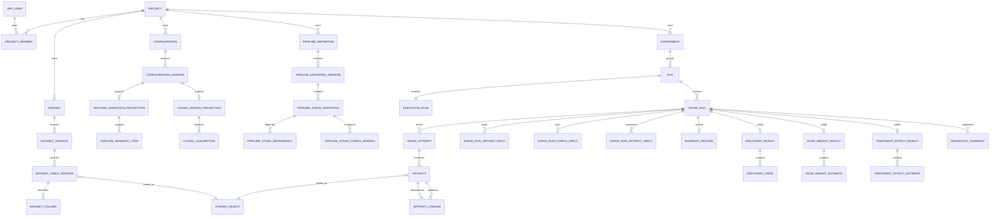

# causal-atelier Webサービス データモデル定義書

- 文書版: 1.0
- 対象DBMS: PostgreSQL
- Artifact Store: local filesystem adapter / S3-compatible adapter
- 基準リポジトリ: `kousuke-ota-datascience/causal-atelier`
- 調査日: 2026-07-18

---

## 1. 目的

本書は、`causal-atelier` のWebサービス化に必要な論理データモデル、主要table、制約、状態遷移、lineage、transaction境界を定義する。

本モデルは次を重視する。

- 現行YAML設定との可逆なimport/export
- 複数table Datasetへの対応
- Execution PlanとManifestの分離
- Run、Stage Run、Attemptの分離
- Artifact中心のlineage
- 因果探索・edge weight・treatment effect結果の検索用projection
- 科学的前提と診断の追跡
- local pathを永続IDとして扱わない

---

## 2. 設計原則

### 2.1. 不変resource

次は確定後に更新しない。

- Dataset Version
- Dataset Table Version
- Published Configuration Version
- Pipeline Definition Version
- Execution Plan
- Artifact content
- Manifest
- Run Event
- Stage Attempt履歴

### 2.2. Template、Plan、Execution、Factの分離

| 概念 | 意味 |
|---|---|
| Pipeline Definition Version | 再利用可能な実行template |
| Execution Plan | Run受付時に解決した不変の計画 |
| Run / Stage Run / Attempt | 実行状態と試行履歴 |
| Manifest | 実際に使用・生成された事実 |

### 2.3. canonical documentとprojectionの分離

YAML/JSON設定やManifestはcanonical documentとして保存し、検索・制約に必要な項目のみrelational tableへprojectionする。

完全JSONB化も完全正規化も行わない。

### 2.4. ID方針

- 主キーはUUIDとする。
- UUIDはapplication側で生成する。
- 外部公開IDにDB連番を使用しない。
- event/auditの高頻度tableのみbigint sequenceを許可する。

### 2.5. 時刻

- すべて `timestamptz` を使用する。
- 保存時はUTCとする。
- APIではtimezone offsetを保持するISO 8601を使用する。

---

## 3. 集約

1. Identity / Authorization
2. Project
3. Data Catalog
4. Configuration Catalog
5. Experiment
6. Pipeline Definition
7. Run Execution
8. Artifact / Manifest / Lineage
9. Analysis Result Projection
10. Audit / Outbox

---

## 4. 概念ER



---

# 5. Identity・Project

## 5.1. `app_user`

| column | type | constraint / meaning |
|---|---|---|
| id | uuid | PK |
| identity_provider | varchar(64) | not null |
| external_subject | varchar(255) | not null |
| email | citext | nullable |
| display_name | varchar(255) | not null |
| status | varchar(32) | ACTIVE/SUSPENDED/DELETED |
| created_at | timestamptz | not null |
| updated_at | timestamptz | not null |

```sql
UNIQUE(identity_provider, external_subject)
```

## 5.2. `project`

| column | type |
|---|---|
| id | uuid PK |
| slug | citext |
| name | varchar(255) |
| description | text nullable |
| status | varchar(32) |
| created_by | uuid FK app_user |
| created_at | timestamptz |
| updated_at | timestamptz |
| deleted_at | timestamptz nullable |

```sql
UNIQUE(slug)
```

将来multi-tenantを導入する場合は `workspace_id` を追加し、`UNIQUE(workspace_id, slug)` へ変更する。

## 5.3. `role`

| column | type |
|---|---|
| id | uuid PK |
| code | varchar(64) unique |
| name | varchar(255) |
| system_managed | boolean |

seed:

- VIEWER
- ANALYST
- MAINTAINER
- PROJECT_ADMIN
- SYSTEM_ADMIN

## 5.4. `project_member`

| column | type |
|---|---|
| project_id | uuid FK |
| user_id | uuid FK |
| role_id | uuid FK |
| created_at | timestamptz |

```sql
PRIMARY KEY(project_id, user_id)
```

---

# 6. Stored Object

## 6.1. `stored_object`

物理保存先を表す。Dataset table、Artifact、Manifestで共用する。

| column | type | meaning |
|---|---|---|
| id | uuid PK | |
| backend | varchar(32) | LOCAL/S3 |
| bucket | varchar(255) nullable | LOCALではnullable |
| object_key | text | local adapterではroot相対path |
| object_version | varchar(255) nullable | storage-side version |
| media_type | varchar(255) nullable | MIME |
| format | varchar(32) nullable | CSV/PARQUET/YAML/JSON/MD/PNG等 |
| size_bytes | bigint nullable | |
| checksum_algorithm | varchar(32) | SHA256等 |
| checksum | varchar(255) | |
| encryption_metadata | jsonb | |
| status | varchar(32) | PENDING/AVAILABLE/DELETED/QUARANTINED |
| created_at | timestamptz | |
| deleted_at | timestamptz nullable | |

制約:

```sql
CHECK(size_bytes IS NULL OR size_bytes >= 0)
UNIQUE(backend, bucket, object_key, object_version)
```

署名付きURLは保存しない。

---

# 7. Data Catalog

## 7.1. `dataset`

複数tableを束ねる論理Dataset collection。

| column | type |
|---|---|
| id | uuid PK |
| project_id | uuid FK |
| slug | citext |
| name | varchar(255) |
| description | text nullable |
| dataset_kind | varchar(32) |
| created_by | uuid FK |
| created_at | timestamptz |
| updated_at | timestamptz |
| deleted_at | timestamptz nullable |

`dataset_kind`:

- RAW
- INTERIM
- PROCESSED
- DISCOVERY_FEATURE
- INFERENCE_FEATURE

```sql
UNIQUE(project_id, slug)
```

## 7.2. `dataset_version`

| column | type | meaning |
|---|---|---|
| id | uuid PK | |
| dataset_id | uuid FK | |
| version_number | integer | 1-based |
| status | varchar(32) | REGISTERING/READY/INVALID/DELETED |
| source_type | varchar(32) | UPLOAD/OBJECT_REFERENCE/ETL/FEATURE_BUILD/IMPORT |
| source_metadata | jsonb | original registry/path等 |
| schema_hash | varchar(255) nullable | collection-level hash |
| content_hash | varchar(255) nullable | collection-level hash |
| table_count | integer | |
| origin_stage_run_id | uuid nullable FK | |
| created_by | uuid FK | |
| created_at | timestamptz | |
| ready_at | timestamptz nullable | |
| deleted_at | timestamptz nullable | |

```sql
UNIQUE(dataset_id, version_number)
CHECK(version_number >= 1)
CHECK(table_count >= 0)
```

`READY`後はmetadataを含めて不変とする。ただし機密classification等の運用policyは別tableで管理する。

## 7.3. `dataset_table_version`

現行Dataset Registryのentryに対応する。

| column | type |
|---|---|
| id | uuid PK |
| dataset_version_id | uuid FK |
| logical_name | citext |
| stored_object_id | uuid FK |
| ordinal | integer |
| file_format | varchar(32) |
| row_count | bigint nullable |
| column_count | integer nullable |
| schema_json | jsonb |
| schema_hash | varchar(255) nullable |
| content_hash | varchar(255) |
| partition_values | jsonb nullable |
| source_entry_name | varchar(255) nullable |
| created_at | timestamptz |

```sql
UNIQUE(dataset_version_id, logical_name)
UNIQUE(dataset_version_id, ordinal)
CHECK(row_count IS NULL OR row_count >= 0)
CHECK(column_count IS NULL OR column_count >= 0)
```

Complete Journeyでは、`campaigns`、`transactions`、`demographics`等が各行となる。

## 7.4. `dataset_column`

| column | type |
|---|---|
| id | uuid PK |
| dataset_table_version_id | uuid FK |
| ordinal | integer |
| name | citext |
| physical_type | varchar(128) |
| logical_type | varchar(128) nullable |
| nullable | boolean |
| description | text nullable |
| semantic_tags | jsonb |

```sql
UNIQUE(dataset_table_version_id, name)
UNIQUE(dataset_table_version_id, ordinal)
```

## 7.5. `dataset_column_policy`

| column | type |
|---|---|
| dataset_column_id | uuid PK/FK |
| classification | varchar(32) |
| preview_allowed | boolean |
| analysis_allowed | boolean |
| download_allowed | boolean |
| mask_rule | varchar(64) nullable |
| updated_by | uuid FK |
| updated_at | timestamptz |

## 7.6. `data_profile`

| column | type |
|---|---|
| id | uuid PK |
| dataset_table_version_id | uuid FK |
| profiler_name | varchar(128) |
| profiler_version | varchar(64) |
| sampled | boolean |
| sample_size | bigint nullable |
| summary_json | jsonb |
| artifact_id | uuid nullable FK |
| created_at | timestamptz |

## 7.7. `column_profile`

| column | type |
|---|---|
| data_profile_id | uuid FK |
| dataset_column_id | uuid FK |
| null_count | bigint nullable |
| distinct_count | bigint nullable |
| min_value | text nullable |
| max_value | text nullable |
| statistics_json | jsonb |

```sql
PRIMARY KEY(data_profile_id, dataset_column_id)
```

---

# 8. Configuration Catalog

## 8.1. `configuration`

| column | type |
|---|---|
| id | uuid PK |
| project_id | uuid FK |
| configuration_type | varchar(64) |
| slug | citext |
| name | varchar(255) |
| description | text nullable |
| created_by | uuid FK |
| created_at | timestamptz |
| deleted_at | timestamptz nullable |

`configuration_type`:

- ETL_EXTRACT
- ETL_TRANSFORM
- ETL_LOAD
- DISCOVERY_ANALYSIS
- DISCOVERY_FEATURE
- INFERENCE_ANALYSIS
- INFERENCE_FEATURE
- FEATURE_SEMANTICS
- CAUSAL_DESIGN
- PIPELINE

```sql
UNIQUE(project_id, configuration_type, slug)
```

## 8.2. `configuration_version`

| column | type | meaning |
|---|---|---|
| id | uuid PK | |
| configuration_id | uuid FK | |
| version_number | integer | |
| status | varchar(32) | DRAFT/PUBLISHED/DEPRECATED |
| schema_version | varchar(64) | API/config schema |
| canonical_json | jsonb | canonical representation |
| original_format | varchar(16) | YAML/JSON |
| original_text | text nullable | round-trip用 |
| content_hash | varchar(255) | canonical hash |
| validation_status | varchar(32) | UNKNOWN/VALID/INVALID |
| validation_summary | jsonb | |
| supersedes_version_id | uuid nullable FK | |
| created_by | uuid FK | |
| created_at | timestamptz | |
| published_by | uuid nullable FK | |
| published_at | timestamptz nullable | |
| lock_version | integer | optimistic lock |

```sql
UNIQUE(configuration_id, version_number)
UNIQUE(configuration_id, content_hash)
CHECK(version_number >= 1)
```

変更規則:

- DRAFTのみ編集可能。
- PUBLISHEDは不変。
- 通常RUNはPUBLISHEDのみ参照。
- DRY_RUN/VALIDATE_ONLYは明示指定時にDRAFTを許可できる。

## 8.3. `configuration_dependency`

Configuration間の参照を正規化する。

| column | type |
|---|---|
| source_configuration_version_id | uuid FK |
| dependency_name | citext |
| target_configuration_version_id | uuid FK |
| dependency_type | varchar(32) |

```sql
PRIMARY KEY(source_configuration_version_id, dependency_name)
```

例:

- PIPELINE -> DISCOVERY_ANALYSIS
- PIPELINE -> INFERENCE_ANALYSIS
- PIPELINE -> FEATURE_SEMANTICS
- CAUSAL_DESIGN -> FEATURE_SEMANTICS

---

# 9. Feature Semantics Projection

## 9.1. `feature_semantics_projection`

| column | type |
|---|---|
| configuration_version_id | uuid PK/FK |
| default_unit_id | varchar(255) nullable |
| feature_count | integer |
| created_at | timestamptz |

## 9.2. `feature_semantic_item`

| column | type |
|---|---|
| feature_semantics_version_id | uuid FK |
| name | citext |
| role | varchar(32) |
| source_table | citext |
| source_column | citext nullable |
| unit_id | citext |
| aggregation | varchar(64) nullable |
| transform | varchar(128) nullable |
| dtype | varchar(128) nullable |
| allowed_for_adjustment | boolean |
| post_treatment | boolean |
| metadata_json | jsonb |

```sql
PRIMARY KEY(feature_semantics_version_id, name)
```

`role`:

- treatment
- outcome
- covariate
- mediator
- collider
- post_treatment

DB制約に加え、domain validationで次を検査する。

- treatment/outcomeはadjustment不可。
- post-treatmentはadjustment不可。
- collider/mediatorはadjustment不可。

---

# 10. Causal Design Projection

## 10.1. `causal_design_projection`

| column | type |
|---|---|
| configuration_version_id | uuid PK/FK |
| feature_semantics_version_id | uuid nullable FK |
| estimand | varchar(16) |
| treatment_name | citext |
| treatment_time | varchar(255) nullable |
| treatment_levels | jsonb |
| outcome_name | citext |
| outcome_window | jsonb nullable |
| unit | varchar(255) |
| time_zero | varchar(255) nullable |
| adjustment_set_name | varchar(255) nullable |

`estimand`はMVPではATE/ATT。

可能な場合、次の複合FKを設定する。

```text
(feature_semantics_version_id, treatment_name)
  -> feature_semantic_item(feature_semantics_version_id, name)

(feature_semantics_version_id, outcome_name)
  -> feature_semantic_item(feature_semantics_version_id, name)
```

## 10.2. `causal_assumption`

| column | type |
|---|---|
| causal_design_version_id | uuid FK |
| assumption_code | varchar(128) |
| statement | text nullable |
| declaration_status | varchar(32) |
| evidence | text nullable |
| ordinal | integer |

```sql
PRIMARY KEY(causal_design_version_id, assumption_code)
```

`declaration_status`:

- DECLARED
- REVIEWED
- VIOLATED
- NOT_ASSESSED
- NOT_TESTABLE

これはassumptionの証明状態ではなく、利用者の評価記録である。

---

# 11. Experiment

## 11.1. `experiment`

現行 `experiments/<連番>_<subtheme>` に対応するRun grouping。

| column | type |
|---|---|
| id | uuid PK |
| project_id | uuid FK |
| slug | citext |
| title | varchar(255) |
| objective | text nullable |
| hypothesis | text nullable |
| notes | text nullable |
| source_repository | text nullable |
| source_commit | varchar(128) nullable |
| notebook_reference | text nullable |
| tags | jsonb |
| created_by | uuid FK |
| created_at | timestamptz |
| updated_at | timestamptz |
| archived_at | timestamptz nullable |

```sql
UNIQUE(project_id, slug)
```

---

# 12. Pipeline Definition

## 12.1. `pipeline_definition`

| column | type |
|---|---|
| id | uuid PK |
| project_id | uuid FK |
| slug | citext |
| name | varchar(255) |
| description | text nullable |
| created_by | uuid FK |
| created_at | timestamptz |
| deleted_at | timestamptz nullable |

```sql
UNIQUE(project_id, slug)
```

## 12.2. `pipeline_definition_version`

| column | type |
|---|---|
| id | uuid PK |
| pipeline_definition_id | uuid FK |
| version_number | integer |
| status | varchar(32) |
| random_seed_default | bigint nullable |
| fail_fast | boolean |
| canonical_json | jsonb |
| content_hash | varchar(255) |
| created_by | uuid FK |
| created_at | timestamptz |
| published_at | timestamptz nullable |

```sql
UNIQUE(pipeline_definition_id, version_number)
UNIQUE(pipeline_definition_id, content_hash)
```

## 12.3. `pipeline_stage_definition`

| column | type |
|---|---|
| id | uuid PK |
| pipeline_definition_version_id | uuid FK |
| stage_key | citext |
| stage_type | varchar(32) |
| analysis_mode | varchar(32) nullable |
| ordinal | integer |
| enabled_by_default | boolean |
| runner_name | varchar(128) |
| timeout_seconds | integer nullable |
| retry_policy_json | jsonb |
| resource_requirements_json | jsonb |
| metadata_json | jsonb |

`stage_type` MVP:

- ETL
- DISCOVERY
- INFERENCE

`analysis_mode`:

- INFERENCEの場合: EDGE_WEIGHT/TREATMENT_EFFECT
- その他: null

```sql
UNIQUE(pipeline_definition_version_id, stage_key)
UNIQUE(pipeline_definition_version_id, ordinal)
CHECK(timeout_seconds IS NULL OR timeout_seconds > 0)
```

## 12.4. `pipeline_stage_dependency`

| column | type |
|---|---|
| stage_definition_id | uuid FK |
| depends_on_stage_definition_id | uuid FK |

```sql
PRIMARY KEY(stage_definition_id, depends_on_stage_definition_id)
CHECK(stage_definition_id <> depends_on_stage_definition_id)
```

cycle検査はdomain serviceで行う。

## 12.5. `pipeline_stage_config_binding`

| column | type |
|---|---|
| stage_definition_id | uuid FK |
| binding_name | citext |
| configuration_version_id | uuid FK |
|required | boolean |

```sql
PRIMARY KEY(stage_definition_id, binding_name)
```

例:

- `analysis_config`
- `feature_config`
- `feature_semantics`
- `causal_design`

## 12.6. `pipeline_stage_output_declaration`

| column | type |
|---|---|
| stage_definition_id | uuid FK |
| output_name | citext |
| artifact_kind | varchar(64) |
| required | boolean |
| register_as_dataset | boolean |

```sql
PRIMARY KEY(stage_definition_id, output_name)
```

---

# 13. Run・Execution Plan

## 13.1. `run`

| column | type |
|---|---|
| id | uuid PK |
| project_id | uuid FK |
| experiment_id | uuid nullable FK |
| pipeline_definition_version_id | uuid nullable FK |
| run_kind | varchar(32) |
| execution_mode | varchar(32) |
| status | varchar(32) |
| submitted_by | uuid FK |
| submitted_at | timestamptz |
| queued_at | timestamptz nullable |
| started_at | timestamptz nullable |
| finished_at | timestamptz nullable |
| cancel_requested_at | timestamptz nullable |
| idempotency_key | varchar(255) nullable |
| request_hash | varchar(255) |
| random_seed | bigint nullable |
| code_commit | varchar(128) nullable |
| package_version | varchar(64) nullable |
| dependency_lock_hash | varchar(255) nullable |
| container_image_digest | varchar(255) nullable |
| priority | integer |
| retry_of_run_id | uuid nullable FK |
| error_code | varchar(128) nullable |
| error_summary | text nullable |
| metadata_json | jsonb |

`run_kind`:

- PIPELINE
- ETL
- DISCOVERY
- INFERENCE

`execution_mode`:

- DRY_RUN
- VALIDATE_ONLY
- RUN

partial unique index:

```sql
CREATE UNIQUE INDEX uq_run_project_idempotency
ON run(project_id, idempotency_key)
WHERE idempotency_key IS NOT NULL;
```

## 13.2. `execution_plan`

| column | type |
|---|---|
| run_id | uuid PK/FK |
| schema_version | varchar(64) |
| canonical_json | jsonb |
| plan_hash | varchar(255) |
| created_at | timestamptz |

`canonical_json`は現行 `ExecutionPlan.to_dict()` の後継である。

## 13.3. `stage_run`

| column | type |
|---|---|
| id | uuid PK |
| run_id | uuid FK |
| stage_key | citext |
| stage_type | varchar(32) |
| analysis_mode | varchar(32) nullable |
| ordinal | integer |
| runner_name | varchar(128) |
| status | varchar(32) |
| current_attempt_number | integer |
| selected_attempt_id | uuid nullable |
| cache_hit | boolean |
| reused_from_stage_run_id | uuid nullable FK |
| started_at | timestamptz nullable |
| finished_at | timestamptz nullable |
| error_code | varchar(128) nullable |
| error_summary | text nullable |

```sql
UNIQUE(run_id, stage_key)
UNIQUE(run_id, ordinal)
CHECK(current_attempt_number >= 0)
```

## 13.4. `stage_run_dependency`

Execution Planで解決済みのDAG。

| column | type |
|---|---|
| stage_run_id | uuid FK |
| depends_on_stage_run_id | uuid FK |

```sql
PRIMARY KEY(stage_run_id, depends_on_stage_run_id)
```

## 13.5. `stage_attempt`

| column | type |
|---|---|
| id | uuid PK |
| stage_run_id | uuid FK |
| attempt_number | integer |
| status | varchar(32) |
| queue_message_id | varchar(255) nullable |
| worker_id | varchar(255) nullable |
| workspace_ref | text nullable |
| queued_at | timestamptz |
| leased_at | timestamptz nullable |
| lease_expires_at | timestamptz nullable |
| heartbeat_at | timestamptz nullable |
| started_at | timestamptz nullable |
| finished_at | timestamptz nullable |
| exit_code | integer nullable |
| error_class | varchar(255) nullable |
| error_code | varchar(128) nullable |
| error_message | text nullable |
| error_detail_json | jsonb |
| runtime_metadata_json | jsonb |
| resource_usage_json | jsonb |

```sql
UNIQUE(stage_run_id, attempt_number)
CHECK(attempt_number >= 1)
```

---

# 14. Stage Input

polymorphic FKを避け、input種別ごとにtableを分ける。

## 14.1. `stage_run_dataset_input`

| column | type |
|---|---|
| stage_run_id | uuid FK |
| input_name | citext |
| dataset_version_id | uuid FK |

```sql
PRIMARY KEY(stage_run_id, input_name)
```

## 14.2. `stage_run_config_input`

| column | type |
|---|---|
| stage_run_id | uuid FK |
| input_name | citext |
| configuration_version_id | uuid FK |
| content_hash_snapshot | varchar(255) |

```sql
PRIMARY KEY(stage_run_id, input_name)
```

## 14.3. `stage_run_artifact_input`

| column | type |
|---|---|
| stage_run_id | uuid FK |
| input_name | citext |
| artifact_id | uuid FK |

```sql
PRIMARY KEY(stage_run_id, input_name)
```

## 14.4. `stage_run_parameter`

| column | type |
|---|---|
| stage_run_id | uuid FK |
| parameter_name | citext |
| value_json | jsonb |
| source | varchar(32) |

`source`:

- PIPELINE_DEFAULT
- CONFIGURATION
- API_OVERRIDE
- SYSTEM

```sql
PRIMARY KEY(stage_run_id, parameter_name)
```

---

# 15. Artifact・Manifest・Lineage

## 15.1. `artifact`

| column | type |
|---|---|
| id | uuid PK |
| project_id | uuid FK |
| artifact_kind | varchar(64) |
| logical_name | varchar(255) |
| status | varchar(32) |
| stored_object_id | uuid nullable FK |
| produced_by_attempt_id | uuid nullable FK |
| media_type | varchar(255) nullable |
| schema_name | varchar(128) nullable |
| schema_version | varchar(64) nullable |
| content_hash | varchar(255) |
| metadata_json | jsonb |
| created_at | timestamptz |
| deleted_at | timestamptz nullable |

`artifact_kind` MVP:

- DATASET_TABLE
- RAW_INPUT_SNAPSHOT
- FEATURE_FRAME
- RESOLVED_CONFIG
- RESOLVED_FEATURE_SEMANTICS
- DISCOVERY_EDGES
- DISCOVERY_GRAPH
- DISCOVERY_DIAGNOSTIC
- EDGE_WEIGHT_ESTIMATES
- TREATMENT_EFFECT_ESTIMATES
- DIAGNOSTIC_TABLE
- ADJUSTMENT_SET
- REPORT
- MANIFEST
- LOG

`status`:

- PENDING
- AVAILABLE
- INVALID
- QUARANTINED
- DELETED

## 15.2. `stage_run_artifact_output`

| column | type |
|---|---|
| stage_run_id | uuid FK |
| output_name | citext |
| artifact_id | uuid FK |
| required | boolean |

```sql
PRIMARY KEY(stage_run_id, output_name)
UNIQUE(artifact_id)
```

## 15.3. `artifact_lineage`

| column | type |
|---|---|
| downstream_artifact_id | uuid FK |
| upstream_artifact_id | uuid FK |
| relationship_type | varchar(32) |

`relationship_type`:

- DERIVED_FROM
- CONFIGURED_BY
- SUMMARIZES
- VISUALIZES
- PACKAGES
- IMPORTED_FROM

```sql
PRIMARY KEY(downstream_artifact_id, upstream_artifact_id, relationship_type)
```

## 15.4. `manifest_record`

| column | type |
|---|---|
| id | uuid PK |
| run_id | uuid FK |
| stage_run_id | uuid nullable FK |
| scope | varchar(16) |
| artifact_id | uuid FK |
| schema_version | varchar(64) |
| content_hash | varchar(255) |
| projection_json | jsonb |
| created_at | timestamptz |

```sql
CHECK(
  (scope = 'RUN' AND stage_run_id IS NULL)
  OR
  (scope = 'STAGE' AND stage_run_id IS NOT NULL)
)
```

canonical ManifestはArtifact Store上のYAML/JSONであり、`projection_json`は検索用である。

---

# 16. Analysis Result Projection

CSV/Parquet Artifactを毎回読み込まずUI表示・比較するため、共通項目をDBへprojectionする。Artifact本体が正本であり、projectionは再生成可能とする。

## 16.1. `discovery_result`

| column | type |
|---|---|
| id | uuid PK |
| stage_run_id | uuid unique FK |
| dataset_version_id | uuid FK |
| discovery_analysis_version_id | uuid FK |
| discovery_feature_version_id | uuid FK |
| resolved_semantics_artifact_id | uuid nullable FK |
| algorithm_count | integer |
| node_count | integer nullable |
| edge_count | integer nullable |
| status | varchar(32) |
| summary_json | jsonb |
| created_at | timestamptz |

## 16.2. `discovery_algorithm_result`

| column | type |
|---|---|
| id | uuid PK |
| discovery_result_id | uuid FK |
| algorithm | varchar(64) |
| status | varchar(32) |
| message | text nullable |
| edge_artifact_id | uuid nullable FK |
| graph_artifact_id | uuid nullable FK |
| diagnostic_artifact_id | uuid nullable FK |
| metadata_json | jsonb |

```sql
UNIQUE(discovery_result_id, algorithm)
```

## 16.3. `discovery_edge`

algorithm間で異なるschemaを吸収するため、共通項目とpayloadを併用する。

| column | type |
|---|---|
| id | uuid PK |
| discovery_algorithm_result_id | uuid FK |
| source | citext |
| target | citext |
| edge_type | varchar(64) nullable |
| orientation | varchar(64) nullable |
| score | double precision nullable |
| stability | double precision nullable |
| selected | boolean |
| payload_json | jsonb |

index:

```sql
CREATE INDEX idx_discovery_edge_nodes
ON discovery_edge(discovery_algorithm_result_id, source, target);
```

## 16.4. `edge_weight_result`

| column | type |
|---|---|
| id | uuid PK |
| stage_run_id | uuid unique FK |
| discovery_result_id | uuid nullable FK |
| dataset_version_id | uuid FK |
| inference_analysis_version_id | uuid FK |
| inference_feature_version_id | uuid FK |
| result_artifact_id | uuid FK |
| report_artifact_id | uuid nullable FK |
| status | varchar(32) |
| summary_json | jsonb |
| created_at | timestamptz |

## 16.5. `edge_weight_estimate`

| column | type |
|---|---|
| id | uuid PK |
| edge_weight_result_id | uuid FK |
| algorithm | varchar(64) |
| source | citext |
| target | citext |
| coefficient | double precision nullable |
| standard_error | double precision nullable |
| statistic | double precision nullable |
| p_value | double precision nullable |
| adjusted_p_value | double precision nullable |
| ci_lower | double precision nullable |
| ci_upper | double precision nullable |
| sample_count | bigint nullable |
| robust_se | varchar(16) nullable |
| status | varchar(32) |
| warning | text nullable |
| interpretation_level | varchar(64) |
| payload_json | jsonb |

`interpretation_level`既定値:

- EXPLORATORY_EDGE_COEFFICIENT

## 16.6. `treatment_effect_result`

| column | type |
|---|---|
| id | uuid PK |
| stage_run_id | uuid unique FK |
| dataset_version_id | uuid FK |
| inference_analysis_version_id | uuid FK |
| inference_feature_version_id | uuid FK |
| feature_semantics_version_id | uuid FK |
| causal_design_version_id | uuid FK |
| discovery_result_id | uuid nullable FK |
| treatment_name | citext |
| outcome_name | citext |
| estimand | varchar(16) |
| adjustment_strategy | varchar(64) |
| result_artifact_id | uuid FK |
| report_artifact_id | uuid nullable FK |
| diagnostic_status | varchar(32) |
| summary_json | jsonb |
| created_at | timestamptz |

## 16.7. `treatment_effect_estimate`

| column | type |
|---|---|
| id | uuid PK |
| treatment_effect_result_id | uuid FK |
| method | varchar(64) |
| estimand | varchar(16) |
| estimate | double precision nullable |
| standard_error | double precision nullable |
| ci_lower | double precision nullable |
| ci_upper | double precision nullable |
| p_value | double precision nullable |
| adjusted_p_value | double precision nullable |
| sample_count | bigint nullable |
| effective_sample_size | double precision nullable |
| robust_se | varchar(16) nullable |
| adjustment_method | varchar(64) nullable |
| diagnostic_status | varchar(32) |
| interpretation_level | varchar(64) |
| notes | text nullable |
| warnings | text nullable |
| payload_json | jsonb |

```sql
UNIQUE(treatment_effect_result_id, method, estimand)
```

## 16.8. `selected_adjustment_variable`

| column | type |
|---|---|
| treatment_effect_result_id | uuid FK |
| feature_name | citext |
| ordinal | integer |
| selection_source | varchar(32) |

```sql
PRIMARY KEY(treatment_effect_result_id, feature_name)
```

`selection_source`:

- PRE_TREATMENT_CONFIG
- MANUAL
- GRAPH_PARENT

## 16.9. `excluded_adjustment_candidate`

| column | type |
|---|---|
| id | uuid PK |
| treatment_effect_result_id | uuid FK |
| feature_name | citext |
| reason_code | varchar(128) |
| reason_detail | text nullable |
| payload_json | jsonb |

## 16.10. `diagnostic_summary`

| column | type |
|---|---|
| id | uuid PK |
| stage_run_id | uuid FK |
| diagnostic_type | varchar(64) |
| metric_name | varchar(128) |
| metric_value_number | double precision nullable |
| metric_value_text | text nullable |
| severity | varchar(16) nullable |
| status | varchar(32) nullable |
| artifact_id | uuid nullable FK |
| payload_json | jsonb |

`diagnostic_type`例:

- DESIGN
- BALANCE
- PROPENSITY_OVERLAP
- OUTCOME_DISTRIBUTION
- COLLINEARITY
- DROPPED_COLUMN
- SKIPPED_EDGE
- BOOTSTRAP_STABILITY

---

# 17. Validation

## 17.1. `validation_run`

DRY_RUN/VALIDATE_ONLY/RUN前validationの結果を保持する。

| column | type |
|---|---|
| id | uuid PK |
| run_id | uuid FK |
| stage_run_id | uuid nullable FK |
| validator_name | varchar(128) |
| validator_version | varchar(64) nullable |
| status | varchar(16) |
| started_at | timestamptz |
| finished_at | timestamptz |

## 17.2. `validation_issue`

| column | type |
|---|---|
| id | uuid PK |
| validation_run_id | uuid FK |
| severity | varchar(16) |
| code | varchar(128) |
| message | text |
| location | text nullable |
| payload_json | jsonb |
| ordinal | integer |

`severity`:

- INFO
- WARNING
- ERROR

現行 `ValidationIssue` の永続projectionに対応する。

---

# 18. Event・Queue・Audit

## 18.1. `run_event`

append-only event stream。

| column | type |
|---|---|
| id | bigint PK |
| run_id | uuid FK |
| stage_run_id | uuid nullable FK |
| stage_attempt_id | uuid nullable FK |
| sequence_number | bigint |
| event_type | varchar(128) |
| payload_json | jsonb |
| occurred_at | timestamptz |

```sql
UNIQUE(run_id, sequence_number)
```

## 18.2. `outbox_event`

| column | type |
|---|---|
| id | uuid PK |
| aggregate_type | varchar(64) |
| aggregate_id | uuid |
| event_type | varchar(128) |
| payload_json | jsonb |
| created_at | timestamptz |
| published_at | timestamptz nullable |
| publish_attempts | integer |
| last_error | text nullable |

## 18.3. `audit_event`

| column | type |
|---|---|
| id | bigint PK |
| project_id | uuid nullable |
| actor_user_id | uuid nullable |
| action | varchar(128) |
| resource_type | varchar(64) |
| resource_id | uuid nullable |
| request_id | varchar(255) nullable |
| before_json | jsonb nullable |
| after_json | jsonb nullable |
| source_ip | inet nullable |
| user_agent | text nullable |
| occurred_at | timestamptz |

更新・削除を禁止する。

---

# 19. 状態遷移

## 19.1. Configuration Version

```text
DRAFT -> PUBLISHED -> DEPRECATED
```

- PUBLISHEDからDRAFTへ戻さない。
- DEPRECATEDは既存Run参照を壊さない。

## 19.2. Dataset Version

```text
REGISTERING -> READY
REGISTERING -> INVALID
READY -> DELETED
INVALID -> DELETED
```

## 19.3. Run / Stage Run

```text
SUBMITTED -> QUEUED -> VALIDATING -> RUNNING -> SUCCEEDED
                                      |          |
                                      |          -> FAILED
                                      -> CANCEL_REQUESTED -> CANCELLED
```

許可遷移はDomain Serviceで検査し、条件付きUPDATEを利用する。

## 19.4. Stage Attempt

```text
CREATED -> QUEUED -> LEASED -> RUNNING
                              -> SUCCEEDED
                              -> FAILED
                              -> CANCELLED
                              -> TIMED_OUT
                              -> LOST
```

---

# 20. 主要不変条件

1. PUBLISHED Configuration Versionは更新しない。
2. READY Dataset Version/Table Versionの内容を更新しない。
3. AVAILABLE Artifactのcontentを置換しない。
4. Runは必ずExecution Planを1件持つ。
5. Stage RunはRunに所属する。
6. AttemptはStage Runに所属し、attempt numberを再利用しない。
7. Stage Run成功時、required output ArtifactがすべてAVAILABLEである。
8. ManifestのhashとArtifactのhashが一致する。
9. INFERENCE/EDGE_WEIGHTはDiscovery Artifact入力を持つ。
10. INFERENCE/TREATMENT_EFFECTはInference Config、Feature Config、Feature Semantics、Causal Designを持つ。
11. treatment/outcomeは同じFeature Semantics Versionに存在する。
12. adjustment variableはcovariateかつadjustment可、post-treatmentではない。
13. 同一Idempotency-KeyでRunを重複作成しない。
14. retry時に過去Attemptを更新しない。
15. result projectionは必ず元ArtifactとStage Runを参照する。
16. local absolute pathをAPIのresource IDとして保存しない。

---

# 21. Index

```sql
CREATE INDEX idx_run_project_status_submitted
ON run(project_id, status, submitted_at DESC);

CREATE INDEX idx_run_experiment_submitted
ON run(experiment_id, submitted_at DESC)
WHERE experiment_id IS NOT NULL;

CREATE INDEX idx_stage_run_run_status
ON stage_run(run_id, status, ordinal);

CREATE INDEX idx_stage_attempt_lease
ON stage_attempt(status, lease_expires_at)
WHERE status IN ('LEASED', 'RUNNING');

CREATE INDEX idx_dataset_version_dataset_number
ON dataset_version(dataset_id, version_number DESC);

CREATE INDEX idx_dataset_table_logical_name
ON dataset_table_version(dataset_version_id, logical_name);

CREATE INDEX idx_configuration_version_status
ON configuration_version(configuration_id, status, version_number DESC);

CREATE INDEX idx_artifact_project_kind_created
ON artifact(project_id, artifact_kind, created_at DESC);

CREATE INDEX idx_artifact_content_hash
ON artifact(content_hash);

CREATE INDEX idx_treatment_effect_method
ON treatment_effect_estimate(treatment_effect_result_id, method);

CREATE INDEX idx_run_event_sequence
ON run_event(run_id, sequence_number);

CREATE INDEX idx_outbox_unpublished
ON outbox_event(created_at)
WHERE published_at IS NULL;
```

大規模化時に月次partitionを検討するtable:

- run_event
- audit_event
- outbox_event
- diagnostic_summary

---

# 22. Transaction境界

## 22.1. Run作成

1 transaction内で次を行う。

1. idempotency確認
2. `run` insert
3. `execution_plan` insert
4. `stage_run` insert
5. stage input/dependency insert
6. `validation_run`準備
7. `run_event` insert
8. `outbox_event` insert

Queue publishはtransaction外でOutbox publisherが行う。

## 22.2. Attempt lease

競合workerによる二重取得を防ぐ。

```sql
UPDATE stage_attempt
SET status = 'LEASED',
    worker_id = :worker_id,
    leased_at = now(),
    lease_expires_at = :lease_expires_at
WHERE id = :attempt_id
  AND status = 'QUEUED';
```

更新件数が1件の場合のみlease成功とする。

## 22.3. Stage成功

1. workerがArtifact Storeへuploadする。
2. checksumを検証する。
3. DB transaction開始。
4. `stored_object` AVAILABLE登録。
5. `artifact` AVAILABLE登録。
6. output/lineage登録。
7. result projection登録。
8. Manifest Artifactと`manifest_record`登録。
9. Attempt/Stage RunをSUCCEEDEDへ更新。
10. `run_event`登録。
11. 後続stage用`outbox_event`登録。
12. commit。

Artifact uploadに失敗した場合、StageをSUCCEEDEDにしない。

---

# 23. 現行コードとのmapping

| 現行コード | 新データモデル |
|---|---|
| `ExecutionPlan.run_id` | `run.id` |
| `ExecutionPlan.strategy` | `run.execution_mode` |
| `ExecutionPlan.to_dict()` | `execution_plan.canonical_json` |
| `StagePlan.name` | `stage_run.stage_key` / `stage_type` |
| `StagePlan.enabled` | Execution Plan内 + Stage Run生成有無 |
| `StagePlan.input_paths` | stage input table + worker materialization |
| `StagePlan.config_paths` | `stage_run_config_input` |
| `StagePlan.resolved_args` | `stage_run_parameter` + plan JSON |
| `StagePlan.output_paths` | output declaration + Artifact |
| `ArtifactRegistry` | output declaration / Artifact contract |
| `RunManifest` | MANIFEST Artifact + `manifest_record` |
| `ValidationIssue` | `validation_issue` |
| `DiscoveryResult` | `discovery_result` / `discovery_algorithm_result` |
| discovery `edges.csv` | DISCOVERY_EDGES Artifact + `discovery_edge` projection |
| `edge_effects.csv` | EDGE_WEIGHT_ESTIMATES Artifact + estimate projection |
| `treatment_effects.csv` | TREATMENT_EFFECT_ESTIMATES Artifact + estimate projection |
| dataset `load.yaml` entry | `dataset_table_version` |
| `experiments/<name>` | `experiment` |

---

# 24. Worker Materializationモデル

永続DBにlocal pathを保存しない一方、現行コードはPathを要求する。workerは次の変換を行う。

```text
Dataset Version / Configuration Version / Artifact ID
        |
        v
Attempt-local workspace
  inputs/datasets/...
  inputs/configs/...
  inputs/artifacts/...
  outputs/...
        |
        v
既存 PipelinePlanner / StageRunner
        |
        v
Artifact upload + Manifest V2
```

`workspace_ref`はdebug用であり、永続的なArtifact参照に使用しない。

---

# 25. JSONB方針

## JSONBに置く

- canonical configuration
- canonical execution plan
- plugin/algorithm固有parameter
- diagnostic details
- runtime metadata
- source metadata
- algorithm固有edge payload
- result固有追加column

## relational columnへ置く

- Project/Dataset/Configuration/Run/Artifact ID
- status
- version number
- stage type
- analysis mode
- treatment/outcome/estimand
- algorithm/method
- estimate/p-value/CI
- created_at
- dependency/lineage

---

# 26. MVP table一覧

## 必須

- app_user
- project
- role
- project_member
- stored_object
- dataset
- dataset_version
- dataset_table_version
- dataset_column
- data_profile
- column_profile
- configuration
- configuration_version
- configuration_dependency
- feature_semantics_projection
- feature_semantic_item
- causal_design_projection
- causal_assumption
- experiment
- pipeline_definition
- pipeline_definition_version
- pipeline_stage_definition
- pipeline_stage_dependency
- pipeline_stage_config_binding
- pipeline_stage_output_declaration
- run
- execution_plan
- stage_run
- stage_run_dependency
- stage_attempt
- stage_run_dataset_input
- stage_run_config_input
- stage_run_artifact_input
- stage_run_parameter
- artifact
- stage_run_artifact_output
- artifact_lineage
- manifest_record
- validation_run
- validation_issue
- discovery_result
- discovery_algorithm_result
- discovery_edge
- edge_weight_result
- edge_weight_estimate
- treatment_effect_result
- treatment_effect_estimate
- selected_adjustment_variable
- excluded_adjustment_candidate
- diagnostic_summary
- run_event
- outbox_event
- audit_event

## MVP後

- workspace/tenant
- custom role/permission
- schedule
- external tracking reference
- registered model/model version
- model scoring run
- notebook execution
- review/approval
- legal hold
- retention policy
- algorithm plugin registry
- cached stage result

---

# 27. データモデル受入条件

### DM-AC-001

Treatment Effect Estimateから、Run、Stage Run、Attempt、Dataset Version、Configuration Version、Causal Design、Feature Semantics、Artifact、Manifestへ遡れる。

### DM-AC-002

Complete Journey Dataset Version内の各logical tableとParquet objectを一意に参照できる。

### DM-AC-003

Discovery Edge ArtifactをInference Stage inputとしてpathではなくArtifact IDで参照できる。

### DM-AC-004

再試行時に過去Attemptのerror、worker、実行時間を保持できる。

### DM-AC-005

Published Configuration VersionをDB操作で上書きできない。

### DM-AC-006

同一Idempotency-KeyによるRun重複をDB制約で防止できる。

### DM-AC-007

Artifact Store backendをLOCALからS3へ変更してもRun/Artifactの論理IDが変わらない。

### DM-AC-008

CSV/Parquet Artifactからresult projectionを再構築できる。

### DM-AC-009

Feature SemanticsとCausal Designの不整合をRun前に検出できる。

### DM-AC-010

Metadata DBのみでRunの現在状態、retry、cancel、lineageを管理でき、外部tracking serviceを正本としない。

---

# 28. 次工程

1. PostgreSQL enumを使用するかlookup tableを使用するか決定
2. DDL作成
3. SQLAlchemy 2.x model作成
4. Alembic initial migration作成
5. Pydantic API schema作成
6. Repository port/interface作成
7. Unit of Work作成
8. Run state machine作成
9. Transactional Outbox実装
10. Artifact Store portとLOCAL/S3 adapter実装
11. Manifest V2 schema実装
12. 現行YAML import/export service実装
13. Result projection parser実装
14. DB constraint/invariant test作成
