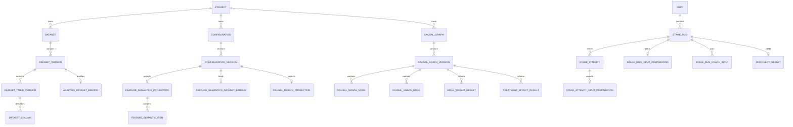

# 0. 文書情報

文書名: causal-atelier Webサービス データモデル定義書

## 0.1. 文書の目的

本書は、causal-atelier Webサービスが使用するPostgreSQL上の論理データモデルを定義する。読者は本書だけを参照して、主要なエンティティ、属性、主キー・外部キー、更新可能な状態、エンティティ間の関係、実行時の来歴、および移行要件を理解できる。

対象はMetadata DB、すなわち因果推論実験を管理・再現・監査するためのメタデータを保存するPostgreSQL DBである。causal-atelierは因果推論の対象となる表データそのものを、このDBの行として作成・更新・削除・問い合わせしない。対象データ本体と大きな結果ファイルはArtifact Storeまたは外部データ基盤に置き、causal-atelierはその識別子、schema/content hash、所在、来歴、検索・権限制御用projectionだけをMetadata DBに保存する。

## 0.2. 適用範囲

| 項目 | 内容 |
|---|---|
| 文書版 | 1.3 |
| 改訂日 | 2026-07-20 |
| 対象DBMS | PostgreSQL（SQLiteはテスト環境で同等の制約を検証する） |
| Artifact Store | local filesystem、S3、Azure Blob StorageをAdapter経由で利用可能とする |
| 対象機能 | Dataset、Configuration、Pipeline、Run、Artifact、Discovery、Saved Causal Graph、Inference、監査 |
| MVP後の機能 | External Dataset Reference、Graph手動編集のevent、外部credential binding |

## 0.3. 改定履歴

| 版 | 日付 | 変更内容 |
|---|---|---|
| 1.0 | 2026-07-18 | Webサービス化に必要な初期データモデルを定義 |
| 1.1 | 2026-07-20 | Analysis-ready実行、Feature SemanticsとDatasetのbinding、Saved Causal Graph Version、Causal Design接続、Run Result導線、Input Conditioning来歴、External Dataset Referenceを追加 |
| 1.2 | 2026-07-20 | 文書構造を再編し、各エンティティの責務・CRUD・関係を明文化。単独で読める完全な定義書へ改訂 |
| 1.3 | 2026-07-20 | 因果推論対象データと実験管理metadataの境界を明確化し、全tableの実装対応列定義を追加 |

## 0.4. 本版の変更方針

本節は、サービスが管理する行の削除・更新可否を定める。causal-atelierは因果推論実験を再現・監査できることを優先するため、内容を確定したVersion、実行履歴、Manifest、Artifact content、Resultの根拠を物理DELETEしない。

利用者がDataset、Configuration、Causal Graphを「削除」する操作は、参照中の行を消す操作ではない。Application Serviceが論理削除または利用停止状態へ遷移させ、過去Run、Result、Auditからの参照を残す。内容を変更したい場合は、Application Serviceが新しいVersionまたはAttemptを作成する。

この規則は、サービスのデータライフサイクルを定めるものであり、過去の文書版や未提供サービスのmigration互換性を要求するものではない。

## 0.5. 本書で用いる対象語と責務主体

| 用語 | 指す対象 |
|---|---|
| 論理Resource | Dataset、Configuration、Causal Graphのように、名称を持ち複数の内容Versionを束ねる対象 |
| Version | 特定時点の内容を固定したsnapshot。Version内容を編集せず、変更時は次Versionを作成する |
| 実行履歴 | Run、Stage Run、Stage Attempt、Event、Manifestのように、いつ何を実行したかを示す記録 |
| 実装者 | ORM model、DDL、Application Serviceを実装する者。各制約を実装・テストする責任を負う |
| Application Service | APIまたはworkerから呼ばれ、複数tableをまたぐ業務整合性を検証してtransactionを開始する層 |
| DB | PostgreSQL。FK、UNIQUE、CHECK、NOT NULLで表現可能な整合性を強制する主体 |

以降、データの作成・更新・削除を行う主体はApplication Serviceまたはworker、DB制約を強制する主体はPostgreSQL DBとする。制約の実装主体を区別する必要がある箇所では、本文で明記する。

## 0.6. 規範用語

| 表現 | 意味 |
|---|---|
| 必須、すること | 実装・検証が必要 |
| nullable / optional | Resourceまたはinput modeにより値を省略できる |
| MVP後 | この版のDDL実装対象外。ただし将来追加を阻害してはならない |
| 不変 | Application ServiceおよびDB運用はterminalまたはpublish後の内容をUPDATEしない。変更時は新しいVersionまたはAttemptをINSERTする |
| 論理削除 | 行を物理削除せず、deleted_at等で通常の検索対象から外す |

# 1. モデルの共通規則

この章は、全Domainのtableに共通する識別、更新、保存、および実行入力の扱いを定める。

## 1.1. Resource、Version、Execution、Fact

この節は、同じ「データ」という語で混同しやすい論理Resource、内容Version、実行、実行Fact、検索用Projectionを区別する。

| 種別 | 対象 | CRUDと責務 |
|---|---|---|
| Resource | Dataset、Configuration、Causal Graph | Application Serviceは作成後に名称・説明などの可変metadataだけを更新できる。削除は原則として論理削除 |
| Version | Dataset Version、Configuration Version、Causal Graph Version、Pipeline Definition Version | 内容のsnapshot。Application Serviceは作成後に内容を更新せず、修正時は次Versionを作成する |
| Execution | Run、Stage Run、Stage Attempt | workerまたはApplication Serviceは実行状態を更新できる。retryでは新しいAttemptを作成し、完了したAttemptを上書きしない |
| Fact / Artifact | Manifest、Run Event、Audit Event、Artifact content、Input Preparation | append-only。workerまたはApplication Serviceは訂正・再実行時に新しいFactを追加する |
| Projection | Result、profile、Graph node/edge、run_result_summary | 正本への参照とUI検索を担う。正本と矛盾した場合は再生成または無効化する |

Dataset Version、Dataset Table Version、PUBLISHED Configuration Version、PUBLISHED Causal Graph Version、Pipeline Definition Version、Execution Plan、Artifact content、Manifest、Run Event、およびterminalとなったStage Attemptの履歴は不変である。Application ServiceがDELETEを許せるのは、他のrowから参照されていないDRAFT Resourceの論理削除に限る。

## 1.2. 識別子・時刻・hash

- 主キーはUUIDとし、application側で生成する。高頻度append-only eventだけbigintを使用してよい。
- migration実装者は外部公開IDにDB連番を用いない。DBはすべての時刻をUTCの`timestamptz`で保存する。
- Run作成を行うApplication Serviceは、実行入力のResource IDだけでなく、受付時のcontent hashまたはschema hashをsnapshotとして保存する。
- canonical documentまたはArtifactを内容の正本とし、relation tableは整合性・検索・表示のためのprojectionとして扱う。

## 1.3. input mode

実行入力は次のいずれかへ、Execution Plan作成前に必ず解決する。

| code | 利用場面 | 必須入力 |
|---|---|---|
| CONFIGURED_FEATURE_BUILD | 既存CLI、ETL、Feature Buildを経由する実行 | 対応するFeature Configuration Version |
| ANALYSIS_READY | Web UIで分析準備済みDatasetを直接使う実行 | READY Analysis Dataset Binding、Feature Semantics Version |

Run作成を行うApplication Serviceは、mode未指定の既存requestを`CONFIGURED_FEATURE_BUILD`として解決する。Application ServiceはDataset Kind、table数、filenameからmodeを推測してはならない。

# 2. エンティティ一覧

この章は、データモデルをDomainごとに分類し、どのtable群が何を管理するかを示す。

## 2.1. 主なエンティティ

| Domain | エンティティ | 役割 |
|---|---|---|
| Identity | app_user、role、project_member | 利用者、権限、Projectへの所属 |
| Project | project | Dataset、設定、Run、Graphを分離する所有境界 |
| Data Catalog | dataset、dataset_version、dataset_table_version、dataset_column | データ集合と不変のschema/content snapshot |
| Analysis readiness | analysis_dataset_binding、data_profile、dataset_column_policy | 分析に使えるtable、品質、column利用制限 |
| Configuration | configuration、configuration_version、feature_semantics_projection、feature_semantic_item、causal_design_projection、causal_assumption | 分析上の意味、因果設計、Version化された設定 |
| Pipeline / execution | pipeline_definition、pipeline_definition_version、pipeline_stage_definition、run、execution_plan、stage_run、stage_attempt | 実行計画、stage、試行の管理 |
| Input provenance | stage_run_dataset_input、stage_run_config_input、stage_run_artifact_input、stage_run_input_preparation、stage_attempt_input_preparation、stage_run_graph_input | 受付時の入力と実際に使用したconditioningの記録 |
| Artifact / audit | stored_object、artifact、manifest_record、artifact_lineage、run_event、outbox_event、audit_event | object参照、成果物、lineage、非同期処理と監査 |
| Discovery / graph | discovery_result、discovery_algorithm_result、discovery_edge、causal_graph、causal_graph_version、causal_graph_node、causal_graph_edge | 探索結果と分析者が採用した因果グラフ |
| Inference | edge_weight_result、treatment_effect_result、run_result_summary | 推論結果とRunからの結果検索 |
| Supporting | experiment、validation_run、validation_issue、visualization_specification、visualization_query | 検証・可視化を支える補助機能 |

## 2.2. 全Domainで参照する共通エンティティ

この節は、個別の分析処理ではなく、所有者、保存先、設定、実行履歴として複数Domainから参照されるエンティティを説明する。

### 2.2.1. Identity / Project

`app_user`は利用者、`role`は権限コード、`project_member`は利用者とProjectの所属・roleを表す。`project`は全ての分析Resourceの所有境界である。Application ServiceはProjectをまたぐDataset、Configuration、Graph、Runの参照を作成・更新時に拒否する。利用者とProjectの削除は、既存Runの監査性を損なわない論理削除または無効化として扱う。

### 2.2.2. Object / Artifact

`stored_object`はArtifact Store上のobject locator、size、checksum、content typeを保持する。`artifact`は業務上の成果物種別・生成元・状態を表し、AVAILABLE後にcontentを置換しない。`manifest_record`は実行で読んだ入力と生成した出力のhash snapshotをappend-onlyで記録する。`artifact_lineage`はArtifact間の由来を表す有向関係であり、FKが表す所有関係を代替しない。

### 2.2.3. Configuration / Pipeline / Execution

`configuration`は設定の論理Resource、`configuration_version`は内容の不変snapshotである。`pipeline_definition`と`pipeline_definition_version`はstage構成の論理ResourceとVersion、`pipeline_stage_definition`は各stageの種別・順序・入力契約を表す。`run`は実行依頼、`execution_plan`は受付時に確定した入力Version/hash/modeの不変計画、`stage_run`はplan内のstage実行、`stage_attempt`はretryを含む試行履歴である。RunとStage Runは状態更新できるが、完了したAttemptおよびその入力Factは更新・削除しない。

### 2.2.4. 補助エンティティ

`experiment`、`configuration_dependency`、`pipeline_stage_dependency`、`pipeline_stage_config_binding`、`pipeline_stage_output_declaration`、`stage_run_dependency`、`stage_run_parameter`、`validation_run`、`validation_issue`、`visualization_specification`、`visualization_query`は、実験の整理、設定・stage依存、stage出力宣言、実行時依存・parameter、検証結果、可視化定義・queryを保持する。各tableの列定義は4章のtable仕様に記載する。

# 3. 概念ER

この章は、Data Catalog、設定、実行、結果を構成する主要table間の所有関係を俯瞰する。



# 4. エンティティ詳細

この章は、各tableの実装上の列定義と、その列に適用する業務制約を定める。

## 4.1. テーブル列定義一覧

この節は、実装の `src/causal_atelier/domain/metadata.py` に定義された全tableについて、列、PostgreSQL型、鍵、NULL可否、入力制約、役割を示す。因果推論対象データの各セルは本節のtableに保存しない。入力可能値の「型・FK・CHECKに従う」は、同じ行のデータ型、外部キー参照先、および5・6章の制約を満たす任意の値を表す。

### `app_user`

実装class: `User`。`app_user` が担う業務上の役割とtable間の関係は、後続の4.2節以降および5章に記載する。

| 列名（論理名） | 列名（物理名） | データ型 | 項目の意味/内容 | PK | FK | NOT NULL | 入力可能値 | 役割 |
| --- | --- | --- | --- | --- | --- | --- | --- | --- |
| ID | `id` | varchar(36) | ID | ○ | — | ○ | 既定値: new_id。型・FK・CHECKに従う | 行を一意に識別する主キー |
| Identity Provider | `identity_provider` | varchar(64) | Identity Provider | — | — | ○ | 型・FK・CHECKに従う | 属性 |
| External Subject | `external_subject` | varchar(255) | External Subject | — | — | ○ | 型・FK・CHECKに従う | 属性 |
| Email | `email` | varchar(320) | Email | — | — | — | 型・FK・CHECKに従う | 属性 |
| Display Name | `display_name` | varchar(255) | Display Name | — | — | ○ | 型・FK・CHECKに従う | 属性 |
| Status | `status` | varchar(32) | Status | — | — | ○ | 既定値: "ACTIVE"。型・FK・CHECKに従う | 状態遷移の管理 |
| Created At | `created_at` | timestamptz | Created At | — | — | ○ | 既定値: utcnow。型・FK・CHECKに従う | 時刻の記録 |
| Updated At | `updated_at` | timestamptz | Updated At | — | — | ○ | 既定値: utcnow。型・FK・CHECKに従う | 時刻の記録 |

### `project`

実装class: `Project`。`project` が担う業務上の役割とtable間の関係は、後続の4.2節以降および5章に記載する。

| 列名（論理名） | 列名（物理名） | データ型 | 項目の意味/内容 | PK | FK | NOT NULL | 入力可能値 | 役割 |
| --- | --- | --- | --- | --- | --- | --- | --- | --- |
| ID | `id` | varchar(36) | ID | ○ | — | ○ | 既定値: new_id。型・FK・CHECKに従う | 行を一意に識別する主キー |
| Slug | `slug` | varchar(255) | Slug | — | — | ○ | 型・FK・CHECKに従う | 属性 |
| Name | `name` | varchar(255) | Name | — | — | ○ | 型・FK・CHECKに従う | 属性 |
| Description | `description` | text | Description | — | — | — | 型・FK・CHECKに従う | 属性 |
| Status | `status` | varchar(32) | Status | — | — | ○ | 既定値: "ACTIVE"。型・FK・CHECKに従う | 状態遷移の管理 |
| Created By | `created_by` | varchar(36) | Created By | — | `app_user.id` | ○ | 型・FK・CHECKに従う | 属性 |
| Created At | `created_at` | timestamptz | Created At | — | — | ○ | 既定値: utcnow。型・FK・CHECKに従う | 時刻の記録 |
| Updated At | `updated_at` | timestamptz | Updated At | — | — | ○ | 既定値: utcnow。型・FK・CHECKに従う | 時刻の記録 |
| Deleted At | `deleted_at` | timestamptz | Deleted At | — | — | — | 型・FK・CHECKに従う | 時刻の記録 |

### `role`

実装class: `Role`。`role` が担う業務上の役割とtable間の関係は、後続の4.2節以降および5章に記載する。

| 列名（論理名） | 列名（物理名） | データ型 | 項目の意味/内容 | PK | FK | NOT NULL | 入力可能値 | 役割 |
| --- | --- | --- | --- | --- | --- | --- | --- | --- |
| ID | `id` | varchar(36) | ID | ○ | — | ○ | 既定値: new_id。型・FK・CHECKに従う | 行を一意に識別する主キー |
| Code | `code` | varchar(64) | Code | — | — | ○ | 型・FK・CHECKに従う | 属性 |
| Name | `name` | varchar(255) | Name | — | — | ○ | 型・FK・CHECKに従う | 属性 |
| System Managed | `system_managed` | boolean | System Managed | — | — | ○ | 既定値: True。型・FK・CHECKに従う | 属性 |

### `project_member`

実装class: `ProjectMember`。`project_member` が担う業務上の役割とtable間の関係は、後続の4.2節以降および5章に記載する。

| 列名（論理名） | 列名（物理名） | データ型 | 項目の意味/内容 | PK | FK | NOT NULL | 入力可能値 | 役割 |
| --- | --- | --- | --- | --- | --- | --- | --- | --- |
| Project ID | `project_id` | varchar(36) | Project ID | ○ | `project.id` | ○ | 型・FK・CHECKに従う | 関連先を特定する外部キー |
| User ID | `user_id` | varchar(36) | User ID | ○ | `app_user.id` | ○ | 型・FK・CHECKに従う | 関連先を特定する外部キー |
| Role ID | `role_id` | varchar(36) | Role ID | — | `role.id` | ○ | 型・FK・CHECKに従う | 関連先を特定する外部キー |
| Created At | `created_at` | timestamptz | Created At | — | — | ○ | 既定値: utcnow。型・FK・CHECKに従う | 時刻の記録 |

### `stored_object`

実装class: `StoredObject`。`stored_object` が担う業務上の役割とtable間の関係は、後続の4.2節以降および5章に記載する。

| 列名（論理名） | 列名（物理名） | データ型 | 項目の意味/内容 | PK | FK | NOT NULL | 入力可能値 | 役割 |
| --- | --- | --- | --- | --- | --- | --- | --- | --- |
| ID | `id` | varchar(36) | ID | ○ | — | ○ | 既定値: new_id。型・FK・CHECKに従う | 行を一意に識別する主キー |
| Backend | `backend` | varchar(32) | Backend | — | — | ○ | 既定値: "LOCAL"。型・FK・CHECKに従う | 属性 |
| Bucket | `bucket` | varchar(255) | Bucket | — | — | — | 型・FK・CHECKに従う | 属性 |
| Object Key | `object_key` | text | Object Key | — | — | ○ | 型・FK・CHECKに従う | 属性 |
| Object Version | `object_version` | varchar(255) | Object Version | — | — | ○ | 既定値: ""。型・FK・CHECKに従う | 属性 |
| Media Type | `media_type` | varchar(255) | Media Type | — | — | — | 型・FK・CHECKに従う | 属性 |
| Format | `format` | varchar(32) | Format | — | — | — | 型・FK・CHECKに従う | 属性 |
| Size Bytes | `size_bytes` | bigint | Size Bytes | — | — | — | 型・FK・CHECKに従う | 属性 |
| Checksum Algorithm | `checksum_algorithm` | varchar(32) | Checksum Algorithm | — | — | ○ | 既定値: "SHA256"。型・FK・CHECKに従う | 属性 |
| Checksum | `checksum` | varchar(255) | Checksum | — | — | ○ | 型・FK・CHECKに従う | 完全性・同一性の検証 |
| Encryption Metadata | `encryption_metadata` | jsonb | Encryption Metadata | — | — | ○ | 既定値: dict。型・FK・CHECKに従う | 属性 |
| Status | `status` | varchar(32) | Status | — | — | ○ | 既定値: "AVAILABLE"。型・FK・CHECKに従う | 状態遷移の管理 |
| Created At | `created_at` | timestamptz | Created At | — | — | ○ | 既定値: utcnow。型・FK・CHECKに従う | 時刻の記録 |
| Deleted At | `deleted_at` | timestamptz | Deleted At | — | — | — | 型・FK・CHECKに従う | 時刻の記録 |

### `dataset`

実装class: `Dataset`。`dataset` が担う業務上の役割とtable間の関係は、後続の4.2節以降および5章に記載する。

| 列名（論理名） | 列名（物理名） | データ型 | 項目の意味/内容 | PK | FK | NOT NULL | 入力可能値 | 役割 |
| --- | --- | --- | --- | --- | --- | --- | --- | --- |
| ID | `id` | varchar(36) | ID | ○ | — | ○ | 既定値: new_id。型・FK・CHECKに従う | 行を一意に識別する主キー |
| Project ID | `project_id` | varchar(36) | Project ID | — | `project.id` | ○ | 型・FK・CHECKに従う | 関連先を特定する外部キー |
| Slug | `slug` | varchar(255) | Slug | — | — | ○ | 型・FK・CHECKに従う | 属性 |
| Name | `name` | varchar(255) | Name | — | — | ○ | 型・FK・CHECKに従う | 属性 |
| Description | `description` | text | Description | — | — | — | 型・FK・CHECKに従う | 属性 |
| Dataset Kind | `dataset_kind` | varchar(32) | Dataset Kind | — | — | ○ | 型・FK・CHECKに従う | 属性 |
| Created By | `created_by` | varchar(36) | Created By | — | `app_user.id` | ○ | 型・FK・CHECKに従う | 属性 |
| Created At | `created_at` | timestamptz | Created At | — | — | ○ | 既定値: utcnow。型・FK・CHECKに従う | 時刻の記録 |
| Updated At | `updated_at` | timestamptz | Updated At | — | — | ○ | 既定値: utcnow。型・FK・CHECKに従う | 時刻の記録 |
| Deleted At | `deleted_at` | timestamptz | Deleted At | — | — | — | 型・FK・CHECKに従う | 時刻の記録 |

### `dataset_version`

実装class: `DatasetVersion`。`dataset_version` が担う業務上の役割とtable間の関係は、後続の4.2節以降および5章に記載する。

| 列名（論理名） | 列名（物理名） | データ型 | 項目の意味/内容 | PK | FK | NOT NULL | 入力可能値 | 役割 |
| --- | --- | --- | --- | --- | --- | --- | --- | --- |
| ID | `id` | varchar(36) | ID | ○ | — | ○ | 既定値: new_id。型・FK・CHECKに従う | 行を一意に識別する主キー |
| Dataset ID | `dataset_id` | varchar(36) | Dataset ID | — | `dataset.id` | ○ | 型・FK・CHECKに従う | 関連先を特定する外部キー |
| Version Number | `version_number` | integer | Version Number | — | — | ○ | 型・FK・CHECKに従う | 属性 |
| Status | `status` | varchar(32) | Status | — | — | ○ | 既定値: "REGISTERING"。型・FK・CHECKに従う | 状態遷移の管理 |
| Source Type | `source_type` | varchar(32) | Source Type | — | — | ○ | 型・FK・CHECKに従う | 属性 |
| Source Metadata | `source_metadata` | jsonb | Source Metadata | — | — | ○ | 既定値: dict。型・FK・CHECKに従う | 属性 |
| Schema Hash | `schema_hash` | varchar(255) | Schema Hash | — | — | — | 型・FK・CHECKに従う | 完全性・同一性の検証 |
| Content Hash | `content_hash` | varchar(255) | Content Hash | — | — | — | 型・FK・CHECKに従う | 完全性・同一性の検証 |
| Table Count | `table_count` | integer | Table Count | — | — | ○ | 既定値: 0。型・FK・CHECKに従う | 属性 |
| Origin Stage Run ID | `origin_stage_run_id` | varchar(36) | Origin Stage Run ID | — | — | — | 型・FK・CHECKに従う | 関連先または識別子 |
| Created By | `created_by` | varchar(36) | Created By | — | `app_user.id` | ○ | 型・FK・CHECKに従う | 属性 |
| Created At | `created_at` | timestamptz | Created At | — | — | ○ | 既定値: utcnow。型・FK・CHECKに従う | 時刻の記録 |
| Ready At | `ready_at` | timestamptz | Ready At | — | — | — | 型・FK・CHECKに従う | 時刻の記録 |
| Deleted At | `deleted_at` | timestamptz | Deleted At | — | — | — | 型・FK・CHECKに従う | 時刻の記録 |

### `dataset_table_version`

実装class: `DatasetTableVersion`。`dataset_table_version` が担う業務上の役割とtable間の関係は、後続の4.2節以降および5章に記載する。

| 列名（論理名） | 列名（物理名） | データ型 | 項目の意味/内容 | PK | FK | NOT NULL | 入力可能値 | 役割 |
| --- | --- | --- | --- | --- | --- | --- | --- | --- |
| ID | `id` | varchar(36) | ID | ○ | — | ○ | 既定値: new_id。型・FK・CHECKに従う | 行を一意に識別する主キー |
| Dataset Version ID | `dataset_version_id` | varchar(36) | Dataset Version ID | — | `dataset_version.id` | ○ | 型・FK・CHECKに従う | 関連先を特定する外部キー |
| Logical Name | `logical_name` | varchar(255) | Logical Name | — | — | ○ | 型・FK・CHECKに従う | 属性 |
| Stored Object ID | `stored_object_id` | varchar(36) | Stored Object ID | — | `stored_object.id` | ○ | 型・FK・CHECKに従う | 関連先を特定する外部キー |
| Ordinal | `ordinal` | integer | Ordinal | — | — | ○ | 型・FK・CHECKに従う | 属性 |
| File Format | `file_format` | varchar(32) | File Format | — | — | ○ | 型・FK・CHECKに従う | 属性 |
| Row Count | `row_count` | bigint | Row Count | — | — | — | 型・FK・CHECKに従う | 属性 |
| Column Count | `column_count` | integer | Column Count | — | — | — | 型・FK・CHECKに従う | 属性 |
| Schema Json | `schema_json` | jsonb | Schema Json | — | — | ○ | 既定値: dict。型・FK・CHECKに従う | 構造化された補足情報 |
| Schema Hash | `schema_hash` | varchar(255) | Schema Hash | — | — | — | 型・FK・CHECKに従う | 完全性・同一性の検証 |
| Content Hash | `content_hash` | varchar(255) | Content Hash | — | — | ○ | 型・FK・CHECKに従う | 完全性・同一性の検証 |
| Partition Values | `partition_values` | jsonb | Partition Values | — | — | — | 型・FK・CHECKに従う | 属性 |
| Source Entry Name | `source_entry_name` | varchar(255) | Source Entry Name | — | — | — | 型・FK・CHECKに従う | 属性 |
| Created At | `created_at` | timestamptz | Created At | — | — | ○ | 既定値: utcnow。型・FK・CHECKに従う | 時刻の記録 |

### `dataset_column`

実装class: `DatasetColumn`。`dataset_column` が担う業務上の役割とtable間の関係は、後続の4.2節以降および5章に記載する。

| 列名（論理名） | 列名（物理名） | データ型 | 項目の意味/内容 | PK | FK | NOT NULL | 入力可能値 | 役割 |
| --- | --- | --- | --- | --- | --- | --- | --- | --- |
| ID | `id` | varchar(36) | ID | ○ | — | ○ | 既定値: new_id。型・FK・CHECKに従う | 行を一意に識別する主キー |
| Dataset Table Version ID | `dataset_table_version_id` | varchar(36) | Dataset Table Version ID | — | `dataset_table_version.id` | ○ | 型・FK・CHECKに従う | 関連先を特定する外部キー |
| Ordinal | `ordinal` | integer | Ordinal | — | — | ○ | 型・FK・CHECKに従う | 属性 |
| Name | `name` | varchar(255) | Name | — | — | ○ | 型・FK・CHECKに従う | 属性 |
| Physical Type | `physical_type` | varchar(128) | Physical Type | — | — | ○ | 型・FK・CHECKに従う | 属性 |
| Logical Type | `logical_type` | varchar(128) | Logical Type | — | — | — | 型・FK・CHECKに従う | 属性 |
| Nullable | `nullable` | boolean | Nullable | — | — | ○ | 型・FK・CHECKに従う | 属性 |
| Description | `description` | text | Description | — | — | — | 型・FK・CHECKに従う | 属性 |
| Semantic Tags | `semantic_tags` | jsonb | Semantic Tags | — | — | ○ | 既定値: dict。型・FK・CHECKに従う | 属性 |

### `analysis_dataset_binding`

実装class: `AnalysisDatasetBinding`。`analysis_dataset_binding` が担う業務上の役割とtable間の関係は、後続の4.2節以降および5章に記載する。

| 列名（論理名） | 列名（物理名） | データ型 | 項目の意味/内容 | PK | FK | NOT NULL | 入力可能値 | 役割 |
| --- | --- | --- | --- | --- | --- | --- | --- | --- |
| Dataset Version ID | `dataset_version_id` | varchar(36) | Dataset Version ID | ○ | `dataset_version.id` | ○ | 型・FK・CHECKに従う | 関連先を特定する外部キー |
| Primary Table Version ID | `primary_table_version_id` | varchar(36) | Primary Table Version ID | — | `dataset_table_version.id` | ○ | 型・FK・CHECKに従う | 関連先を特定する外部キー |
| Analysis Unit Description | `analysis_unit_description` | text | Analysis Unit Description | — | — | ○ | 型・FK・CHECKに従う | 属性 |
| Unit Identifier Column ID | `unit_identifier_column_id` | varchar(36) | Unit Identifier Column ID | — | `dataset_column.id` | — | 型・FK・CHECKに従う | 関連先を特定する外部キー |
| Readiness Status | `readiness_status` | varchar(32) | Readiness Status | — | — | ○ | 既定値: "UNKNOWN"。型・FK・CHECKに従う | 属性 |
| Schema Hash Snapshot | `schema_hash_snapshot` | varchar(255) | Schema Hash Snapshot | — | — | ○ | 型・FK・CHECKに従う | 属性 |
| Validation Summary Json | `validation_summary_json` | jsonb | Validation Summary Json | — | — | ○ | 既定値: dict。型・FK・CHECKに従う | 構造化された補足情報 |
| Created By | `created_by` | varchar(36) | Created By | — | `app_user.id` | ○ | 型・FK・CHECKに従う | 属性 |
| Created At | `created_at` | timestamptz | Created At | — | — | ○ | 既定値: utcnow。型・FK・CHECKに従う | 時刻の記録 |
| Validated At | `validated_at` | timestamptz | Validated At | — | — | — | 型・FK・CHECKに従う | 時刻の記録 |

### `dataset_column_policy`

実装class: `DatasetColumnPolicy`。`dataset_column_policy` が担う業務上の役割とtable間の関係は、後続の4.2節以降および5章に記載する。

| 列名（論理名） | 列名（物理名） | データ型 | 項目の意味/内容 | PK | FK | NOT NULL | 入力可能値 | 役割 |
| --- | --- | --- | --- | --- | --- | --- | --- | --- |
| Dataset Column ID | `dataset_column_id` | varchar(36) | Dataset Column ID | ○ | `dataset_column.id` | ○ | 型・FK・CHECKに従う | 関連先を特定する外部キー |
| Classification | `classification` | varchar(32) | Classification | — | — | ○ | 既定値: "INTERNAL"。型・FK・CHECKに従う | 属性 |
| Preview Allowed | `preview_allowed` | boolean | Preview Allowed | — | — | ○ | 既定値: True。型・FK・CHECKに従う | 属性 |
| Analysis Allowed | `analysis_allowed` | boolean | Analysis Allowed | — | — | ○ | 既定値: True。型・FK・CHECKに従う | 属性 |
| Download Allowed | `download_allowed` | boolean | Download Allowed | — | — | ○ | 既定値: True。型・FK・CHECKに従う | 属性 |
| Mask Rule | `mask_rule` | varchar(64) | Mask Rule | — | — | — | 型・FK・CHECKに従う | 属性 |
| Minimum Group Count | `minimum_group_count` | integer | Minimum Group Count | — | — | — | 型・FK・CHECKに従う | 属性 |
| Updated By | `updated_by` | varchar(36) | Updated By | — | `app_user.id` | ○ | 型・FK・CHECKに従う | 属性 |
| Updated At | `updated_at` | timestamptz | Updated At | — | — | ○ | 既定値: utcnow。型・FK・CHECKに従う | 時刻の記録 |

### `data_profile`

実装class: `DataProfile`。`data_profile` が担う業務上の役割とtable間の関係は、後続の4.2節以降および5章に記載する。

| 列名（論理名） | 列名（物理名） | データ型 | 項目の意味/内容 | PK | FK | NOT NULL | 入力可能値 | 役割 |
| --- | --- | --- | --- | --- | --- | --- | --- | --- |
| ID | `id` | varchar(36) | ID | ○ | — | ○ | 既定値: new_id。型・FK・CHECKに従う | 行を一意に識別する主キー |
| Dataset Table Version ID | `dataset_table_version_id` | varchar(36) | Dataset Table Version ID | — | `dataset_table_version.id` | ○ | 型・FK・CHECKに従う | 関連先を特定する外部キー |
| Status | `status` | varchar(32) | Status | — | — | ○ | 既定値: "PENDING"。型・FK・CHECKに従う | 状態遷移の管理 |
| Profiler Name | `profiler_name` | varchar(128) | Profiler Name | — | — | ○ | 既定値: "causal-atelier"。型・FK・CHECKに従う | 属性 |
| Profiler Version | `profiler_version` | varchar(64) | Profiler Version | — | — | ○ | 既定値: "1"。型・FK・CHECKに従う | 属性 |
| Sampled | `sampled` | boolean | Sampled | — | — | ○ | 既定値: False。型・FK・CHECKに従う | 属性 |
| Sample Size | `sample_size` | bigint | Sample Size | — | — | — | 型・FK・CHECKに従う | 属性 |
| Summary Json | `summary_json` | jsonb | Summary Json | — | — | ○ | 既定値: dict。型・FK・CHECKに従う | 構造化された補足情報 |
| Artifact ID | `artifact_id` | varchar(36) | Artifact ID | — | — | — | 型・FK・CHECKに従う | 関連先または識別子 |
| Error Summary | `error_summary` | text | Error Summary | — | — | — | 型・FK・CHECKに従う | 属性 |
| Created At | `created_at` | timestamptz | Created At | — | — | ○ | 既定値: utcnow。型・FK・CHECKに従う | 時刻の記録 |

### `column_profile`

実装class: `ColumnProfile`。`column_profile` が担う業務上の役割とtable間の関係は、後続の4.2節以降および5章に記載する。

| 列名（論理名） | 列名（物理名） | データ型 | 項目の意味/内容 | PK | FK | NOT NULL | 入力可能値 | 役割 |
| --- | --- | --- | --- | --- | --- | --- | --- | --- |
| Data Profile ID | `data_profile_id` | varchar(36) | Data Profile ID | ○ | `data_profile.id` | ○ | 型・FK・CHECKに従う | 関連先を特定する外部キー |
| Dataset Column ID | `dataset_column_id` | varchar(36) | Dataset Column ID | ○ | `dataset_column.id` | ○ | 型・FK・CHECKに従う | 関連先を特定する外部キー |
| Null Count | `null_count` | bigint | Null Count | — | — | — | 型・FK・CHECKに従う | 属性 |
| Distinct Count | `distinct_count` | bigint | Distinct Count | — | — | — | 型・FK・CHECKに従う | 属性 |
| Min Value | `min_value` | text | Min Value | — | — | — | 型・FK・CHECKに従う | 属性 |
| Max Value | `max_value` | text | Max Value | — | — | — | 型・FK・CHECKに従う | 属性 |
| Statistics Json | `statistics_json` | jsonb | Statistics Json | — | — | ○ | 既定値: dict。型・FK・CHECKに従う | 構造化された補足情報 |

### `configuration`

実装class: `Configuration`。`configuration` が担う業務上の役割とtable間の関係は、後続の4.2節以降および5章に記載する。

| 列名（論理名） | 列名（物理名） | データ型 | 項目の意味/内容 | PK | FK | NOT NULL | 入力可能値 | 役割 |
| --- | --- | --- | --- | --- | --- | --- | --- | --- |
| ID | `id` | varchar(36) | ID | ○ | — | ○ | 既定値: new_id。型・FK・CHECKに従う | 行を一意に識別する主キー |
| Project ID | `project_id` | varchar(36) | Project ID | — | `project.id` | ○ | 型・FK・CHECKに従う | 関連先を特定する外部キー |
| Configuration Type | `configuration_type` | varchar(64) | Configuration Type | — | — | ○ | 型・FK・CHECKに従う | 属性 |
| Slug | `slug` | varchar(255) | Slug | — | — | ○ | 型・FK・CHECKに従う | 属性 |
| Name | `name` | varchar(255) | Name | — | — | ○ | 型・FK・CHECKに従う | 属性 |
| Description | `description` | text | Description | — | — | — | 型・FK・CHECKに従う | 属性 |
| Created By | `created_by` | varchar(36) | Created By | — | `app_user.id` | ○ | 型・FK・CHECKに従う | 属性 |
| Created At | `created_at` | timestamptz | Created At | — | — | ○ | 既定値: utcnow。型・FK・CHECKに従う | 時刻の記録 |
| Deleted At | `deleted_at` | timestamptz | Deleted At | — | — | — | 型・FK・CHECKに従う | 時刻の記録 |

### `configuration_version`

実装class: `ConfigurationVersion`。`configuration_version` が担う業務上の役割とtable間の関係は、後続の4.2節以降および5章に記載する。

| 列名（論理名） | 列名（物理名） | データ型 | 項目の意味/内容 | PK | FK | NOT NULL | 入力可能値 | 役割 |
| --- | --- | --- | --- | --- | --- | --- | --- | --- |
| ID | `id` | varchar(36) | ID | ○ | — | ○ | 既定値: new_id。型・FK・CHECKに従う | 行を一意に識別する主キー |
| Configuration ID | `configuration_id` | varchar(36) | Configuration ID | — | `configuration.id` | ○ | 型・FK・CHECKに従う | 関連先を特定する外部キー |
| Version Number | `version_number` | integer | Version Number | — | — | ○ | 型・FK・CHECKに従う | 属性 |
| Status | `status` | varchar(32) | Status | — | — | ○ | 既定値: "DRAFT"。型・FK・CHECKに従う | 状態遷移の管理 |
| Schema Version | `schema_version` | varchar(64) | Schema Version | — | — | ○ | 既定値: "1"。型・FK・CHECKに従う | 属性 |
| Canonical Json | `canonical_json` | jsonb | Canonical Json | — | — | ○ | 型・FK・CHECKに従う | 構造化された補足情報 |
| Original Format | `original_format` | varchar(16) | Original Format | — | — | ○ | 既定値: "YAML"。型・FK・CHECKに従う | 属性 |
| Original Text | `original_text` | text | Original Text | — | — | — | 型・FK・CHECKに従う | 属性 |
| Content Hash | `content_hash` | varchar(255) | Content Hash | — | — | ○ | 型・FK・CHECKに従う | 完全性・同一性の検証 |
| Validation Status | `validation_status` | varchar(32) | Validation Status | — | — | ○ | 既定値: "UNKNOWN"。型・FK・CHECKに従う | 属性 |
| Validation Summary | `validation_summary` | jsonb | Validation Summary | — | — | ○ | 既定値: dict。型・FK・CHECKに従う | 属性 |
| Supersedes Version ID | `supersedes_version_id` | varchar(36) | Supersedes Version ID | — | `configuration_version.id` | — | 型・FK・CHECKに従う | 関連先を特定する外部キー |
| Created By | `created_by` | varchar(36) | Created By | — | `app_user.id` | ○ | 型・FK・CHECKに従う | 属性 |
| Created At | `created_at` | timestamptz | Created At | — | — | ○ | 既定値: utcnow。型・FK・CHECKに従う | 時刻の記録 |
| Published By | `published_by` | varchar(36) | Published By | — | `app_user.id` | — | 型・FK・CHECKに従う | 属性 |
| Published At | `published_at` | timestamptz | Published At | — | — | — | 型・FK・CHECKに従う | 時刻の記録 |
| Lock Version | `lock_version` | integer | Lock Version | — | — | ○ | 既定値: 1。型・FK・CHECKに従う | 属性 |

### `configuration_dependency`

実装class: `ConfigurationDependency`。`configuration_dependency` が担う業務上の役割とtable間の関係は、後続の4.2節以降および5章に記載する。

| 列名（論理名） | 列名（物理名） | データ型 | 項目の意味/内容 | PK | FK | NOT NULL | 入力可能値 | 役割 |
| --- | --- | --- | --- | --- | --- | --- | --- | --- |
| Source Configuration Version ID | `source_configuration_version_id` | varchar(36) | Source Configuration Version ID | ○ | `configuration_version.id` | ○ | 型・FK・CHECKに従う | 関連先を特定する外部キー |
| Dependency Name | `dependency_name` | varchar(255) | Dependency Name | ○ | — | ○ | 型・FK・CHECKに従う | 属性 |
| Target Configuration Version ID | `target_configuration_version_id` | varchar(36) | Target Configuration Version ID | — | `configuration_version.id` | ○ | 型・FK・CHECKに従う | 関連先を特定する外部キー |
| Dependency Type | `dependency_type` | varchar(32) | Dependency Type | — | — | ○ | 型・FK・CHECKに従う | 属性 |

### `feature_semantics_projection`

実装class: `FeatureSemanticsProjection`。`feature_semantics_projection` が担う業務上の役割とtable間の関係は、後続の4.2節以降および5章に記載する。

| 列名（論理名） | 列名（物理名） | データ型 | 項目の意味/内容 | PK | FK | NOT NULL | 入力可能値 | 役割 |
| --- | --- | --- | --- | --- | --- | --- | --- | --- |
| Configuration Version ID | `configuration_version_id` | varchar(36) | Configuration Version ID | ○ | `configuration_version.id` | ○ | 型・FK・CHECKに従う | 関連先を特定する外部キー |
| Default Unit ID | `default_unit_id` | varchar(255) | Default Unit ID | — | — | — | 型・FK・CHECKに従う | 関連先または識別子 |
| Feature Count | `feature_count` | integer | Feature Count | — | — | ○ | 型・FK・CHECKに従う | 属性 |
| Created At | `created_at` | timestamptz | Created At | — | — | ○ | 既定値: utcnow。型・FK・CHECKに従う | 時刻の記録 |

### `feature_semantics_dataset_binding`

実装class: `FeatureSemanticsDatasetBinding`。`feature_semantics_dataset_binding` が担う業務上の役割とtable間の関係は、後続の4.2節以降および5章に記載する。

| 列名（論理名） | 列名（物理名） | データ型 | 項目の意味/内容 | PK | FK | NOT NULL | 入力可能値 | 役割 |
| --- | --- | --- | --- | --- | --- | --- | --- | --- |
| Configuration Version ID | `configuration_version_id` | varchar(36) | Configuration Version ID | ○ | `configuration_version.id` | ○ | 型・FK・CHECKに従う | 関連先を特定する外部キー |
| Dataset Version ID | `dataset_version_id` | varchar(36) | Dataset Version ID | — | `dataset_version.id` | ○ | 型・FK・CHECKに従う | 関連先を特定する外部キー |
| Dataset Table Version ID | `dataset_table_version_id` | varchar(36) | Dataset Table Version ID | — | `dataset_table_version.id` | ○ | 型・FK・CHECKに従う | 関連先を特定する外部キー |
| Dataset Schema Hash Snapshot | `dataset_schema_hash_snapshot` | varchar(255) | Dataset Schema Hash Snapshot | — | — | ○ | 型・FK・CHECKに従う | 属性 |
| Binding Status | `binding_status` | varchar(32) | Binding Status | — | — | ○ | 既定値: "VALID"。型・FK・CHECKに従う | 属性 |
| Validation Summary Json | `validation_summary_json` | jsonb | Validation Summary Json | — | — | ○ | 既定値: dict。型・FK・CHECKに従う | 構造化された補足情報 |
| Created At | `created_at` | timestamptz | Created At | — | — | ○ | 既定値: utcnow。型・FK・CHECKに従う | 時刻の記録 |
| Validated At | `validated_at` | timestamptz | Validated At | — | — | — | 型・FK・CHECKに従う | 時刻の記録 |

### `feature_semantic_item`

実装class: `FeatureSemanticItem`。`feature_semantic_item` が担う業務上の役割とtable間の関係は、後続の4.2節以降および5章に記載する。

| 列名（論理名） | 列名（物理名） | データ型 | 項目の意味/内容 | PK | FK | NOT NULL | 入力可能値 | 役割 |
| --- | --- | --- | --- | --- | --- | --- | --- | --- |
| Feature Semantics Version ID | `feature_semantics_version_id` | varchar(36) | Feature Semantics Version ID | ○ | `configuration_version.id` | ○ | 型・FK・CHECKに従う | 関連先を特定する外部キー |
| Name | `name` | varchar(255) | Name | ○ | — | ○ | 型・FK・CHECKに従う | 属性 |
| Role | `role` | varchar(32) | Role | — | — | ○ | 型・FK・CHECKに従う | 属性 |
| Source Table | `source_table` | varchar(255) | Source Table | — | — | ○ | 型・FK・CHECKに従う | 属性 |
| Source Column | `source_column` | varchar(255) | Source Column | — | — | — | 型・FK・CHECKに従う | 属性 |
| Unit ID | `unit_id` | varchar(255) | Unit ID | — | — | ○ | 型・FK・CHECKに従う | 関連先または識別子 |
| Aggregation | `aggregation` | varchar(64) | Aggregation | — | — | — | 型・FK・CHECKに従う | 属性 |
| Transform | `transform` | varchar(128) | Transform | — | — | — | 型・FK・CHECKに従う | 属性 |
| Dtype | `dtype` | varchar(128) | Dtype | — | — | — | 型・FK・CHECKに従う | 属性 |
| Dataset Column ID | `dataset_column_id` | varchar(36) | Dataset Column ID | — | `dataset_column.id` | — | 型・FK・CHECKに従う | 関連先を特定する外部キー |
| Categorical | `categorical` | boolean | Categorical | — | — | ○ | 既定値: False。型・FK・CHECKに従う | 属性 |
| Allowed For Discovery | `allowed_for_discovery` | boolean | Allowed For Discovery | — | — | ○ | 既定値: True。型・FK・CHECKに従う | 属性 |
| Allowed For Adjustment | `allowed_for_adjustment` | boolean | Allowed For Adjustment | — | — | ○ | 既定値: False。型・FK・CHECKに従う | 属性 |
| Post Treatment | `post_treatment` | boolean | Post Treatment | — | — | ○ | 既定値: False。型・FK・CHECKに従う | 属性 |
| Time Metadata Json | `time_metadata_json` | jsonb | Time Metadata Json | — | — | ○ | 既定値: dict。型・FK・CHECKに従う | 構造化された補足情報 |
| Description | `description` | text | Description | — | — | — | 型・FK・CHECKに従う | 属性 |
| Metadata Json | `metadata_json` | jsonb | Metadata Json | — | — | ○ | 既定値: dict。型・FK・CHECKに従う | 構造化された補足情報 |

### `causal_design_projection`

実装class: `CausalDesignProjection`。`causal_design_projection` が担う業務上の役割とtable間の関係は、後続の4.2節以降および5章に記載する。

| 列名（論理名） | 列名（物理名） | データ型 | 項目の意味/内容 | PK | FK | NOT NULL | 入力可能値 | 役割 |
| --- | --- | --- | --- | --- | --- | --- | --- | --- |
| Configuration Version ID | `configuration_version_id` | varchar(36) | Configuration Version ID | ○ | `configuration_version.id` | ○ | 型・FK・CHECKに従う | 関連先を特定する外部キー |
| Feature Semantics Version ID | `feature_semantics_version_id` | varchar(36) | Feature Semantics Version ID | — | `configuration_version.id` | — | 型・FK・CHECKに従う | 関連先を特定する外部キー |
| Dataset Version ID | `dataset_version_id` | varchar(36) | Dataset Version ID | — | `dataset_version.id` | — | 型・FK・CHECKに従う | 関連先を特定する外部キー |
| Causal Graph Version ID | `causal_graph_version_id` | varchar(36) | Causal Graph Version ID | — | `causal_graph_version.id` | — | 型・FK・CHECKに従う | 関連先を特定する外部キー |
| Estimand | `estimand` | varchar(16) | Estimand | — | — | ○ | 型・FK・CHECKに従う | 属性 |
| Treatment Name | `treatment_name` | varchar(255) | Treatment Name | — | — | ○ | 型・FK・CHECKに従う | 属性 |
| Treatment Time | `treatment_time` | varchar(255) | Treatment Time | — | — | — | 型・FK・CHECKに従う | 属性 |
| Treatment Levels | `treatment_levels` | jsonb | Treatment Levels | — | — | ○ | 既定値: list。型・FK・CHECKに従う | 属性 |
| Outcome Name | `outcome_name` | varchar(255) | Outcome Name | — | — | ○ | 型・FK・CHECKに従う | 属性 |
| Outcome Window | `outcome_window` | jsonb | Outcome Window | — | — | — | 型・FK・CHECKに従う | 属性 |
| Unit | `unit` | varchar(255) | Unit | — | — | ○ | 型・FK・CHECKに従う | 属性 |
| Time Zero | `time_zero` | varchar(255) | Time Zero | — | — | — | 型・FK・CHECKに従う | 属性 |
| Adjustment Set Name | `adjustment_set_name` | varchar(255) | Adjustment Set Name | — | — | — | 型・FK・CHECKに従う | 属性 |
| Target Population | `target_population` | text | Target Population | — | — | — | 型・FK・CHECKに従う | 属性 |
| Adjustment Strategy | `adjustment_strategy` | varchar(64) | Adjustment Strategy | — | — | — | 型・FK・CHECKに従う | 属性 |
| Adjustment Set Json | `adjustment_set_json` | jsonb | Adjustment Set Json | — | — | ○ | 既定値: list。型・FK・CHECKに従う | 構造化された補足情報 |
| Analyst Note | `analyst_note` | text | Analyst Note | — | — | — | 型・FK・CHECKに従う | 属性 |

### `causal_assumption`

実装class: `CausalAssumption`。`causal_assumption` が担う業務上の役割とtable間の関係は、後続の4.2節以降および5章に記載する。

| 列名（論理名） | 列名（物理名） | データ型 | 項目の意味/内容 | PK | FK | NOT NULL | 入力可能値 | 役割 |
| --- | --- | --- | --- | --- | --- | --- | --- | --- |
| Causal Design Version ID | `causal_design_version_id` | varchar(36) | Causal Design Version ID | ○ | `configuration_version.id` | ○ | 型・FK・CHECKに従う | 関連先を特定する外部キー |
| Assumption Code | `assumption_code` | varchar(128) | Assumption Code | ○ | — | ○ | 型・FK・CHECKに従う | 属性 |
| Statement | `statement` | text | Statement | — | — | — | 型・FK・CHECKに従う | 属性 |
| Declaration Status | `declaration_status` | varchar(32) | Declaration Status | — | — | ○ | 型・FK・CHECKに従う | 属性 |
| Evidence | `evidence` | text | Evidence | — | — | — | 型・FK・CHECKに従う | 属性 |
| Ordinal | `ordinal` | integer | Ordinal | — | — | ○ | 型・FK・CHECKに従う | 属性 |

### `experiment`

実装class: `Experiment`。`experiment` が担う業務上の役割とtable間の関係は、後続の4.2節以降および5章に記載する。

| 列名（論理名） | 列名（物理名） | データ型 | 項目の意味/内容 | PK | FK | NOT NULL | 入力可能値 | 役割 |
| --- | --- | --- | --- | --- | --- | --- | --- | --- |
| ID | `id` | varchar(36) | ID | ○ | — | ○ | 既定値: new_id。型・FK・CHECKに従う | 行を一意に識別する主キー |
| Project ID | `project_id` | varchar(36) | Project ID | — | `project.id` | ○ | 型・FK・CHECKに従う | 関連先を特定する外部キー |
| Slug | `slug` | varchar(255) | Slug | — | — | ○ | 型・FK・CHECKに従う | 属性 |
| Title | `title` | varchar(255) | Title | — | — | ○ | 型・FK・CHECKに従う | 属性 |
| Objective | `objective` | text | Objective | — | — | — | 型・FK・CHECKに従う | 属性 |
| Hypothesis | `hypothesis` | text | Hypothesis | — | — | — | 型・FK・CHECKに従う | 属性 |
| Notes | `notes` | text | Notes | — | — | — | 型・FK・CHECKに従う | 属性 |
| Source Repository | `source_repository` | text | Source Repository | — | — | — | 型・FK・CHECKに従う | 属性 |
| Source Commit | `source_commit` | varchar(128) | Source Commit | — | — | — | 型・FK・CHECKに従う | 属性 |
| Notebook Reference | `notebook_reference` | text | Notebook Reference | — | — | — | 型・FK・CHECKに従う | 属性 |
| Tags | `tags` | jsonb | Tags | — | — | ○ | 既定値: list。型・FK・CHECKに従う | 属性 |
| Created By | `created_by` | varchar(36) | Created By | — | `app_user.id` | ○ | 型・FK・CHECKに従う | 属性 |
| Created At | `created_at` | timestamptz | Created At | — | — | ○ | 既定値: utcnow。型・FK・CHECKに従う | 時刻の記録 |
| Updated At | `updated_at` | timestamptz | Updated At | — | — | ○ | 既定値: utcnow。型・FK・CHECKに従う | 時刻の記録 |
| Archived At | `archived_at` | timestamptz | Archived At | — | — | — | 型・FK・CHECKに従う | 時刻の記録 |

### `pipeline_definition`

実装class: `PipelineDefinition`。`pipeline_definition` が担う業務上の役割とtable間の関係は、後続の4.2節以降および5章に記載する。

| 列名（論理名） | 列名（物理名） | データ型 | 項目の意味/内容 | PK | FK | NOT NULL | 入力可能値 | 役割 |
| --- | --- | --- | --- | --- | --- | --- | --- | --- |
| ID | `id` | varchar(36) | ID | ○ | — | ○ | 既定値: new_id。型・FK・CHECKに従う | 行を一意に識別する主キー |
| Project ID | `project_id` | varchar(36) | Project ID | — | `project.id` | ○ | 型・FK・CHECKに従う | 関連先を特定する外部キー |
| Slug | `slug` | varchar(255) | Slug | — | — | ○ | 型・FK・CHECKに従う | 属性 |
| Name | `name` | varchar(255) | Name | — | — | ○ | 型・FK・CHECKに従う | 属性 |
| Description | `description` | text | Description | — | — | — | 型・FK・CHECKに従う | 属性 |
| Created By | `created_by` | varchar(36) | Created By | — | `app_user.id` | ○ | 型・FK・CHECKに従う | 属性 |
| Created At | `created_at` | timestamptz | Created At | — | — | ○ | 既定値: utcnow。型・FK・CHECKに従う | 時刻の記録 |
| Deleted At | `deleted_at` | timestamptz | Deleted At | — | — | — | 型・FK・CHECKに従う | 時刻の記録 |

### `pipeline_definition_version`

実装class: `PipelineDefinitionVersion`。`pipeline_definition_version` が担う業務上の役割とtable間の関係は、後続の4.2節以降および5章に記載する。

| 列名（論理名） | 列名（物理名） | データ型 | 項目の意味/内容 | PK | FK | NOT NULL | 入力可能値 | 役割 |
| --- | --- | --- | --- | --- | --- | --- | --- | --- |
| ID | `id` | varchar(36) | ID | ○ | — | ○ | 既定値: new_id。型・FK・CHECKに従う | 行を一意に識別する主キー |
| Pipeline Definition ID | `pipeline_definition_id` | varchar(36) | Pipeline Definition ID | — | `pipeline_definition.id` | ○ | 型・FK・CHECKに従う | 関連先を特定する外部キー |
| Version Number | `version_number` | integer | Version Number | — | — | ○ | 型・FK・CHECKに従う | 属性 |
| Status | `status` | varchar(32) | Status | — | — | ○ | 既定値: "DRAFT"。型・FK・CHECKに従う | 状態遷移の管理 |
| Random Seed Default | `random_seed_default` | bigint | Random Seed Default | — | — | — | 型・FK・CHECKに従う | 属性 |
| Fail Fast | `fail_fast` | boolean | Fail Fast | — | — | ○ | 既定値: True。型・FK・CHECKに従う | 属性 |
| Canonical Json | `canonical_json` | jsonb | Canonical Json | — | — | ○ | 型・FK・CHECKに従う | 構造化された補足情報 |
| Content Hash | `content_hash` | varchar(255) | Content Hash | — | — | ○ | 型・FK・CHECKに従う | 完全性・同一性の検証 |
| Created By | `created_by` | varchar(36) | Created By | — | `app_user.id` | ○ | 型・FK・CHECKに従う | 属性 |
| Created At | `created_at` | timestamptz | Created At | — | — | ○ | 既定値: utcnow。型・FK・CHECKに従う | 時刻の記録 |
| Published At | `published_at` | timestamptz | Published At | — | — | — | 型・FK・CHECKに従う | 時刻の記録 |

### `pipeline_stage_definition`

実装class: `PipelineStageDefinition`。`pipeline_stage_definition` が担う業務上の役割とtable間の関係は、後続の4.2節以降および5章に記載する。

| 列名（論理名） | 列名（物理名） | データ型 | 項目の意味/内容 | PK | FK | NOT NULL | 入力可能値 | 役割 |
| --- | --- | --- | --- | --- | --- | --- | --- | --- |
| ID | `id` | varchar(36) | ID | ○ | — | ○ | 既定値: new_id。型・FK・CHECKに従う | 行を一意に識別する主キー |
| Pipeline Definition Version ID | `pipeline_definition_version_id` | varchar(36) | Pipeline Definition Version ID | — | `pipeline_definition_version.id` | ○ | 型・FK・CHECKに従う | 関連先を特定する外部キー |
| Stage Key | `stage_key` | varchar(255) | Stage Key | — | — | ○ | 型・FK・CHECKに従う | 属性 |
| Stage Type | `stage_type` | varchar(32) | Stage Type | — | — | ○ | 型・FK・CHECKに従う | 属性 |
| Analysis Mode | `analysis_mode` | varchar(32) | Analysis Mode | — | — | — | 型・FK・CHECKに従う | 属性 |
| Input Mode | `input_mode` | varchar(32) | Input Mode | — | — | — | 型・FK・CHECKに従う | 属性 |
| Ordinal | `ordinal` | integer | Ordinal | — | — | ○ | 型・FK・CHECKに従う | 属性 |
| Enabled By Default | `enabled_by_default` | boolean | Enabled By Default | — | — | ○ | 既定値: True。型・FK・CHECKに従う | 属性 |
| Runner Name | `runner_name` | varchar(128) | Runner Name | — | — | ○ | 型・FK・CHECKに従う | 属性 |
| Timeout Seconds | `timeout_seconds` | integer | Timeout Seconds | — | — | — | 型・FK・CHECKに従う | 属性 |
| Retry Policy Json | `retry_policy_json` | jsonb | Retry Policy Json | — | — | ○ | 既定値: dict。型・FK・CHECKに従う | 構造化された補足情報 |
| Resource Requirements Json | `resource_requirements_json` | jsonb | Resource Requirements Json | — | — | ○ | 既定値: dict。型・FK・CHECKに従う | 構造化された補足情報 |
| Metadata Json | `metadata_json` | jsonb | Metadata Json | — | — | ○ | 既定値: dict。型・FK・CHECKに従う | 構造化された補足情報 |

### `pipeline_stage_dependency`

実装class: `PipelineStageDependency`。`pipeline_stage_dependency` が担う業務上の役割とtable間の関係は、後続の4.2節以降および5章に記載する。

| 列名（論理名） | 列名（物理名） | データ型 | 項目の意味/内容 | PK | FK | NOT NULL | 入力可能値 | 役割 |
| --- | --- | --- | --- | --- | --- | --- | --- | --- |
| Stage Definition ID | `stage_definition_id` | varchar(36) | Stage Definition ID | ○ | `pipeline_stage_definition.id` | ○ | 型・FK・CHECKに従う | 関連先を特定する外部キー |
| Depends On Stage Definition ID | `depends_on_stage_definition_id` | varchar(36) | Depends On Stage Definition ID | ○ | `pipeline_stage_definition.id` | ○ | 型・FK・CHECKに従う | 関連先を特定する外部キー |

### `pipeline_stage_config_binding`

実装class: `PipelineStageConfigBinding`。`pipeline_stage_config_binding` が担う業務上の役割とtable間の関係は、後続の4.2節以降および5章に記載する。

| 列名（論理名） | 列名（物理名） | データ型 | 項目の意味/内容 | PK | FK | NOT NULL | 入力可能値 | 役割 |
| --- | --- | --- | --- | --- | --- | --- | --- | --- |
| Stage Definition ID | `stage_definition_id` | varchar(36) | Stage Definition ID | ○ | `pipeline_stage_definition.id` | ○ | 型・FK・CHECKに従う | 関連先を特定する外部キー |
| Binding Name | `binding_name` | varchar(255) | Binding Name | ○ | — | ○ | 型・FK・CHECKに従う | 属性 |
| Configuration Version ID | `configuration_version_id` | varchar(36) | Configuration Version ID | — | `configuration_version.id` | ○ | 型・FK・CHECKに従う | 関連先を特定する外部キー |
| Required | `required` | boolean | Required | — | — | ○ | 既定値: True。型・FK・CHECKに従う | 属性 |

### `pipeline_stage_output_declaration`

実装class: `PipelineStageOutputDeclaration`。`pipeline_stage_output_declaration` が担う業務上の役割とtable間の関係は、後続の4.2節以降および5章に記載する。

| 列名（論理名） | 列名（物理名） | データ型 | 項目の意味/内容 | PK | FK | NOT NULL | 入力可能値 | 役割 |
| --- | --- | --- | --- | --- | --- | --- | --- | --- |
| Stage Definition ID | `stage_definition_id` | varchar(36) | Stage Definition ID | ○ | `pipeline_stage_definition.id` | ○ | 型・FK・CHECKに従う | 関連先を特定する外部キー |
| Output Name | `output_name` | varchar(255) | Output Name | ○ | — | ○ | 型・FK・CHECKに従う | 属性 |
| Artifact Kind | `artifact_kind` | varchar(64) | Artifact Kind | — | — | ○ | 型・FK・CHECKに従う | 属性 |
| Required | `required` | boolean | Required | — | — | ○ | 既定値: True。型・FK・CHECKに従う | 属性 |
| Register As Dataset | `register_as_dataset` | boolean | Register As Dataset | — | — | ○ | 既定値: False。型・FK・CHECKに従う | 属性 |

### `run`

実装class: `Run`。`run` が担う業務上の役割とtable間の関係は、後続の4.2節以降および5章に記載する。

| 列名（論理名） | 列名（物理名） | データ型 | 項目の意味/内容 | PK | FK | NOT NULL | 入力可能値 | 役割 |
| --- | --- | --- | --- | --- | --- | --- | --- | --- |
| ID | `id` | varchar(36) | ID | ○ | — | ○ | 既定値: new_id。型・FK・CHECKに従う | 行を一意に識別する主キー |
| Project ID | `project_id` | varchar(36) | Project ID | — | `project.id` | ○ | 型・FK・CHECKに従う | 関連先を特定する外部キー |
| Experiment ID | `experiment_id` | varchar(36) | Experiment ID | — | `experiment.id` | — | 型・FK・CHECKに従う | 関連先を特定する外部キー |
| Pipeline Definition Version ID | `pipeline_definition_version_id` | varchar(36) | Pipeline Definition Version ID | — | `pipeline_definition_version.id` | — | 型・FK・CHECKに従う | 関連先を特定する外部キー |
| Run Kind | `run_kind` | varchar(32) | Run Kind | — | — | ○ | 型・FK・CHECKに従う | 属性 |
| Execution Mode | `execution_mode` | varchar(32) | Execution Mode | — | — | ○ | 型・FK・CHECKに従う | 属性 |
| Status | `status` | varchar(32) | Status | — | — | ○ | 既定値: "SUBMITTED"。型・FK・CHECKに従う | 状態遷移の管理 |
| Submitted By | `submitted_by` | varchar(36) | Submitted By | — | `app_user.id` | ○ | 型・FK・CHECKに従う | 属性 |
| Submitted At | `submitted_at` | timestamptz | Submitted At | — | — | ○ | 既定値: utcnow。型・FK・CHECKに従う | 時刻の記録 |
| Queued At | `queued_at` | timestamptz | Queued At | — | — | — | 型・FK・CHECKに従う | 時刻の記録 |
| Started At | `started_at` | timestamptz | Started At | — | — | — | 型・FK・CHECKに従う | 時刻の記録 |
| Finished At | `finished_at` | timestamptz | Finished At | — | — | — | 型・FK・CHECKに従う | 時刻の記録 |
| Cancel Requested At | `cancel_requested_at` | timestamptz | Cancel Requested At | — | — | — | 型・FK・CHECKに従う | 時刻の記録 |
| Idempotency Key | `idempotency_key` | varchar(255) | Idempotency Key | — | — | — | 型・FK・CHECKに従う | 属性 |
| Request Hash | `request_hash` | varchar(255) | Request Hash | — | — | ○ | 型・FK・CHECKに従う | 完全性・同一性の検証 |
| Random Seed | `random_seed` | bigint | Random Seed | — | — | — | 型・FK・CHECKに従う | 属性 |
| Code Commit | `code_commit` | varchar(128) | Code Commit | — | — | — | 型・FK・CHECKに従う | 属性 |
| Package Version | `package_version` | varchar(64) | Package Version | — | — | — | 型・FK・CHECKに従う | 属性 |
| Dependency Lock Hash | `dependency_lock_hash` | varchar(255) | Dependency Lock Hash | — | — | — | 型・FK・CHECKに従う | 完全性・同一性の検証 |
| Container Image Digest | `container_image_digest` | varchar(255) | Container Image Digest | — | — | — | 型・FK・CHECKに従う | 属性 |
| Priority | `priority` | integer | Priority | — | — | ○ | 既定値: 0。型・FK・CHECKに従う | 属性 |
| Retry Of Run ID | `retry_of_run_id` | varchar(36) | Retry Of Run ID | — | `run.id` | — | 型・FK・CHECKに従う | 関連先を特定する外部キー |
| Error Code | `error_code` | varchar(128) | Error Code | — | — | — | 型・FK・CHECKに従う | 属性 |
| Error Summary | `error_summary` | text | Error Summary | — | — | — | 型・FK・CHECKに従う | 属性 |
| Metadata Json | `metadata_json` | jsonb | Metadata Json | — | — | ○ | 既定値: dict。型・FK・CHECKに従う | 構造化された補足情報 |

### `execution_plan`

実装class: `ExecutionPlanRecord`。`execution_plan` が担う業務上の役割とtable間の関係は、後続の4.2節以降および5章に記載する。

| 列名（論理名） | 列名（物理名） | データ型 | 項目の意味/内容 | PK | FK | NOT NULL | 入力可能値 | 役割 |
| --- | --- | --- | --- | --- | --- | --- | --- | --- |
| Run ID | `run_id` | varchar(36) | Run ID | ○ | `run.id` | ○ | 型・FK・CHECKに従う | 関連先を特定する外部キー |
| Schema Version | `schema_version` | varchar(64) | Schema Version | — | — | ○ | 既定値: "2"。型・FK・CHECKに従う | 属性 |
| Canonical Json | `canonical_json` | jsonb | Canonical Json | — | — | ○ | 型・FK・CHECKに従う | 構造化された補足情報 |
| Plan Hash | `plan_hash` | varchar(255) | Plan Hash | — | — | ○ | 型・FK・CHECKに従う | 完全性・同一性の検証 |
| Created At | `created_at` | timestamptz | Created At | — | — | ○ | 既定値: utcnow。型・FK・CHECKに従う | 時刻の記録 |

### `stage_run`

実装class: `StageRun`。`stage_run` が担う業務上の役割とtable間の関係は、後続の4.2節以降および5章に記載する。

| 列名（論理名） | 列名（物理名） | データ型 | 項目の意味/内容 | PK | FK | NOT NULL | 入力可能値 | 役割 |
| --- | --- | --- | --- | --- | --- | --- | --- | --- |
| ID | `id` | varchar(36) | ID | ○ | — | ○ | 既定値: new_id。型・FK・CHECKに従う | 行を一意に識別する主キー |
| Run ID | `run_id` | varchar(36) | Run ID | — | `run.id` | ○ | 型・FK・CHECKに従う | 関連先を特定する外部キー |
| Stage Key | `stage_key` | varchar(255) | Stage Key | — | — | ○ | 型・FK・CHECKに従う | 属性 |
| Stage Type | `stage_type` | varchar(32) | Stage Type | — | — | ○ | 型・FK・CHECKに従う | 属性 |
| Analysis Mode | `analysis_mode` | varchar(32) | Analysis Mode | — | — | — | 型・FK・CHECKに従う | 属性 |
| Input Mode | `input_mode` | varchar(32) | Input Mode | — | — | ○ | 既定値: "CONFIGURED_FEATURE_BUILD"。型・FK・CHECKに従う | 属性 |
| Ordinal | `ordinal` | integer | Ordinal | — | — | ○ | 型・FK・CHECKに従う | 属性 |
| Runner Name | `runner_name` | varchar(128) | Runner Name | — | — | ○ | 型・FK・CHECKに従う | 属性 |
| Status | `status` | varchar(32) | Status | — | — | ○ | 既定値: "SUBMITTED"。型・FK・CHECKに従う | 状態遷移の管理 |
| Current Attempt Number | `current_attempt_number` | integer | Current Attempt Number | — | — | ○ | 既定値: 0。型・FK・CHECKに従う | 属性 |
| Selected Attempt ID | `selected_attempt_id` | varchar(36) | Selected Attempt ID | — | — | — | 型・FK・CHECKに従う | 関連先または識別子 |
| Cache Hit | `cache_hit` | boolean | Cache Hit | — | — | ○ | 既定値: False。型・FK・CHECKに従う | 属性 |
| Reused From Stage Run ID | `reused_from_stage_run_id` | varchar(36) | Reused From Stage Run ID | — | `stage_run.id` | — | 型・FK・CHECKに従う | 関連先を特定する外部キー |
| Started At | `started_at` | timestamptz | Started At | — | — | — | 型・FK・CHECKに従う | 時刻の記録 |
| Finished At | `finished_at` | timestamptz | Finished At | — | — | — | 型・FK・CHECKに従う | 時刻の記録 |
| Error Code | `error_code` | varchar(128) | Error Code | — | — | — | 型・FK・CHECKに従う | 属性 |
| Error Summary | `error_summary` | text | Error Summary | — | — | — | 型・FK・CHECKに従う | 属性 |

### `stage_run_dependency`

実装class: `StageRunDependency`。`stage_run_dependency` が担う業務上の役割とtable間の関係は、後続の4.2節以降および5章に記載する。

| 列名（論理名） | 列名（物理名） | データ型 | 項目の意味/内容 | PK | FK | NOT NULL | 入力可能値 | 役割 |
| --- | --- | --- | --- | --- | --- | --- | --- | --- |
| Stage Run ID | `stage_run_id` | varchar(36) | Stage Run ID | ○ | `stage_run.id` | ○ | 型・FK・CHECKに従う | 関連先を特定する外部キー |
| Depends On Stage Run ID | `depends_on_stage_run_id` | varchar(36) | Depends On Stage Run ID | ○ | `stage_run.id` | ○ | 型・FK・CHECKに従う | 関連先を特定する外部キー |

### `stage_attempt`

実装class: `StageAttempt`。`stage_attempt` が担う業務上の役割とtable間の関係は、後続の4.2節以降および5章に記載する。

| 列名（論理名） | 列名（物理名） | データ型 | 項目の意味/内容 | PK | FK | NOT NULL | 入力可能値 | 役割 |
| --- | --- | --- | --- | --- | --- | --- | --- | --- |
| ID | `id` | varchar(36) | ID | ○ | — | ○ | 既定値: new_id。型・FK・CHECKに従う | 行を一意に識別する主キー |
| Stage Run ID | `stage_run_id` | varchar(36) | Stage Run ID | — | `stage_run.id` | ○ | 型・FK・CHECKに従う | 関連先を特定する外部キー |
| Attempt Number | `attempt_number` | integer | Attempt Number | — | — | ○ | 型・FK・CHECKに従う | 属性 |
| Status | `status` | varchar(32) | Status | — | — | ○ | 既定値: "CREATED"。型・FK・CHECKに従う | 状態遷移の管理 |
| Queue Message ID | `queue_message_id` | varchar(255) | Queue Message ID | — | — | — | 型・FK・CHECKに従う | 関連先または識別子 |
| Worker ID | `worker_id` | varchar(255) | Worker ID | — | — | — | 型・FK・CHECKに従う | 関連先または識別子 |
| Workspace Ref | `workspace_ref` | text | Workspace Ref | — | — | — | 型・FK・CHECKに従う | 属性 |
| Queued At | `queued_at` | timestamptz | Queued At | — | — | ○ | 既定値: utcnow。型・FK・CHECKに従う | 時刻の記録 |
| Leased At | `leased_at` | timestamptz | Leased At | — | — | — | 型・FK・CHECKに従う | 時刻の記録 |
| Lease Expires At | `lease_expires_at` | timestamptz | Lease Expires At | — | — | — | 型・FK・CHECKに従う | 時刻の記録 |
| Heartbeat At | `heartbeat_at` | timestamptz | Heartbeat At | — | — | — | 型・FK・CHECKに従う | 時刻の記録 |
| Started At | `started_at` | timestamptz | Started At | — | — | — | 型・FK・CHECKに従う | 時刻の記録 |
| Finished At | `finished_at` | timestamptz | Finished At | — | — | — | 型・FK・CHECKに従う | 時刻の記録 |
| Exit Code | `exit_code` | integer | Exit Code | — | — | — | 型・FK・CHECKに従う | 属性 |
| Error Class | `error_class` | varchar(255) | Error Class | — | — | — | 型・FK・CHECKに従う | 属性 |
| Error Code | `error_code` | varchar(128) | Error Code | — | — | — | 型・FK・CHECKに従う | 属性 |
| Error Message | `error_message` | text | Error Message | — | — | — | 型・FK・CHECKに従う | 属性 |
| Error Detail Json | `error_detail_json` | jsonb | Error Detail Json | — | — | ○ | 既定値: dict。型・FK・CHECKに従う | 構造化された補足情報 |
| Runtime Metadata Json | `runtime_metadata_json` | jsonb | Runtime Metadata Json | — | — | ○ | 既定値: dict。型・FK・CHECKに従う | 構造化された補足情報 |
| Resource Usage Json | `resource_usage_json` | jsonb | Resource Usage Json | — | — | ○ | 既定値: dict。型・FK・CHECKに従う | 構造化された補足情報 |

### `stage_run_dataset_input`

実装class: `StageRunDatasetInput`。`stage_run_dataset_input` が担う業務上の役割とtable間の関係は、後続の4.2節以降および5章に記載する。

| 列名（論理名） | 列名（物理名） | データ型 | 項目の意味/内容 | PK | FK | NOT NULL | 入力可能値 | 役割 |
| --- | --- | --- | --- | --- | --- | --- | --- | --- |
| Stage Run ID | `stage_run_id` | varchar(36) | Stage Run ID | ○ | `stage_run.id` | ○ | 型・FK・CHECKに従う | 関連先を特定する外部キー |
| Input Name | `input_name` | varchar(255) | Input Name | ○ | — | ○ | 型・FK・CHECKに従う | 属性 |
| Dataset Version ID | `dataset_version_id` | varchar(36) | Dataset Version ID | — | `dataset_version.id` | ○ | 型・FK・CHECKに従う | 関連先を特定する外部キー |

### `stage_run_config_input`

実装class: `StageRunConfigInput`。`stage_run_config_input` が担う業務上の役割とtable間の関係は、後続の4.2節以降および5章に記載する。

| 列名（論理名） | 列名（物理名） | データ型 | 項目の意味/内容 | PK | FK | NOT NULL | 入力可能値 | 役割 |
| --- | --- | --- | --- | --- | --- | --- | --- | --- |
| Stage Run ID | `stage_run_id` | varchar(36) | Stage Run ID | ○ | `stage_run.id` | ○ | 型・FK・CHECKに従う | 関連先を特定する外部キー |
| Input Name | `input_name` | varchar(255) | Input Name | ○ | — | ○ | 型・FK・CHECKに従う | 属性 |
| Configuration Version ID | `configuration_version_id` | varchar(36) | Configuration Version ID | — | `configuration_version.id` | ○ | 型・FK・CHECKに従う | 関連先を特定する外部キー |
| Content Hash Snapshot | `content_hash_snapshot` | varchar(255) | Content Hash Snapshot | — | — | ○ | 型・FK・CHECKに従う | 属性 |

### `stage_run_artifact_input`

実装class: `StageRunArtifactInput`。`stage_run_artifact_input` が担う業務上の役割とtable間の関係は、後続の4.2節以降および5章に記載する。

| 列名（論理名） | 列名（物理名） | データ型 | 項目の意味/内容 | PK | FK | NOT NULL | 入力可能値 | 役割 |
| --- | --- | --- | --- | --- | --- | --- | --- | --- |
| Stage Run ID | `stage_run_id` | varchar(36) | Stage Run ID | ○ | `stage_run.id` | ○ | 型・FK・CHECKに従う | 関連先を特定する外部キー |
| Input Name | `input_name` | varchar(255) | Input Name | ○ | — | ○ | 型・FK・CHECKに従う | 属性 |
| Artifact ID | `artifact_id` | varchar(36) | Artifact ID | — | `artifact.id` | ○ | 型・FK・CHECKに従う | 関連先を特定する外部キー |

### `stage_run_input_preparation`

実装class: `StageRunInputPreparation`。`stage_run_input_preparation` が担う業務上の役割とtable間の関係は、後続の4.2節以降および5章に記載する。

| 列名（論理名） | 列名（物理名） | データ型 | 項目の意味/内容 | PK | FK | NOT NULL | 入力可能値 | 役割 |
| --- | --- | --- | --- | --- | --- | --- | --- | --- |
| Stage Run ID | `stage_run_id` | varchar(36) | Stage Run ID | ○ | `stage_run.id` | ○ | 型・FK・CHECKに従う | 関連先を特定する外部キー |
| Input Mode | `input_mode` | varchar(32) | Input Mode | — | — | ○ | 型・FK・CHECKに従う | 属性 |
| Input Dataset Version ID | `input_dataset_version_id` | varchar(36) | Input Dataset Version ID | — | `dataset_version.id` | ○ | 型・FK・CHECKに従う | 関連先を特定する外部キー |
| Input Table Version ID | `input_table_version_id` | varchar(36) | Input Table Version ID | — | `dataset_table_version.id` | — | 型・FK・CHECKに従う | 関連先を特定する外部キー |
| Input Schema Hash | `input_schema_hash` | varchar(255) | Input Schema Hash | — | — | ○ | 型・FK・CHECKに従う | 完全性・同一性の検証 |
| Feature Semantics Version ID | `feature_semantics_version_id` | varchar(36) | Feature Semantics Version ID | — | `configuration_version.id` | — | 型・FK・CHECKに従う | 関連先を特定する外部キー |
| Requested Columns Json | `requested_columns_json` | jsonb | Requested Columns Json | — | — | ○ | 既定値: list。型・FK・CHECKに従う | 構造化された補足情報 |
| Conditioning Spec Json | `conditioning_spec_json` | jsonb | Conditioning Spec Json | — | — | ○ | 既定値: dict。型・FK・CHECKに従う | 構造化された補足情報 |
| Configured Feature Version ID | `configured_feature_version_id` | varchar(36) | Configured Feature Version ID | — | `configuration_version.id` | — | 型・FK・CHECKに従う | 関連先を特定する外部キー |
| Created At | `created_at` | timestamptz | Created At | — | — | ○ | 既定値: utcnow。型・FK・CHECKに従う | 時刻の記録 |

### `stage_attempt_input_preparation`

実装class: `StageAttemptInputPreparation`。`stage_attempt_input_preparation` が担う業務上の役割とtable間の関係は、後続の4.2節以降および5章に記載する。

| 列名（論理名） | 列名（物理名） | データ型 | 項目の意味/内容 | PK | FK | NOT NULL | 入力可能値 | 役割 |
| --- | --- | --- | --- | --- | --- | --- | --- | --- |
| Stage Attempt ID | `stage_attempt_id` | varchar(36) | Stage Attempt ID | ○ | `stage_attempt.id` | ○ | 型・FK・CHECKに従う | 関連先を特定する外部キー |
| Stage Run ID | `stage_run_id` | varchar(36) | Stage Run ID | — | `stage_run.id` | ○ | 型・FK・CHECKに従う | 関連先を特定する外部キー |
| Input Mode | `input_mode` | varchar(32) | Input Mode | — | — | ○ | 型・FK・CHECKに従う | 属性 |
| Actual Selected Columns Json | `actual_selected_columns_json` | jsonb | Actual Selected Columns Json | — | — | ○ | 既定値: list。型・FK・CHECKに従う | 構造化された補足情報 |
| Excluded Columns Json | `excluded_columns_json` | jsonb | Excluded Columns Json | — | — | ○ | 既定値: list。型・FK・CHECKに従う | 構造化された補足情報 |
| Resolved Conditioning Json | `resolved_conditioning_json` | jsonb | Resolved Conditioning Json | — | — | ○ | 既定値: dict。型・FK・CHECKに従う | 構造化された補足情報 |
| Feature Frame Artifact ID | `feature_frame_artifact_id` | varchar(36) | Feature Frame Artifact ID | — | `artifact.id` | — | 型・FK・CHECKに従う | 関連先を特定する外部キー |
| Resolved Preparation Artifact ID | `resolved_preparation_artifact_id` | varchar(36) | Resolved Preparation Artifact ID | — | `artifact.id` | — | 型・FK・CHECKに従う | 関連先を特定する外部キー |
| Status | `status` | varchar(32) | Status | — | — | ○ | 既定値: "RUNNING"。型・FK・CHECKに従う | 状態遷移の管理 |
| Error Summary | `error_summary` | text | Error Summary | — | — | — | 型・FK・CHECKに従う | 属性 |
| Created At | `created_at` | timestamptz | Created At | — | — | ○ | 既定値: utcnow。型・FK・CHECKに従う | 時刻の記録 |
| Finished At | `finished_at` | timestamptz | Finished At | — | — | — | 型・FK・CHECKに従う | 時刻の記録 |

### `stage_run_parameter`

実装class: `StageRunParameter`。`stage_run_parameter` が担う業務上の役割とtable間の関係は、後続の4.2節以降および5章に記載する。

| 列名（論理名） | 列名（物理名） | データ型 | 項目の意味/内容 | PK | FK | NOT NULL | 入力可能値 | 役割 |
| --- | --- | --- | --- | --- | --- | --- | --- | --- |
| Stage Run ID | `stage_run_id` | varchar(36) | Stage Run ID | ○ | `stage_run.id` | ○ | 型・FK・CHECKに従う | 関連先を特定する外部キー |
| Parameter Name | `parameter_name` | varchar(255) | Parameter Name | ○ | — | ○ | 型・FK・CHECKに従う | 属性 |
| Value Json | `value_json` | jsonb | Value Json | — | — | ○ | 型・FK・CHECKに従う | 構造化された補足情報 |
| Source | `source` | varchar(32) | Source | — | — | ○ | 型・FK・CHECKに従う | 属性 |

### `artifact`

実装class: `Artifact`。`artifact` が担う業務上の役割とtable間の関係は、後続の4.2節以降および5章に記載する。

| 列名（論理名） | 列名（物理名） | データ型 | 項目の意味/内容 | PK | FK | NOT NULL | 入力可能値 | 役割 |
| --- | --- | --- | --- | --- | --- | --- | --- | --- |
| ID | `id` | varchar(36) | ID | ○ | — | ○ | 既定値: new_id。型・FK・CHECKに従う | 行を一意に識別する主キー |
| Project ID | `project_id` | varchar(36) | Project ID | — | `project.id` | ○ | 型・FK・CHECKに従う | 関連先を特定する外部キー |
| Artifact Kind | `artifact_kind` | varchar(64) | Artifact Kind | — | — | ○ | 型・FK・CHECKに従う | 属性 |
| Logical Name | `logical_name` | varchar(255) | Logical Name | — | — | ○ | 型・FK・CHECKに従う | 属性 |
| Status | `status` | varchar(32) | Status | — | — | ○ | 既定値: "PENDING"。型・FK・CHECKに従う | 状態遷移の管理 |
| Stored Object ID | `stored_object_id` | varchar(36) | Stored Object ID | — | `stored_object.id` | — | 型・FK・CHECKに従う | 関連先を特定する外部キー |
| Produced By Attempt ID | `produced_by_attempt_id` | varchar(36) | Produced By Attempt ID | — | `stage_attempt.id` | — | 型・FK・CHECKに従う | 関連先を特定する外部キー |
| Media Type | `media_type` | varchar(255) | Media Type | — | — | — | 型・FK・CHECKに従う | 属性 |
| Schema Name | `schema_name` | varchar(128) | Schema Name | — | — | — | 型・FK・CHECKに従う | 属性 |
| Schema Version | `schema_version` | varchar(64) | Schema Version | — | — | — | 型・FK・CHECKに従う | 属性 |
| Content Hash | `content_hash` | varchar(255) | Content Hash | — | — | ○ | 型・FK・CHECKに従う | 完全性・同一性の検証 |
| Metadata Json | `metadata_json` | jsonb | Metadata Json | — | — | ○ | 既定値: dict。型・FK・CHECKに従う | 構造化された補足情報 |
| Created At | `created_at` | timestamptz | Created At | — | — | ○ | 既定値: utcnow。型・FK・CHECKに従う | 時刻の記録 |
| Deleted At | `deleted_at` | timestamptz | Deleted At | — | — | — | 型・FK・CHECKに従う | 時刻の記録 |

### `stage_run_artifact_output`

実装class: `StageRunArtifactOutput`。`stage_run_artifact_output` が担う業務上の役割とtable間の関係は、後続の4.2節以降および5章に記載する。

| 列名（論理名） | 列名（物理名） | データ型 | 項目の意味/内容 | PK | FK | NOT NULL | 入力可能値 | 役割 |
| --- | --- | --- | --- | --- | --- | --- | --- | --- |
| Stage Run ID | `stage_run_id` | varchar(36) | Stage Run ID | ○ | `stage_run.id` | ○ | 型・FK・CHECKに従う | 関連先を特定する外部キー |
| Output Name | `output_name` | varchar(255) | Output Name | ○ | — | ○ | 型・FK・CHECKに従う | 属性 |
| Artifact ID | `artifact_id` | varchar(36) | Artifact ID | — | `artifact.id` | ○ | 型・FK・CHECKに従う | 関連先を特定する外部キー |
| Required | `required` | boolean | Required | — | — | ○ | 既定値: True。型・FK・CHECKに従う | 属性 |

### `artifact_lineage`

実装class: `ArtifactLineage`。`artifact_lineage` が担う業務上の役割とtable間の関係は、後続の4.2節以降および5章に記載する。

| 列名（論理名） | 列名（物理名） | データ型 | 項目の意味/内容 | PK | FK | NOT NULL | 入力可能値 | 役割 |
| --- | --- | --- | --- | --- | --- | --- | --- | --- |
| Downstream Artifact ID | `downstream_artifact_id` | varchar(36) | Downstream Artifact ID | ○ | `artifact.id` | ○ | 型・FK・CHECKに従う | 関連先を特定する外部キー |
| Upstream Artifact ID | `upstream_artifact_id` | varchar(36) | Upstream Artifact ID | ○ | `artifact.id` | ○ | 型・FK・CHECKに従う | 関連先を特定する外部キー |
| Relationship Type | `relationship_type` | varchar(32) | Relationship Type | ○ | — | ○ | 型・FK・CHECKに従う | 属性 |

### `manifest_record`

実装class: `ManifestRecord`。`manifest_record` が担う業務上の役割とtable間の関係は、後続の4.2節以降および5章に記載する。

| 列名（論理名） | 列名（物理名） | データ型 | 項目の意味/内容 | PK | FK | NOT NULL | 入力可能値 | 役割 |
| --- | --- | --- | --- | --- | --- | --- | --- | --- |
| ID | `id` | varchar(36) | ID | ○ | — | ○ | 既定値: new_id。型・FK・CHECKに従う | 行を一意に識別する主キー |
| Run ID | `run_id` | varchar(36) | Run ID | — | `run.id` | ○ | 型・FK・CHECKに従う | 関連先を特定する外部キー |
| Stage Run ID | `stage_run_id` | varchar(36) | Stage Run ID | — | `stage_run.id` | — | 型・FK・CHECKに従う | 関連先を特定する外部キー |
| Scope | `scope` | varchar(16) | Scope | — | — | ○ | 型・FK・CHECKに従う | 属性 |
| Artifact ID | `artifact_id` | varchar(36) | Artifact ID | — | `artifact.id` | ○ | 型・FK・CHECKに従う | 関連先を特定する外部キー |
| Schema Version | `schema_version` | varchar(64) | Schema Version | — | — | ○ | 型・FK・CHECKに従う | 属性 |
| Content Hash | `content_hash` | varchar(255) | Content Hash | — | — | ○ | 型・FK・CHECKに従う | 完全性・同一性の検証 |
| Projection Json | `projection_json` | jsonb | Projection Json | — | — | ○ | 型・FK・CHECKに従う | 構造化された補足情報 |
| Created At | `created_at` | timestamptz | Created At | — | — | ○ | 既定値: utcnow。型・FK・CHECKに従う | 時刻の記録 |

### `validation_run`

実装class: `ValidationRun`。`validation_run` が担う業務上の役割とtable間の関係は、後続の4.2節以降および5章に記載する。

| 列名（論理名） | 列名（物理名） | データ型 | 項目の意味/内容 | PK | FK | NOT NULL | 入力可能値 | 役割 |
| --- | --- | --- | --- | --- | --- | --- | --- | --- |
| ID | `id` | varchar(36) | ID | ○ | — | ○ | 既定値: new_id。型・FK・CHECKに従う | 行を一意に識別する主キー |
| Run ID | `run_id` | varchar(36) | Run ID | — | `run.id` | ○ | 型・FK・CHECKに従う | 関連先を特定する外部キー |
| Stage Run ID | `stage_run_id` | varchar(36) | Stage Run ID | — | `stage_run.id` | — | 型・FK・CHECKに従う | 関連先を特定する外部キー |
| Validator Name | `validator_name` | varchar(128) | Validator Name | — | — | ○ | 型・FK・CHECKに従う | 属性 |
| Validator Version | `validator_version` | varchar(64) | Validator Version | — | — | — | 型・FK・CHECKに従う | 属性 |
| Status | `status` | varchar(16) | Status | — | — | ○ | 型・FK・CHECKに従う | 状態遷移の管理 |
| Started At | `started_at` | timestamptz | Started At | — | — | ○ | 既定値: utcnow。型・FK・CHECKに従う | 時刻の記録 |
| Finished At | `finished_at` | timestamptz | Finished At | — | — | ○ | 既定値: utcnow。型・FK・CHECKに従う | 時刻の記録 |

### `validation_issue`

実装class: `ValidationIssueRecord`。`validation_issue` が担う業務上の役割とtable間の関係は、後続の4.2節以降および5章に記載する。

| 列名（論理名） | 列名（物理名） | データ型 | 項目の意味/内容 | PK | FK | NOT NULL | 入力可能値 | 役割 |
| --- | --- | --- | --- | --- | --- | --- | --- | --- |
| ID | `id` | varchar(36) | ID | ○ | — | ○ | 既定値: new_id。型・FK・CHECKに従う | 行を一意に識別する主キー |
| Validation Run ID | `validation_run_id` | varchar(36) | Validation Run ID | — | `validation_run.id` | ○ | 型・FK・CHECKに従う | 関連先を特定する外部キー |
| Severity | `severity` | varchar(16) | Severity | — | — | ○ | 型・FK・CHECKに従う | 属性 |
| Code | `code` | varchar(128) | Code | — | — | ○ | 型・FK・CHECKに従う | 属性 |
| Message | `message` | text | Message | — | — | ○ | 型・FK・CHECKに従う | 属性 |
| Location | `location` | text | Location | — | — | — | 型・FK・CHECKに従う | 属性 |
| Payload Json | `payload_json` | jsonb | Payload Json | — | — | ○ | 既定値: dict。型・FK・CHECKに従う | 構造化された補足情報 |
| Ordinal | `ordinal` | integer | Ordinal | — | — | ○ | 型・FK・CHECKに従う | 属性 |

### `run_event`

実装class: `RunEvent`。`run_event` が担う業務上の役割とtable間の関係は、後続の4.2節以降および5章に記載する。

| 列名（論理名） | 列名（物理名） | データ型 | 項目の意味/内容 | PK | FK | NOT NULL | 入力可能値 | 役割 |
| --- | --- | --- | --- | --- | --- | --- | --- | --- |
| ID | `id` | bigint | ID | ○ | — | ○ | 型・FK・CHECKに従う | 行を一意に識別する主キー |
| Run ID | `run_id` | varchar(36) | Run ID | — | `run.id` | ○ | 型・FK・CHECKに従う | 関連先を特定する外部キー |
| Stage Run ID | `stage_run_id` | varchar(36) | Stage Run ID | — | `stage_run.id` | — | 型・FK・CHECKに従う | 関連先を特定する外部キー |
| Stage Attempt ID | `stage_attempt_id` | varchar(36) | Stage Attempt ID | — | `stage_attempt.id` | — | 型・FK・CHECKに従う | 関連先を特定する外部キー |
| Sequence Number | `sequence_number` | bigint | Sequence Number | — | — | ○ | 型・FK・CHECKに従う | 属性 |
| Event Type | `event_type` | varchar(128) | Event Type | — | — | ○ | 型・FK・CHECKに従う | 属性 |
| Payload Json | `payload_json` | jsonb | Payload Json | — | — | ○ | 既定値: dict。型・FK・CHECKに従う | 構造化された補足情報 |
| Occurred At | `occurred_at` | timestamptz | Occurred At | — | — | ○ | 既定値: utcnow。型・FK・CHECKに従う | 時刻の記録 |

### `outbox_event`

実装class: `OutboxEvent`。`outbox_event` が担う業務上の役割とtable間の関係は、後続の4.2節以降および5章に記載する。

| 列名（論理名） | 列名（物理名） | データ型 | 項目の意味/内容 | PK | FK | NOT NULL | 入力可能値 | 役割 |
| --- | --- | --- | --- | --- | --- | --- | --- | --- |
| ID | `id` | varchar(36) | ID | ○ | — | ○ | 既定値: new_id。型・FK・CHECKに従う | 行を一意に識別する主キー |
| Aggregate Type | `aggregate_type` | varchar(64) | Aggregate Type | — | — | ○ | 型・FK・CHECKに従う | 属性 |
| Aggregate ID | `aggregate_id` | varchar(36) | Aggregate ID | — | — | ○ | 型・FK・CHECKに従う | 関連先または識別子 |
| Event Type | `event_type` | varchar(128) | Event Type | — | — | ○ | 型・FK・CHECKに従う | 属性 |
| Payload Json | `payload_json` | jsonb | Payload Json | — | — | ○ | 既定値: dict。型・FK・CHECKに従う | 構造化された補足情報 |
| Created At | `created_at` | timestamptz | Created At | — | — | ○ | 既定値: utcnow。型・FK・CHECKに従う | 時刻の記録 |
| Published At | `published_at` | timestamptz | Published At | — | — | — | 型・FK・CHECKに従う | 時刻の記録 |
| Claimed At | `claimed_at` | timestamptz | Claimed At | — | — | — | 型・FK・CHECKに従う | 時刻の記録 |
| Claimed By | `claimed_by` | varchar(255) | Claimed By | — | — | — | 型・FK・CHECKに従う | 属性 |
| Publish Attempts | `publish_attempts` | integer | Publish Attempts | — | — | ○ | 既定値: 0。型・FK・CHECKに従う | 属性 |
| Last Error | `last_error` | text | Last Error | — | — | — | 型・FK・CHECKに従う | 属性 |

### `audit_event`

実装class: `AuditEvent`。`audit_event` が担う業務上の役割とtable間の関係は、後続の4.2節以降および5章に記載する。

| 列名（論理名） | 列名（物理名） | データ型 | 項目の意味/内容 | PK | FK | NOT NULL | 入力可能値 | 役割 |
| --- | --- | --- | --- | --- | --- | --- | --- | --- |
| ID | `id` | bigint | ID | ○ | — | ○ | 型・FK・CHECKに従う | 行を一意に識別する主キー |
| Project ID | `project_id` | varchar(36) | Project ID | — | `project.id` | — | 型・FK・CHECKに従う | 関連先を特定する外部キー |
| Actor User ID | `actor_user_id` | varchar(36) | Actor User ID | — | `app_user.id` | — | 型・FK・CHECKに従う | 関連先を特定する外部キー |
| Action | `action` | varchar(128) | Action | — | — | ○ | 型・FK・CHECKに従う | 属性 |
| Resource Type | `resource_type` | varchar(64) | Resource Type | — | — | ○ | 型・FK・CHECKに従う | 属性 |
| Resource ID | `resource_id` | varchar(36) | Resource ID | — | — | — | 型・FK・CHECKに従う | 関連先または識別子 |
| Request ID | `request_id` | varchar(255) | Request ID | — | — | — | 型・FK・CHECKに従う | 関連先または識別子 |
| Before Json | `before_json` | jsonb | Before Json | — | — | — | 型・FK・CHECKに従う | 構造化された補足情報 |
| After Json | `after_json` | jsonb | After Json | — | — | — | 型・FK・CHECKに従う | 構造化された補足情報 |
| Source Ip | `source_ip` | varchar(64) | Source Ip | — | — | — | 型・FK・CHECKに従う | 属性 |
| User Agent | `user_agent` | text | User Agent | — | — | — | 型・FK・CHECKに従う | 属性 |
| Occurred At | `occurred_at` | timestamptz | Occurred At | — | — | ○ | 既定値: utcnow。型・FK・CHECKに従う | 時刻の記録 |

### `visualization_specification`

実装class: `VisualizationSpecification`。`visualization_specification` が担う業務上の役割とtable間の関係は、後続の4.2節以降および5章に記載する。

| 列名（論理名） | 列名（物理名） | データ型 | 項目の意味/内容 | PK | FK | NOT NULL | 入力可能値 | 役割 |
| --- | --- | --- | --- | --- | --- | --- | --- | --- |
| ID | `id` | varchar(36) | ID | ○ | — | ○ | 既定値: new_id。型・FK・CHECKに従う | 行を一意に識別する主キー |
| Project ID | `project_id` | varchar(36) | Project ID | — | `project.id` | ○ | 型・FK・CHECKに従う | 関連先を特定する外部キー |
| Name | `name` | varchar(255) | Name | — | — | ○ | 型・FK・CHECKに従う | 属性 |
| Description | `description` | text | Description | — | — | — | 型・FK・CHECKに従う | 属性 |
| Dataset Table Version ID | `dataset_table_version_id` | varchar(36) | Dataset Table Version ID | — | `dataset_table_version.id` | — | 型・FK・CHECKに従う | 関連先を特定する外部キー |
| Logical Table Name | `logical_table_name` | varchar(255) | Logical Table Name | — | — | — | 型・FK・CHECKに従う | 属性 |
| Specification Json | `specification_json` | jsonb | Specification Json | — | — | ○ | 型・FK・CHECKに従う | 構造化された補足情報 |
| Specification Hash | `specification_hash` | varchar(255) | Specification Hash | — | — | ○ | 型・FK・CHECKに従う | 完全性・同一性の検証 |
| Created By | `created_by` | varchar(36) | Created By | — | `app_user.id` | ○ | 型・FK・CHECKに従う | 属性 |
| Created At | `created_at` | timestamptz | Created At | — | — | ○ | 既定値: utcnow。型・FK・CHECKに従う | 時刻の記録 |
| Updated At | `updated_at` | timestamptz | Updated At | — | — | ○ | 既定値: utcnow。型・FK・CHECKに従う | 時刻の記録 |

### `visualization_query`

実装class: `VisualizationQuery`。`visualization_query` が担う業務上の役割とtable間の関係は、後続の4.2節以降および5章に記載する。

| 列名（論理名） | 列名（物理名） | データ型 | 項目の意味/内容 | PK | FK | NOT NULL | 入力可能値 | 役割 |
| --- | --- | --- | --- | --- | --- | --- | --- | --- |
| ID | `id` | varchar(36) | ID | ○ | — | ○ | 既定値: new_id。型・FK・CHECKに従う | 行を一意に識別する主キー |
| Project ID | `project_id` | varchar(36) | Project ID | — | `project.id` | ○ | 型・FK・CHECKに従う | 関連先を特定する外部キー |
| Dataset Table Version ID | `dataset_table_version_id` | varchar(36) | Dataset Table Version ID | — | `dataset_table_version.id` | ○ | 型・FK・CHECKに従う | 関連先を特定する外部キー |
| Visualization Specification ID | `visualization_specification_id` | varchar(36) | Visualization Specification ID | — | `visualization_specification.id` | — | 型・FK・CHECKに従う | 関連先を特定する外部キー |
| Status | `status` | varchar(32) | Status | — | — | ○ | 既定値: "SUBMITTED"。型・FK・CHECKに従う | 状態遷移の管理 |
| Query Json | `query_json` | jsonb | Query Json | — | — | ○ | 型・FK・CHECKに従う | 構造化された補足情報 |
| Query Hash | `query_hash` | varchar(255) | Query Hash | — | — | ○ | 型・FK・CHECKに従う | 完全性・同一性の検証 |
| Query Engine Version | `query_engine_version` | varchar(64) | Query Engine Version | — | — | ○ | 既定値: "pyarrow-1"。型・FK・CHECKに従う | 属性 |
| Result Json | `result_json` | jsonb | Result Json | — | — | — | 型・FK・CHECKに従う | 構造化された補足情報 |
| Result Artifact ID | `result_artifact_id` | varchar(36) | Result Artifact ID | — | `artifact.id` | — | 型・FK・CHECKに従う | 関連先を特定する外部キー |
| Cache Hit | `cache_hit` | boolean | Cache Hit | — | — | ○ | 既定値: False。型・FK・CHECKに従う | 属性 |
| Sampled | `sampled` | boolean | Sampled | — | — | ○ | 既定値: False。型・FK・CHECKに従う | 属性 |
| Sample Size | `sample_size` | bigint | Sample Size | — | — | — | 型・FK・CHECKに従う | 属性 |
| Sampling Method | `sampling_method` | varchar(64) | Sampling Method | — | — | — | 型・FK・CHECKに従う | 属性 |
| Random Seed | `random_seed` | bigint | Random Seed | — | — | — | 型・FK・CHECKに従う | 属性 |
| Scanned Bytes | `scanned_bytes` | bigint | Scanned Bytes | — | — | — | 型・FK・CHECKに従う | 属性 |
| Result Row Count | `result_row_count` | bigint | Result Row Count | — | — | — | 型・FK・CHECKに従う | 属性 |
| Duration Ms | `duration_ms` | bigint | Duration Ms | — | — | — | 型・FK・CHECKに従う | 属性 |
| Error Summary | `error_summary` | text | Error Summary | — | — | — | 型・FK・CHECKに従う | 属性 |
| Created By | `created_by` | varchar(36) | Created By | — | `app_user.id` | ○ | 型・FK・CHECKに従う | 属性 |
| Created At | `created_at` | timestamptz | Created At | — | — | ○ | 既定値: utcnow。型・FK・CHECKに従う | 時刻の記録 |
| Started At | `started_at` | timestamptz | Started At | — | — | — | 型・FK・CHECKに従う | 時刻の記録 |
| Finished At | `finished_at` | timestamptz | Finished At | — | — | — | 型・FK・CHECKに従う | 時刻の記録 |

### `discovery_result`

実装class: `DiscoveryResult`。`discovery_result` が担う業務上の役割とtable間の関係は、後続の4.2節以降および5章に記載する。

| 列名（論理名） | 列名（物理名） | データ型 | 項目の意味/内容 | PK | FK | NOT NULL | 入力可能値 | 役割 |
| --- | --- | --- | --- | --- | --- | --- | --- | --- |
| ID | `id` | varchar(36) | ID | ○ | — | ○ | 既定値: new_id。型・FK・CHECKに従う | 行を一意に識別する主キー |
| Stage Run ID | `stage_run_id` | varchar(36) | Stage Run ID | — | `stage_run.id` | ○ | 型・FK・CHECKに従う | 関連先を特定する外部キー |
| Dataset Version ID | `dataset_version_id` | varchar(36) | Dataset Version ID | — | `dataset_version.id` | ○ | 型・FK・CHECKに従う | 関連先を特定する外部キー |
| Discovery Analysis Version ID | `discovery_analysis_version_id` | varchar(36) | Discovery Analysis Version ID | — | `configuration_version.id` | ○ | 型・FK・CHECKに従う | 関連先を特定する外部キー |
| Discovery Feature Version ID | `discovery_feature_version_id` | varchar(36) | Discovery Feature Version ID | — | `configuration_version.id` | — | 型・FK・CHECKに従う | 関連先を特定する外部キー |
| Input Mode | `input_mode` | varchar(32) | Input Mode | — | — | ○ | 既定値: "CONFIGURED_FEATURE_BUILD"。型・FK・CHECKに従う | 属性 |
| Feature Semantics Version ID | `feature_semantics_version_id` | varchar(36) | Feature Semantics Version ID | — | `configuration_version.id` | — | 型・FK・CHECKに従う | 関連先を特定する外部キー |
| Input Preparation Attempt ID | `input_preparation_attempt_id` | varchar(36) | Input Preparation Attempt ID | — | `stage_attempt_input_preparation.stage_attempt_id` | — | 型・FK・CHECKに従う | 関連先を特定する外部キー |
| Resolved Semantics Artifact ID | `resolved_semantics_artifact_id` | varchar(36) | Resolved Semantics Artifact ID | — | `artifact.id` | — | 型・FK・CHECKに従う | 関連先を特定する外部キー |
| Algorithm Count | `algorithm_count` | integer | Algorithm Count | — | — | ○ | 型・FK・CHECKに従う | 属性 |
| Node Count | `node_count` | integer | Node Count | — | — | — | 型・FK・CHECKに従う | 属性 |
| Edge Count | `edge_count` | integer | Edge Count | — | — | — | 型・FK・CHECKに従う | 属性 |
| Status | `status` | varchar(32) | Status | — | — | ○ | 型・FK・CHECKに従う | 状態遷移の管理 |
| Summary Json | `summary_json` | jsonb | Summary Json | — | — | ○ | 既定値: dict。型・FK・CHECKに従う | 構造化された補足情報 |
| Created At | `created_at` | timestamptz | Created At | — | — | ○ | 既定値: utcnow。型・FK・CHECKに従う | 時刻の記録 |

### `discovery_algorithm_result`

実装class: `DiscoveryAlgorithmResult`。`discovery_algorithm_result` が担う業務上の役割とtable間の関係は、後続の4.2節以降および5章に記載する。

| 列名（論理名） | 列名（物理名） | データ型 | 項目の意味/内容 | PK | FK | NOT NULL | 入力可能値 | 役割 |
| --- | --- | --- | --- | --- | --- | --- | --- | --- |
| ID | `id` | varchar(36) | ID | ○ | — | ○ | 既定値: new_id。型・FK・CHECKに従う | 行を一意に識別する主キー |
| Discovery Result ID | `discovery_result_id` | varchar(36) | Discovery Result ID | — | `discovery_result.id` | ○ | 型・FK・CHECKに従う | 関連先を特定する外部キー |
| Algorithm | `algorithm` | varchar(64) | Algorithm | — | — | ○ | 型・FK・CHECKに従う | 属性 |
| Status | `status` | varchar(32) | Status | — | — | ○ | 型・FK・CHECKに従う | 状態遷移の管理 |
| Message | `message` | text | Message | — | — | — | 型・FK・CHECKに従う | 属性 |
| Edge Artifact ID | `edge_artifact_id` | varchar(36) | Edge Artifact ID | — | `artifact.id` | — | 型・FK・CHECKに従う | 関連先を特定する外部キー |
| Graph Artifact ID | `graph_artifact_id` | varchar(36) | Graph Artifact ID | — | `artifact.id` | — | 型・FK・CHECKに従う | 関連先を特定する外部キー |
| Diagnostic Artifact ID | `diagnostic_artifact_id` | varchar(36) | Diagnostic Artifact ID | — | `artifact.id` | — | 型・FK・CHECKに従う | 関連先を特定する外部キー |
| Metadata Json | `metadata_json` | jsonb | Metadata Json | — | — | ○ | 既定値: dict。型・FK・CHECKに従う | 構造化された補足情報 |

### `discovery_edge`

実装class: `DiscoveryEdge`。`discovery_edge` が担う業務上の役割とtable間の関係は、後続の4.2節以降および5章に記載する。

| 列名（論理名） | 列名（物理名） | データ型 | 項目の意味/内容 | PK | FK | NOT NULL | 入力可能値 | 役割 |
| --- | --- | --- | --- | --- | --- | --- | --- | --- |
| ID | `id` | varchar(36) | ID | ○ | — | ○ | 既定値: new_id。型・FK・CHECKに従う | 行を一意に識別する主キー |
| Discovery Algorithm Result ID | `discovery_algorithm_result_id` | varchar(36) | Discovery Algorithm Result ID | — | `discovery_algorithm_result.id` | ○ | 型・FK・CHECKに従う | 関連先を特定する外部キー |
| Source | `source` | varchar(255) | Source | — | — | ○ | 型・FK・CHECKに従う | 属性 |
| Target | `target` | varchar(255) | Target | — | — | ○ | 型・FK・CHECKに従う | 属性 |
| Edge Type | `edge_type` | varchar(64) | Edge Type | — | — | — | 型・FK・CHECKに従う | 属性 |
| Orientation | `orientation` | varchar(64) | Orientation | — | — | — | 型・FK・CHECKに従う | 属性 |
| Score | `score` | double precision | Score | — | — | — | 型・FK・CHECKに従う | 属性 |
| Stability | `stability` | double precision | Stability | — | — | — | 型・FK・CHECKに従う | 属性 |
| Selected | `selected` | boolean | Selected | — | — | ○ | 既定値: True。型・FK・CHECKに従う | 属性 |
| Payload Json | `payload_json` | jsonb | Payload Json | — | — | ○ | 既定値: dict。型・FK・CHECKに従う | 構造化された補足情報 |

### `causal_graph`

実装class: `CausalGraph`。`causal_graph` が担う業務上の役割とtable間の関係は、後続の4.2節以降および5章に記載する。

| 列名（論理名） | 列名（物理名） | データ型 | 項目の意味/内容 | PK | FK | NOT NULL | 入力可能値 | 役割 |
| --- | --- | --- | --- | --- | --- | --- | --- | --- |
| ID | `id` | varchar(36) | ID | ○ | — | ○ | 既定値: new_id。型・FK・CHECKに従う | 行を一意に識別する主キー |
| Project ID | `project_id` | varchar(36) | Project ID | — | `project.id` | ○ | 型・FK・CHECKに従う | 関連先を特定する外部キー |
| Slug | `slug` | varchar(255) | Slug | — | — | ○ | 型・FK・CHECKに従う | 属性 |
| Name | `name` | varchar(255) | Name | — | — | ○ | 型・FK・CHECKに従う | 属性 |
| Description | `description` | text | Description | — | — | — | 型・FK・CHECKに従う | 属性 |
| Created By | `created_by` | varchar(36) | Created By | — | `app_user.id` | ○ | 型・FK・CHECKに従う | 属性 |
| Created At | `created_at` | timestamptz | Created At | — | — | ○ | 既定値: utcnow。型・FK・CHECKに従う | 時刻の記録 |
| Updated At | `updated_at` | timestamptz | Updated At | — | — | ○ | 既定値: utcnow。型・FK・CHECKに従う | 時刻の記録 |
| Deleted At | `deleted_at` | timestamptz | Deleted At | — | — | — | 型・FK・CHECKに従う | 時刻の記録 |

### `causal_graph_version`

実装class: `CausalGraphVersion`。`causal_graph_version` が担う業務上の役割とtable間の関係は、後続の4.2節以降および5章に記載する。

| 列名（論理名） | 列名（物理名） | データ型 | 項目の意味/内容 | PK | FK | NOT NULL | 入力可能値 | 役割 |
| --- | --- | --- | --- | --- | --- | --- | --- | --- |
| ID | `id` | varchar(36) | ID | ○ | — | ○ | 既定値: new_id。型・FK・CHECKに従う | 行を一意に識別する主キー |
| Causal Graph ID | `causal_graph_id` | varchar(36) | Causal Graph ID | — | `causal_graph.id` | ○ | 型・FK・CHECKに従う | 関連先を特定する外部キー |
| Version Number | `version_number` | integer | Version Number | — | — | ○ | 型・FK・CHECKに従う | 属性 |
| Status | `status` | varchar(32) | Status | — | — | ○ | 既定値: "DRAFT"。型・FK・CHECKに従う | 状態遷移の管理 |
| Source Discovery Algorithm Result ID | `source_discovery_algorithm_result_id` | varchar(36) | Source Discovery Algorithm Result ID | — | `discovery_algorithm_result.id` | ○ | 型・FK・CHECKに従う | 関連先を特定する外部キー |
| Dataset Version ID | `dataset_version_id` | varchar(36) | Dataset Version ID | — | `dataset_version.id` | ○ | 型・FK・CHECKに従う | 関連先を特定する外部キー |
| Feature Semantics Version ID | `feature_semantics_version_id` | varchar(36) | Feature Semantics Version ID | — | `configuration_version.id` | ○ | 型・FK・CHECKに従う | 関連先を特定する外部キー |
| Algorithm | `algorithm` | varchar(64) | Algorithm | — | — | ○ | 型・FK・CHECKに従う | 属性 |
| Algorithm Parameter Hash | `algorithm_parameter_hash` | varchar(255) | Algorithm Parameter Hash | — | — | — | 型・FK・CHECKに従う | 完全性・同一性の検証 |
| Node Count | `node_count` | integer | Node Count | — | — | ○ | 型・FK・CHECKに従う | 属性 |
| Edge Count | `edge_count` | integer | Edge Count | — | — | ○ | 型・FK・CHECKに従う | 属性 |
| Canonical Json | `canonical_json` | jsonb | Canonical Json | — | — | ○ | 型・FK・CHECKに従う | 構造化された補足情報 |
| Content Hash | `content_hash` | varchar(255) | Content Hash | — | — | ○ | 型・FK・CHECKに従う | 完全性・同一性の検証 |
| Graph Artifact ID | `graph_artifact_id` | varchar(36) | Graph Artifact ID | — | `artifact.id` | ○ | 型・FK・CHECKに従う | 関連先を特定する外部キー |
| Selection Note | `selection_note` | text | Selection Note | — | — | — | 型・FK・CHECKに従う | 属性 |
| Created By | `created_by` | varchar(36) | Created By | — | `app_user.id` | ○ | 型・FK・CHECKに従う | 属性 |
| Created At | `created_at` | timestamptz | Created At | — | — | ○ | 既定値: utcnow。型・FK・CHECKに従う | 時刻の記録 |
| Validated At | `validated_at` | timestamptz | Validated At | — | — | — | 型・FK・CHECKに従う | 時刻の記録 |
| Published By | `published_by` | varchar(36) | Published By | — | `app_user.id` | — | 型・FK・CHECKに従う | 属性 |
| Published At | `published_at` | timestamptz | Published At | — | — | — | 型・FK・CHECKに従う | 時刻の記録 |
| Supersedes Version ID | `supersedes_version_id` | varchar(36) | Supersedes Version ID | — | `causal_graph_version.id` | — | 型・FK・CHECKに従う | 関連先を特定する外部キー |

### `causal_graph_node`

実装class: `CausalGraphNode`。`causal_graph_node` が担う業務上の役割とtable間の関係は、後続の4.2節以降および5章に記載する。

| 列名（論理名） | 列名（物理名） | データ型 | 項目の意味/内容 | PK | FK | NOT NULL | 入力可能値 | 役割 |
| --- | --- | --- | --- | --- | --- | --- | --- | --- |
| Causal Graph Version ID | `causal_graph_version_id` | varchar(36) | Causal Graph Version ID | ○ | `causal_graph_version.id` | ○ | 型・FK・CHECKに従う | 関連先を特定する外部キー |
| Name | `name` | varchar(255) | Name | ○ | — | ○ | 型・FK・CHECKに従う | 属性 |
| Ordinal | `ordinal` | integer | Ordinal | — | — | ○ | 型・FK・CHECKに従う | 属性 |
| Role Snapshot | `role_snapshot` | varchar(32) | Role Snapshot | — | — | — | 型・FK・CHECKに従う | 属性 |
| Metadata Json | `metadata_json` | jsonb | Metadata Json | — | — | ○ | 既定値: dict。型・FK・CHECKに従う | 構造化された補足情報 |

### `causal_graph_edge`

実装class: `CausalGraphEdge`。`causal_graph_edge` が担う業務上の役割とtable間の関係は、後続の4.2節以降および5章に記載する。

| 列名（論理名） | 列名（物理名） | データ型 | 項目の意味/内容 | PK | FK | NOT NULL | 入力可能値 | 役割 |
| --- | --- | --- | --- | --- | --- | --- | --- | --- |
| ID | `id` | varchar(36) | ID | ○ | — | ○ | 既定値: new_id。型・FK・CHECKに従う | 行を一意に識別する主キー |
| Causal Graph Version ID | `causal_graph_version_id` | varchar(36) | Causal Graph Version ID | — | `causal_graph_version.id` | ○ | 型・FK・CHECKに従う | 関連先を特定する外部キー |
| Node A | `node_a` | varchar(255) | Node A | — | — | ○ | 型・FK・CHECKに従う | 属性 |
| Node B | `node_b` | varchar(255) | Node B | — | — | ○ | 型・FK・CHECKに従う | 属性 |
| Endpoint At A | `endpoint_at_a` | varchar(16) | Endpoint At A | — | — | ○ | 型・FK・CHECKに従う | 属性 |
| Endpoint At B | `endpoint_at_b` | varchar(16) | Endpoint At B | — | — | ○ | 型・FK・CHECKに従う | 属性 |
| Score | `score` | double precision | Score | — | — | — | 型・FK・CHECKに従う | 属性 |
| Stability | `stability` | double precision | Stability | — | — | — | 型・FK・CHECKに従う | 属性 |
| Source Discovery Edge ID | `source_discovery_edge_id` | varchar(36) | Source Discovery Edge ID | — | `discovery_edge.id` | — | 型・FK・CHECKに従う | 関連先を特定する外部キー |
| Payload Json | `payload_json` | jsonb | Payload Json | — | — | ○ | 既定値: dict。型・FK・CHECKに従う | 構造化された補足情報 |

### `stage_run_graph_input`

実装class: `StageRunGraphInput`。`stage_run_graph_input` が担う業務上の役割とtable間の関係は、後続の4.2節以降および5章に記載する。

| 列名（論理名） | 列名（物理名） | データ型 | 項目の意味/内容 | PK | FK | NOT NULL | 入力可能値 | 役割 |
| --- | --- | --- | --- | --- | --- | --- | --- | --- |
| Stage Run ID | `stage_run_id` | varchar(36) | Stage Run ID | ○ | `stage_run.id` | ○ | 型・FK・CHECKに従う | 関連先を特定する外部キー |
| Input Name | `input_name` | varchar(255) | Input Name | ○ | — | ○ | 型・FK・CHECKに従う | 属性 |
| Causal Graph Version ID | `causal_graph_version_id` | varchar(36) | Causal Graph Version ID | — | `causal_graph_version.id` | ○ | 型・FK・CHECKに従う | 関連先を特定する外部キー |
| Content Hash Snapshot | `content_hash_snapshot` | varchar(255) | Content Hash Snapshot | — | — | ○ | 型・FK・CHECKに従う | 属性 |
| Source | `source` | varchar(32) | Source | — | — | ○ | 既定値: "API_OVERRIDE"。型・FK・CHECKに従う | 属性 |

### `edge_weight_result`

実装class: `EdgeWeightResult`。`edge_weight_result` が担う業務上の役割とtable間の関係は、後続の4.2節以降および5章に記載する。

| 列名（論理名） | 列名（物理名） | データ型 | 項目の意味/内容 | PK | FK | NOT NULL | 入力可能値 | 役割 |
| --- | --- | --- | --- | --- | --- | --- | --- | --- |
| ID | `id` | varchar(36) | ID | ○ | — | ○ | 既定値: new_id。型・FK・CHECKに従う | 行を一意に識別する主キー |
| Stage Run ID | `stage_run_id` | varchar(36) | Stage Run ID | — | `stage_run.id` | ○ | 型・FK・CHECKに従う | 関連先を特定する外部キー |
| Discovery Result ID | `discovery_result_id` | varchar(36) | Discovery Result ID | — | `discovery_result.id` | — | 型・FK・CHECKに従う | 関連先を特定する外部キー |
| Dataset Version ID | `dataset_version_id` | varchar(36) | Dataset Version ID | — | `dataset_version.id` | ○ | 型・FK・CHECKに従う | 関連先を特定する外部キー |
| Inference Analysis Version ID | `inference_analysis_version_id` | varchar(36) | Inference Analysis Version ID | — | `configuration_version.id` | ○ | 型・FK・CHECKに従う | 関連先を特定する外部キー |
| Inference Feature Version ID | `inference_feature_version_id` | varchar(36) | Inference Feature Version ID | — | `configuration_version.id` | — | 型・FK・CHECKに従う | 関連先を特定する外部キー |
| Input Mode | `input_mode` | varchar(32) | Input Mode | — | — | ○ | 既定値: "CONFIGURED_FEATURE_BUILD"。型・FK・CHECKに従う | 属性 |
| Feature Semantics Version ID | `feature_semantics_version_id` | varchar(36) | Feature Semantics Version ID | — | `configuration_version.id` | — | 型・FK・CHECKに従う | 関連先を特定する外部キー |
| Causal Graph Version ID | `causal_graph_version_id` | varchar(36) | Causal Graph Version ID | — | `causal_graph_version.id` | — | 型・FK・CHECKに従う | 関連先を特定する外部キー |
| Input Preparation Attempt ID | `input_preparation_attempt_id` | varchar(36) | Input Preparation Attempt ID | — | `stage_attempt_input_preparation.stage_attempt_id` | — | 型・FK・CHECKに従う | 関連先を特定する外部キー |
| Result Artifact ID | `result_artifact_id` | varchar(36) | Result Artifact ID | — | `artifact.id` | ○ | 型・FK・CHECKに従う | 関連先を特定する外部キー |
| Report Artifact ID | `report_artifact_id` | varchar(36) | Report Artifact ID | — | `artifact.id` | — | 型・FK・CHECKに従う | 関連先を特定する外部キー |
| Status | `status` | varchar(32) | Status | — | — | ○ | 型・FK・CHECKに従う | 状態遷移の管理 |
| Summary Json | `summary_json` | jsonb | Summary Json | — | — | ○ | 既定値: dict。型・FK・CHECKに従う | 構造化された補足情報 |
| Created At | `created_at` | timestamptz | Created At | — | — | ○ | 既定値: utcnow。型・FK・CHECKに従う | 時刻の記録 |

### `edge_weight_estimate`

実装class: `EdgeWeightEstimate`。`edge_weight_estimate` が担う業務上の役割とtable間の関係は、後続の4.2節以降および5章に記載する。

| 列名（論理名） | 列名（物理名） | データ型 | 項目の意味/内容 | PK | FK | NOT NULL | 入力可能値 | 役割 |
| --- | --- | --- | --- | --- | --- | --- | --- | --- |
| ID | `id` | varchar(36) | ID | ○ | — | ○ | 既定値: new_id。型・FK・CHECKに従う | 行を一意に識別する主キー |
| Edge Weight Result ID | `edge_weight_result_id` | varchar(36) | Edge Weight Result ID | — | `edge_weight_result.id` | ○ | 型・FK・CHECKに従う | 関連先を特定する外部キー |
| Algorithm | `algorithm` | varchar(64) | Algorithm | — | — | ○ | 型・FK・CHECKに従う | 属性 |
| Source | `source` | varchar(255) | Source | — | — | ○ | 型・FK・CHECKに従う | 属性 |
| Target | `target` | varchar(255) | Target | — | — | ○ | 型・FK・CHECKに従う | 属性 |
| Coefficient | `coefficient` | double precision | Coefficient | — | — | — | 型・FK・CHECKに従う | 属性 |
| Standard Error | `standard_error` | double precision | Standard Error | — | — | — | 型・FK・CHECKに従う | 属性 |
| Statistic | `statistic` | double precision | Statistic | — | — | — | 型・FK・CHECKに従う | 属性 |
| P Value | `p_value` | double precision | P Value | — | — | — | 型・FK・CHECKに従う | 属性 |
| Adjusted P Value | `adjusted_p_value` | double precision | Adjusted P Value | — | — | — | 型・FK・CHECKに従う | 属性 |
| Ci Lower | `ci_lower` | double precision | Ci Lower | — | — | — | 型・FK・CHECKに従う | 属性 |
| Ci Upper | `ci_upper` | double precision | Ci Upper | — | — | — | 型・FK・CHECKに従う | 属性 |
| Sample Count | `sample_count` | bigint | Sample Count | — | — | — | 型・FK・CHECKに従う | 属性 |
| Robust Se | `robust_se` | varchar(16) | Robust Se | — | — | — | 型・FK・CHECKに従う | 属性 |
| Status | `status` | varchar(32) | Status | — | — | ○ | 型・FK・CHECKに従う | 状態遷移の管理 |
| Warning | `warning` | text | Warning | — | — | — | 型・FK・CHECKに従う | 属性 |
| Interpretation Level | `interpretation_level` | varchar(64) | Interpretation Level | — | — | ○ | 既定値: "EXPLORATORY_EDGE_COEFFICIENT"。型・FK・CHECKに従う | 属性 |
| Payload Json | `payload_json` | jsonb | Payload Json | — | — | ○ | 既定値: dict。型・FK・CHECKに従う | 構造化された補足情報 |

### `treatment_effect_result`

実装class: `TreatmentEffectResult`。`treatment_effect_result` が担う業務上の役割とtable間の関係は、後続の4.2節以降および5章に記載する。

| 列名（論理名） | 列名（物理名） | データ型 | 項目の意味/内容 | PK | FK | NOT NULL | 入力可能値 | 役割 |
| --- | --- | --- | --- | --- | --- | --- | --- | --- |
| ID | `id` | varchar(36) | ID | ○ | — | ○ | 既定値: new_id。型・FK・CHECKに従う | 行を一意に識別する主キー |
| Stage Run ID | `stage_run_id` | varchar(36) | Stage Run ID | — | `stage_run.id` | ○ | 型・FK・CHECKに従う | 関連先を特定する外部キー |
| Dataset Version ID | `dataset_version_id` | varchar(36) | Dataset Version ID | — | `dataset_version.id` | ○ | 型・FK・CHECKに従う | 関連先を特定する外部キー |
| Inference Analysis Version ID | `inference_analysis_version_id` | varchar(36) | Inference Analysis Version ID | — | `configuration_version.id` | ○ | 型・FK・CHECKに従う | 関連先を特定する外部キー |
| Inference Feature Version ID | `inference_feature_version_id` | varchar(36) | Inference Feature Version ID | — | `configuration_version.id` | — | 型・FK・CHECKに従う | 関連先を特定する外部キー |
| Feature Semantics Version ID | `feature_semantics_version_id` | varchar(36) | Feature Semantics Version ID | — | `configuration_version.id` | ○ | 型・FK・CHECKに従う | 関連先を特定する外部キー |
| Causal Design Version ID | `causal_design_version_id` | varchar(36) | Causal Design Version ID | — | `configuration_version.id` | ○ | 型・FK・CHECKに従う | 関連先を特定する外部キー |
| Discovery Result ID | `discovery_result_id` | varchar(36) | Discovery Result ID | — | `discovery_result.id` | — | 型・FK・CHECKに従う | 関連先を特定する外部キー |
| Input Mode | `input_mode` | varchar(32) | Input Mode | — | — | ○ | 既定値: "CONFIGURED_FEATURE_BUILD"。型・FK・CHECKに従う | 属性 |
| Causal Graph Version ID | `causal_graph_version_id` | varchar(36) | Causal Graph Version ID | — | `causal_graph_version.id` | — | 型・FK・CHECKに従う | 関連先を特定する外部キー |
| Input Preparation Attempt ID | `input_preparation_attempt_id` | varchar(36) | Input Preparation Attempt ID | — | `stage_attempt_input_preparation.stage_attempt_id` | — | 型・FK・CHECKに従う | 関連先を特定する外部キー |
| Treatment Name | `treatment_name` | varchar(255) | Treatment Name | — | — | ○ | 型・FK・CHECKに従う | 属性 |
| Outcome Name | `outcome_name` | varchar(255) | Outcome Name | — | — | ○ | 型・FK・CHECKに従う | 属性 |
| Estimand | `estimand` | varchar(16) | Estimand | — | — | ○ | 型・FK・CHECKに従う | 属性 |
| Adjustment Strategy | `adjustment_strategy` | varchar(64) | Adjustment Strategy | — | — | ○ | 型・FK・CHECKに従う | 属性 |
| Result Artifact ID | `result_artifact_id` | varchar(36) | Result Artifact ID | — | `artifact.id` | ○ | 型・FK・CHECKに従う | 関連先を特定する外部キー |
| Report Artifact ID | `report_artifact_id` | varchar(36) | Report Artifact ID | — | `artifact.id` | — | 型・FK・CHECKに従う | 関連先を特定する外部キー |
| Diagnostic Status | `diagnostic_status` | varchar(32) | Diagnostic Status | — | — | ○ | 型・FK・CHECKに従う | 属性 |
| Summary Json | `summary_json` | jsonb | Summary Json | — | — | ○ | 既定値: dict。型・FK・CHECKに従う | 構造化された補足情報 |
| Created At | `created_at` | timestamptz | Created At | — | — | ○ | 既定値: utcnow。型・FK・CHECKに従う | 時刻の記録 |

### `treatment_effect_estimate`

実装class: `TreatmentEffectEstimate`。`treatment_effect_estimate` が担う業務上の役割とtable間の関係は、後続の4.2節以降および5章に記載する。

| 列名（論理名） | 列名（物理名） | データ型 | 項目の意味/内容 | PK | FK | NOT NULL | 入力可能値 | 役割 |
| --- | --- | --- | --- | --- | --- | --- | --- | --- |
| ID | `id` | varchar(36) | ID | ○ | — | ○ | 既定値: new_id。型・FK・CHECKに従う | 行を一意に識別する主キー |
| Treatment Effect Result ID | `treatment_effect_result_id` | varchar(36) | Treatment Effect Result ID | — | `treatment_effect_result.id` | ○ | 型・FK・CHECKに従う | 関連先を特定する外部キー |
| Method | `method` | varchar(64) | Method | — | — | ○ | 型・FK・CHECKに従う | 属性 |
| Estimand | `estimand` | varchar(16) | Estimand | — | — | ○ | 型・FK・CHECKに従う | 属性 |
| Estimate | `estimate` | double precision | Estimate | — | — | — | 型・FK・CHECKに従う | 属性 |
| Standard Error | `standard_error` | double precision | Standard Error | — | — | — | 型・FK・CHECKに従う | 属性 |
| Ci Lower | `ci_lower` | double precision | Ci Lower | — | — | — | 型・FK・CHECKに従う | 属性 |
| Ci Upper | `ci_upper` | double precision | Ci Upper | — | — | — | 型・FK・CHECKに従う | 属性 |
| P Value | `p_value` | double precision | P Value | — | — | — | 型・FK・CHECKに従う | 属性 |
| Adjusted P Value | `adjusted_p_value` | double precision | Adjusted P Value | — | — | — | 型・FK・CHECKに従う | 属性 |
| Sample Count | `sample_count` | bigint | Sample Count | — | — | — | 型・FK・CHECKに従う | 属性 |
| Effective Sample Size | `effective_sample_size` | double precision | Effective Sample Size | — | — | — | 型・FK・CHECKに従う | 属性 |
| Robust Se | `robust_se` | varchar(16) | Robust Se | — | — | — | 型・FK・CHECKに従う | 属性 |
| Adjustment Method | `adjustment_method` | varchar(64) | Adjustment Method | — | — | — | 型・FK・CHECKに従う | 属性 |
| Diagnostic Status | `diagnostic_status` | varchar(32) | Diagnostic Status | — | — | ○ | 型・FK・CHECKに従う | 属性 |
| Interpretation Level | `interpretation_level` | varchar(64) | Interpretation Level | — | — | ○ | 既定値: "ESTIMATED_TREATMENT_EFFECT"。型・FK・CHECKに従う | 属性 |
| Notes | `notes` | text | Notes | — | — | — | 型・FK・CHECKに従う | 属性 |
| Warnings | `warnings` | text | Warnings | — | — | — | 型・FK・CHECKに従う | 属性 |
| Payload Json | `payload_json` | jsonb | Payload Json | — | — | ○ | 既定値: dict。型・FK・CHECKに従う | 構造化された補足情報 |

### `selected_adjustment_variable`

実装class: `SelectedAdjustmentVariable`。`selected_adjustment_variable` が担う業務上の役割とtable間の関係は、後続の4.2節以降および5章に記載する。

| 列名（論理名） | 列名（物理名） | データ型 | 項目の意味/内容 | PK | FK | NOT NULL | 入力可能値 | 役割 |
| --- | --- | --- | --- | --- | --- | --- | --- | --- |
| Treatment Effect Result ID | `treatment_effect_result_id` | varchar(36) | Treatment Effect Result ID | ○ | `treatment_effect_result.id` | ○ | 型・FK・CHECKに従う | 関連先を特定する外部キー |
| Feature Name | `feature_name` | varchar(255) | Feature Name | ○ | — | ○ | 型・FK・CHECKに従う | 属性 |
| Ordinal | `ordinal` | integer | Ordinal | — | — | ○ | 型・FK・CHECKに従う | 属性 |
| Selection Source | `selection_source` | varchar(32) | Selection Source | — | — | ○ | 型・FK・CHECKに従う | 属性 |

### `excluded_adjustment_candidate`

実装class: `ExcludedAdjustmentCandidate`。`excluded_adjustment_candidate` が担う業務上の役割とtable間の関係は、後続の4.2節以降および5章に記載する。

| 列名（論理名） | 列名（物理名） | データ型 | 項目の意味/内容 | PK | FK | NOT NULL | 入力可能値 | 役割 |
| --- | --- | --- | --- | --- | --- | --- | --- | --- |
| ID | `id` | varchar(36) | ID | ○ | — | ○ | 既定値: new_id。型・FK・CHECKに従う | 行を一意に識別する主キー |
| Treatment Effect Result ID | `treatment_effect_result_id` | varchar(36) | Treatment Effect Result ID | — | `treatment_effect_result.id` | ○ | 型・FK・CHECKに従う | 関連先を特定する外部キー |
| Feature Name | `feature_name` | varchar(255) | Feature Name | — | — | ○ | 型・FK・CHECKに従う | 属性 |
| Reason Code | `reason_code` | varchar(128) | Reason Code | — | — | ○ | 型・FK・CHECKに従う | 属性 |
| Reason Detail | `reason_detail` | text | Reason Detail | — | — | — | 型・FK・CHECKに従う | 属性 |
| Payload Json | `payload_json` | jsonb | Payload Json | — | — | ○ | 既定値: dict。型・FK・CHECKに従う | 構造化された補足情報 |

### `diagnostic_summary`

実装class: `DiagnosticSummary`。`diagnostic_summary` が担う業務上の役割とtable間の関係は、後続の4.2節以降および5章に記載する。

| 列名（論理名） | 列名（物理名） | データ型 | 項目の意味/内容 | PK | FK | NOT NULL | 入力可能値 | 役割 |
| --- | --- | --- | --- | --- | --- | --- | --- | --- |
| ID | `id` | varchar(36) | ID | ○ | — | ○ | 既定値: new_id。型・FK・CHECKに従う | 行を一意に識別する主キー |
| Stage Run ID | `stage_run_id` | varchar(36) | Stage Run ID | — | `stage_run.id` | ○ | 型・FK・CHECKに従う | 関連先を特定する外部キー |
| Diagnostic Type | `diagnostic_type` | varchar(64) | Diagnostic Type | — | — | ○ | 型・FK・CHECKに従う | 属性 |
| Metric Name | `metric_name` | varchar(128) | Metric Name | — | — | ○ | 型・FK・CHECKに従う | 属性 |
| Metric Value Number | `metric_value_number` | double precision | Metric Value Number | — | — | — | 型・FK・CHECKに従う | 属性 |
| Metric Value Text | `metric_value_text` | text | Metric Value Text | — | — | — | 型・FK・CHECKに従う | 属性 |
| Severity | `severity` | varchar(16) | Severity | — | — | — | 型・FK・CHECKに従う | 属性 |
| Status | `status` | varchar(32) | Status | — | — | — | 型・FK・CHECKに従う | 状態遷移の管理 |
| Artifact ID | `artifact_id` | uuid | Artifact ID | — | `artifact.id` | — | 型・FK・CHECKに従う | 関連先を特定する外部キー |
| Payload Json | `payload_json` | jsonb | Payload Json | — | — | ○ | 既定値: dict。型・FK・CHECKに従う | 構造化された補足情報 |


### `external_dataset_reference`（MVP後）

このtableは外部データ基盤上の不変snapshotを識別する設計対象であり、現行ORMにはまだ実装しない。主キーは`id uuid`、`dataset_version_id uuid NOT NULL UNIQUE FK dataset_version`、`provider varchar(32) NOT NULL`、`catalog_name varchar(255) nullable`、`schema_name varchar(255) nullable`、`object_name varchar(255) nullable`、`source_uri text NOT NULL`、`snapshot_type varchar(32) NOT NULL`、`snapshot_value varchar(255) NOT NULL`、`source_pipeline_run_id varchar(255) nullable`、`schema_hash varchar(255) NOT NULL`、`content_fingerprint varchar(255) nullable`、`credential_reference text nullable`、`metadata_json jsonb NOT NULL`、`created_at timestamptz NOT NULL`とする。`snapshot_value`は`latest`を許さない。これらの列は、外部データのセル内容ではなく所在・snapshot・schema・credential参照を管理する。

### `run_result_summary`（read-only view）

このviewは`run`、`stage_run`、`discovery_result`、`edge_weight_result`、`treatment_effect_result`から生成するread-only projectionである。列は`run_id uuid NOT NULL`、`stage_run_id uuid NOT NULL`、`stage_key varchar(255) NOT NULL`、`result_type varchar(32) NOT NULL`、`result_id uuid NOT NULL`、`status varchar(32) nullable`、`created_at timestamptz NOT NULL`とする。Application ServiceおよびUIはこのviewへINSERT、UPDATE、DELETEを行わない。

## 4.2. Data Catalogの業務制約

この節は、DatasetとそのVersionをAnalysis-ready入力として利用する際の業務上の値域・整合性を定める。

### `dataset`

`dataset`はProject内の論理的なデータ集合であり、主キーは`id`である。`project_id`、`slug`、`name`、`description`、`dataset_kind`、`created_by`、作成・更新・論理削除時刻を保持する。`UNIQUE(project_id, slug)`により、同一Project内でのURL・API用識別子を一意にする。Dataset自身は名称・説明を更新できるが、内容は`dataset_version`にのみ追加する。

`dataset_kind`:

- RAW
- INTERIM
- PROCESSED
- DISCOVERY_FEATURE
- INFERENCE_FEATURE

Web UI実装はPROCESSED、DISCOVERY_FEATURE、INFERENCE_FEATUREを主に使用する。一方、migration実装者は既存schemaのRAW/INTERIM code値およびそれらを持つ既存rowを削除・変換しない。

### `dataset_version`

`dataset_version`は`dataset_id`配下の不変snapshotである。`version_number`、`status`、`source_type`、`source_metadata`、`schema_hash`、`content_hash`、`table_count`、`origin_stage_run_id`、作成者・時刻・ready時刻を保持する。`UNIQUE(dataset_id, version_number)`とし、READY後にcontent、schema、table構成をUPDATEしない。内容を変更する場合は新しいversion_numberをINSERTする。

`source_type`:

- UPLOAD
- OBJECT_REFERENCE
- ETL
- FEATURE_BUILD
- IMPORT
- EXTERNAL_REFERENCE（MVP後）

migration実装者は既存`source_metadata` JSONBのkey・値の意味を変更しない。External Datasetの検索対象項目は、Application Serviceが専用tableへ投影する。

### `dataset_table_version`

`dataset_table_version`はVersion内の1つの物理tableまたはfileを表す。`logical_name`、`stored_object_id`、`ordinal`、`file_format`、row/column count、`schema_json`、schema/content hash、partition情報を保持する。`dataset_column`はこのtableに属し、column名・順序・physical/logical type・nullable・説明・semantic tagを保持する。複数table対応を維持し、MVP Webが1 tableしか作成しなくても、次の制約を維持する。

```sql
UNIQUE(dataset_version_id, logical_name)
UNIQUE(dataset_version_id, ordinal)
```

MVP uploadを実装するmigrationは、既存`dataset_table_version.stored_object_id NOT NULL`制約を維持する。MVP後にExternal Dataset Sourceを実装するMigration Dだけが、次のschema変更を行う。

- `external_dataset_reference_id uuid nullable FK`を追加する。
- `stored_object_id`をnullable化する。
- `stored_object_id`と`external_dataset_reference_id`のいずれか一方だけが設定されるCHECKを追加する。
- 既存rowはすべて`stored_object_id`側として維持する。

```sql
CHECK (
  (stored_object_id IS NOT NULL AND external_dataset_reference_id IS NULL)
  OR
  (stored_object_id IS NULL AND external_dataset_reference_id IS NOT NULL)
)
```

### `analysis_dataset_binding`（新規・MVP必須）

Dataset VersionをAnalysis-ready入力として利用する際の宣言とvalidation projectionを保持する。

| column | type | constraint / meaning |
|---|---|---|
| dataset_version_id | uuid | PK/FK `dataset_version` |
| primary_table_version_id | uuid | FK `dataset_table_version`, not null |
| analysis_unit_description | text | not null |
| unit_identifier_column_id | uuid | nullable FK `dataset_column` |
| readiness_status | varchar(32) | UNKNOWN/VALIDATING/READY/INVALID |
| schema_hash_snapshot | varchar(255) | not null |
| validation_summary_json | jsonb | not null default `{}` |
| created_by | uuid | FK `app_user`, not null |
| created_at | timestamptz | not null |
| validated_at | timestamptz | nullable |

不変条件:

- `primary_table_version_id`は同じ`dataset_version_id`に所属する。
- `unit_identifier_column_id`はprimary tableに所属する。
- Dataset VersionがREADYかつbindingがREADYの場合だけANALYSIS_READY Runへ利用できる。
- binding作成後にDataset Versionのschema hashとsnapshotが異なる場合INVALIDとする。

cross-table constraintはDB triggerではなくDomain Serviceで検証してよい。

### `dataset_column_policy`

migration実装者は既存`dataset_column_policy`のcolumnと値の意味を維持する。`minimum_group_count integer nullable`がschemaにない場合だけ、このcolumnを追加する。

Feature Semantics editorは`analysis_allowed=false`のcolumnを分析roleへ設定できない。

### `data_profile`

現行実装に合わせてstatusとerrorを保持する。

| column | type |
|---|---|
| status | varchar(32) |
| error_summary | text nullable |

既存profile columnは維持する。

### `external_dataset_reference`（新規・MVP後）

Databricks等の可変な名前と不変snapshotを分離する。

| column | type | meaning |
|---|---|---|
| id | uuid PK | |
| dataset_version_id | uuid unique FK | 対応Dataset Version |
| provider | varchar(32) | DATABRICKS_DELTA等 |
| catalog_name | varchar(255) nullable | |
| schema_name | varchar(255) nullable | |
| object_name | varchar(255) nullable | table/view |
| source_uri | text | provider固有URI |
| snapshot_type | varchar(32) | VERSION/TIMESTAMP/SNAPSHOT_ID |
| snapshot_value | varchar(255) | 不変値。`latest`禁止 |
| source_pipeline_run_id | varchar(255) nullable | 外部lineage |
| schema_hash | varchar(255) | |
| content_fingerprint | varchar(255) nullable | |
| credential_reference | text nullable | Secret Manager参照。secret本体禁止 |
| metadata_json | jsonb | |
| created_at | timestamptz | |

```sql
CHECK(lower(snapshot_value) <> 'latest')
```

同じ外部snapshotを複数ProjectまたはDatasetへ登録することを許すため、source tupleをglobal uniqueにはしない。検索用non-unique indexを作成する。

```sql
CREATE INDEX idx_external_dataset_snapshot
ON external_dataset_reference(provider, source_uri, snapshot_type, snapshot_value);
```

MVP uploadではこのtableを作成しなくてよい。

---

## 4.3. Feature Semanticsの業務制約

この節は、Dataset上の物理columnに分析上の役割を与えるConfigurationの整合性を定める。

### `feature_semantics_projection`

migration実装者は既存`feature_semantics_projection` tableとそのrowを維持する。Datasetとのbinding情報は、このprojectionへ混在させず、`feature_semantics_dataset_binding` tableに保存する。

### `feature_semantics_dataset_binding`（新規・MVP必須）

| column | type | meaning |
|---|---|---|
| configuration_version_id | uuid PK/FK | FEATURE_SEMANTICS Version |
| dataset_version_id | uuid FK | 対象Dataset Version |
| dataset_table_version_id | uuid FK | 通常はprimary table |
| dataset_schema_hash_snapshot | varchar(255) | not null |
| binding_status | varchar(32) | VALID/INVALID/STALE |
| validation_summary_json | jsonb | not null default `{}` |
| created_at | timestamptz | not null |
| validated_at | timestamptz | nullable |

不変条件:

- Configuration TypeはFEATURE_SEMANTICSである。
- tableはDataset Versionに所属する。
- PUBLISHED後はbindingを更新しない。
- 別Dataset Versionへ適用する場合は新しいFeature Semantics Versionを作成する。

### `feature_semantic_item`

既存PKを維持する。

```sql
PRIMARY KEY(feature_semantics_version_id, name)
```

migration実装者は既存`feature_semantic_item`のcolumnを削除・renameせず、次のcolumnを追加する。

| column | type | default / meaning |
|---|---|---|
| dataset_column_id | uuid nullable FK | 対応する物理column |
| categorical | boolean | false |
| allowed_for_discovery | boolean | true |
| time_metadata_json | jsonb | `{}` |
| description | text nullable | |

`role`は次を許可する。

- identifier
- treatment
- outcome
- covariate
- mediator
- collider
- post_treatment
- excluded

既存role値はすべて維持される。

validation:

- identifier/excludedは`allowed_for_discovery=false`を既定とする。
- treatment/outcome/mediator/collider/post_treatmentは`allowed_for_adjustment=false`。
- `dataset_column_id`指定時はbinding対象tableのcolumnである。
- PUBLISHED Versionに紐づくitemは更新しない。

---

## 4.4. Causal Designの業務制約

この節は、因果推論で採用するDataset、Graph、treatment、outcome、adjustmentの結び付けを定める。

### `causal_design_projection`

migration実装者は既存`causal_design_projection`のcolumnを削除・renameせず、次のcolumnを追加する。

| column | type | meaning |
|---|---|---|
| dataset_version_id | uuid nullable FK | Analysis-ready入力 |
| causal_graph_version_id | uuid nullable FK | 採用Graph Version |
| target_population | text nullable | |
| adjustment_strategy | varchar(64) nullable | MANUAL/PRE_TREATMENT/GRAPH_DERIVED |
| adjustment_set_json | jsonb | not null default `[]` |
| analyst_note | text nullable | |

Application ServiceはPUBLISHED Causal Designを作成またはpublishする際に、`dataset_version_id`と`causal_graph_version_id`の指定を要求する。

### `causal_assumption`

migration実装者は既存`causal_assumption` tableのschemaと既存rowを維持する。Application Serviceはassumptionを因果仮定の証明結果としてではなく、分析者による宣言・評価として保存する。

### Causal Design整合条件

- Feature Semantics、Dataset、Saved Graphは同じProjectに所属する。
- treatment/outcomeは同じFeature Semantics Versionに存在する。
- Saved Graphのnode setにtreatment/outcomeが存在する。
- adjustment setはFeature Semanticsのadjustment policyを満たす。
- Graph-derived候補と最終採用setを区別する。

---

## 4.5. Pipeline・Run・Input Preparationの業務制約

この節は、Run受付時の入力選択とAttemptで実際に行った入力準備の記録方法を定める。

### `pipeline_stage_definition`

追加column:

| column | type | meaning |
|---|---|---|
| input_mode | varchar(32) nullable | CONFIGURED_FEATURE_BUILD/ANALYSIS_READY |

nullableは既存Pipeline Definitionとの互換用である。nullは計画解決時に`CONFIGURED_FEATURE_BUILD`として扱う。

### `stage_run`

追加column:

| column | type | constraint |
|---|---|---|
| input_mode | varchar(32) | not null |

migration:

```sql
ALTER TABLE stage_run
ADD COLUMN input_mode varchar(32);

UPDATE stage_run
SET input_mode = 'CONFIGURED_FEATURE_BUILD'
WHERE input_mode IS NULL;

ALTER TABLE stage_run
ALTER COLUMN input_mode SET NOT NULL;
```

新しいWeb RunだけANALYSIS_READYを明示する。既存rowをDataset Kind等から推測してbackfillしない。

### `stage_run_input_preparation`（新規・MVP必須）

Run受付・validation時に解決したFeature BuildまたはAlgorithm Input Conditioningの要求・計画を保持するStage Run単位の1:1 projection。

| column | type | meaning |
|---|---|---|
| stage_run_id | uuid PK/FK | |
| input_mode | varchar(32) | stage_run snapshot |
| input_dataset_version_id | uuid FK | |
| input_table_version_id | uuid nullable FK | Analysis-ready primary table |
| input_schema_hash | varchar(255) | |
| feature_semantics_version_id | uuid nullable FK | |
| requested_columns_json | jsonb | ordered list |
| conditioning_spec_json | jsonb | requested missing/encoding/standardization等 |
| configured_feature_version_id | uuid nullable FK | legacy Feature Config |
| created_at | timestamptz | |

mode別constraint:

```text
ANALYSIS_READY:
  input_table_version_id required
  feature_semantics_version_id required
  configured_feature_version_id optional/null

CONFIGURED_FEATURE_BUILD:
  configured_feature_version_id required for existing Discovery/Inference
  input_table_version_id optional
```

DB CHECKだけでConfiguration Typeを検査できないため、Domain Serviceでも検証する。

### `stage_attempt_input_preparation`（新規・MVP必須）

Attemptごとに実際に実行したFeature Build / Algorithm Input Conditioningと成果物をappend-onlyで保持する。

| column | type | meaning |
|---|---|---|
| stage_attempt_id | uuid PK/FK | `stage_attempt` |
| stage_run_id | uuid FK | join/index用。Attempt所属先と一致 |
| input_mode | varchar(32) | Attempt開始時snapshot |
| actual_selected_columns_json | jsonb | ordered list |
| excluded_columns_json | jsonb | column/reason/stage |
| resolved_conditioning_json | jsonb | 実際に適用したparameter |
| feature_frame_artifact_id | uuid nullable FK | 実際の入力frame |
| resolved_preparation_artifact_id | uuid nullable FK | canonical INPUT_PREPARATION Artifact |
| status | varchar(32) | RUNNING/SUCCEEDED/FAILED |
| error_summary | text nullable | preparation失敗 |
| created_at | timestamptz | |
| finished_at | timestamptz nullable | |

不変条件:

- `stage_attempt_id`と`stage_run_id`の所属が一致する。
- Attemptごとに最大1件。
- terminal status到達後は更新しない。
- retryは新しいAttempt rowを作り、過去rowを上書きしない。
- Resultは成功して選択されたAttemptのPreparationを参照する。

### `stage_run_graph_input`（新規・MVP必須）

Saved GraphをArtifact IDではなくGraph Version IDとしてStageへ固定する。

| column | type | meaning |
|---|---|---|
| stage_run_id | uuid FK | |
| input_name | citext | 通常`causal_graph` |
| causal_graph_version_id | uuid FK | |
| content_hash_snapshot | varchar(255) | Run受付時hash |
| source | varchar(32) | PIPELINE/API_OVERRIDE/SYSTEM |

```sql
PRIMARY KEY(stage_run_id, input_name)
```

migration実装者は既存`stage_run_artifact_input` tableとそのrowを削除しない。既存CLI互換のDiscovery Edge Artifact入力は、Application Serviceが引き続き同tableへ保存できる。

### `execution_plan`

schemaは維持し、`canonical_json`に各stageの次を必須追加する。

- resolved input mode
- Dataset Version ID/hash
- Feature Semantics Version ID/hash
- configured Feature Version ID/hash（該当時）
- Saved Graph Version ID/hash（該当時）
- Causal Design Version ID/hash（該当時）
- input preparation specification

Plan hashは追加項目を含むcanonical JSONから計算する。

---

## 4.6. Saved Causal Graphの業務制約

この節は、探索結果から分析者が採用した因果グラフを不変Versionとして管理する方法を定める。

### 目的

Discovery Algorithm Resultは計算結果であり、Analystが推論に採用した仮説とは異なる。採用行為を独立Resource/Versionとして永続化する。

### `causal_graph`（新規・MVP必須）

| column | type | meaning |
|---|---|---|
| id | uuid PK | |
| project_id | uuid FK | |
| slug | citext | |
| name | varchar(255) | |
| description | text nullable | |
| created_by | uuid FK | |
| created_at | timestamptz | |
| updated_at | timestamptz | |
| deleted_at | timestamptz nullable | logical delete |

```sql
UNIQUE(project_id, slug)
```

### `causal_graph_version`（新規・MVP必須）

| column | type | meaning |
|---|---|---|
| id | uuid PK | |
| causal_graph_id | uuid FK | |
| version_number | integer | 1-based |
| status | varchar(32) | DRAFT/VALID/INVALID/PUBLISHED/DEPRECATED |
| source_discovery_algorithm_result_id | uuid FK | 採用元 |
| dataset_version_id | uuid FK | source snapshot |
| feature_semantics_version_id | uuid FK | Configuration Version |
| algorithm | varchar(64) | snapshot |
| algorithm_parameter_hash | varchar(255) nullable | |
| node_count | integer | |
| edge_count | integer | |
| canonical_json | jsonb | graph正本のcanonical表現 |
| content_hash | varchar(255) | canonical hash |
| graph_artifact_id | uuid FK | SAVED_CAUSAL_GRAPH Artifact |
| selection_note | text nullable | 採用理由 |
| created_by | uuid FK | 選択者 |
| created_at | timestamptz | |
| validated_at | timestamptz nullable | |
| published_by | uuid nullable FK | |
| published_at | timestamptz nullable | |
| supersedes_version_id | uuid nullable FK | 同Graph内 |

```sql
UNIQUE(causal_graph_id, version_number)
UNIQUE(causal_graph_id, content_hash)
CHECK(version_number >= 1)
CHECK(node_count >= 0)
CHECK(edge_count >= 0)
```

PUBLISHED後は更新しない。

### canonical edge表現

partially oriented edgeを欠損なく表すため、単なるsource/targetではなく両端endpoint markを用いる。

endpoint mark:

- TAIL
- ARROW
- CIRCLE

例:

| 表現 | endpoint A | endpoint B |
|---|---|---|
| A → B | TAIL | ARROW |
| A — B | TAIL | TAIL |
| A ↔ B | ARROW | ARROW |
| A ○→ B | CIRCLE | ARROW |
| A ○—○ B | CIRCLE | CIRCLE |

canonical JSONではnode nameをUnicode正規化し、edge pairを`node_a < node_b`となる順に並べる。node listとedge listのsort規則、float canonicalization、schema versionを固定する。

### `causal_graph_node`（新規・MVP必須）

| column | type |
|---|---|
| causal_graph_version_id | uuid FK |
| name | citext |
| ordinal | integer |
| role_snapshot | varchar(32) nullable |
| metadata_json | jsonb |

```sql
PRIMARY KEY(causal_graph_version_id, name)
UNIQUE(causal_graph_version_id, ordinal)
```

### `causal_graph_edge`（新規・MVP必須）

| column | type | meaning |
|---|---|---|
| id | uuid PK | |
| causal_graph_version_id | uuid FK | |
| node_a | citext | canonical lower side |
| node_b | citext | canonical upper side |
| endpoint_at_a | varchar(16) | TAIL/ARROW/CIRCLE |
| endpoint_at_b | varchar(16) | TAIL/ARROW/CIRCLE |
| score | double precision nullable | source snapshot |
| stability | double precision nullable | source snapshot |
| source_discovery_edge_id | uuid nullable FK | lineage |
| payload_json | jsonb | algorithm固有値 |

```sql
UNIQUE(causal_graph_version_id, node_a, node_b)
CHECK(node_a < node_b)
```

`node_a`と`node_b`は同じGraph Versionのnodeを参照する。PostgreSQLでは複合FKまたはapplication validationで保証する。

MVPではalgorithm結果をそのまま保存する。手動edge編集はMVP後だが、Version modelは編集後の新Version作成を阻害しない。

### Graph作成transaction

1 transaction内で次を行う。

1. source Discovery Algorithm ResultとProject権限を検証
2. Dataset/Semantics整合を検証
3. canonical node/edge生成
4. content hash計算
5. Graph ArtifactをAVAILABLEとして登録
6. `causal_graph_version` insert
7. node/edge projection insert
8. Artifact lineage insert
9. audit event insert

Artifact uploadに失敗した場合、Graph VersionをPUBLISHEDにしない。

---

## 4.7. Artifact・Lineageの業務制約

この節は、Artifact種別と、成果物間の由来を表すlineageの扱いを定める。

### `artifact.artifact_kind`追加値

既存値を維持し、次を追加する。

- SAVED_CAUSAL_GRAPH
- INPUT_PREPARATION
- FEATURE_FRAME
- GRAPH_COMPARISON（optional）

### Artifact lineage type追加値

既存値を維持し、必要に応じて次を追加する。

- SELECTED_FROM
- MATERIALIZED_FROM
- CONDITIONED_FROM
- USED_GRAPH
- DESIGNED_BY

### Graph lineage

最低限次を登録する。

```text
DISCOVERY_EDGES Artifact
  -> SELECTED_FROM
SAVED_CAUSAL_GRAPH Artifact

Dataset Table Artifact
  -> CONDITIONED_FROM
FEATURE_FRAME Artifact

SAVED_CAUSAL_GRAPH Artifact
  -> USED_GRAPH
Inference Result Artifact
```

Relational FKとArtifact lineageは目的が異なるため、両方保持する。

---

## 4.8. Analysis Result Projectionの業務制約

この節は、DiscoveryおよびInferenceの実行結果を、入力・Graph・Attemptとともに検索可能にするprojectionを定める。

### `discovery_result`

既存columnを維持し、次を追加・変更する。

| column | type | migration / meaning |
|---|---|---|
| input_mode | varchar(32) | nullable追加、既存rowはCONFIGURED_FEATURE_BUILDでbackfill後not null |
| feature_semantics_version_id | uuid nullable FK | 新Web rowでは必須 |
| discovery_feature_version_id | uuid nullable FK | 既存not nullからnullableへ。Configured modeでは必須 |
| input_preparation_attempt_id | uuid nullable FK | `stage_attempt_input_preparation`。新規成功Resultでは必須 |

mode別application constraint:

```text
ANALYSIS_READY:
  feature_semantics_version_id required
  discovery_feature_version_id optional/null

CONFIGURED_FEATURE_BUILD:
  discovery_feature_version_id required
  feature_semantics_version_id optionalまたはresolved semantics参照
```

### `discovery_algorithm_result` / `discovery_edge`

migration実装者は`discovery_algorithm_result`および`discovery_edge`の既存schemaとrowを維持する。Application Serviceは`discovery_edge`をalgorithm固有projectionとして扱い、Saved Graphの正本として更新・参照してはならない。

### `edge_weight_result`

既存columnを維持し、次を追加・変更する。

| column | type | meaning |
|---|---|---|
| input_mode | varchar(32) | not null、既存row backfill |
| feature_semantics_version_id | uuid nullable FK | Analysis-readyでは必須 |
| causal_graph_version_id | uuid nullable FK | 新Web主導線では必須 |
| inference_feature_version_id | uuid nullable FK | Configured modeでは必須、nullable化 |
| input_preparation_attempt_id | uuid nullable FK | 実際に使用したPreparation |

既存`discovery_result_id`は維持する。Saved Graphを使用する場合もsource探索結果へのshort pathとしてnullable参照を保持してよい。

### `treatment_effect_result`

既存columnを維持し、次を追加・変更する。

| column | type | meaning |
|---|---|---|
| input_mode | varchar(32) | not null、既存row backfill |
| causal_graph_version_id | uuid nullable FK | 新Web主導線では必須 |
| inference_feature_version_id | uuid nullable FK | Configured modeでは必須、nullable化 |
| input_preparation_attempt_id | uuid nullable FK | 実際に使用したPreparation |

既存`feature_semantics_version_id`、`causal_design_version_id`、`discovery_result_id`を維持する。

### `run_result_summary`（新規read-only view）

Result IDの手入力を不要にするため、3 Result tableをRun/Stageと結合したviewを定義する。

| column | type |
|---|---|
| run_id | uuid |
| stage_run_id | uuid |
| stage_key | citext |
| result_type | varchar(32) |
| result_id | uuid |
| status | varchar(32) nullable |
| created_at | timestamptz |

概念SQL:

```sql
CREATE VIEW run_result_summary AS
SELECT sr.run_id, sr.id AS stage_run_id, sr.stage_key,
       'DISCOVERY' AS result_type, dr.id AS result_id,
       dr.status, dr.created_at
FROM stage_run sr JOIN discovery_result dr ON dr.stage_run_id = sr.id
UNION ALL
SELECT sr.run_id, sr.id, sr.stage_key,
       'EDGE_WEIGHT', ewr.id, ewr.status, ewr.created_at
FROM stage_run sr JOIN edge_weight_result ewr ON ewr.stage_run_id = sr.id
UNION ALL
SELECT sr.run_id, sr.id, sr.stage_key,
       'TREATMENT_EFFECT', ter.id, ter.diagnostic_status, ter.created_at
FROM stage_run sr JOIN treatment_effect_result ter ON ter.stage_run_id = sr.id;
```

SQLite test環境では同等のquery serviceで実装してよい。viewはread-onlyであり、Resultの正本ではない。

---

# 5. エンティティ間の関係と集約

## 5.1. 所有・Version・実行の関係

- ProjectはDataset、Configuration、Causal Graph、Runの所有境界であり、これらを異なるProject間で結合してはならない。
- Datasetは複数のDataset Versionを持ち、Dataset Versionは複数のDataset Table Versionを持てる。Web MVPが単一tableを作成しても、DB全体に単一table制約を設けない。
- ConfigurationとPipeline Definitionはそれぞれ複数Versionを持つ。PUBLISHED Versionを変更する代わりに、新Versionを作成する。
- Runは1件のExecution Planと複数のStage Runを持ち、Stage Runは複数のStage Attemptを持つ。Stage Runの入力はDataset、Configuration、Artifact、Graphを入力種別ごとのrelationで固定する。

## 5.2. 分析導線の関係

\`\`\`text
Dataset Version / Table Version
  -> Analysis Dataset Binding (READY)
  -> Feature Semantics Dataset Binding
  -> Stage Run Input Preparation
  -> Stage Attempt Input Preparation
  -> Discovery Result
  -> Causal Graph Version
  -> Causal Design Projection
  -> Inference Result
\`\`\`

ANALYSIS_READYではDataset、primary table、Feature Semantics、実行時conditioningがこの順で固定される。CONFIGURED_FEATURE_BUILDでは既存Feature Configurationが同じ位置の入力契約を担う。どちらのmodeでもResultからStage Run、Attempt、入力Version、Artifactへ遡れることを必須とする。

## 5.3. 集約境界と更新規則

| 集約 | root | 一緒に整合性を検証する子エンティティ |
|---|---|---|
| Data Catalog | dataset_version | dataset_table_version、dataset_column、analysis_dataset_binding |
| Feature Semantics | configuration_version | feature_semantics_projection、feature_semantic_item、feature_semantics_dataset_binding |
| Causal Design | configuration_version | causal_design_projection、causal_assumption |
| Run execution | run | execution_plan、stage_run、stage_attempt、各stage input、input preparation |
| Saved Graph | causal_graph_version | causal_graph_node、causal_graph_edge、graph Artifact、lineage |
| Result | 各result row | selected Attempt Preparation、入力Version、結果Artifact |

異なる集約をまたぐ整合性（Project一致、所属table一致、mode別必須入力）はDomain Serviceでtransaction開始時またはpublish時に検証する。DBのFK・UNIQUE・CHECKで表現できる制約はDBにも置く。

# 6. 整合性制約と状態遷移

## 6.1. 共通

1. PUBLISHED Configuration Versionを更新しない。
2. PUBLISHED Causal Graph Versionを更新しない。
3. READY Dataset Version/Table Versionの内容を更新しない。
4. AVAILABLE Artifactのcontentを置換しない。
5. RunはExecution Planを1件持つ。
6. retry時に過去Attemptを更新しない。
7. local absolute pathをAPI Resource IDとして保存しない。

## 6.2. input mode

1. `stage_run.input_mode`は必須。
2. mode未指定の既存requestはCONFIGURED_FEATURE_BUILDへ解決する。
3. ANALYSIS_READYは`analysis_dataset_binding`とFeature Semantics bindingを要求する。
4. CONFIGURED_FEATURE_BUILDは既存Feature Configurationを要求する。
5. modeをDataset Kind、table数、filenameから推測しない。
6. DRY_RUN、VALIDATE_ONLY、RUNで同じmode解決を使う。

## 6.3. Saved Graph

1. Graph、source Result、Dataset、Semanticsは同一Projectに所属する。
2. node/edge countはprojection件数と一致する。
3. content hashはcanonical JSONと一致する。
4. edgeの両nodeはnode projectionに存在する。
5. Graph Version ArtifactがAVAILABLEになるまでpublishしない。
6. supersedes先は同じCausal Graphに所属する。

## 6.4. Inference

1. 新Web Edge Weight/Treatment EffectはPUBLISHED Graph Versionを要求する。
2. GraphのDataset/SemanticsはInference入力と互換である。
3. treatment/outcomeはSemanticsとGraphに存在する。
4. adjustment variableはcovariate、adjustment可、post-treatmentではない。
5. Result projectionはStage Run、入力Version、元Artifactを参照する。

---

## 6.5. 状態遷移

### 6.5.1. Dataset Version

```text
REGISTERING -> READY | INVALID
READY -> DELETED
INVALID -> DELETED
```

### 6.5.2. Analysis Dataset Binding

```text
UNKNOWN -> VALIDATING -> READY | INVALID
READY -> INVALID
```

READYからINVALIDは、外部参照切れ等を検知した運用状態であり、Dataset Versionの不変contentを変更しない。

### 6.5.3. Configuration Version

```text
DRAFT -> VALID -> PUBLISHED -> DEPRECATED
        -> INVALID
```

現行DBがDRAFT/PUBLISHEDだけの場合、VALIDは`validation_status`で表現してもよい。

### 6.5.4. Causal Graph Version

```text
DRAFT -> VALID -> PUBLISHED -> DEPRECATED
        -> INVALID
```

PUBLISHEDからDRAFTへ戻さない。

### 6.5.5. Run / Attempt

`run`、`stage_run`、`stage_attempt`の具体的なstatus codeは既存実装の値を使用する。ただし状態遷移には次の規則を適用する。

1. Runは受付後にExecution Planを1件だけ確定し、planを置換しない。
2. Stage Runは依存Stageが成功したときだけ開始可能とし、cancelled、failed、succeeded等のterminal状態から実行中へ戻さない。
3. retryは同じStage Runの新しいStage Attemptを作成する。過去Attempt、Manifest、Input Preparation、Result、Artifactのstatusや内容を上書きしない。
4. Result projectionは成功したAttemptだけを参照し、失敗またはcancelled Attemptの結果を公開しない。

---

# 7. Index

migration実装者は既存indexをDROPまたは意味変更せず、次のindexを追加する。

```sql
CREATE INDEX idx_analysis_dataset_readiness
ON analysis_dataset_binding(readiness_status);

CREATE INDEX idx_semantics_binding_dataset
ON feature_semantics_dataset_binding(dataset_version_id, binding_status);

CREATE INDEX idx_stage_run_input_mode
ON stage_run(run_id, input_mode, ordinal);

CREATE INDEX idx_graph_project_created
ON causal_graph(project_id, created_at DESC)
WHERE deleted_at IS NULL;

CREATE INDEX idx_graph_version_status
ON causal_graph_version(causal_graph_id, status, version_number DESC);

CREATE INDEX idx_graph_version_source
ON causal_graph_version(source_discovery_algorithm_result_id);

CREATE INDEX idx_graph_edge_nodes
ON causal_graph_edge(causal_graph_version_id, node_a, node_b);

CREATE INDEX idx_edge_weight_graph
ON edge_weight_result(causal_graph_version_id)
WHERE causal_graph_version_id IS NOT NULL;

CREATE INDEX idx_treatment_effect_graph
ON treatment_effect_result(causal_graph_version_id)
WHERE causal_graph_version_id IS NOT NULL;
```

---

# 8. Transaction境界

## 8.1. Analysis Dataset登録

1. objectをArtifact Storeへuploadする。
2. checksumを計算・検証する。
3. Dataset、Dataset Version、Table Version、Columnをtransaction内で登録する。
4. `analysis_dataset_binding`をUNKNOWNで作成する。
5. profile/validation Outbox Eventを登録する。
6. validation成功時にDataset VersionとbindingをREADYにする。

## 8.2. Run作成

1. input modeを明示解決する。
2. mode別必須inputを検証する。
3. Dataset/Semantics/Graph/Designのhash snapshotを取得する。
4. Execution Planへmodeとsnapshotを含める。
5. `stage_run.input_mode`を保存する。
6. `stage_run_graph_input`を必要に応じて保存する。
7. 残りのRun、Stage、Event、Outboxを同一transactionで保存する。

## 8.3. Stage成功

- Run作成時の`stage_run_input_preparation`を参照する。
- Attempt開始時に`stage_attempt_input_preparation`をRUNNINGで登録する。
- INPUT_PREPARATION/FEATURE_FRAME Artifactを登録する。
- Attempt Preparationへ実処理結果とArtifactを記録しSUCCEEDEDにする。
- Resultにinput mode、Semantics、Graph Version、Attempt Preparationを投影する。
- Graph ArtifactをInference Result Artifactのlineageへ接続する。

PreparationまたはStageが失敗した場合は同Attempt PreparationをFAILEDにし、retryでは新しいrowを作る。

## 8.4. Graph Version作成・publish

11.7節に従う。Graph metadataだけがcommitされ、Artifact uploadが欠落する状態を許可しない。

---

# 9. DDL実装方針

この章は、未提供サービスの初期schemaを実装する順序を定める。過去schemaの存在やrowのbackfillは前提としない。

## 9.1. 原則

- 実装者は4章のtable、列、PK、FK、NOT NULL、UNIQUE、CHECKをPostgreSQL DDLとORM modelの両方へ実装する。
- 実装者はPostgreSQLとSQLite test環境で同じ業務制約を検証する。
- DDLで表現できないProject境界、mode別必須入力、所属table一致はApplication Serviceで検証する。

## 9.2. 実装順序

1. Data Catalog、Analysis Dataset Binding、Feature Semantics Binding、input modeを実装する。
2. Saved Causal Graph、Graph node/edge、Artifact lineageを実装する。
3. Discovery・Inference ResultとGraph・Attempt Preparationの参照を実装する。
4. Run Result Summary viewまたは同等のQuery Serviceを実装する。
5. MVP後のExternal Dataset Referenceとcredential referenceを実装する。

## 9.3. 実装時に禁止する推測

- Application Serviceはtable数、Dataset Kind、filenameからANALYSIS_READYを推測しない。
- Application Serviceは分析者の選択なしにDiscovery結果からPUBLISHED Graphを生成しない。
- Application Serviceはlocal workspace pathをExternal Dataset Referenceとして保存しない。

---

# 10. 実装対応表

| 現行コード / 概念 | 本書のデータモデル |
|---|---|
| Dataset Version + primary table | `analysis_dataset_binding` |
| Feature Semantics Configuration Version | `feature_semantics_dataset_binding` |
| existing Feature Build | `input_mode=CONFIGURED_FEATURE_BUILD` |
| new direct table path | `input_mode=ANALYSIS_READY` |
| requested preprocessing policy | `stage_run_input_preparation.conditioning_spec_json` |
| actual preprocessing result | `stage_attempt_input_preparation.resolved_conditioning_json` |
| materialized feature frame | FEATURE_FRAME Artifact |
| Discovery Algorithm Result selected by Analyst | `causal_graph_version` |
| discovery `edges.csv` | DISCOVERY_EDGES Artifact + `discovery_edge` |
| saved canonical graph | SAVED_CAUSAL_GRAPH Artifact + graph projection |
| inference graph input | `stage_run_graph_input` |
| Causal Design Configuration | `causal_design_projection.causal_graph_version_id` |
| Run result navigation | `run_result_summary` view/query service |
| existing CLI no mode | CONFIGURED_FEATURE_BUILDへ解決 |
| Databricks Delta snapshot | `external_dataset_reference`（MVP後） |

---

# 11. MVP対象一覧

## 11.1. 新規必須

- analysis_dataset_binding
- feature_semantics_dataset_binding
- stage_run_input_preparation
- stage_attempt_input_preparation
- stage_run_graph_input
- causal_graph
- causal_graph_version
- causal_graph_node
- causal_graph_edge
- run_result_summary（viewまたは同等query service）

## 11.2. 変更必須

- pipeline_stage_definition
- stage_run
- feature_semantic_item
- causal_design_projection
- discovery_result
- edge_weight_result
- treatment_effect_result
- artifact kind / artifact lineage code

## 11.3. 基本機能に必要なtable

次のエンティティは、本書が定義するMVPの基本機能を構成する。

- Identity / Project
- Stored Object
- Dataset / Dataset Version / Dataset Table / Column / Policy / Profile
- Configuration / Configuration Version / Dependency
- Feature Semantics / Causal Design / Assumption
- Experiment
- Pipeline Definition / Stage Definition / Dependency / Binding / Output
- Run / Execution Plan / Stage Run / Attempt / Stage Input / Parameter
- Artifact / Output / Lineage / Manifest
- Validation / Event / Outbox / Audit
- Discovery / Edge Weight / Treatment Effect / Adjustment / Diagnostic
- Visualization Specification / Query

## 11.4. MVP後

- external_dataset_reference
- Graph manual edit event
- Graph review / approval
- Databricks credential binding
- external tracking reference
- model registry / scoring
- schedule / retention / legal hold

---

# 12. データモデル受入条件

## 12.1. DM-AC-001 Analysis Dataset

単一CSV/ParquetのDataset Versionからprimary Table、schema hash、分析単位、optional identifier columnを一意に取得できる。

## 12.2. DM-AC-002 Multiple table compatibility

Complete Journey Dataset Version内の8 logical tableとObjectを従来どおり保持でき、単一table制約がDB全体へ追加されていない。

## 12.3. DM-AC-003 Semantics binding

Feature Semantics Versionから対象Dataset Version、Table Version、schema hash snapshot、各physical columnへ遡れる。

## 12.4. DM-AC-004 Explicit input mode

すべての新規Stage Runにresolved input modeが保存され、既存rowはCONFIGURED_FEATURE_BUILDとしてbackfillされる。

## 12.5. DM-AC-005 Mode-specific inputs

ANALYSIS_READYとCONFIGURED_FEATURE_BUILDの各modeについて、必要なDataset、SemanticsまたはFeature Configuration、resolved conditioningを記録できる。

## 12.6. DM-AC-006 Existing CLI compatibility

新column追加後も、modeを送らない既存CLI/API requestからConfigured Feature Build Stage Runを作成できる。

## 12.7. DM-AC-007 Saved Graph lineage

Saved Graph Versionからsource Discovery Algorithm Result、Discovery Edge、Dataset Version、Feature Semantics Version、Graph Artifact、選択者へ遡れる。

## 12.8. DM-AC-008 Graph immutability

PUBLISHED Graph Versionを更新せず、変更時は新Versionを作成できる。

## 12.9. DM-AC-009 Graph canonicalization

directed、undirected、bidirected、partially oriented edgeをendpoint markでlossなく保存し、同じgraphから同じcontent hashを生成できる。

## 12.10. DM-AC-010 Graph to Inference

Inference Stage RunとResultから、使用したGraph Version IDと受付時content hashへ遡れる。

## 12.11. DM-AC-011 Causal Design

Causal DesignからDataset、Feature Semantics、Saved Graph、treatment、outcome、estimand、adjustment set、assumptionへ遡れる。

## 12.12. DM-AC-012 Run result navigation

Run IDからDiscovery、Edge Weight、Treatment Effect Result IDをResult ID手入力なしで検索できる。

## 12.13. DM-AC-013 Input preparation provenance

Resultから対応するAttempt Preparationを経由して、selected/excluded columns、欠損値policy、encoding、standardization、constant/collinearity除外、Feature Frame Artifactへ遡れる。

## 12.14. DM-AC-014 Existing preprocessing preservation

既存ETL/Feature BuildのDataset Version、Configuration、Artifact、Manifestを新schemaへmigration後も参照できる。

## 12.15. DM-AC-015 Retry and immutability

retry時に過去Attempt、Input Preparation、Result、Artifactを上書きしない。

## 12.16. DM-AC-016 External snapshot

MVP後、Databricks等のexternal referenceで`latest`ではなく不変snapshotを保持できる。

## 12.17. DM-AC-017 Project boundary

Dataset、Semantics、Graph、Design、Runを異なるProject間で結び付けようとした場合、Application Serviceが拒否する。

---

# 13. 実装上の禁止事項

この章は、データモデルの意味・再現性・監査性を損なう実装を禁止する。

1. `dataset_table_version`へ「1 Dataset Versionにつき1 table」のDB制約を追加する。
2. ETL/FEATURE_BUILD/IMPORTのsource typeを削除する。
3. ETL、DISCOVERY_FEATURE、INFERENCE_FEATUREのConfiguration Typeを削除する。
4. `pipeline_stage_definition.stage_type=ETL`を削除する。
5. `stage_run_artifact_input`をGraph Version入力へ置換して削除する。
6. 既存Result rowへ推測でSaved Graph Versionを割り当てる。
7. 既存Stage/ResultをANALYSIS_READYとしてbackfillする。
8. existing Feature Version FKをcolumnごとdropする。
9. localStorageをGraph Versionの正本とする。
10. 既存migration fileを編集する。
11. 既存testを削除またはassertion緩和だけで通過させる。

---

# 14. 実装順序

1. 既存CLI、Complete Journey ETL、Feature Build、Result projectionの回帰testを固定する。
2. input mode codeとmigrationを追加する。
3. Analysis Dataset / Semantics bindingを追加する。
4. ANALYSIS_READY Discovery/Inferenceを追加する。
5. Saved Graph aggregateとmigrationを追加する。
6. Causal Design/InferenceへGraph Versionを接続する。
7. Run Result view/queryを追加する。
8. Frontendの通常導線を変更する。
9. 全既存testと新規acceptance testを実行する。
10. External Dataset ReferenceはMVP完了後に実装する。

---

# 15. 必須テスト

## 15.1. Migration

- 空DBへの全migration
- 初期schema作成後に、全table、FK、UNIQUE、CHECK、viewが定義どおり存在すること
- 既存Stage/Resultのinput mode backfill
- downgrade可能性または不可理由の文書化
- PostgreSQLとSQLite model差異

## 15.2. Constraint

- Graph Version unique/version/hash
- canonical edge ordering
- cross-Project拒否
- mode別必須input
- PUBLISHED immutability
- ResultからRun/Graphへのjoin

## 15.3. Regression

- Complete Journey 8 table Dataset
- Complete Journey ETL
- existing Discovery CLI
- existing Inference CLI
- existing Pipeline CLI
- retry / cancel / Artifact lineage
- visualization table/API smoke test

## 15.4. New flow

- single CSV/Parquet Analysis Dataset
- Semantics binding
- ANALYSIS_READY multi-algorithm Discovery
- Discovery ResultからGraph Version作成・publish
- Graph Versionを使うEdge Weight
- Graph Versionを使うTreatment Effect
- Algorithm Input Conditioning provenance
- RunからResult一覧
- DatasetからInference Resultまでのlineage

---

# 16. 未決事項

1. input modeをPostgreSQL enum、CHECK、application validationのどれで管理するか。
2. Graph endpoint markのcodeと外部format変換規則。
3. Graph canonical JSON schema versionとfloat canonicalization。
4. Feature Semanticsを別Dataset Versionへ再利用する互換規則。
5. Causal DesignでSaved Graphを必須にする範囲。
6. `run_result_summary`をDB viewにするかQuery Serviceにするか。
7. Input Preparation canonical ArtifactのJSON schema。
8. manual Graph edit時のevent model。
9. External Datasetのtable-level sourceとmaterialization cache model。
10. Result/Graphのretentionとlogical delete policy。

---

# 17. 参照資料

- `_work/20260718_requirements_of_web_service/01_web_service_requirements_v1.2.md`
- `_work/20260718_requirements_of_web_service/02_data_model_definition.md`
- `src/causal_atelier/domain/metadata.py`
- `src/causal_atelier/interfaces/api/schemas/resources.py`
- `src/causal_atelier/interfaces/api/routers/datasets.py`
- `src/causal_atelier/interfaces/api/routers/configurations.py`
- `src/causal_atelier/interfaces/api/routers/runs.py`
- `src/causal_atelier/application/run_execution/services.py`
- `src/causal_atelier/workers/executor.py`
- `src/causal_atelier/workers/materialization.py`
- `src/causal_atelier/workers/projection.py`
- `src/causal_atelier/application/pipeline/etl.py`
- `src/causal_atelier/etl/completejourney/extract.py`
- `migrations/versions/20260719_0001_initial_metadata.py`

---

# 18. 完了の定義

本書で定義するデータモデルは、次をすべて満たしたとき完了とする。

1. 新しいAnalysis-ready経路と既存Configured Feature Build経路を同一schemaで区別・併存できる。
2. 既存CLI・ETL・Feature Buildのrowと実行契約を壊さない。
3. Analysis DatasetとFeature Semanticsのschema bindingを不変に記録できる。
4. Discovery Algorithm ResultからAnalystが選択したGraph Versionを不変Resourceとして保存できる。
5. Graph VersionをCausal DesignとInference Run/Resultへ接続できる。
6. Algorithm Input ConditioningをResultから追跡できる。
7. RunからResult IDを検索できる。
8. DatasetからInference Resultまでのlineageを辿れる。
9. migration・constraint・regression・new flow testがすべて通過する。

本書は既存ETL・preprocessingの廃止設計ではない。通常Web UIで明示操作させない処理も、CLI、worker、Application Serviceの実行資産として維持する。
