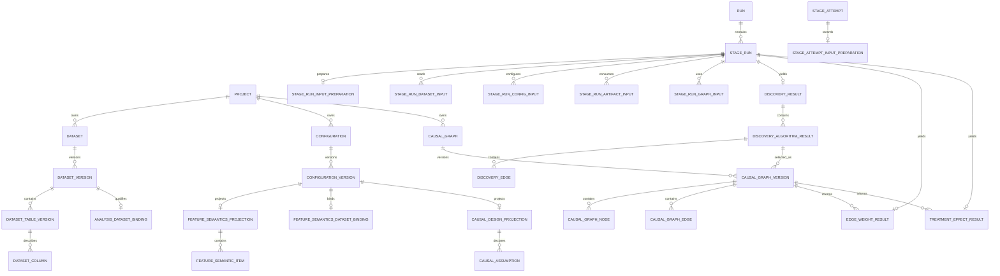

# ariadne Webサービス データモデル定義書

- 文書版: 1.1
- 対象DBMS: PostgreSQL
- Artifact Store: local filesystem / S3 / Azure Blob Adapter
- 基準リポジトリ: `kousuke-ota-datascience/ariadne`
- 基準要件: `01_web_service_requirements_v1.2.md`
- 原版: `02_data_model_definition.md`（文書版1.0）
- 改訂日: 2026-07-20

### 改訂履歴

| 版 | 日付 | 変更内容 |
|---|---|---|
| 1.0 | 2026-07-18 | Webサービス化に必要な初期データモデルを定義 |
| 1.1 | 2026-07-20 | Analysis-ready実行mode、Feature SemanticsとDatasetのbinding、Saved Causal Graph Version、Causal Designとの接続、Run Result導線、Algorithm Input Conditioning来歴、将来のExternal Dataset Referenceを追加。既存CLI・ETL・Feature Buildの後方互換方針を明文化 |

---

## 1. 目的

本書は、`ariadne` のWebサービス化に必要な論理データモデル、主要table、制約、状態遷移、lineage、transaction境界、migration方針を定義する。

本版は、要件定義書v1.2の中心フローを実現する。

```text
Analysis-ready Dataset Version
  -> Feature Semantics Version
  -> Discovery Run / Result
  -> Saved Causal Graph Version
  -> Causal Design Version
  -> Inference Run / Result
  -> Diagnostic / Report / Lineage
```

同時に、次の既存経路を維持する。

```text
Dataset Registry / Feature Configuration
  -> Existing ETL / Feature Build
  -> Discovery / Inference
```

### 1.1. 本版の変更原則

1. 既存tableを削除せず、追加table・nullable column・互換defaultを中心に変更する。
2. 新しい`ANALYSIS_READY`経路は、既存`CONFIGURED_FEATURE_BUILD`経路の置換ではなく追加とする。
3. 既存CLI requestが新しいmodeを指定しない場合、従来経路へ解決する。
4. 複数table Datasetを許す既存modelを維持し、Web MVPだけが単一tableを標準利用する。
5. Complete Journey ETL、Dataset Registry、Discovery/Inference Feature Build用Configurationを削除しない。
6. Saved Graphをbrowser localStorageではなくMetadata DBとArtifact Storeへ保存する。
7. canonical documentまたはArtifactを正本とし、relational tableは制約・検索・表示用projectionとする。

### 1.2. 規範用語

| 表現 | 意味 |
|---|---|
| 必須、すること | 実装必須 |
| nullable / optional | Resourceまたはmodeにより省略可能 |
| MVP後 | 今回DDLへ含めなくてよいが、将来追加を阻害しない |
| 維持 | table、column、import path、既存値の意味を非互換にしない |

### 1.3. Source of truth

実装時の優先順位は次とする。

1. `01_web_service_requirements_v1.2.md`
2. 本書v1.1
3. 現行SQLAlchemy modelとAlembic migration
4. 原版v1.0

本書に記載のない既存column、index、constraintは削除指示ではない。明示的な変更指示がない限り現行実装を維持すること。

---

## 2. v1.0からの変更サマリー

### 2.1. 新規table

| table | MVP | 目的 |
|---|---|---|
| `analysis_dataset_binding` | 必須 | Analysis-ready Datasetのprimary table、分析単位、readinessを保持 |
| `feature_semantics_dataset_binding` | 必須 | Feature Semantics VersionとDataset Version/schemaを固定 |
| `stage_run_input_preparation` | 必須 | input modeと要求されたAlgorithm Input Conditioning計画を保持 |
| `stage_attempt_input_preparation` | 必須 | Attemptごとの実際のconditioning結果とArtifactを保持 |
| `stage_run_graph_input` | 必須 | Inference Stageが使用したSaved Graph Versionを固定 |
| `causal_graph` | 必須 | 保存グラフの論理Resource |
| `causal_graph_version` | 必須 | 不変の保存グラフVersion |
| `causal_graph_node` | 必須 | Graph Versionのnode projection |
| `causal_graph_edge` | 必須 | Graph Versionのcanonical edge projection |
| `external_dataset_reference` | MVP後 | Databricks等の不変snapshot参照 |
| `run_result_summary` | 必須 | RunからResultへ到達するread-only SQL view |

### 2.2. 追加・変更column

| table | 変更 |
|---|---|
| `pipeline_stage_definition` | nullable `input_mode`追加 |
| `stage_run` | not null `input_mode`追加。既存row/defaultは`CONFIGURED_FEATURE_BUILD` |
| `dataset_table_version` | MVP後、nullable external source FKを追加し、stored objectとの排他的sourceを表現 |
| `feature_semantic_item` | identifier/excluded等のroleと分析可否metadataを追加 |
| `causal_design_projection` | Dataset、Saved Graph、target population、adjustment strategyを追加 |
| `discovery_result` | Feature Semantics Version、input mode、Attempt Preparation参照を追加。legacy Feature Versionをnullable化 |
| `edge_weight_result` | Feature Semantics Version、Saved Graph Version、input mode、Attempt Preparation参照を追加。legacy Feature Versionをnullable化 |
| `treatment_effect_result` | Saved Graph Version、input mode、Attempt Preparation参照を追加。legacy Feature Versionをnullable化 |
| `artifact.artifact_kind` | SAVED_CAUSAL_GRAPH、INPUT_PREPARATION等を追加 |

### 2.3. 削除しないもの

次はWebの通常導線から外れてもschemaから削除しない。

- `dataset_version.source_type = ETL / FEATURE_BUILD / IMPORT`
- 複数の`dataset_table_version`
- ETL Configuration Type
- `DISCOVERY_FEATURE` / `INFERENCE_FEATURE` Configuration Type
- `pipeline_stage_definition.stage_type = ETL`
- `stage_run_artifact_input`
- Complete Journey由来のResult/Artifact/Manifest
- Visualization関連table

---

## 3. 設計原則

### 3.1. 不変Resource

次は確定またはpublish後に内容を更新しない。

- Dataset Version / Dataset Table Version
- Published Configuration Version
- Published Causal Graph Version
- Pipeline Definition Version
- Execution Plan
- Artifact content
- Manifest
- Run Event
- Stage Attempt履歴
- Result projectionが参照する入力Version snapshot

### 3.2. Resource、Version、Execution、Factの分離

| 概念 | 意味 |
|---|---|
| Dataset / Configuration / Causal Graph | 論理Resource |
| 各Version | 不変の内容またはsnapshot |
| Execution Plan | Run受付時に解決した不変計画 |
| Run / Stage Run / Attempt | 実行状態と試行履歴 |
| Manifest / Input Preparation | 実際に使用・生成したfact |
| Result projection | ArtifactをUI検索用に投影した再生成可能データ |

### 3.3. ID・時刻

- 主キーはUUIDとし、application側で生成する。
- event/audit等の高頻度append-only tableだけbigintを許可する。
- 外部公開IDにDB連番を使用しない。
- すべての時刻は`timestamptz`、保存時UTCとする。

### 3.4. Checksum snapshot

Stage inputはResource IDだけでなく、受付時のcontent/schema hash snapshotを保持する。Version rowが不変であってもManifestへ同hashを記録する。

### 3.5. input mode

論理値は次の2種類とする。

- `CONFIGURED_FEATURE_BUILD`
- `ANALYSIS_READY`

名称は実装上変更してよいが、DB上では安定したcodeとして保持する。

mode解決規則:

1. 新Web UIは`ANALYSIS_READY`を明示する。
2. 既存requestにmodeがない場合、`CONFIGURED_FEATURE_BUILD`へ解決する。
3. Dataset Kind、table数、filenameから推測しない。
4. Execution Plan作成時までに必ず解決し、`stage_run.input_mode`へ保存する。

---

## 4. 集約

1. Identity / Authorization
2. Project
3. Data Catalog / Dataset Source
4. Configuration Catalog / Feature Semantics / Causal Design
5. Experiment
6. Pipeline Definition
7. Run Execution / Input Preparation
8. Artifact / Manifest / Lineage
9. Discovery Result Projection
10. Saved Causal Graph
11. Inference Result Projection
12. Validation / Audit / Outbox
13. Visualization（既存互換）

---

## 5. 概念ER



---

# 6. 既存集約の維持

次のtableは原版v1.0および現行SQLAlchemy modelを維持する。本版に追加記載がないcolumn・constraintを削除しない。

## 6.1. Identity / Project

- `app_user`
- `project`
- `role`
- `project_member`

## 6.2. Object / Artifact基盤

- `stored_object`
- `artifact`
- `stage_run_artifact_output`
- `artifact_lineage`
- `manifest_record`

## 6.3. Configuration / Experiment / Pipeline

- `configuration`
- `configuration_version`
- `configuration_dependency`
- `experiment`
- `pipeline_definition`
- `pipeline_definition_version`
- `pipeline_stage_dependency`
- `pipeline_stage_config_binding`
- `pipeline_stage_output_declaration`

## 6.4. Execution / Operation

- `run`
- `execution_plan`
- `stage_run_dependency`
- `stage_attempt`
- `stage_run_dataset_input`
- `stage_run_config_input`
- `stage_run_artifact_input`
- `stage_run_parameter`
- `validation_run`
- `validation_issue`
- `run_event`
- `outbox_event`
- `audit_event`

## 6.5. Visualization

- `visualization_specification`
- `visualization_query`
- Dataset column policyとprofile関連table

VisualizationをWeb MVP主導線から外すことは、これらのtableをdropする指示ではない。

---

# 7. Data Catalog変更

## 7.1. `dataset`

既存schemaを維持する。

`dataset_kind`:

- RAW
- INTERIM
- PROCESSED
- DISCOVERY_FEATURE
- INFERENCE_FEATURE

MVP WebはPROCESSED、DISCOVERY_FEATURE、INFERENCE_FEATUREを主に使用するが、RAW/INTERIMを削除しない。

## 7.2. `dataset_version`

既存columnとsource typeを維持する。

`source_type`:

- UPLOAD
- OBJECT_REFERENCE
- ETL
- FEATURE_BUILD
- IMPORT
- EXTERNAL_REFERENCE（MVP後）

既存`source_metadata` JSONBの意味を変更しない。External Datasetの検索対象項目は専用tableへ投影する。

## 7.3. `dataset_table_version`

複数table対応を維持する。MVP Webが1 tableしか作成しなくても、次の既存制約を維持する。

```sql
UNIQUE(dataset_version_id, logical_name)
UNIQUE(dataset_version_id, ordinal)
```

MVP uploadでは既存の`stored_object_id not null`を維持する。External Dataset Sourceを実装するMigration Dでは次を行う。

- `external_dataset_reference_id uuid nullable FK`を追加する。
- `stored_object_id`をnullable化する。
- `stored_object_id`と`external_dataset_reference_id`のいずれか一方だけが設定されるCHECKを追加する。
- 既存rowはすべて`stored_object_id`側として維持する。

```sql
CHECK (
  (stored_object_id IS NOT NULL AND external_dataset_reference_id IS NULL)
  OR
  (stored_object_id IS NULL AND external_dataset_reference_id IS NOT NULL)
)
```

## 7.4. `analysis_dataset_binding`（新規・MVP必須）

Dataset VersionをAnalysis-ready入力として利用する際の宣言とvalidation projectionを保持する。

| column | type | constraint / meaning |
|---|---|---|
| dataset_version_id | uuid | PK/FK `dataset_version` |
| primary_table_version_id | uuid | FK `dataset_table_version`, not null |
| analysis_unit_description | text | not null |
| unit_identifier_column_id | uuid | nullable FK `dataset_column` |
| readiness_status | varchar(32) | UNKNOWN/VALIDATING/READY/INVALID |
| schema_hash_snapshot | varchar(255) | not null |
| validation_summary_json | jsonb | not null default `{}` |
| created_by | uuid | FK `app_user`, not null |
| created_at | timestamptz | not null |
| validated_at | timestamptz | nullable |

不変条件:

- `primary_table_version_id`は同じ`dataset_version_id`に所属する。
- `unit_identifier_column_id`はprimary tableに所属する。
- Dataset VersionがREADYかつbindingがREADYの場合だけANALYSIS_READY Runへ利用できる。
- binding作成後にDataset Versionのschema hashとsnapshotが異なる場合INVALIDとする。

cross-table constraintはDB triggerではなくDomain Serviceで検証してよい。

## 7.5. `dataset_column_policy`

既存columnを維持し、`minimum_group_count integer nullable`が未実装の場合は追加する。

Feature Semantics editorは`analysis_allowed=false`のcolumnを分析roleへ設定できない。

## 7.6. `data_profile`

現行実装に合わせてstatusとerrorを保持する。

| column | type |
|---|---|
| status | varchar(32) |
| error_summary | text nullable |

既存profile columnは維持する。

## 7.7. `external_dataset_reference`（新規・MVP後）

Databricks等の可変な名前と不変snapshotを分離する。

| column | type | meaning |
|---|---|---|
| id | uuid PK | |
| dataset_version_id | uuid unique FK | 対応Dataset Version |
| provider | varchar(32) | DATABRICKS_DELTA等 |
| catalog_name | varchar(255) nullable | |
| schema_name | varchar(255) nullable | |
| object_name | varchar(255) nullable | table/view |
| source_uri | text | provider固有URI |
| snapshot_type | varchar(32) | VERSION/TIMESTAMP/SNAPSHOT_ID |
| snapshot_value | varchar(255) | 不変値。`latest`禁止 |
| source_pipeline_run_id | varchar(255) nullable | 外部lineage |
| schema_hash | varchar(255) | |
| content_fingerprint | varchar(255) nullable | |
| credential_reference | text nullable | Secret Manager参照。secret本体禁止 |
| metadata_json | jsonb | |
| created_at | timestamptz | |

```sql
CHECK(lower(snapshot_value) <> 'latest')
```

同じ外部snapshotを複数ProjectまたはDatasetへ登録することを許すため、source tupleをglobal uniqueにはしない。検索用non-unique indexを作成する。

```sql
CREATE INDEX idx_external_dataset_snapshot
ON external_dataset_reference(provider, source_uri, snapshot_type, snapshot_value);
```

MVP uploadではこのtableを作成しなくてよい。

---

# 8. Feature Semantics変更

## 8.1. `feature_semantics_projection`

既存tableを維持する。Datasetとのbindingは専用tableに分離する。

## 8.2. `feature_semantics_dataset_binding`（新規・MVP必須）

| column | type | meaning |
|---|---|---|
| configuration_version_id | uuid PK/FK | FEATURE_SEMANTICS Version |
| dataset_version_id | uuid FK | 対象Dataset Version |
| dataset_table_version_id | uuid FK | 通常はprimary table |
| dataset_schema_hash_snapshot | varchar(255) | not null |
| binding_status | varchar(32) | VALID/INVALID/STALE |
| validation_summary_json | jsonb | not null default `{}` |
| created_at | timestamptz | not null |
| validated_at | timestamptz | nullable |

不変条件:

- Configuration TypeはFEATURE_SEMANTICSである。
- tableはDataset Versionに所属する。
- PUBLISHED後はbindingを更新しない。
- 別Dataset Versionへ適用する場合は新しいFeature Semantics Versionを作成する。

## 8.3. `feature_semantic_item`

既存PKを維持する。

```sql
PRIMARY KEY(feature_semantics_version_id, name)
```

既存columnに次を追加する。

| column | type | default / meaning |
|---|---|---|
| dataset_column_id | uuid nullable FK | 対応する物理column |
| categorical | boolean | false |
| allowed_for_discovery | boolean | true |
| time_metadata_json | jsonb | `{}` |
| description | text nullable | |

`role`は次を許可する。

- identifier
- treatment
- outcome
- covariate
- mediator
- collider
- post_treatment
- excluded

既存role値はすべて維持される。

validation:

- identifier/excludedは`allowed_for_discovery=false`を既定とする。
- treatment/outcome/mediator/collider/post_treatmentは`allowed_for_adjustment=false`。
- `dataset_column_id`指定時はbinding対象tableのcolumnである。
- PUBLISHED Versionに紐づくitemは更新しない。

---

# 9. Causal Design変更

## 9.1. `causal_design_projection`

既存columnに次を追加する。

| column | type | meaning |
|---|---|---|
| dataset_version_id | uuid nullable FK | Analysis-ready入力 |
| causal_graph_version_id | uuid nullable FK | 採用Graph Version |
| target_population | text nullable | |
| adjustment_strategy | varchar(64) nullable | MANUAL/PRE_TREATMENT/GRAPH_DERIVED |
| adjustment_set_json | jsonb | not null default `[]` |
| analyst_note | text nullable | |

移行時、既存rowは追加columnをnullableで許容する。v1.2 Webから作成するPUBLISHED Designには、application validationで`dataset_version_id`と`causal_graph_version_id`を要求する。

## 9.2. `causal_assumption`

既存schemaを維持する。assumptionは証明状態ではなく分析者の宣言・評価である。

## 9.3. Causal Design整合条件

- Feature Semantics、Dataset、Saved Graphは同じProjectに所属する。
- treatment/outcomeは同じFeature Semantics Versionに存在する。
- Saved Graphのnode setにtreatment/outcomeが存在する。
- adjustment setはFeature Semanticsのadjustment policyを満たす。
- Graph-derived候補と最終採用setを区別する。

---

# 10. Pipeline・Runのinput mode

## 10.1. `pipeline_stage_definition`

追加column:

| column | type | meaning |
|---|---|---|
| input_mode | varchar(32) nullable | CONFIGURED_FEATURE_BUILD/ANALYSIS_READY |

nullableは既存Pipeline Definitionとの互換用である。nullは計画解決時に`CONFIGURED_FEATURE_BUILD`として扱う。

## 10.2. `stage_run`

追加column:

| column | type | constraint |
|---|---|---|
| input_mode | varchar(32) | not null |

migration:

```sql
ALTER TABLE stage_run
ADD COLUMN input_mode varchar(32);

UPDATE stage_run
SET input_mode = 'CONFIGURED_FEATURE_BUILD'
WHERE input_mode IS NULL;

ALTER TABLE stage_run
ALTER COLUMN input_mode SET NOT NULL;
```

新しいWeb RunだけANALYSIS_READYを明示する。既存rowをDataset Kind等から推測してbackfillしない。

## 10.3. `stage_run_input_preparation`（新規・MVP必須）

Run受付・validation時に解決したFeature BuildまたはAlgorithm Input Conditioningの要求・計画を保持するStage Run単位の1:1 projection。

| column | type | meaning |
|---|---|---|
| stage_run_id | uuid PK/FK | |
| input_mode | varchar(32) | stage_run snapshot |
| input_dataset_version_id | uuid FK | |
| input_table_version_id | uuid nullable FK | Analysis-ready primary table |
| input_schema_hash | varchar(255) | |
| feature_semantics_version_id | uuid nullable FK | |
| requested_columns_json | jsonb | ordered list |
| conditioning_spec_json | jsonb | requested missing/encoding/standardization等 |
| configured_feature_version_id | uuid nullable FK | legacy Feature Config |
| created_at | timestamptz | |

mode別constraint:

```text
ANALYSIS_READY:
  input_table_version_id required
  feature_semantics_version_id required
  configured_feature_version_id optional/null

CONFIGURED_FEATURE_BUILD:
  configured_feature_version_id required for existing Discovery/Inference
  input_table_version_id optional
```

DB CHECKだけでConfiguration Typeを検査できないため、Domain Serviceでも検証する。

## 10.4. `stage_attempt_input_preparation`（新規・MVP必須）

Attemptごとに実際に実行したFeature Build / Algorithm Input Conditioningと成果物をappend-onlyで保持する。

| column | type | meaning |
|---|---|---|
| stage_attempt_id | uuid PK/FK | `stage_attempt` |
| stage_run_id | uuid FK | join/index用。Attempt所属先と一致 |
| input_mode | varchar(32) | Attempt開始時snapshot |
| actual_selected_columns_json | jsonb | ordered list |
| excluded_columns_json | jsonb | column/reason/stage |
| resolved_conditioning_json | jsonb | 実際に適用したparameter |
| feature_frame_artifact_id | uuid nullable FK | 実際の入力frame |
| resolved_preparation_artifact_id | uuid nullable FK | canonical INPUT_PREPARATION Artifact |
| status | varchar(32) | RUNNING/SUCCEEDED/FAILED |
| error_summary | text nullable | preparation失敗 |
| created_at | timestamptz | |
| finished_at | timestamptz nullable | |

不変条件:

- `stage_attempt_id`と`stage_run_id`の所属が一致する。
- Attemptごとに最大1件。
- terminal status到達後は更新しない。
- retryは新しいAttempt rowを作り、過去rowを上書きしない。
- Resultは成功して選択されたAttemptのPreparationを参照する。

## 10.5. `stage_run_graph_input`（新規・MVP必須）

Saved GraphをArtifact IDではなくGraph Version IDとしてStageへ固定する。

| column | type | meaning |
|---|---|---|
| stage_run_id | uuid FK | |
| input_name | citext | 通常`causal_graph` |
| causal_graph_version_id | uuid FK | |
| content_hash_snapshot | varchar(255) | Run受付時hash |
| source | varchar(32) | PIPELINE/API_OVERRIDE/SYSTEM |

```sql
PRIMARY KEY(stage_run_id, input_name)
```

既存`stage_run_artifact_input`は削除しない。CLI互換のDiscovery Edge Artifact入力は引き続き同tableを使用できる。

## 10.6. `execution_plan`

schemaは維持し、`canonical_json`に各stageの次を必須追加する。

- resolved input mode
- Dataset Version ID/hash
- Feature Semantics Version ID/hash
- configured Feature Version ID/hash（該当時）
- Saved Graph Version ID/hash（該当時）
- Causal Design Version ID/hash（該当時）
- input preparation specification

Plan hashは追加項目を含むcanonical JSONから計算する。

---

# 11. Saved Causal Graph集約

## 11.1. 目的

Discovery Algorithm Resultは計算結果であり、Analystが推論に採用した仮説とは異なる。採用行為を独立Resource/Versionとして永続化する。

## 11.2. `causal_graph`（新規・MVP必須）

| column | type | meaning |
|---|---|---|
| id | uuid PK | |
| project_id | uuid FK | |
| slug | citext | |
| name | varchar(255) | |
| description | text nullable | |
| created_by | uuid FK | |
| created_at | timestamptz | |
| updated_at | timestamptz | |
| deleted_at | timestamptz nullable | logical delete |

```sql
UNIQUE(project_id, slug)
```

## 11.3. `causal_graph_version`（新規・MVP必須）

| column | type | meaning |
|---|---|---|
| id | uuid PK | |
| causal_graph_id | uuid FK | |
| version_number | integer | 1-based |
| status | varchar(32) | DRAFT/VALID/INVALID/PUBLISHED/DEPRECATED |
| source_discovery_algorithm_result_id | uuid FK | 採用元 |
| dataset_version_id | uuid FK | source snapshot |
| feature_semantics_version_id | uuid FK | Configuration Version |
| algorithm | varchar(64) | snapshot |
| algorithm_parameter_hash | varchar(255) nullable | |
| node_count | integer | |
| edge_count | integer | |
| canonical_json | jsonb | graph正本のcanonical表現 |
| content_hash | varchar(255) | canonical hash |
| graph_artifact_id | uuid FK | SAVED_CAUSAL_GRAPH Artifact |
| selection_note | text nullable | 採用理由 |
| created_by | uuid FK | 選択者 |
| created_at | timestamptz | |
| validated_at | timestamptz nullable | |
| published_by | uuid nullable FK | |
| published_at | timestamptz nullable | |
| supersedes_version_id | uuid nullable FK | 同Graph内 |

```sql
UNIQUE(causal_graph_id, version_number)
UNIQUE(causal_graph_id, content_hash)
CHECK(version_number >= 1)
CHECK(node_count >= 0)
CHECK(edge_count >= 0)
```

PUBLISHED後は更新しない。

## 11.4. canonical edge表現

partially oriented edgeを欠損なく表すため、単なるsource/targetではなく両端endpoint markを用いる。

endpoint mark:

- TAIL
- ARROW
- CIRCLE

例:

| 表現 | endpoint A | endpoint B |
|---|---|---|
| A → B | TAIL | ARROW |
| A — B | TAIL | TAIL |
| A ↔ B | ARROW | ARROW |
| A ○→ B | CIRCLE | ARROW |
| A ○—○ B | CIRCLE | CIRCLE |

canonical JSONではnode nameをUnicode正規化し、edge pairを`node_a < node_b`となる順に並べる。node listとedge listのsort規則、float canonicalization、schema versionを固定する。

## 11.5. `causal_graph_node`（新規・MVP必須）

| column | type |
|---|---|
| causal_graph_version_id | uuid FK |
| name | citext |
| ordinal | integer |
| role_snapshot | varchar(32) nullable |
| metadata_json | jsonb |

```sql
PRIMARY KEY(causal_graph_version_id, name)
UNIQUE(causal_graph_version_id, ordinal)
```

## 11.6. `causal_graph_edge`（新規・MVP必須）

| column | type | meaning |
|---|---|---|
| id | uuid PK | |
| causal_graph_version_id | uuid FK | |
| node_a | citext | canonical lower side |
| node_b | citext | canonical upper side |
| endpoint_at_a | varchar(16) | TAIL/ARROW/CIRCLE |
| endpoint_at_b | varchar(16) | TAIL/ARROW/CIRCLE |
| score | double precision nullable | source snapshot |
| stability | double precision nullable | source snapshot |
| source_discovery_edge_id | uuid nullable FK | lineage |
| payload_json | jsonb | algorithm固有値 |

```sql
UNIQUE(causal_graph_version_id, node_a, node_b)
CHECK(node_a < node_b)
```

`node_a`と`node_b`は同じGraph Versionのnodeを参照する。PostgreSQLでは複合FKまたはapplication validationで保証する。

MVPではalgorithm結果をそのまま保存する。手動edge編集はMVP後だが、Version modelは編集後の新Version作成を阻害しない。

## 11.7. Graph作成transaction

1 transaction内で次を行う。

1. source Discovery Algorithm ResultとProject権限を検証
2. Dataset/Semantics整合を検証
3. canonical node/edge生成
4. content hash計算
5. Graph ArtifactをAVAILABLEとして登録
6. `causal_graph_version` insert
7. node/edge projection insert
8. Artifact lineage insert
9. audit event insert

Artifact uploadに失敗した場合、Graph VersionをPUBLISHEDにしない。

---

# 12. Artifact・Lineage変更

## 12.1. `artifact.artifact_kind`追加値

既存値を維持し、次を追加する。

- SAVED_CAUSAL_GRAPH
- INPUT_PREPARATION
- FEATURE_FRAME
- GRAPH_COMPARISON（optional）

## 12.2. Artifact lineage type追加値

既存値を維持し、必要に応じて次を追加する。

- SELECTED_FROM
- MATERIALIZED_FROM
- CONDITIONED_FROM
- USED_GRAPH
- DESIGNED_BY

## 12.3. Graph lineage

最低限次を登録する。

```text
DISCOVERY_EDGES Artifact
  -> SELECTED_FROM
SAVED_CAUSAL_GRAPH Artifact

Dataset Table Artifact
  -> CONDITIONED_FROM
FEATURE_FRAME Artifact

SAVED_CAUSAL_GRAPH Artifact
  -> USED_GRAPH
Inference Result Artifact
```

Relational FKとArtifact lineageは目的が異なるため、両方保持する。

---

# 13. Analysis Result Projection変更

## 13.1. `discovery_result`

既存columnを維持し、次を追加・変更する。

| column | type | migration / meaning |
|---|---|---|
| input_mode | varchar(32) | nullable追加、既存rowはCONFIGURED_FEATURE_BUILDでbackfill後not null |
| feature_semantics_version_id | uuid nullable FK | 新Web rowでは必須 |
| discovery_feature_version_id | uuid nullable FK | 既存not nullからnullableへ。Configured modeでは必須 |
| input_preparation_attempt_id | uuid nullable FK | `stage_attempt_input_preparation`。新規成功Resultでは必須 |

mode別application constraint:

```text
ANALYSIS_READY:
  feature_semantics_version_id required
  discovery_feature_version_id optional/null

CONFIGURED_FEATURE_BUILD:
  discovery_feature_version_id required
  feature_semantics_version_id optionalまたはresolved semantics参照
```

## 13.2. `discovery_algorithm_result` / `discovery_edge`

既存schemaを維持する。`discovery_edge`はalgorithm固有projectionであり、Saved Graphの正本ではない。

## 13.3. `edge_weight_result`

既存columnを維持し、次を追加・変更する。

| column | type | meaning |
|---|---|---|
| input_mode | varchar(32) | not null、既存row backfill |
| feature_semantics_version_id | uuid nullable FK | Analysis-readyでは必須 |
| causal_graph_version_id | uuid nullable FK | 新Web主導線では必須 |
| inference_feature_version_id | uuid nullable FK | Configured modeでは必須、nullable化 |
| input_preparation_attempt_id | uuid nullable FK | 実際に使用したPreparation |

既存`discovery_result_id`は維持する。Saved Graphを使用する場合もsource探索結果へのshort pathとしてnullable参照を保持してよい。

## 13.4. `treatment_effect_result`

既存columnを維持し、次を追加・変更する。

| column | type | meaning |
|---|---|---|
| input_mode | varchar(32) | not null、既存row backfill |
| causal_graph_version_id | uuid nullable FK | 新Web主導線では必須 |
| inference_feature_version_id | uuid nullable FK | Configured modeでは必須、nullable化 |
| input_preparation_attempt_id | uuid nullable FK | 実際に使用したPreparation |

既存`feature_semantics_version_id`、`causal_design_version_id`、`discovery_result_id`を維持する。

## 13.5. `run_result_summary`（新規read-only view）

Result IDの手入力を不要にするため、3 Result tableをRun/Stageと結合したviewを定義する。

| column | type |
|---|---|
| run_id | uuid |
| stage_run_id | uuid |
| stage_key | citext |
| result_type | varchar(32) |
| result_id | uuid |
| status | varchar(32) nullable |
| created_at | timestamptz |

概念SQL:

```sql
CREATE VIEW run_result_summary AS
SELECT sr.run_id, sr.id AS stage_run_id, sr.stage_key,
       'DISCOVERY' AS result_type, dr.id AS result_id,
       dr.status, dr.created_at
FROM stage_run sr JOIN discovery_result dr ON dr.stage_run_id = sr.id
UNION ALL
SELECT sr.run_id, sr.id, sr.stage_key,
       'EDGE_WEIGHT', ewr.id, ewr.status, ewr.created_at
FROM stage_run sr JOIN edge_weight_result ewr ON ewr.stage_run_id = sr.id
UNION ALL
SELECT sr.run_id, sr.id, sr.stage_key,
       'TREATMENT_EFFECT', ter.id, ter.diagnostic_status, ter.created_at
FROM stage_run sr JOIN treatment_effect_result ter ON ter.stage_run_id = sr.id;
```

SQLite test環境では同等のquery serviceで実装してよい。viewはread-onlyであり、Resultの正本ではない。

---

# 14. Validation・不変条件

## 14.1. 共通

1. PUBLISHED Configuration Versionを更新しない。
2. PUBLISHED Causal Graph Versionを更新しない。
3. READY Dataset Version/Table Versionの内容を更新しない。
4. AVAILABLE Artifactのcontentを置換しない。
5. RunはExecution Planを1件持つ。
6. retry時に過去Attemptを更新しない。
7. local absolute pathをAPI Resource IDとして保存しない。

## 14.2. input mode

1. `stage_run.input_mode`は必須。
2. mode未指定の既存requestはCONFIGURED_FEATURE_BUILDへ解決する。
3. ANALYSIS_READYは`analysis_dataset_binding`とFeature Semantics bindingを要求する。
4. CONFIGURED_FEATURE_BUILDは既存Feature Configurationを要求する。
5. modeをDataset Kind、table数、filenameから推測しない。
6. DRY_RUN、VALIDATE_ONLY、RUNで同じmode解決を使う。

## 14.3. Saved Graph

1. Graph、source Result、Dataset、Semanticsは同一Projectに所属する。
2. node/edge countはprojection件数と一致する。
3. content hashはcanonical JSONと一致する。
4. edgeの両nodeはnode projectionに存在する。
5. Graph Version ArtifactがAVAILABLEになるまでpublishしない。
6. supersedes先は同じCausal Graphに所属する。

## 14.4. Inference

1. 新Web Edge Weight/Treatment EffectはPUBLISHED Graph Versionを要求する。
2. GraphのDataset/SemanticsはInference入力と互換である。
3. treatment/outcomeはSemanticsとGraphに存在する。
4. adjustment variableはcovariate、adjustment可、post-treatmentではない。
5. Result projectionはStage Run、入力Version、元Artifactを参照する。

---

# 15. 状態遷移

## 15.1. Dataset Version

```text
REGISTERING -> READY | INVALID
READY -> DELETED
INVALID -> DELETED
```

## 15.2. Analysis Dataset Binding

```text
UNKNOWN -> VALIDATING -> READY | INVALID
READY -> INVALID
```

READYからINVALIDは、外部参照切れ等を検知した運用状態であり、Dataset Versionの不変contentを変更しない。

## 15.3. Configuration Version

```text
DRAFT -> VALID -> PUBLISHED -> DEPRECATED
        -> INVALID
```

現行DBがDRAFT/PUBLISHEDだけの場合、VALIDは`validation_status`で表現してもよい。

## 15.4. Causal Graph Version

```text
DRAFT -> VALID -> PUBLISHED -> DEPRECATED
        -> INVALID
```

PUBLISHEDからDRAFTへ戻さない。

## 15.5. Run / Attempt

原版v1.0の状態遷移を維持する。

---

# 16. Index

既存indexを維持し、次を追加する。

```sql
CREATE INDEX idx_analysis_dataset_readiness
ON analysis_dataset_binding(readiness_status);

CREATE INDEX idx_semantics_binding_dataset
ON feature_semantics_dataset_binding(dataset_version_id, binding_status);

CREATE INDEX idx_stage_run_input_mode
ON stage_run(run_id, input_mode, ordinal);

CREATE INDEX idx_graph_project_created
ON causal_graph(project_id, created_at DESC)
WHERE deleted_at IS NULL;

CREATE INDEX idx_graph_version_status
ON causal_graph_version(causal_graph_id, status, version_number DESC);

CREATE INDEX idx_graph_version_source
ON causal_graph_version(source_discovery_algorithm_result_id);

CREATE INDEX idx_graph_edge_nodes
ON causal_graph_edge(causal_graph_version_id, node_a, node_b);

CREATE INDEX idx_edge_weight_graph
ON edge_weight_result(causal_graph_version_id)
WHERE causal_graph_version_id IS NOT NULL;

CREATE INDEX idx_treatment_effect_graph
ON treatment_effect_result(causal_graph_version_id)
WHERE causal_graph_version_id IS NOT NULL;
```

---

# 17. Transaction境界

## 17.1. Analysis Dataset登録

1. objectをArtifact Storeへuploadする。
2. checksumを計算・検証する。
3. Dataset、Dataset Version、Table Version、Columnをtransaction内で登録する。
4. `analysis_dataset_binding`をUNKNOWNで作成する。
5. profile/validation Outbox Eventを登録する。
6. validation成功時にDataset VersionとbindingをREADYにする。

## 17.2. Run作成

原版v1.0のtransactionに次を追加する。

1. input modeを明示解決する。
2. mode別必須inputを検証する。
3. Dataset/Semantics/Graph/Designのhash snapshotを取得する。
4. Execution Planへmodeとsnapshotを含める。
5. `stage_run.input_mode`を保存する。
6. `stage_run_graph_input`を必要に応じて保存する。
7. 残りのRun、Stage、Event、Outboxを同一transactionで保存する。

## 17.3. Stage成功

原版v1.0の処理に次を追加する。

- Run作成時の`stage_run_input_preparation`を参照する。
- Attempt開始時に`stage_attempt_input_preparation`をRUNNINGで登録する。
- INPUT_PREPARATION/FEATURE_FRAME Artifactを登録する。
- Attempt Preparationへ実処理結果とArtifactを記録しSUCCEEDEDにする。
- Resultにinput mode、Semantics、Graph Version、Attempt Preparationを投影する。
- Graph ArtifactをInference Result Artifactのlineageへ接続する。

PreparationまたはStageが失敗した場合は同Attempt PreparationをFAILEDにし、retryでは新しいrowを作る。

## 17.4. Graph Version作成・publish

11.7節に従う。Graph metadataだけがcommitされ、Artifact uploadが欠落する状態を許可しない。

---

# 18. Migration方針

## 18.1. 原則

- 既存migrationを編集せず、新しいAlembic revisionを追加する。
- table/column dropを行わない。
- nullable追加、backfill、not null化を段階的に行う。
- PostgreSQLとSQLite testの両方でmigration/model testを行う。

## 18.2. 推奨順序

### Migration A: Additive foundation

1. `analysis_dataset_binding`
2. `feature_semantics_dataset_binding`
3. Feature Semantic追加column
4. `pipeline_stage_definition.input_mode`
5. `stage_run.input_mode` nullable追加
6. 既存Stage RunをCONFIGURED_FEATURE_BUILDでbackfill
7. `stage_run.input_mode` not null化
8. `stage_run_input_preparation`
9. `stage_attempt_input_preparation`

### Migration B: Saved Graph

1. `causal_graph`
2. `causal_graph_version`
3. `causal_graph_node`
4. `causal_graph_edge`
5. `stage_run_graph_input`
6. Causal Design追加column
7. Artifact kind/lineage code追加

### Migration C: Result linkage

1. Result tableへ`input_mode` nullable追加
2. 既存ResultをCONFIGURED_FEATURE_BUILDでbackfill
3. Result tableへSemantics/Graph FK追加
4. Result tableへAttempt Preparation FK追加
5. legacy Feature Version FKをnullable化
6. `run_result_summary` view追加

### Migration D: External source（MVP後）

1. `external_dataset_reference`
2. `dataset_table_version.external_dataset_reference_id`追加
3. `stored_object_id`nullable化と排他的source CHECK追加
4. Dataset materialization契約
5. credential reference integration

## 18.3. Backfill禁止事項

- table数が1件という理由でANALYSIS_READYにしない。
- Dataset KindがPROCESSEDという理由でANALYSIS_READYにしない。
- 既存Discovery Edge ArtifactからAnalystの選択なしにPUBLISHED Graphを自動生成しない。
- local workspace pathをExternal Dataset Referenceへ移さない。

---

# 19. 現行コードとのmapping

| 現行コード / 概念 | v1.1データモデル |
|---|---|
| Dataset Version + primary table | `analysis_dataset_binding` |
| Feature Semantics Configuration Version | `feature_semantics_dataset_binding` |
| existing Feature Build | `input_mode=CONFIGURED_FEATURE_BUILD` |
| new direct table path | `input_mode=ANALYSIS_READY` |
| requested preprocessing policy | `stage_run_input_preparation.conditioning_spec_json` |
| actual preprocessing result | `stage_attempt_input_preparation.resolved_conditioning_json` |
| materialized feature frame | FEATURE_FRAME Artifact |
| Discovery Algorithm Result selected by Analyst | `causal_graph_version` |
| discovery `edges.csv` | DISCOVERY_EDGES Artifact + `discovery_edge` |
| saved canonical graph | SAVED_CAUSAL_GRAPH Artifact + graph projection |
| inference graph input | `stage_run_graph_input` |
| Causal Design Configuration | `causal_design_projection.causal_graph_version_id` |
| Run result navigation | `run_result_summary` view/query service |
| existing CLI no mode | CONFIGURED_FEATURE_BUILDへ解決 |
| Databricks Delta snapshot | `external_dataset_reference`（MVP後） |

---

# 20. MVP table一覧

## 20.1. 新規必須

- analysis_dataset_binding
- feature_semantics_dataset_binding
- stage_run_input_preparation
- stage_attempt_input_preparation
- stage_run_graph_input
- causal_graph
- causal_graph_version
- causal_graph_node
- causal_graph_edge
- run_result_summary（viewまたは同等query service）

## 20.2. 変更必須

- pipeline_stage_definition
- stage_run
- feature_semantic_item
- causal_design_projection
- discovery_result
- edge_weight_result
- treatment_effect_result
- artifact kind / artifact lineage code

## 20.3. 既存維持必須

原版v1.0のMVP必須table、および現行実装済みの次をすべて維持する。

- Identity / Project
- Stored Object
- Dataset / Dataset Version / Dataset Table / Column / Policy / Profile
- Configuration / Configuration Version / Dependency
- Feature Semantics / Causal Design / Assumption
- Experiment
- Pipeline Definition / Stage Definition / Dependency / Binding / Output
- Run / Execution Plan / Stage Run / Attempt / Stage Input / Parameter
- Artifact / Output / Lineage / Manifest
- Validation / Event / Outbox / Audit
- Discovery / Edge Weight / Treatment Effect / Adjustment / Diagnostic
- Visualization Specification / Query

## 20.4. MVP後

- external_dataset_reference
- Graph manual edit event
- Graph review / approval
- Databricks credential binding
- external tracking reference
- model registry / scoring
- schedule / retention / legal hold

---

# 21. データモデル受入条件

### DM-AC-001 Analysis Dataset

単一CSV/ParquetのDataset Versionからprimary Table、schema hash、分析単位、optional identifier columnを一意に取得できる。

### DM-AC-002 Multiple table compatibility

Complete Journey Dataset Version内の8 logical tableとObjectを従来どおり保持でき、単一table制約がDB全体へ追加されていない。

### DM-AC-003 Semantics binding

Feature Semantics Versionから対象Dataset Version、Table Version、schema hash snapshot、各physical columnへ遡れる。

### DM-AC-004 Explicit input mode

すべての新規Stage Runにresolved input modeが保存され、既存rowはCONFIGURED_FEATURE_BUILDとしてbackfillされる。

### DM-AC-005 Mode-specific inputs

ANALYSIS_READYとCONFIGURED_FEATURE_BUILDの各modeについて、必要なDataset、SemanticsまたはFeature Configuration、resolved conditioningを記録できる。

### DM-AC-006 Existing CLI compatibility

新column追加後も、modeを送らない既存CLI/API requestからConfigured Feature Build Stage Runを作成できる。

### DM-AC-007 Saved Graph lineage

Saved Graph Versionからsource Discovery Algorithm Result、Discovery Edge、Dataset Version、Feature Semantics Version、Graph Artifact、選択者へ遡れる。

### DM-AC-008 Graph immutability

PUBLISHED Graph Versionを更新せず、変更時は新Versionを作成できる。

### DM-AC-009 Graph canonicalization

directed、undirected、bidirected、partially oriented edgeをendpoint markでlossなく保存し、同じgraphから同じcontent hashを生成できる。

### DM-AC-010 Graph to Inference

Inference Stage RunとResultから、使用したGraph Version IDと受付時content hashへ遡れる。

### DM-AC-011 Causal Design

Causal DesignからDataset、Feature Semantics、Saved Graph、treatment、outcome、estimand、adjustment set、assumptionへ遡れる。

### DM-AC-012 Run result navigation

Run IDからDiscovery、Edge Weight、Treatment Effect Result IDをResult ID手入力なしで検索できる。

### DM-AC-013 Input preparation provenance

Resultから対応するAttempt Preparationを経由して、selected/excluded columns、欠損値policy、encoding、standardization、constant/collinearity除外、Feature Frame Artifactへ遡れる。

### DM-AC-014 Existing preprocessing preservation

既存ETL/Feature BuildのDataset Version、Configuration、Artifact、Manifestを新schemaへmigration後も参照できる。

### DM-AC-015 Retry and immutability

retry時に過去Attempt、Input Preparation、Result、Artifactを上書きしない。

### DM-AC-016 External snapshot

MVP後、Databricks等のexternal referenceで`latest`ではなく不変snapshotを保持できる。

### DM-AC-017 Project boundary

Dataset、Semantics、Graph、Design、Runを異なるProject間で結び付けようとした場合、Application Serviceが拒否する。

---

# 22. 実装者向け変更禁止事項

本書をもとに実装するコーディングエージェントは、次を行ってはならない。

1. `dataset_table_version`へ「1 Dataset Versionにつき1 table」のDB制約を追加する。
2. ETL/FEATURE_BUILD/IMPORTのsource typeを削除する。
3. ETL、DISCOVERY_FEATURE、INFERENCE_FEATUREのConfiguration Typeを削除する。
4. `pipeline_stage_definition.stage_type=ETL`を削除する。
5. `stage_run_artifact_input`をGraph Version入力へ置換して削除する。
6. 既存Result rowへ推測でSaved Graph Versionを割り当てる。
7. 既存Stage/ResultをANALYSIS_READYとしてbackfillする。
8. existing Feature Version FKをcolumnごとdropする。
9. localStorageをGraph Versionの正本とする。
10. 既存migration fileを編集する。
11. 既存testを削除またはassertion緩和だけで通過させる。

---

# 23. 実装順序

1. 既存CLI、Complete Journey ETL、Feature Build、Result projectionの回帰testを固定する。
2. input mode codeとmigrationを追加する。
3. Analysis Dataset / Semantics bindingを追加する。
4. ANALYSIS_READY Discovery/Inferenceを追加する。
5. Saved Graph aggregateとmigrationを追加する。
6. Causal Design/InferenceへGraph Versionを接続する。
7. Run Result view/queryを追加する。
8. Frontendの通常導線を変更する。
9. 全既存testと新規acceptance testを実行する。
10. External Dataset ReferenceはMVP完了後に実装する。

---

# 24. 必須テスト

## 24.1. Migration

- 空DBへの全migration
- 現行migration適用済みDBからv1.1へのupgrade
- 既存Stage/Resultのinput mode backfill
- downgrade可能性または不可理由の文書化
- PostgreSQLとSQLite model差異

## 24.2. Constraint

- Graph Version unique/version/hash
- canonical edge ordering
- cross-Project拒否
- mode別必須input
- PUBLISHED immutability
- ResultからRun/Graphへのjoin

## 24.3. Regression

- Complete Journey 8 table Dataset
- Complete Journey ETL
- existing Discovery CLI
- existing Inference CLI
- existing Pipeline CLI
- retry / cancel / Artifact lineage
- visualization table/API smoke test

## 24.4. New flow

- single CSV/Parquet Analysis Dataset
- Semantics binding
- ANALYSIS_READY multi-algorithm Discovery
- Discovery ResultからGraph Version作成・publish
- Graph Versionを使うEdge Weight
- Graph Versionを使うTreatment Effect
- Algorithm Input Conditioning provenance
- RunからResult一覧
- DatasetからInference Resultまでのlineage

---

# 25. 未決事項

1. input modeをPostgreSQL enum、CHECK、application validationのどれで管理するか。
2. Graph endpoint markのcodeと外部format変換規則。
3. Graph canonical JSON schema versionとfloat canonicalization。
4. Feature Semanticsを別Dataset Versionへ再利用する互換規則。
5. Causal DesignでSaved Graphを必須にする範囲。
6. `run_result_summary`をDB viewにするかQuery Serviceにするか。
7. Input Preparation canonical ArtifactのJSON schema。
8. manual Graph edit時のevent model。
9. External Datasetのtable-level sourceとmaterialization cache model。
10. Result/Graphのretentionとlogical delete policy。

---

# 26. 根拠ファイル

- `_work/20260718_requirements_of_web_service/01_web_service_requirements_v1.2.md`
- `_work/20260718_requirements_of_web_service/02_data_model_definition.md`
- `src/ariadne/domain/metadata.py`
- `src/ariadne/interfaces/api/schemas/resources.py`
- `src/ariadne/interfaces/api/routers/datasets.py`
- `src/ariadne/interfaces/api/routers/configurations.py`
- `src/ariadne/interfaces/api/routers/runs.py`
- `src/ariadne/application/run_execution/services.py`
- `src/ariadne/workers/executor.py`
- `src/ariadne/workers/materialization.py`
- `src/ariadne/workers/projection.py`
- `src/ariadne/application/pipeline/etl.py`
- `src/ariadne/etl/completejourney/extract.py`
- `migrations/versions/20260719_0001_initial_metadata.py`

---

# 27. v1.1完了の定義

データモデルv1.1は、次をすべて満たしたとき完了とする。

1. 新しいAnalysis-ready経路と既存Configured Feature Build経路を同一schemaで区別・併存できる。
2. 既存CLI・ETL・Feature Buildのrowと実行契約を壊さない。
3. Analysis DatasetとFeature Semanticsのschema bindingを不変に記録できる。
4. Discovery Algorithm ResultからAnalystが選択したGraph Versionを不変Resourceとして保存できる。
5. Graph VersionをCausal DesignとInference Run/Resultへ接続できる。
6. Algorithm Input ConditioningをResultから追跡できる。
7. RunからResult IDを検索できる。
8. DatasetからInference Resultまでのlineageを辿れる。
9. migration・constraint・regression・new flow testがすべて通過する。

本書は既存ETL・preprocessingの廃止設計ではない。通常Web UIで明示操作させない処理も、CLI、worker、Application Serviceの実行資産として維持する。
