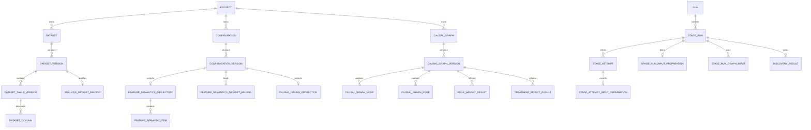

# 0. 文書情報

文書名: ariadne Webサービス データモデル定義書

## 0.1. 文書の目的

本書は、ariadne Webサービスが使用するPostgreSQL上の論理データモデルを定義する。読者は本書だけを参照して、主要なエンティティ、属性、主キー・外部キー、更新可能な状態、エンティティ間の関係、実行時の来歴、および移行要件を理解できる。

対象はMetadata DBである。データ本体や大きな結果ファイルはArtifact Storeに置き、DBにはその識別子、完全性確認用hash、検索・権限制御用のprojectionを保存する。

## 0.2. 適用範囲

| 項目 | 内容 |
|---|---|
| 文書版 | 1.2 |
| 改訂日 | 2026-07-20 |
| 対象DBMS | PostgreSQL（SQLiteはテスト環境で同等の制約を検証する） |
| Artifact Store | local filesystem、S3、Azure Blob StorageをAdapter経由で利用可能とする |
| 対象機能 | Dataset、Configuration、Pipeline、Run、Artifact、Discovery、Saved Causal Graph、Inference、監査 |
| MVP後の機能 | External Dataset Reference、Graph手動編集のevent、外部credential binding |

## 0.3. 改定履歴

| 版 | 日付 | 変更内容 |
|---|---|---|
| 1.0 | 2026-07-18 | Webサービス化に必要な初期データモデルを定義 |
| 1.1 | 2026-07-20 | Analysis-ready実行、Feature SemanticsとDatasetのbinding、Saved Causal Graph Version、Causal Design接続、Run Result導線、Input Conditioning来歴、External Dataset Referenceを追加 |
| 1.2 | 2026-07-20 | 文書構造を再編し、各エンティティの責務・CRUD・関係を明文化。単独で読める完全な定義書へ改訂 |

## 0.4. 本版の変更方針

本節の変更対象は、文書の旧版ではなく、v1.2のmigrationを適用する前からPostgreSQLのMetadata DBに永続化されているschemaとrowである。migration実装者は、既存table・column・constraint・code値をDROP、rename、または意味変更してはならない。本書で明示した新table・新column・nullable化・code値追加だけを、追加migrationで適用する。

既存rowについては、migrationがrowの物理削除、contentの書換え、または入力値からの推測による意味付けを行ってはならない。not null化が必要な追加columnだけは、本書で指定した固定値によるbackfillを許す。たとえば既存のStage RunとResultの`input_mode`は、実データから推測せず`CONFIGURED_FEATURE_BUILD`でbackfillする。

この方針は旧版文書の文章を保存するという意味ではない。文書は、必要に応じて構成・用語・説明を改訂してよい。新しいWeb UIの導線も、既存CLI、ETL、Feature Buildの実行契約と既存DB rowを維持したまま、同じPostgreSQL schemaに追加する。

## 0.5. 本書で用いる対象語と責務主体

| 用語 | 指す対象 |
|---|---|
| 既存schema | v1.2 migration適用前にPostgreSQL Metadata DBに存在するtable、column、constraint、index、code値 |
| 既存row | 同migration適用前からDBに保存されている行 |
| 既存実行経路 | modeを指定しないCLI/API、Complete Journey ETL、既存Feature Buildを介したworker実行 |
| migration実装者 | Alembic revisionとORM modelを変更する実装者。schema変更とbackfillの責任を負う |
| Application Service | APIまたはworkerから呼ばれ、複数tableをまたぐ業務整合性を検証してtransactionを開始する層 |
| DB | PostgreSQL。FK、UNIQUE、CHECK、NOT NULLで表現可能な整合性を強制する主体 |

以降、「維持する」「更新しない」「要求する」「拒否する」と記載した場合、主語が省略されていても、この表のmigration実装者、Application Service、またはDBのいずれが責務を負うかを文脈で特定する。特定できない要件は、該当箇所で主語を明記する。

## 0.6. 規範用語

| 表現 | 意味 |
|---|---|
| 必須、すること | 実装・検証が必要 |
| nullable / optional | Resourceまたはinput modeにより値を省略できる |
| MVP後 | この版のDDL実装対象外。ただし将来追加を阻害してはならない |
| 不変 | Application ServiceおよびDB運用はterminalまたはpublish後の内容をUPDATEしない。変更時は新しいVersionまたはAttemptをINSERTする |
| 論理削除 | 行を物理削除せず、deleted_at等で通常の検索対象から外す |

# 1. モデルの共通規則

## 1.1. Resource、Version、Execution、Fact

| 種別 | 対象 | CRUDと責務 |
|---|---|---|
| Resource | Dataset、Configuration、Causal Graph | Application Serviceは作成後に名称・説明などの可変metadataだけを更新できる。削除は原則として論理削除 |
| Version | Dataset Version、Configuration Version、Causal Graph Version、Pipeline Definition Version | 内容のsnapshot。Application Serviceは作成後に内容を更新せず、修正時は次Versionを作成する |
| Execution | Run、Stage Run、Stage Attempt | workerまたはApplication Serviceは実行状態を更新できる。retryでは新しいAttemptを作成し、完了したAttemptを上書きしない |
| Fact / Artifact | Manifest、Run Event、Audit Event、Artifact content、Input Preparation | append-only。workerまたはApplication Serviceは訂正・再実行時に新しいFactを追加する |
| Projection | Result、profile、Graph node/edge、run_result_summary | 正本への参照とUI検索を担う。正本と矛盾した場合は再生成または無効化する |

Dataset Version、Dataset Table Version、PUBLISHED Configuration Version、PUBLISHED Causal Graph Version、Pipeline Definition Version、Execution Plan、Artifact content、Manifest、Run Event、およびterminalとなったStage Attemptの履歴は不変である。Application ServiceがDELETEを許せるのは、他のrowから参照されていないDRAFT Resourceの論理削除に限る。

## 1.2. 識別子・時刻・hash

- 主キーはUUIDとし、application側で生成する。高頻度append-only eventだけbigintを使用してよい。
- migration実装者は外部公開IDにDB連番を用いない。DBはすべての時刻をUTCの`timestamptz`で保存する。
- Run作成を行うApplication Serviceは、実行入力のResource IDだけでなく、受付時のcontent hashまたはschema hashをsnapshotとして保存する。
- canonical documentまたはArtifactを内容の正本とし、relation tableは整合性・検索・表示のためのprojectionとして扱う。

## 1.3. input mode

実行入力は次のいずれかへ、Execution Plan作成前に必ず解決する。

| code | 利用場面 | 必須入力 |
|---|---|---|
| CONFIGURED_FEATURE_BUILD | 既存CLI、ETL、Feature Buildを経由する実行 | 対応するFeature Configuration Version |
| ANALYSIS_READY | Web UIで分析準備済みDatasetを直接使う実行 | READY Analysis Dataset Binding、Feature Semantics Version |

Run作成を行うApplication Serviceは、mode未指定の既存requestを`CONFIGURED_FEATURE_BUILD`として解決する。Application ServiceはDataset Kind、table数、filenameからmodeを推測してはならない。

# 2. エンティティ一覧

## 2.1. 主なエンティティ

| 領域 | エンティティ | 役割 |
|---|---|---|
| Identity | app_user、role、project_member | 利用者、権限、Projectへの所属 |
| Project | project | Dataset、設定、Run、Graphを分離する所有境界 |
| Data Catalog | dataset、dataset_version、dataset_table_version、dataset_column | データ集合と不変のschema/content snapshot |
| Analysis readiness | analysis_dataset_binding、data_profile、dataset_column_policy | 分析に使えるtable、品質、column利用制限 |
| Configuration | configuration、configuration_version、feature_semantics_projection、feature_semantic_item、causal_design_projection、causal_assumption | 分析上の意味、因果設計、Version化された設定 |
| Pipeline / execution | pipeline_definition、pipeline_definition_version、pipeline_stage_definition、run、execution_plan、stage_run、stage_attempt | 実行計画、stage、試行の管理 |
| Input provenance | stage_run_dataset_input、stage_run_config_input、stage_run_artifact_input、stage_run_input_preparation、stage_attempt_input_preparation、stage_run_graph_input | 受付時の入力と実際に使用したconditioningの記録 |
| Artifact / audit | stored_object、artifact、manifest_record、artifact_lineage、run_event、outbox_event、audit_event | object参照、成果物、lineage、非同期処理と監査 |
| Discovery / graph | discovery_result、discovery_algorithm_result、discovery_edge、causal_graph、causal_graph_version、causal_graph_node、causal_graph_edge | 探索結果と分析者が採用した因果グラフ |
| Inference | edge_weight_result、treatment_effect_result、run_result_summary | 推論結果とRunからの結果検索 |
| 互換機能 | experiment、validation_run、validation_issue、visualization_specification、visualization_query | 既存の検証・可視化経路 |

## 2.2. 基盤エンティティの詳細

### 2.2.1. Identity / Project

`app_user`は利用者、`role`は権限コード、`project_member`は利用者とProjectの所属・roleを表す。`project`は全ての分析Resourceの所有境界である。Application ServiceはProjectをまたぐDataset、Configuration、Graph、Runの参照を作成・更新時に拒否する。利用者とProjectの削除は、既存Runの監査性を損なわない論理削除または無効化として扱う。

### 2.2.2. Object / Artifact

`stored_object`はArtifact Store上のobject locator、size、checksum、content typeを保持する。`artifact`は業務上の成果物種別・生成元・状態を表し、AVAILABLE後にcontentを置換しない。`manifest_record`は実行で読んだ入力と生成した出力のhash snapshotをappend-onlyで記録する。`artifact_lineage`はArtifact間の由来を表す有向関係であり、FKが表す所有関係を代替しない。

### 2.2.3. Configuration / Pipeline / Execution

`configuration`は設定の論理Resource、`configuration_version`は内容の不変snapshotである。`pipeline_definition`と`pipeline_definition_version`はstage構成の論理ResourceとVersion、`pipeline_stage_definition`は各stageの種別・順序・入力契約を表す。`run`は実行依頼、`execution_plan`は受付時に確定した入力Version/hash/modeの不変計画、`stage_run`はplan内のstage実行、`stage_attempt`はretryを含む試行履歴である。RunとStage Runは状態更新できるが、完了したAttemptおよびその入力Factは更新・削除しない。

### 2.2.4. 既存互換エンティティ

`experiment`、`configuration_dependency`、`pipeline_stage_dependency`、`pipeline_stage_config_binding`、`pipeline_stage_output_declaration`、`stage_run_dependency`、`stage_run_parameter`、`validation_run`、`validation_issue`、`visualization_specification`、`visualization_query`は維持する。これらはそれぞれ実験の整理、設定・stage依存、stage出力宣言、実行時依存・parameter、検証結果、可視化定義・queryを保持する。Web MVPの通常画面で直接編集しなくても、既存CLI/API/workerが参照するためdrop・意味変更をしてはならない。

# 3. 概念ER

`dataset_version`以下の物理schema、Configuration Version以下の意味・設計、Run以下の実行とArtifact、Discovery以下のSaved Graph、Inference結果の関係を示す。



# 4. エンティティ詳細

## 4.1. Data Catalog

### 4.1.1. `dataset`

`dataset`はProject内の論理的なデータ集合であり、主キーは`id`である。`project_id`、`slug`、`name`、`description`、`dataset_kind`、`created_by`、作成・更新・論理削除時刻を保持する。`UNIQUE(project_id, slug)`により、同一Project内でのURL・API用識別子を一意にする。Dataset自身は名称・説明を更新できるが、内容は`dataset_version`にのみ追加する。

`dataset_kind`:

- RAW
- INTERIM
- PROCESSED
- DISCOVERY_FEATURE
- INFERENCE_FEATURE

Web UI実装はPROCESSED、DISCOVERY_FEATURE、INFERENCE_FEATUREを主に使用する。一方、migration実装者は既存schemaのRAW/INTERIM code値およびそれらを持つ既存rowを削除・変換しない。

### 4.1.2. `dataset_version`

`dataset_version`は`dataset_id`配下の不変snapshotである。`version_number`、`status`、`source_type`、`source_metadata`、`schema_hash`、`content_hash`、`table_count`、`origin_stage_run_id`、作成者・時刻・ready時刻を保持する。`UNIQUE(dataset_id, version_number)`とし、READY後にcontent、schema、table構成をUPDATEしない。内容を変更する場合は新しいversion_numberをINSERTする。

`source_type`:

- UPLOAD
- OBJECT_REFERENCE
- ETL
- FEATURE_BUILD
- IMPORT
- EXTERNAL_REFERENCE（MVP後）

migration実装者は既存`source_metadata` JSONBのkey・値の意味を変更しない。External Datasetの検索対象項目は、Application Serviceが専用tableへ投影する。

### 4.1.3. `dataset_table_version`

`dataset_table_version`はVersion内の1つの物理tableまたはfileを表す。`logical_name`、`stored_object_id`、`ordinal`、`file_format`、row/column count、`schema_json`、schema/content hash、partition情報を保持する。`dataset_column`はこのtableに属し、column名・順序・physical/logical type・nullable・説明・semantic tagを保持する。複数table対応を維持し、MVP Webが1 tableしか作成しなくても、次の制約を維持する。

```sql
UNIQUE(dataset_version_id, logical_name)
UNIQUE(dataset_version_id, ordinal)
```

MVP uploadを実装するmigrationは、既存`dataset_table_version.stored_object_id NOT NULL`制約を維持する。MVP後にExternal Dataset Sourceを実装するMigration Dだけが、次のschema変更を行う。

- `external_dataset_reference_id uuid nullable FK`を追加する。
- `stored_object_id`をnullable化する。
- `stored_object_id`と`external_dataset_reference_id`のいずれか一方だけが設定されるCHECKを追加する。
- 既存rowはすべて`stored_object_id`側として維持する。

```sql
CHECK (
  (stored_object_id IS NOT NULL AND external_dataset_reference_id IS NULL)
  OR
  (stored_object_id IS NULL AND external_dataset_reference_id IS NOT NULL)
)
```

### 4.1.4. `analysis_dataset_binding`（新規・MVP必須）

Dataset VersionをAnalysis-ready入力として利用する際の宣言とvalidation projectionを保持する。

| column | type | constraint / meaning |
|---|---|---|
| dataset_version_id | uuid | PK/FK `dataset_version` |
| primary_table_version_id | uuid | FK `dataset_table_version`, not null |
| analysis_unit_description | text | not null |
| unit_identifier_column_id | uuid | nullable FK `dataset_column` |
| readiness_status | varchar(32) | UNKNOWN/VALIDATING/READY/INVALID |
| schema_hash_snapshot | varchar(255) | not null |
| validation_summary_json | jsonb | not null default `{}` |
| created_by | uuid | FK `app_user`, not null |
| created_at | timestamptz | not null |
| validated_at | timestamptz | nullable |

不変条件:

- `primary_table_version_id`は同じ`dataset_version_id`に所属する。
- `unit_identifier_column_id`はprimary tableに所属する。
- Dataset VersionがREADYかつbindingがREADYの場合だけANALYSIS_READY Runへ利用できる。
- binding作成後にDataset Versionのschema hashとsnapshotが異なる場合INVALIDとする。

cross-table constraintはDB triggerではなくDomain Serviceで検証してよい。

### 4.1.5. `dataset_column_policy`

migration実装者は既存`dataset_column_policy`のcolumnと値の意味を維持する。`minimum_group_count integer nullable`がschemaにない場合だけ、このcolumnを追加する。

Feature Semantics editorは`analysis_allowed=false`のcolumnを分析roleへ設定できない。

### 4.1.6. `data_profile`

現行実装に合わせてstatusとerrorを保持する。

| column | type |
|---|---|
| status | varchar(32) |
| error_summary | text nullable |

既存profile columnは維持する。

### 4.1.7. `external_dataset_reference`（新規・MVP後）

Databricks等の可変な名前と不変snapshotを分離する。

| column | type | meaning |
|---|---|---|
| id | uuid PK | |
| dataset_version_id | uuid unique FK | 対応Dataset Version |
| provider | varchar(32) | DATABRICKS_DELTA等 |
| catalog_name | varchar(255) nullable | |
| schema_name | varchar(255) nullable | |
| object_name | varchar(255) nullable | table/view |
| source_uri | text | provider固有URI |
| snapshot_type | varchar(32) | VERSION/TIMESTAMP/SNAPSHOT_ID |
| snapshot_value | varchar(255) | 不変値。`latest`禁止 |
| source_pipeline_run_id | varchar(255) nullable | 外部lineage |
| schema_hash | varchar(255) | |
| content_fingerprint | varchar(255) nullable | |
| credential_reference | text nullable | Secret Manager参照。secret本体禁止 |
| metadata_json | jsonb | |
| created_at | timestamptz | |

```sql
CHECK(lower(snapshot_value) <> 'latest')
```

同じ外部snapshotを複数ProjectまたはDatasetへ登録することを許すため、source tupleをglobal uniqueにはしない。検索用non-unique indexを作成する。

```sql
CREATE INDEX idx_external_dataset_snapshot
ON external_dataset_reference(provider, source_uri, snapshot_type, snapshot_value);
```

MVP uploadではこのtableを作成しなくてよい。

---

## 4.2. Feature Semantics

### 4.2.1. `feature_semantics_projection`

migration実装者は既存`feature_semantics_projection` tableとそのrowを維持する。Datasetとのbinding情報は、このprojectionへ混在させず、`feature_semantics_dataset_binding` tableに保存する。

### 4.2.2. `feature_semantics_dataset_binding`（新規・MVP必須）

| column | type | meaning |
|---|---|---|
| configuration_version_id | uuid PK/FK | FEATURE_SEMANTICS Version |
| dataset_version_id | uuid FK | 対象Dataset Version |
| dataset_table_version_id | uuid FK | 通常はprimary table |
| dataset_schema_hash_snapshot | varchar(255) | not null |
| binding_status | varchar(32) | VALID/INVALID/STALE |
| validation_summary_json | jsonb | not null default `{}` |
| created_at | timestamptz | not null |
| validated_at | timestamptz | nullable |

不変条件:

- Configuration TypeはFEATURE_SEMANTICSである。
- tableはDataset Versionに所属する。
- PUBLISHED後はbindingを更新しない。
- 別Dataset Versionへ適用する場合は新しいFeature Semantics Versionを作成する。

### 4.2.3. `feature_semantic_item`

既存PKを維持する。

```sql
PRIMARY KEY(feature_semantics_version_id, name)
```

migration実装者は既存`feature_semantic_item`のcolumnを削除・renameせず、次のcolumnを追加する。

| column | type | default / meaning |
|---|---|---|
| dataset_column_id | uuid nullable FK | 対応する物理column |
| categorical | boolean | false |
| allowed_for_discovery | boolean | true |
| time_metadata_json | jsonb | `{}` |
| description | text nullable | |

`role`は次を許可する。

- identifier
- treatment
- outcome
- covariate
- mediator
- collider
- post_treatment
- excluded

既存role値はすべて維持される。

validation:

- identifier/excludedは`allowed_for_discovery=false`を既定とする。
- treatment/outcome/mediator/collider/post_treatmentは`allowed_for_adjustment=false`。
- `dataset_column_id`指定時はbinding対象tableのcolumnである。
- PUBLISHED Versionに紐づくitemは更新しない。

---

## 4.3. Causal Design

### 4.3.1. `causal_design_projection`

migration実装者は既存`causal_design_projection`のcolumnを削除・renameせず、次のcolumnを追加する。

| column | type | meaning |
|---|---|---|
| dataset_version_id | uuid nullable FK | Analysis-ready入力 |
| causal_graph_version_id | uuid nullable FK | 採用Graph Version |
| target_population | text nullable | |
| adjustment_strategy | varchar(64) nullable | MANUAL/PRE_TREATMENT/GRAPH_DERIVED |
| adjustment_set_json | jsonb | not null default `[]` |
| analyst_note | text nullable | |

移行時、既存rowは追加columnをnullableで許容する。v1.2 Webから作成するPUBLISHED Designには、application validationで`dataset_version_id`と`causal_graph_version_id`を要求する。

### 4.3.2. `causal_assumption`

migration実装者は既存`causal_assumption` tableのschemaと既存rowを維持する。Application Serviceはassumptionを因果仮定の証明結果としてではなく、分析者による宣言・評価として保存する。

### 4.3.3. Causal Design整合条件

- Feature Semantics、Dataset、Saved Graphは同じProjectに所属する。
- treatment/outcomeは同じFeature Semantics Versionに存在する。
- Saved Graphのnode setにtreatment/outcomeが存在する。
- adjustment setはFeature Semanticsのadjustment policyを満たす。
- Graph-derived候補と最終採用setを区別する。

---

## 4.4. Pipeline・Run・Input Preparation

### 4.4.1. `pipeline_stage_definition`

追加column:

| column | type | meaning |
|---|---|---|
| input_mode | varchar(32) nullable | CONFIGURED_FEATURE_BUILD/ANALYSIS_READY |

nullableは既存Pipeline Definitionとの互換用である。nullは計画解決時に`CONFIGURED_FEATURE_BUILD`として扱う。

### 4.4.2. `stage_run`

追加column:

| column | type | constraint |
|---|---|---|
| input_mode | varchar(32) | not null |

migration:

```sql
ALTER TABLE stage_run
ADD COLUMN input_mode varchar(32);

UPDATE stage_run
SET input_mode = 'CONFIGURED_FEATURE_BUILD'
WHERE input_mode IS NULL;

ALTER TABLE stage_run
ALTER COLUMN input_mode SET NOT NULL;
```

新しいWeb RunだけANALYSIS_READYを明示する。既存rowをDataset Kind等から推測してbackfillしない。

### 4.4.3. `stage_run_input_preparation`（新規・MVP必須）

Run受付・validation時に解決したFeature BuildまたはAlgorithm Input Conditioningの要求・計画を保持するStage Run単位の1:1 projection。

| column | type | meaning |
|---|---|---|
| stage_run_id | uuid PK/FK | |
| input_mode | varchar(32) | stage_run snapshot |
| input_dataset_version_id | uuid FK | |
| input_table_version_id | uuid nullable FK | Analysis-ready primary table |
| input_schema_hash | varchar(255) | |
| feature_semantics_version_id | uuid nullable FK | |
| requested_columns_json | jsonb | ordered list |
| conditioning_spec_json | jsonb | requested missing/encoding/standardization等 |
| configured_feature_version_id | uuid nullable FK | legacy Feature Config |
| created_at | timestamptz | |

mode別constraint:

```text
ANALYSIS_READY:
  input_table_version_id required
  feature_semantics_version_id required
  configured_feature_version_id optional/null

CONFIGURED_FEATURE_BUILD:
  configured_feature_version_id required for existing Discovery/Inference
  input_table_version_id optional
```

DB CHECKだけでConfiguration Typeを検査できないため、Domain Serviceでも検証する。

### 4.4.4. `stage_attempt_input_preparation`（新規・MVP必須）

Attemptごとに実際に実行したFeature Build / Algorithm Input Conditioningと成果物をappend-onlyで保持する。

| column | type | meaning |
|---|---|---|
| stage_attempt_id | uuid PK/FK | `stage_attempt` |
| stage_run_id | uuid FK | join/index用。Attempt所属先と一致 |
| input_mode | varchar(32) | Attempt開始時snapshot |
| actual_selected_columns_json | jsonb | ordered list |
| excluded_columns_json | jsonb | column/reason/stage |
| resolved_conditioning_json | jsonb | 実際に適用したparameter |
| feature_frame_artifact_id | uuid nullable FK | 実際の入力frame |
| resolved_preparation_artifact_id | uuid nullable FK | canonical INPUT_PREPARATION Artifact |
| status | varchar(32) | RUNNING/SUCCEEDED/FAILED |
| error_summary | text nullable | preparation失敗 |
| created_at | timestamptz | |
| finished_at | timestamptz nullable | |

不変条件:

- `stage_attempt_id`と`stage_run_id`の所属が一致する。
- Attemptごとに最大1件。
- terminal status到達後は更新しない。
- retryは新しいAttempt rowを作り、過去rowを上書きしない。
- Resultは成功して選択されたAttemptのPreparationを参照する。

### 4.4.5. `stage_run_graph_input`（新規・MVP必須）

Saved GraphをArtifact IDではなくGraph Version IDとしてStageへ固定する。

| column | type | meaning |
|---|---|---|
| stage_run_id | uuid FK | |
| input_name | citext | 通常`causal_graph` |
| causal_graph_version_id | uuid FK | |
| content_hash_snapshot | varchar(255) | Run受付時hash |
| source | varchar(32) | PIPELINE/API_OVERRIDE/SYSTEM |

```sql
PRIMARY KEY(stage_run_id, input_name)
```

migration実装者は既存`stage_run_artifact_input` tableとそのrowを削除しない。既存CLI互換のDiscovery Edge Artifact入力は、Application Serviceが引き続き同tableへ保存できる。

### 4.4.6. `execution_plan`

schemaは維持し、`canonical_json`に各stageの次を必須追加する。

- resolved input mode
- Dataset Version ID/hash
- Feature Semantics Version ID/hash
- configured Feature Version ID/hash（該当時）
- Saved Graph Version ID/hash（該当時）
- Causal Design Version ID/hash（該当時）
- input preparation specification

Plan hashは追加項目を含むcanonical JSONから計算する。

---

## 4.5. Saved Causal Graph

### 4.5.1. 目的

Discovery Algorithm Resultは計算結果であり、Analystが推論に採用した仮説とは異なる。採用行為を独立Resource/Versionとして永続化する。

### 4.5.2. `causal_graph`（新規・MVP必須）

| column | type | meaning |
|---|---|---|
| id | uuid PK | |
| project_id | uuid FK | |
| slug | citext | |
| name | varchar(255) | |
| description | text nullable | |
| created_by | uuid FK | |
| created_at | timestamptz | |
| updated_at | timestamptz | |
| deleted_at | timestamptz nullable | logical delete |

```sql
UNIQUE(project_id, slug)
```

### 4.5.3. `causal_graph_version`（新規・MVP必須）

| column | type | meaning |
|---|---|---|
| id | uuid PK | |
| causal_graph_id | uuid FK | |
| version_number | integer | 1-based |
| status | varchar(32) | DRAFT/VALID/INVALID/PUBLISHED/DEPRECATED |
| source_discovery_algorithm_result_id | uuid FK | 採用元 |
| dataset_version_id | uuid FK | source snapshot |
| feature_semantics_version_id | uuid FK | Configuration Version |
| algorithm | varchar(64) | snapshot |
| algorithm_parameter_hash | varchar(255) nullable | |
| node_count | integer | |
| edge_count | integer | |
| canonical_json | jsonb | graph正本のcanonical表現 |
| content_hash | varchar(255) | canonical hash |
| graph_artifact_id | uuid FK | SAVED_CAUSAL_GRAPH Artifact |
| selection_note | text nullable | 採用理由 |
| created_by | uuid FK | 選択者 |
| created_at | timestamptz | |
| validated_at | timestamptz nullable | |
| published_by | uuid nullable FK | |
| published_at | timestamptz nullable | |
| supersedes_version_id | uuid nullable FK | 同Graph内 |

```sql
UNIQUE(causal_graph_id, version_number)
UNIQUE(causal_graph_id, content_hash)
CHECK(version_number >= 1)
CHECK(node_count >= 0)
CHECK(edge_count >= 0)
```

PUBLISHED後は更新しない。

### 4.5.4. canonical edge表現

partially oriented edgeを欠損なく表すため、単なるsource/targetではなく両端endpoint markを用いる。

endpoint mark:

- TAIL
- ARROW
- CIRCLE

例:

| 表現 | endpoint A | endpoint B |
|---|---|---|
| A → B | TAIL | ARROW |
| A — B | TAIL | TAIL |
| A ↔ B | ARROW | ARROW |
| A ○→ B | CIRCLE | ARROW |
| A ○—○ B | CIRCLE | CIRCLE |

canonical JSONではnode nameをUnicode正規化し、edge pairを`node_a < node_b`となる順に並べる。node listとedge listのsort規則、float canonicalization、schema versionを固定する。

### 4.5.5. `causal_graph_node`（新規・MVP必須）

| column | type |
|---|---|
| causal_graph_version_id | uuid FK |
| name | citext |
| ordinal | integer |
| role_snapshot | varchar(32) nullable |
| metadata_json | jsonb |

```sql
PRIMARY KEY(causal_graph_version_id, name)
UNIQUE(causal_graph_version_id, ordinal)
```

### 4.5.6. `causal_graph_edge`（新規・MVP必須）

| column | type | meaning |
|---|---|---|
| id | uuid PK | |
| causal_graph_version_id | uuid FK | |
| node_a | citext | canonical lower side |
| node_b | citext | canonical upper side |
| endpoint_at_a | varchar(16) | TAIL/ARROW/CIRCLE |
| endpoint_at_b | varchar(16) | TAIL/ARROW/CIRCLE |
| score | double precision nullable | source snapshot |
| stability | double precision nullable | source snapshot |
| source_discovery_edge_id | uuid nullable FK | lineage |
| payload_json | jsonb | algorithm固有値 |

```sql
UNIQUE(causal_graph_version_id, node_a, node_b)
CHECK(node_a < node_b)
```

`node_a`と`node_b`は同じGraph Versionのnodeを参照する。PostgreSQLでは複合FKまたはapplication validationで保証する。

MVPではalgorithm結果をそのまま保存する。手動edge編集はMVP後だが、Version modelは編集後の新Version作成を阻害しない。

### 4.5.7. Graph作成transaction

1 transaction内で次を行う。

1. source Discovery Algorithm ResultとProject権限を検証
2. Dataset/Semantics整合を検証
3. canonical node/edge生成
4. content hash計算
5. Graph ArtifactをAVAILABLEとして登録
6. `causal_graph_version` insert
7. node/edge projection insert
8. Artifact lineage insert
9. audit event insert

Artifact uploadに失敗した場合、Graph VersionをPUBLISHEDにしない。

---

## 4.6. Artifact・Lineage

### 4.6.1. `artifact.artifact_kind`追加値

既存値を維持し、次を追加する。

- SAVED_CAUSAL_GRAPH
- INPUT_PREPARATION
- FEATURE_FRAME
- GRAPH_COMPARISON（optional）

### 4.6.2. Artifact lineage type追加値

既存値を維持し、必要に応じて次を追加する。

- SELECTED_FROM
- MATERIALIZED_FROM
- CONDITIONED_FROM
- USED_GRAPH
- DESIGNED_BY

### 4.6.3. Graph lineage

最低限次を登録する。

```text
DISCOVERY_EDGES Artifact
  -> SELECTED_FROM
SAVED_CAUSAL_GRAPH Artifact

Dataset Table Artifact
  -> CONDITIONED_FROM
FEATURE_FRAME Artifact

SAVED_CAUSAL_GRAPH Artifact
  -> USED_GRAPH
Inference Result Artifact
```

Relational FKとArtifact lineageは目的が異なるため、両方保持する。

---

## 4.7. Analysis Result Projection

### 4.7.1. `discovery_result`

既存columnを維持し、次を追加・変更する。

| column | type | migration / meaning |
|---|---|---|
| input_mode | varchar(32) | nullable追加、既存rowはCONFIGURED_FEATURE_BUILDでbackfill後not null |
| feature_semantics_version_id | uuid nullable FK | 新Web rowでは必須 |
| discovery_feature_version_id | uuid nullable FK | 既存not nullからnullableへ。Configured modeでは必須 |
| input_preparation_attempt_id | uuid nullable FK | `stage_attempt_input_preparation`。新規成功Resultでは必須 |

mode別application constraint:

```text
ANALYSIS_READY:
  feature_semantics_version_id required
  discovery_feature_version_id optional/null

CONFIGURED_FEATURE_BUILD:
  discovery_feature_version_id required
  feature_semantics_version_id optionalまたはresolved semantics参照
```

### 4.7.2. `discovery_algorithm_result` / `discovery_edge`

migration実装者は`discovery_algorithm_result`および`discovery_edge`の既存schemaとrowを維持する。Application Serviceは`discovery_edge`をalgorithm固有projectionとして扱い、Saved Graphの正本として更新・参照してはならない。

### 4.7.3. `edge_weight_result`

既存columnを維持し、次を追加・変更する。

| column | type | meaning |
|---|---|---|
| input_mode | varchar(32) | not null、既存row backfill |
| feature_semantics_version_id | uuid nullable FK | Analysis-readyでは必須 |
| causal_graph_version_id | uuid nullable FK | 新Web主導線では必須 |
| inference_feature_version_id | uuid nullable FK | Configured modeでは必須、nullable化 |
| input_preparation_attempt_id | uuid nullable FK | 実際に使用したPreparation |

既存`discovery_result_id`は維持する。Saved Graphを使用する場合もsource探索結果へのshort pathとしてnullable参照を保持してよい。

### 4.7.4. `treatment_effect_result`

既存columnを維持し、次を追加・変更する。

| column | type | meaning |
|---|---|---|
| input_mode | varchar(32) | not null、既存row backfill |
| causal_graph_version_id | uuid nullable FK | 新Web主導線では必須 |
| inference_feature_version_id | uuid nullable FK | Configured modeでは必須、nullable化 |
| input_preparation_attempt_id | uuid nullable FK | 実際に使用したPreparation |

既存`feature_semantics_version_id`、`causal_design_version_id`、`discovery_result_id`を維持する。

### 4.7.5. `run_result_summary`（新規read-only view）

Result IDの手入力を不要にするため、3 Result tableをRun/Stageと結合したviewを定義する。

| column | type |
|---|---|
| run_id | uuid |
| stage_run_id | uuid |
| stage_key | citext |
| result_type | varchar(32) |
| result_id | uuid |
| status | varchar(32) nullable |
| created_at | timestamptz |

概念SQL:

```sql
CREATE VIEW run_result_summary AS
SELECT sr.run_id, sr.id AS stage_run_id, sr.stage_key,
       'DISCOVERY' AS result_type, dr.id AS result_id,
       dr.status, dr.created_at
FROM stage_run sr JOIN discovery_result dr ON dr.stage_run_id = sr.id
UNION ALL
SELECT sr.run_id, sr.id, sr.stage_key,
       'EDGE_WEIGHT', ewr.id, ewr.status, ewr.created_at
FROM stage_run sr JOIN edge_weight_result ewr ON ewr.stage_run_id = sr.id
UNION ALL
SELECT sr.run_id, sr.id, sr.stage_key,
       'TREATMENT_EFFECT', ter.id, ter.diagnostic_status, ter.created_at
FROM stage_run sr JOIN treatment_effect_result ter ON ter.stage_run_id = sr.id;
```

SQLite test環境では同等のquery serviceで実装してよい。viewはread-onlyであり、Resultの正本ではない。

---

# 5. エンティティ間の関係と集約

## 5.1. 所有・Version・実行の関係

- ProjectはDataset、Configuration、Causal Graph、Runの所有境界であり、これらを異なるProject間で結合してはならない。
- Datasetは複数のDataset Versionを持ち、Dataset Versionは複数のDataset Table Versionを持てる。Web MVPが単一tableを作成しても、DB全体に単一table制約を設けない。
- ConfigurationとPipeline Definitionはそれぞれ複数Versionを持つ。PUBLISHED Versionを変更する代わりに、新Versionを作成する。
- Runは1件のExecution Planと複数のStage Runを持ち、Stage Runは複数のStage Attemptを持つ。Stage Runの入力はDataset、Configuration、Artifact、Graphを入力種別ごとのrelationで固定する。

## 5.2. 分析導線の関係

\`\`\`text
Dataset Version / Table Version
  -> Analysis Dataset Binding (READY)
  -> Feature Semantics Dataset Binding
  -> Stage Run Input Preparation
  -> Stage Attempt Input Preparation
  -> Discovery Result
  -> Causal Graph Version
  -> Causal Design Projection
  -> Inference Result
\`\`\`

ANALYSIS_READYではDataset、primary table、Feature Semantics、実行時conditioningがこの順で固定される。CONFIGURED_FEATURE_BUILDでは既存Feature Configurationが同じ位置の入力契約を担う。どちらのmodeでもResultからStage Run、Attempt、入力Version、Artifactへ遡れることを必須とする。

## 5.3. 集約境界と更新規則

| 集約 | root | 一緒に整合性を検証する子エンティティ |
|---|---|---|
| Data Catalog | dataset_version | dataset_table_version、dataset_column、analysis_dataset_binding |
| Feature Semantics | configuration_version | feature_semantics_projection、feature_semantic_item、feature_semantics_dataset_binding |
| Causal Design | configuration_version | causal_design_projection、causal_assumption |
| Run execution | run | execution_plan、stage_run、stage_attempt、各stage input、input preparation |
| Saved Graph | causal_graph_version | causal_graph_node、causal_graph_edge、graph Artifact、lineage |
| Result | 各result row | selected Attempt Preparation、入力Version、結果Artifact |

異なる集約をまたぐ整合性（Project一致、所属table一致、mode別必須入力）はDomain Serviceでtransaction開始時またはpublish時に検証する。DBのFK・UNIQUE・CHECKで表現できる制約はDBにも置く。

# 6. 整合性制約と状態遷移

## 6.1. 共通

1. PUBLISHED Configuration Versionを更新しない。
2. PUBLISHED Causal Graph Versionを更新しない。
3. READY Dataset Version/Table Versionの内容を更新しない。
4. AVAILABLE Artifactのcontentを置換しない。
5. RunはExecution Planを1件持つ。
6. retry時に過去Attemptを更新しない。
7. local absolute pathをAPI Resource IDとして保存しない。

## 6.2. input mode

1. `stage_run.input_mode`は必須。
2. mode未指定の既存requestはCONFIGURED_FEATURE_BUILDへ解決する。
3. ANALYSIS_READYは`analysis_dataset_binding`とFeature Semantics bindingを要求する。
4. CONFIGURED_FEATURE_BUILDは既存Feature Configurationを要求する。
5. modeをDataset Kind、table数、filenameから推測しない。
6. DRY_RUN、VALIDATE_ONLY、RUNで同じmode解決を使う。

## 6.3. Saved Graph

1. Graph、source Result、Dataset、Semanticsは同一Projectに所属する。
2. node/edge countはprojection件数と一致する。
3. content hashはcanonical JSONと一致する。
4. edgeの両nodeはnode projectionに存在する。
5. Graph Version ArtifactがAVAILABLEになるまでpublishしない。
6. supersedes先は同じCausal Graphに所属する。

## 6.4. Inference

1. 新Web Edge Weight/Treatment EffectはPUBLISHED Graph Versionを要求する。
2. GraphのDataset/SemanticsはInference入力と互換である。
3. treatment/outcomeはSemanticsとGraphに存在する。
4. adjustment variableはcovariate、adjustment可、post-treatmentではない。
5. Result projectionはStage Run、入力Version、元Artifactを参照する。

---

## 6.5. 状態遷移

### 6.5.1. Dataset Version

```text
REGISTERING -> READY | INVALID
READY -> DELETED
INVALID -> DELETED
```

### 6.5.2. Analysis Dataset Binding

```text
UNKNOWN -> VALIDATING -> READY | INVALID
READY -> INVALID
```

READYからINVALIDは、外部参照切れ等を検知した運用状態であり、Dataset Versionの不変contentを変更しない。

### 6.5.3. Configuration Version

```text
DRAFT -> VALID -> PUBLISHED -> DEPRECATED
        -> INVALID
```

現行DBがDRAFT/PUBLISHEDだけの場合、VALIDは`validation_status`で表現してもよい。

### 6.5.4. Causal Graph Version

```text
DRAFT -> VALID -> PUBLISHED -> DEPRECATED
        -> INVALID
```

PUBLISHEDからDRAFTへ戻さない。

### 6.5.5. Run / Attempt

`run`、`stage_run`、`stage_attempt`の具体的なstatus codeは既存実装の値を使用する。ただし状態遷移には次の規則を適用する。

1. Runは受付後にExecution Planを1件だけ確定し、planを置換しない。
2. Stage Runは依存Stageが成功したときだけ開始可能とし、cancelled、failed、succeeded等のterminal状態から実行中へ戻さない。
3. retryは同じStage Runの新しいStage Attemptを作成する。過去Attempt、Manifest、Input Preparation、Result、Artifactのstatusや内容を上書きしない。
4. Result projectionは成功したAttemptだけを参照し、失敗またはcancelled Attemptの結果を公開しない。

---

# 7. Index

migration実装者は既存indexをDROPまたは意味変更せず、次のindexを追加する。

```sql
CREATE INDEX idx_analysis_dataset_readiness
ON analysis_dataset_binding(readiness_status);

CREATE INDEX idx_semantics_binding_dataset
ON feature_semantics_dataset_binding(dataset_version_id, binding_status);

CREATE INDEX idx_stage_run_input_mode
ON stage_run(run_id, input_mode, ordinal);

CREATE INDEX idx_graph_project_created
ON causal_graph(project_id, created_at DESC)
WHERE deleted_at IS NULL;

CREATE INDEX idx_graph_version_status
ON causal_graph_version(causal_graph_id, status, version_number DESC);

CREATE INDEX idx_graph_version_source
ON causal_graph_version(source_discovery_algorithm_result_id);

CREATE INDEX idx_graph_edge_nodes
ON causal_graph_edge(causal_graph_version_id, node_a, node_b);

CREATE INDEX idx_edge_weight_graph
ON edge_weight_result(causal_graph_version_id)
WHERE causal_graph_version_id IS NOT NULL;

CREATE INDEX idx_treatment_effect_graph
ON treatment_effect_result(causal_graph_version_id)
WHERE causal_graph_version_id IS NOT NULL;
```

---

# 8. Transaction境界

## 8.1. Analysis Dataset登録

1. objectをArtifact Storeへuploadする。
2. checksumを計算・検証する。
3. Dataset、Dataset Version、Table Version、Columnをtransaction内で登録する。
4. `analysis_dataset_binding`をUNKNOWNで作成する。
5. profile/validation Outbox Eventを登録する。
6. validation成功時にDataset VersionとbindingをREADYにする。

## 8.2. Run作成

1. input modeを明示解決する。
2. mode別必須inputを検証する。
3. Dataset/Semantics/Graph/Designのhash snapshotを取得する。
4. Execution Planへmodeとsnapshotを含める。
5. `stage_run.input_mode`を保存する。
6. `stage_run_graph_input`を必要に応じて保存する。
7. 残りのRun、Stage、Event、Outboxを同一transactionで保存する。

## 8.3. Stage成功

- Run作成時の`stage_run_input_preparation`を参照する。
- Attempt開始時に`stage_attempt_input_preparation`をRUNNINGで登録する。
- INPUT_PREPARATION/FEATURE_FRAME Artifactを登録する。
- Attempt Preparationへ実処理結果とArtifactを記録しSUCCEEDEDにする。
- Resultにinput mode、Semantics、Graph Version、Attempt Preparationを投影する。
- Graph ArtifactをInference Result Artifactのlineageへ接続する。

PreparationまたはStageが失敗した場合は同Attempt PreparationをFAILEDにし、retryでは新しいrowを作る。

## 8.4. Graph Version作成・publish

11.7節に従う。Graph metadataだけがcommitされ、Artifact uploadが欠落する状態を許可しない。

---

# 9. Migration方針

## 9.1. 原則

- migration実装者は適用済みの既存Alembic migrationを編集せず、新しいAlembic revisionを追加する。
- migration実装者は既存table/columnをDROPしない。
- migration実装者はnullable追加、指定された固定値によるbackfill、not null化を段階的に行う。
- 実装者はPostgreSQLとSQLite testの両方でmigration/model testを実行する。

## 9.2. 推奨順序

### 9.2.1. Migration A: Additive foundation

1. `analysis_dataset_binding`
2. `feature_semantics_dataset_binding`
3. Feature Semantic追加column
4. `pipeline_stage_definition.input_mode`
5. `stage_run.input_mode` nullable追加
6. 既存Stage RunをCONFIGURED_FEATURE_BUILDでbackfill
7. `stage_run.input_mode` not null化
8. `stage_run_input_preparation`
9. `stage_attempt_input_preparation`

### 9.2.2. Migration B: Saved Graph

1. `causal_graph`
2. `causal_graph_version`
3. `causal_graph_node`
4. `causal_graph_edge`
5. `stage_run_graph_input`
6. Causal Design追加column
7. Artifact kind/lineage code追加

### 9.2.3. Migration C: Result linkage

1. Result tableへ`input_mode` nullable追加
2. 既存ResultをCONFIGURED_FEATURE_BUILDでbackfill
3. Result tableへSemantics/Graph FK追加
4. Result tableへAttempt Preparation FK追加
5. legacy Feature Version FKをnullable化
6. `run_result_summary` view追加

### 9.2.4. Migration D: External source（MVP後）

1. `external_dataset_reference`
2. `dataset_table_version.external_dataset_reference_id`追加
3. `stored_object_id`nullable化と排他的source CHECK追加
4. Dataset materialization契約
5. credential reference integration

## 9.3. Backfill禁止事項

- table数が1件という理由でANALYSIS_READYにしない。
- Dataset KindがPROCESSEDという理由でANALYSIS_READYにしない。
- 既存Discovery Edge ArtifactからAnalystの選択なしにPUBLISHED Graphを自動生成しない。
- local workspace pathをExternal Dataset Referenceへ移さない。

---

# 10. 実装対応表

| 現行コード / 概念 | 本書のデータモデル |
|---|---|
| Dataset Version + primary table | `analysis_dataset_binding` |
| Feature Semantics Configuration Version | `feature_semantics_dataset_binding` |
| existing Feature Build | `input_mode=CONFIGURED_FEATURE_BUILD` |
| new direct table path | `input_mode=ANALYSIS_READY` |
| requested preprocessing policy | `stage_run_input_preparation.conditioning_spec_json` |
| actual preprocessing result | `stage_attempt_input_preparation.resolved_conditioning_json` |
| materialized feature frame | FEATURE_FRAME Artifact |
| Discovery Algorithm Result selected by Analyst | `causal_graph_version` |
| discovery `edges.csv` | DISCOVERY_EDGES Artifact + `discovery_edge` |
| saved canonical graph | SAVED_CAUSAL_GRAPH Artifact + graph projection |
| inference graph input | `stage_run_graph_input` |
| Causal Design Configuration | `causal_design_projection.causal_graph_version_id` |
| Run result navigation | `run_result_summary` view/query service |
| existing CLI no mode | CONFIGURED_FEATURE_BUILDへ解決 |
| Databricks Delta snapshot | `external_dataset_reference`（MVP後） |

---

# 11. MVP対象一覧

## 11.1. 新規必須

- analysis_dataset_binding
- feature_semantics_dataset_binding
- stage_run_input_preparation
- stage_attempt_input_preparation
- stage_run_graph_input
- causal_graph
- causal_graph_version
- causal_graph_node
- causal_graph_edge
- run_result_summary（viewまたは同等query service）

## 11.2. 変更必須

- pipeline_stage_definition
- stage_run
- feature_semantic_item
- causal_design_projection
- discovery_result
- edge_weight_result
- treatment_effect_result
- artifact kind / artifact lineage code

## 11.3. 既存維持必須

次の既存互換エンティティは、本書が定義するMVPでもすべて維持する。

- Identity / Project
- Stored Object
- Dataset / Dataset Version / Dataset Table / Column / Policy / Profile
- Configuration / Configuration Version / Dependency
- Feature Semantics / Causal Design / Assumption
- Experiment
- Pipeline Definition / Stage Definition / Dependency / Binding / Output
- Run / Execution Plan / Stage Run / Attempt / Stage Input / Parameter
- Artifact / Output / Lineage / Manifest
- Validation / Event / Outbox / Audit
- Discovery / Edge Weight / Treatment Effect / Adjustment / Diagnostic
- Visualization Specification / Query

## 11.4. MVP後

- external_dataset_reference
- Graph manual edit event
- Graph review / approval
- Databricks credential binding
- external tracking reference
- model registry / scoring
- schedule / retention / legal hold

---

# 12. データモデル受入条件

## 12.1. DM-AC-001 Analysis Dataset

単一CSV/ParquetのDataset Versionからprimary Table、schema hash、分析単位、optional identifier columnを一意に取得できる。

## 12.2. DM-AC-002 Multiple table compatibility

Complete Journey Dataset Version内の8 logical tableとObjectを従来どおり保持でき、単一table制約がDB全体へ追加されていない。

## 12.3. DM-AC-003 Semantics binding

Feature Semantics Versionから対象Dataset Version、Table Version、schema hash snapshot、各physical columnへ遡れる。

## 12.4. DM-AC-004 Explicit input mode

すべての新規Stage Runにresolved input modeが保存され、既存rowはCONFIGURED_FEATURE_BUILDとしてbackfillされる。

## 12.5. DM-AC-005 Mode-specific inputs

ANALYSIS_READYとCONFIGURED_FEATURE_BUILDの各modeについて、必要なDataset、SemanticsまたはFeature Configuration、resolved conditioningを記録できる。

## 12.6. DM-AC-006 Existing CLI compatibility

新column追加後も、modeを送らない既存CLI/API requestからConfigured Feature Build Stage Runを作成できる。

## 12.7. DM-AC-007 Saved Graph lineage

Saved Graph Versionからsource Discovery Algorithm Result、Discovery Edge、Dataset Version、Feature Semantics Version、Graph Artifact、選択者へ遡れる。

## 12.8. DM-AC-008 Graph immutability

PUBLISHED Graph Versionを更新せず、変更時は新Versionを作成できる。

## 12.9. DM-AC-009 Graph canonicalization

directed、undirected、bidirected、partially oriented edgeをendpoint markでlossなく保存し、同じgraphから同じcontent hashを生成できる。

## 12.10. DM-AC-010 Graph to Inference

Inference Stage RunとResultから、使用したGraph Version IDと受付時content hashへ遡れる。

## 12.11. DM-AC-011 Causal Design

Causal DesignからDataset、Feature Semantics、Saved Graph、treatment、outcome、estimand、adjustment set、assumptionへ遡れる。

## 12.12. DM-AC-012 Run result navigation

Run IDからDiscovery、Edge Weight、Treatment Effect Result IDをResult ID手入力なしで検索できる。

## 12.13. DM-AC-013 Input preparation provenance

Resultから対応するAttempt Preparationを経由して、selected/excluded columns、欠損値policy、encoding、standardization、constant/collinearity除外、Feature Frame Artifactへ遡れる。

## 12.14. DM-AC-014 Existing preprocessing preservation

既存ETL/Feature BuildのDataset Version、Configuration、Artifact、Manifestを新schemaへmigration後も参照できる。

## 12.15. DM-AC-015 Retry and immutability

retry時に過去Attempt、Input Preparation、Result、Artifactを上書きしない。

## 12.16. DM-AC-016 External snapshot

MVP後、Databricks等のexternal referenceで`latest`ではなく不変snapshotを保持できる。

## 12.17. DM-AC-017 Project boundary

Dataset、Semantics、Graph、Design、Runを異なるProject間で結び付けようとした場合、Application Serviceが拒否する。

---

# 13. 実装上の互換性要件

本書をもとに実装するコーディングエージェントは、次を行ってはならない。

1. `dataset_table_version`へ「1 Dataset Versionにつき1 table」のDB制約を追加する。
2. ETL/FEATURE_BUILD/IMPORTのsource typeを削除する。
3. ETL、DISCOVERY_FEATURE、INFERENCE_FEATUREのConfiguration Typeを削除する。
4. `pipeline_stage_definition.stage_type=ETL`を削除する。
5. `stage_run_artifact_input`をGraph Version入力へ置換して削除する。
6. 既存Result rowへ推測でSaved Graph Versionを割り当てる。
7. 既存Stage/ResultをANALYSIS_READYとしてbackfillする。
8. existing Feature Version FKをcolumnごとdropする。
9. localStorageをGraph Versionの正本とする。
10. 既存migration fileを編集する。
11. 既存testを削除またはassertion緩和だけで通過させる。

---

# 14. 実装順序

1. 既存CLI、Complete Journey ETL、Feature Build、Result projectionの回帰testを固定する。
2. input mode codeとmigrationを追加する。
3. Analysis Dataset / Semantics bindingを追加する。
4. ANALYSIS_READY Discovery/Inferenceを追加する。
5. Saved Graph aggregateとmigrationを追加する。
6. Causal Design/InferenceへGraph Versionを接続する。
7. Run Result view/queryを追加する。
8. Frontendの通常導線を変更する。
9. 全既存testと新規acceptance testを実行する。
10. External Dataset ReferenceはMVP完了後に実装する。

---

# 15. 必須テスト

## 15.1. Migration

- 空DBへの全migration
- 現行migration適用済みDBからv1.2へのupgrade
- 既存Stage/Resultのinput mode backfill
- downgrade可能性または不可理由の文書化
- PostgreSQLとSQLite model差異

## 15.2. Constraint

- Graph Version unique/version/hash
- canonical edge ordering
- cross-Project拒否
- mode別必須input
- PUBLISHED immutability
- ResultからRun/Graphへのjoin

## 15.3. Regression

- Complete Journey 8 table Dataset
- Complete Journey ETL
- existing Discovery CLI
- existing Inference CLI
- existing Pipeline CLI
- retry / cancel / Artifact lineage
- visualization table/API smoke test

## 15.4. New flow

- single CSV/Parquet Analysis Dataset
- Semantics binding
- ANALYSIS_READY multi-algorithm Discovery
- Discovery ResultからGraph Version作成・publish
- Graph Versionを使うEdge Weight
- Graph Versionを使うTreatment Effect
- Algorithm Input Conditioning provenance
- RunからResult一覧
- DatasetからInference Resultまでのlineage

---

# 16. 未決事項

1. input modeをPostgreSQL enum、CHECK、application validationのどれで管理するか。
2. Graph endpoint markのcodeと外部format変換規則。
3. Graph canonical JSON schema versionとfloat canonicalization。
4. Feature Semanticsを別Dataset Versionへ再利用する互換規則。
5. Causal DesignでSaved Graphを必須にする範囲。
6. `run_result_summary`をDB viewにするかQuery Serviceにするか。
7. Input Preparation canonical ArtifactのJSON schema。
8. manual Graph edit時のevent model。
9. External Datasetのtable-level sourceとmaterialization cache model。
10. Result/Graphのretentionとlogical delete policy。

---

# 17. 参照資料

- `_work/20260718_requirements_of_web_service/01_web_service_requirements_v1.2.md`
- `_work/20260718_requirements_of_web_service/02_data_model_definition.md`
- `src/ariadne/domain/metadata.py`
- `src/ariadne/interfaces/api/schemas/resources.py`
- `src/ariadne/interfaces/api/routers/datasets.py`
- `src/ariadne/interfaces/api/routers/configurations.py`
- `src/ariadne/interfaces/api/routers/runs.py`
- `src/ariadne/application/run_execution/services.py`
- `src/ariadne/workers/executor.py`
- `src/ariadne/workers/materialization.py`
- `src/ariadne/workers/projection.py`
- `src/ariadne/application/pipeline/etl.py`
- `src/ariadne/etl/completejourney/extract.py`
- `migrations/versions/20260719_0001_initial_metadata.py`

---

# 18. 完了の定義

本書で定義するデータモデルは、次をすべて満たしたとき完了とする。

1. 新しいAnalysis-ready経路と既存Configured Feature Build経路を同一schemaで区別・併存できる。
2. 既存CLI・ETL・Feature Buildのrowと実行契約を壊さない。
3. Analysis DatasetとFeature Semanticsのschema bindingを不変に記録できる。
4. Discovery Algorithm ResultからAnalystが選択したGraph Versionを不変Resourceとして保存できる。
5. Graph VersionをCausal DesignとInference Run/Resultへ接続できる。
6. Algorithm Input ConditioningをResultから追跡できる。
7. RunからResult IDを検索できる。
8. DatasetからInference Resultまでのlineageを辿れる。
9. migration・constraint・regression・new flow testがすべて通過する。

本書は既存ETL・preprocessingの廃止設計ではない。通常Web UIで明示操作させない処理も、CLI、worker、Application Serviceの実行資産として維持する。
