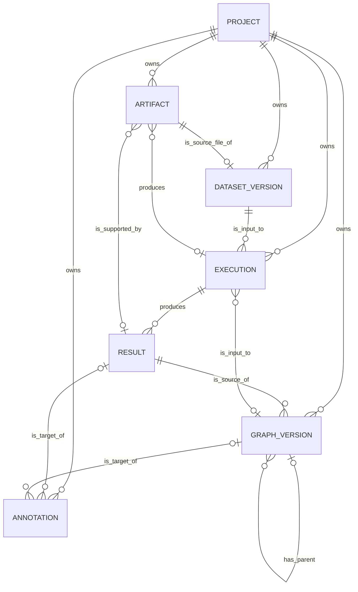

# 21 論理データ設計 — 初期価値検証版

- 文書状態: レビュー反映版
- 更新日: 2026-08-05
- 上位文書:
  - `00_プロダクトコンセプトメモ.md`
  - `10_要件定義.md`
- 目的: 初期Golden Pathを成立させる最小の正本Entity、属性、制約および関係を定義する

## 1. 設計方針

### 1.1 最小化の原則

初期版では、意味論上区別できる概念をすべて独立Entityにしない。

次をExecutionの不変snapshotへ統合する。

- Research Context
- Experiment objective / rationale
- Analysis Definition
- Execution Plan
- Causal Design

次を正本Entityにしない。

- Comparison: 複数Execution / Resultから生成するProjection
- Lineage Relation: 明示参照から導出するView
- Dataset: Dataset Versionの`dataset_key`で論理系列を表現
- Causal Graph: Graph Versionだけで開始
- Claim: 初期版ではAnnotationとして扱う
- Stage Execution / Stage Attempt: 初期版ではExecution内部状態として扱う

### 1.2 初期正本Entity

初期版の正本Entityは次の7つとする。

1. Project
2. Artifact
3. Dataset Version
4. Execution
5. Result
6. Graph Version
7. Annotation

Annotationは、採用理由・仮定・限界を残す価値検証のため初期論理モデルに含める。

### 1.3 型と制約の表記

- データ型は論理型であり、物理DB製品の型名へは詳細設計で写像する
- `PK`および`NOT NULL`欄の`1`は制約あり、空欄は制約なしを表す
- `FK`欄には参照先Entity名と属性名を記載する
- Project配下Entityの参照では、参照先が同一Projectに属することをDB制約またはApplication validationで保証する

## 2. Entity関係

### 2.1 ER図



### 2.2 Cardinality一覧

| 関係 | Cardinality | 説明 |
|---|---|---|
| Project - Artifact | 1 : 0..N | Projectは複数Artifactを所有する |
| Project - Dataset Version | 1 : 0..N | Projectは複数Dataset Versionを所有する |
| Project - Execution | 1 : 0..N | Projectは複数Executionを所有する |
| Project - Graph Version | 1 : 0..N | Projectは複数Graph Versionを所有する |
| Project - Annotation | 1 : 0..N | Projectは複数Annotationを所有する |
| Artifact - Dataset Version | 1 : 0..1 | 1つのDataset Versionは1つのsource file Artifactを参照する |
| Dataset Version - Execution | 1 : 0..N | 1つのDataset Versionを複数Executionが使用できる |
| Graph Version - Execution | 0..1 : 0..N | Estimation Executionは0または1つの入力Graph Versionを使用する。Discoveryでは使用しない |
| Execution - Result | 1 : 0..N | Executionは0件以上のResultを生成する |
| Execution - Artifact | 0..1 : 0..N | ArtifactはExecutionへ直接関連付けられる |
| Result - Artifact | 0..1 : 0..N | ArtifactはResultへ直接関連付けられる |
| Result - Graph Version | 1 : 0..N | Graph Versionは1つのDiscovery Resultをsourceとする |
| Graph Version - Graph Version | 0..1 : 0..N | 編集版は任意で親Graph Versionを参照する |
| Result - Annotation | 0..1 : 0..N | AnnotationはResultを対象にできる |
| Graph Version - Annotation | 0..1 : 0..N | AnnotationはGraph Versionを対象にできる |

### 2.3 参照・削除方針

- Project、Dataset Version、Execution、ResultおよびGraph Versionは分析来歴の正本であるため、参照が存在する状態でのhard deleteを禁止する
- Projectの利用停止は`ARCHIVED`で表現する
- Dataset Version、Execution、Resultおよび`FIXED` Graph Versionは作成後に内容を上書きしない
- FK削除動作は原則`RESTRICT`とし、Artifactの物理削除は参照がなく保持期間を満たした場合に限る
- Annotationの削除要件は初期版で必須とせず、更新履歴が必要になった場合はVersion管理へ拡張する

## 3. Entity定義

### 3.1 Project

**定義:** 1つの分析テーマと、そのデータ・実行・結果の境界。

| 属性 | PK | FK | データ型 | NOT NULL | その他制約 | 説明 |
|---|---:|---|---|---:|---|---|
| `project_id` | 1 |  | UUID | 1 |  | Project識別子 |
| `name` |  |  | VARCHAR(200) | 1 |  | 表示名 |
| `topic` |  |  | TEXT |  |  | 分析テーマ |
| `objective` |  |  | TEXT |  |  | 現時点の目的・問題意識 |
| `memo` |  |  | TEXT |  |  | 自由記述メモ |
| `status` |  |  | VARCHAR(20) | 1 | `ACTIVE` / `ARCHIVED` | Project状態 |
| `created_at` |  |  | TIMESTAMP | 1 |  | 作成日時 |
| `updated_at` |  |  | TIMESTAMP | 1 |  | 更新日時 |

**設計判断**

- Research Topicを独立Entityにしない
- Research Contextの階層を保持しない
- 目的・問題意識は未完成な自由記述から開始できる

### 3.2 Artifact

**定義:** Dataset、ExecutionまたはResultを構成・裏付け・再現する物理生成物の所在とmetadata。

| 属性 | PK | FK | データ型 | NOT NULL | その他制約 | 説明 |
|---|---:|---|---|---:|---|---|
| `artifact_id` | 1 |  | UUID | 1 |  | Artifact識別子 |
| `project_id` |  | `project.project_id` | UUID | 1 | INDEX | 所属Project |
| `execution_id` |  | `execution.execution_id` | UUID |  | INDEX | 生成元Execution。Dataset fileでは空欄可 |
| `result_id` |  | `result.result_id` | UUID |  | INDEX | 裏付けるResult |
| `artifact_type` |  |  | VARCHAR(40) | 1 | ENUM相当 | Artifact種別 |
| `object_key` |  |  | TEXT | 1 | UNIQUE | Artifact Store上の論理所在 |
| `content_hash` |  |  | VARCHAR(128) | 1 |  | 内容hash |
| `media_type` |  |  | VARCHAR(100) | 1 |  | MIME type |
| `size_bytes` |  |  | BIGINT | 1 | `>= 0` | byte数 |
| `metadata_json` |  |  | JSON | 1 | default `{}` | 補足metadata |
| `created_at` |  |  | TIMESTAMP | 1 |  | 作成日時 |

**主なArtifact Type**

- `DATASET_FILE`
- `GRAPH_JSON`
- `GRAPH_IMAGE`
- `EFFECT_TABLE`
- `DIAGNOSTICS_TABLE`
- `MANIFEST`
- `CONFIG_SNAPSHOT`
- `LOG`

**制約**

- APIはlocal absolute pathを正本識別子として返さない
- `result_id`が設定される場合、そのResultのExecutionおよびProjectとの整合を保証する
- Dataset file ArtifactはDataset Versionの`source_artifact_id`から参照する

### 3.3 Dataset Version

**定義:** Executionで使用する前処理済みデータ内容を固定した不変Version。

| 属性 | PK | FK | データ型 | NOT NULL | その他制約 | 説明 |
|---|---:|---|---|---:|---|---|
| `dataset_version_id` | 1 |  | UUID | 1 |  | Dataset Version識別子 |
| `project_id` |  | `project.project_id` | UUID | 1 | INDEX | 所属Project |
| `source_artifact_id` |  | `artifact.artifact_id` | UUID | 1 | UNIQUE | 登録されたデータファイル |
| `dataset_key` |  |  | VARCHAR(100) | 1 | INDEX | 論理Dataset系列を表すkey |
| `name` |  |  | VARCHAR(200) | 1 |  | 表示名 |
| `version_label` |  |  | VARCHAR(100) | 1 | UNIQUE(`project_id`, `dataset_key`, `version_label`) | Version表示ラベル |
| `content_hash` |  |  | VARCHAR(128) | 1 | UNIQUE(`project_id`, `dataset_key`, `content_hash`) | データ内容hash |
| `schema_json` |  |  | JSON | 1 |  | 列名・型等 |
| `profile_summary_json` |  |  | JSON | 1 | default `{}` | 欠損概要等 |
| `row_count` |  |  | BIGINT | 1 | `>= 0` | 行数 |
| `column_count` |  |  | INTEGER | 1 | `>= 0` | 列数 |
| `source_note` |  |  | TEXT |  |  | データ由来メモ |
| `created_at` |  |  | TIMESTAMP | 1 |  | 登録日時 |

**設計判断**

- DatasetとDataset Versionを初期物理モデルでは分離しない
- 同じ`dataset_key`を持つVersion群を同一Dataset系列として表示する
- 登録後の内容を上書きしない

### 3.4 Execution

**定義:** Web/API経路でAriadneが管理する、一つのalgorithm / parameter / estimator条件による一回の処理要求。

| 属性 | PK | FK | データ型 | NOT NULL | その他制約 | 説明 |
|---|---:|---|---|---:|---|---|
| `execution_id` | 1 |  | UUID | 1 |  | Execution識別子 |
| `project_id` |  | `project.project_id` | UUID | 1 | INDEX | 所属Project |
| `dataset_version_id` |  | `dataset_version.dataset_version_id` | UUID | 1 | INDEX | 入力Dataset Version |
| `input_graph_version_id` |  | `graph_version.graph_version_id` | UUID |  | INDEX | Estimation時の入力Graph Version |
| `batch_key` |  |  | UUID | 1 | INDEX | 一括実行・比較単位。Entityではない |
| `operation` |  |  | VARCHAR(20) | 1 | `DISCOVERY` / `ESTIMATION` | 処理種別 |
| `objective_snapshot` |  |  | TEXT |  |  | 実行時点の目的・問いメモ |
| `rationale_snapshot` |  |  | TEXT |  |  | 条件選定理由 |
| `analysis_spec_json` |  |  | JSON | 1 |  | 分析仕様snapshot |
| `algorithm_or_estimator` |  |  | VARCHAR(100) | 1 |  | AlgorithmまたはEstimator識別子 |
| `parameter_json` |  |  | JSON | 1 | default `{}` | parameter snapshot |
| `random_seed` |  |  | BIGINT |  |  | 乱数seed |
| `code_version` |  |  | VARCHAR(200) | 1 |  | 実行コードVersion |
| `runtime_version_json` |  |  | JSON | 1 |  | runtime / library Version |
| `snapshot_hash` |  |  | VARCHAR(128) | 1 |  | canonical snapshot hash |
| `status` |  |  | VARCHAR(20) | 1 | 状態モデル参照 | 技術的実行状態 |
| `retry_count` |  |  | INTEGER | 1 | default `0`, `>= 0` | 技術的retry回数 |
| `last_error_summary` |  |  | TEXT |  |  | 最終技術エラー概要 |
| `requested_by` |  |  | VARCHAR(200) | 1 |  | 要求者識別子 |
| `requested_at` |  |  | TIMESTAMP | 1 |  | 受付日時 |
| `started_at` |  |  | TIMESTAMP |  |  | 開始日時 |
| `finished_at` |  |  | TIMESTAMP |  |  | 終了日時 |

**`analysis_spec_json`の主要構造**

Discovery:

- feature set
- graph constraints
- algorithm-specific configuration
- expected output type

Estimation:

- treatment
- outcome
- estimand
- target population
- adjustment set
- assumptions
- inference options

**不変条件**

- submit後のsnapshotを変更しない
- Algorithm、parameter、Dataset Version、Graph VersionまたはEstimator変更は新Executionとする
- `operation=DISCOVERY`の場合、`input_graph_version_id`はNULLとする
- `operation=ESTIMATION`の場合、`input_graph_version_id`を必須とする
- `batch_key`はExecution Identityではない

### 3.5 Result

**定義:** Executionによって生成され、利用者が比較・判断する論理結果。

| 属性 | PK | FK | データ型 | NOT NULL | その他制約 | 説明 |
|---|---:|---|---|---:|---|---|
| `result_id` | 1 |  | UUID | 1 |  | Result識別子 |
| `execution_id` |  | `execution.execution_id` | UUID | 1 | INDEX | 生成元Execution |
| `result_type` |  |  | VARCHAR(40) | 1 | ENUM相当 | Result種別 |
| `scientific_status` |  |  | VARCHAR(40) | 1 | Scientific Status一覧参照 | 科学的評価状態 |
| `summary_json` |  |  | JSON | 1 | default `{}` | 比較表示用summary |
| `payload_json` |  |  | JSON | 1 | default `{}` | 構造化Result本体 |
| `diagnostics_json` |  |  | JSON | 1 | default `{}` | 診断情報 |
| `warning_json` |  |  | JSON | 1 | default `[]` | warning一覧 |
| `created_at` |  |  | TIMESTAMP | 1 |  | 作成日時 |

**Result Type例**

- `DISCOVERY_GRAPH_RESULT`
- `IDENTIFICATION_RESULT`
- `TREATMENT_EFFECT_RESULT`

**設計判断**

- Executionの技術的`FAILED`と科学的負結果を区別する
- ResultとArtifactを分離する
- ComparisonはResult集合から生成する

### 3.6 Graph Version

**定義:** 選択・修正・推論入力に使用する因果Graphの不変Version。

| 属性 | PK | FK | データ型 | NOT NULL | その他制約 | 説明 |
|---|---:|---|---|---:|---|---|
| `graph_version_id` | 1 |  | UUID | 1 |  | Graph Version識別子 |
| `project_id` |  | `project.project_id` | UUID | 1 | INDEX | 所属Project |
| `source_result_id` |  | `result.result_id` | UUID | 1 | INDEX | 元のDiscovery Result |
| `parent_graph_version_id` |  | `graph_version.graph_version_id` | UUID |  | INDEX | 編集元Graph Version |
| `name` |  |  | VARCHAR(200) | 1 |  | 表示名 |
| `graph_type` |  |  | VARCHAR(40) | 1 | ENUM相当 | DAG / CPDAG / PAG等 |
| `graph_json` |  |  | JSON | 1 |  | node、edge、endpoint表現 |
| `content_hash` |  |  | VARCHAR(128) | 1 |  | Graph内容hash |
| `edit_rationale` |  |  | TEXT |  |  | 選定・編集理由 |
| `status` |  |  | VARCHAR(20) | 1 | `DRAFT` / `FIXED` | Version状態 |
| `created_by` |  |  | VARCHAR(200) | 1 |  | 作成者識別子 |
| `created_at` |  |  | TIMESTAMP | 1 |  | 作成日時 |

**不変条件**

- `FIXED`後の内容を上書きしない
- 修正する場合は新しいGraph Versionを作る
- `source_result_id`は`DISCOVERY_GRAPH_RESULT`を指す
- Estimation Executionから使用Graph Versionを特定できる

### 3.7 Annotation

**定義:** 採用したResultまたはGraph Versionに対する、人間の判断・選定理由・仮定・限界を保持する軽量な記録。

| 属性 | PK | FK | データ型 | NOT NULL | その他制約 | 説明 |
|---|---:|---|---|---:|---|---|
| `annotation_id` | 1 |  | UUID | 1 |  | Annotation識別子 |
| `project_id` |  | `project.project_id` | UUID | 1 | INDEX | 所属Project |
| `target_result_id` |  | `result.result_id` | UUID |  | INDEX | 対象Result |
| `target_graph_version_id` |  | `graph_version.graph_version_id` | UUID |  | INDEX | 対象Graph Version |
| `statement` |  |  | TEXT | 1 |  | 判断・解釈の本文 |
| `rationale` |  |  | TEXT |  |  | 採用・不採用理由 |
| `assumptions_json` |  |  | JSON | 1 | default `[]` | 仮定一覧 |
| `limitations_json` |  |  | JSON | 1 | default `[]` | 限界一覧 |
| `created_by` |  |  | VARCHAR(200) | 1 |  | 作成者識別子 |
| `created_at` |  |  | TIMESTAMP | 1 |  | 作成日時 |
| `updated_at` |  |  | TIMESTAMP | 1 |  | 更新日時 |

**制約**

- `target_result_id`と`target_graph_version_id`のどちらか一方だけを必須とする
- 対象EntityとAnnotationは同一Projectに属すること
- 初期版ではComparison自体をAnnotation対象にしない
- 同一Batch内の比較候補は、対象ResultまたはGraph Versionのsource Executionの`batch_key`から復元する

**設計判断**

- 正式なClaim Version、承認状態および複数Batchを横断するEvidence relationは将来構想とする

## 4. 非Entityのデータモデル

### 4.0 Overview

本章では、正本Entityではないが、初期版の主要機能を成立させるデータモデルを定義する。これらは正本Entityの属性・参照から要求時に生成するか、Entity内部のsnapshotとして保持する。

### 4.1 Execution Snapshot

Execution submit時に、UI入力と参照Entityから次をcanonical JSONへ正規化し、`snapshot_hash`を計算する。

```text
objective / rationale
Dataset Version ID + content hash
input Graph Version ID + content hash [Estimationのみ]
analysis specification
algorithm / estimator
parameters
random seed
code version
runtime versions
```

**生成ロジック**

1. Command DTOをvalidationする
2. Dataset VersionとGraph Versionの正本情報を取得する
3. key順序、数値表現、NULL表現をcanonical化する
4. canonical JSONをExecution属性へ保存する
5. canonical JSONから`snapshot_hash`を計算する
6. submit後はsnapshotを更新しない

### 4.2 Batch View

Batchは正本Entityではなく、同じ`batch_key`を持つExecution集合として表現する。

**導出ロジック**

1. `project_id`と`batch_key`でExecutionを抽出する
2. operationが同一であることを検証する
3. status件数、完了率、Result件数を集計する
4. Workspace表示用のBatch summaryを生成する

### 4.3 Comparison Projection

Comparisonは正本Entityではない。

**入力**

- `execution_ids[]`または`result_ids[]`

**出力**

```text
common_conditions
changed_conditions
result_differences
warnings
lineage_summary
```

**導出ロジック**

1. 選択IDからExecutionとResultを取得する
2. すべてが同一Projectかつ同一operationであることを検証する
3. Execution Snapshotをfield path単位へ展開する
4. 全Executionで値が等しいfieldを`common_conditions`へ格納する
5. 値が異なるfieldを`changed_conditions`へ格納する
6. Result typeに応じた差分関数を適用する
7. scientific statusとwarningの差を付加する
8. 使用Entityの識別子を`lineage_summary`へ付加する

**Discovery差分**

- algorithm
- alpha等のparameter
- graph type
- edge count
- edge追加・削除
- endpoint / orientation変更
- runtime

**Estimation差分**

- estimator
- estimator parameter
- estimate
- standard error
- confidence interval
- overlap
- balance
- sample loss
- warning

### 4.4 Lineage View

Lineageは汎用Relationテーブルを置かず、明示FKから生成する。

**Resultから上流への導出ロジック**

1. `Result.execution_id`からExecutionを取得する
2. `Execution.dataset_version_id`からDataset Versionを取得する
3. Estimationの場合、`Execution.input_graph_version_id`からGraph Versionを取得する
4. `GraphVersion.source_result_id`からDiscovery Resultを取得する
5. Discovery ResultのExecutionとDataset Versionを取得する
6. Execution / Resultに関連するArtifactを取得する
7. 対象ResultまたはGraph Versionに対するAnnotationを取得する
8. 表示順序付きのLineage node / edgeへ変換する

**代表的な表示**

```text
Project objective
→ Execution objective / rationale snapshot
→ Dataset Version
→ Discovery Execution
→ Discovery Result
→ Graph Version
→ Estimation Execution
→ Estimation Result
→ Annotation
→ Artifact
```

## 5. 状態モデル

### 5.0 Overview

本章は、正本Entityが持つ状態属性の値と遷移規則を定義する。Executionの`status`は技術的な処理ライフサイクルを表し、Resultの`scientific_status`とは独立である。

### 5.1 Execution Status

| Status | 意味 | 遷移可能先 |
|---|---|---|
| `QUEUED` | Workerによる処理待ち | `RUNNING`, `CANCELLED` |
| `RUNNING` | Scientific Coreを実行中 | `SUCCEEDED`, `FAILED`, `CANCELLED` |
| `SUCCEEDED` | 技術的に処理を完了しResult保存済み | なし |
| `FAILED` | 技術例外により処理未完了 | `QUEUED`（技術的retry） |
| `CANCELLED` | 利用者またはOperatorにより中止 | なし。再実行は新Execution |

```text
QUEUED ──→ RUNNING ──→ SUCCEEDED
   │           ├──────→ FAILED ──retry──→ QUEUED
   │           └──────→ CANCELLED
   └──────────────────→ CANCELLED
```

**規則**

- `SUCCEEDED`は科学的に有効であることを意味しない
- `NOT_IDENTIFIED`等のResultを保存できた場合、Executionは`SUCCEEDED`とする
- retry時もExecution Snapshotを変更しない

### 5.2 Graph Version Status

| Status | 意味 | 遷移可能先 |
|---|---|---|
| `DRAFT` | 選定・編集作業中 | `FIXED` |
| `FIXED` | 推論入力として使用可能な不変Version | なし |

`FIXED`後に変更する場合は、`parent_graph_version_id`を設定した新しい`DRAFT`を作成する。

### 5.3 Result Scientific Status

Scientific Statusはライフサイクル状態ではなく、Result生成時の科学的評価分類である。

| Scientific Status | 意味 |
|---|---|
| `VALID` | 定義した条件下でResultを解釈可能 |
| `NOT_IDENTIFIED` | 指定Graph・観測変数・仮定ではestimandを識別できない |
| `INSUFFICIENT_OVERLAP` | treatment群間のsupportが不足する |
| `INSUFFICIENT_SAMPLE` | 推定または診断に必要な標本が不足する |
| `ESTIMATION_UNRELIABLE` | 収束、極端重み、診断等から採用困難 |

## 6. 整合性制約

### 6.1 Project境界

- Executionが参照するDataset VersionとGraph VersionはExecutionと同一Projectに属すること
- Graph Versionが参照するsource Resultは同一ProjectのDiscovery Executionから生成されたこと
- Annotationの対象はAnnotationと同一Projectに属すること
- ArtifactがResultを参照する場合、Artifact、ResultおよびExecutionは同一Projectに属すること

### 6.2 不変性

- Dataset Versionは登録後に上書きしない
- Execution Snapshotはsubmit後に上書きしない
- ResultおよびArtifactの内容を上書きせず、再生成時は新規識別子を発行する
- `FIXED` Graph Versionは上書きしない
