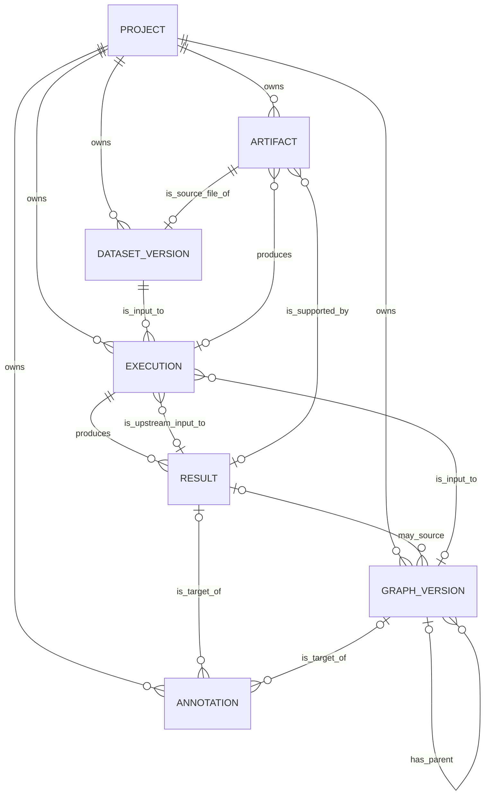

# 21 論理データ設計 — 初期価値検証版 ENH-E2統合改定

- 文書状態: ENH-E2統合改定版
- 更新日: 2026-08-06
- 上位文書:
  - `00_プロダクトコンセプトメモ.md`
  - `10_要件定義.md`
- 下位文書:
  - `22_プロダクト基本設計.md`
  - `23_API・インターフェース設計.md`
  - `30_詳細設計.md`
- 目的: 初期Golden Pathを成立させる最小の正本Entity、属性、制約および関係を定義する

> **要件定義書は常にシステムの正本である。**
>
> **実装、既存コード、DBスキーマ、API、UIまたはテスト結果から、要件定義書を逆生成・事後更新してはならない。**

## 1. 設計方針

### 1.1 最小化の原則

初期版では、意味論上区別できる概念をすべて独立Entityにしない。

次をExecutionの不変snapshotへ統合する。

- Research Context
- Experiment objective / rationale
- Analysis Definition
- Execution Plan
- Causal Design

次を正本Entityにしない。

- Comparison: 複数Execution / Resultから生成するProjection
- Lineage Relation: 明示参照から導出するView
- Dataset: Dataset Versionの`dataset_key`で論理系列を表現
- Causal Graph: Graph Versionだけで開始
- Claim: 初期版ではAnnotationとして扱う
- Stage Execution / Stage Attempt: 初期版ではExecution内部状態として扱う

### 1.2 初期正本Entity

初期版の正本Entityは次の7つとする。

1. Project
2. Artifact
3. Dataset Version
4. Execution
5. Result
6. Graph Version
7. Annotation

Annotationは、採用理由・仮定・限界を残す価値検証のため初期論理モデルに含める。

### 1.3 型と制約の表記

- データ型は論理型であり、物理DB製品の型名へは詳細設計で写像する
- `PK`および`NOT NULL`欄の`1`は制約あり、空欄は制約なしを表す
- `FK`欄には参照先Entity名と属性名を記載する
- Project配下Entityの参照では、参照先が同一Projectに属することをDB制約またはApplication validationで保証する

## 2. Entity関係

### 2.1 ER図


### 2.2 Cardinality一覧

| 関係 | Cardinality | 説明 |
|---|---|---|
| Project - Artifact | 1 : 0..N | Projectは複数Artifactを所有する |
| Project - Dataset Version | 1 : 0..N | Projectは複数Dataset Versionを所有する |
| Project - Execution | 1 : 0..N | Projectは複数Executionを所有する |
| Project - Graph Version | 1 : 0..N | Projectは複数Graph Versionを所有する |
| Project - Annotation | 1 : 0..N | Projectは複数Annotationを所有する |
| Artifact - Dataset Version | 1 : 0..1 | Dataset Versionは1つのsource file Artifactを参照する |
| Dataset Version - Execution | 1 : 0..N | Dataset Versionを複数Executionが使用できる |
| Graph Version - Execution | 0..1 : 0..N | Identification / Estimation等が入力Graphを使用する |
| Result - Execution | 0..1 : 0..N | Estimation等は上流Resultを明示参照できる |
| Execution - Result | 1 : 0..N | Executionは複数種のResultを生成できる |
| Execution - Artifact | 0..1 : 0..N | ArtifactはExecutionへ直接関連付けられる |
| Result - Artifact | 0..1 : 0..N | ArtifactはResultへ直接関連付けられる |
| Result - Graph Version | 0..1 : 0..N | Discovered等のGraphはsource Resultを任意参照する |
| Graph Version - Graph Version | 0..1 : 0..N | 編集・変換版は親Graph Versionを参照する |
| Result - Annotation | 0..1 : 0..N | AnnotationはResultを対象にできる |
| Graph Version - Annotation | 0..1 : 0..N | AnnotationはGraph Versionを対象にできる |
### 2.3 参照・削除方針

- Project、Dataset Version、Execution、ResultおよびGraph Versionは分析来歴の正本であるため、参照が存在する状態でのhard deleteを禁止する
- Projectの利用停止は`ARCHIVED`で表現する
- Dataset Version、Execution、Resultおよび`FIXED` Graph Versionは作成後に内容を上書きしない
- FK削除動作は原則`RESTRICT`とし、Artifactの物理削除は参照がなく保持期間を満たした場合に限る
- Annotationの削除要件は初期版で必須とせず、更新履歴が必要になった場合はVersion管理へ拡張する

## 3. Entity定義

### 3.1 Project

**定義:** 1つの分析テーマと、そのデータ・実行・結果の境界。

| 属性 | PK | FK | データ型 | NOT NULL | その他制約 | 説明 |
|---|---:|---|---|---:|---|---|
| `project_id` | 1 |  | UUID | 1 |  | Project識別子 |
| `name` |  |  | VARCHAR(200) | 1 |  | 表示名 |
| `topic` |  |  | TEXT |  |  | 分析テーマ |
| `objective` |  |  | TEXT |  |  | 現時点の目的・問題意識 |
| `memo` |  |  | TEXT |  |  | 自由記述メモ |
| `status` |  |  | VARCHAR(20) | 1 | `ACTIVE` / `ARCHIVED` | Project状態 |
| `created_at` |  |  | TIMESTAMP | 1 |  | 作成日時 |
| `updated_at` |  |  | TIMESTAMP | 1 |  | 更新日時 |

**設計判断**

- Research Topicを独立Entityにしない
- Research Contextの階層を保持しない
- 目的・問題意識は未完成な自由記述から開始できる
- UIの「削除」は`archive()`による`ACTIVE → ARCHIVED`で表現し、hard deleteしない
- ARCHIVED Projectでは新規write操作を禁止し、既存Lineageをread-onlyで保持する

### 3.2 Artifact

**定義:** Dataset、ExecutionまたはResultを構成・裏付け・再現する物理生成物の所在とmetadata。

| 属性 | PK | FK | データ型 | NOT NULL | その他制約 | 説明 |
|---|---:|---|---|---:|---|---|
| `artifact_id` | 1 |  | UUID | 1 |  | Artifact識別子 |
| `project_id` |  | `project.project_id` | UUID | 1 | INDEX | 所属Project |
| `execution_id` |  | `execution.execution_id` | UUID |  | INDEX | 生成元Execution。Dataset fileでは空欄可 |
| `result_id` |  | `result.result_id` | UUID |  | INDEX | 裏付けるResult |
| `artifact_type` |  |  | VARCHAR(40) | 1 | ENUM相当 | Artifact種別 |
| `object_key` |  |  | TEXT | 1 | UNIQUE | Artifact Store上の論理所在 |
| `content_hash` |  |  | VARCHAR(128) | 1 |  | 内容hash |
| `media_type` |  |  | VARCHAR(100) | 1 |  | MIME type |
| `size_bytes` |  |  | BIGINT | 1 | `>= 0` | byte数 |
| `metadata_json` |  |  | JSON | 1 | default `{}` | 補足metadata |
| `created_at` |  |  | TIMESTAMP | 1 |  | 作成日時 |

**主なArtifact Type**

- `DATASET_FILE`
- `GRAPH_JSON`
- `GRAPH_IMAGE`
- `EFFECT_TABLE`
- `DIAGNOSTICS_TABLE`
- `MANIFEST`
- `CONFIG_SNAPSHOT`
- `LOG`

**制約**

- APIはlocal absolute pathを正本識別子として返さない
- `result_id`が設定される場合、そのResultのExecutionおよびProjectとの整合を保証する
- Dataset file ArtifactはDataset Versionの`source_artifact_id`から参照する

### 3.3 Dataset Version

**定義:** Executionで使用する前処理済みデータ内容を固定した不変Version。

| 属性 | PK | FK | データ型 | NOT NULL | その他制約 | 説明 |
|---|---:|---|---|---:|---|---|
| `dataset_version_id` | 1 |  | UUID | 1 |  | Dataset Version識別子 |
| `project_id` |  | `project.project_id` | UUID | 1 | INDEX | 所属Project |
| `source_artifact_id` |  | `artifact.artifact_id` | UUID | 1 | UNIQUE | 登録されたデータファイル |
| `dataset_key` |  |  | VARCHAR(100) | 1 | INDEX | 論理Dataset系列を表すkey |
| `name` |  |  | VARCHAR(200) | 1 |  | 表示名 |
| `version_label` |  |  | VARCHAR(100) | 1 | UNIQUE(`project_id`, `dataset_key`, `version_label`) | Version表示ラベル |
| `content_hash` |  |  | VARCHAR(128) | 1 | UNIQUE(`project_id`, `dataset_key`, `content_hash`) | データ内容hash |
| `schema_json` |  |  | JSON | 1 |  | 列名・型等 |
| `profile_summary_json` |  |  | JSON | 1 | default `{}` | 欠損概要等 |
| `row_count` |  |  | BIGINT | 1 | `>= 0` | 行数 |
| `column_count` |  |  | INTEGER | 1 | `>= 0` | 列数 |
| `source_note` |  |  | TEXT |  |  | データ由来メモ |
| `created_at` |  |  | TIMESTAMP | 1 |  | 登録日時 |

**設計判断**

- DatasetとDataset Versionを初期物理モデルでは分離しない
- 同じ`dataset_key`を持つVersion群を同一Dataset系列として表示する
- 登録後の内容を上書きしない

### 3.4 Execution

**定義:** Web/API経路でAriadneが管理する、一つのOperation、Method、Parameter Setおよび不変Snapshotによる一回の処理要求。

| 属性 | PK | FK | データ型 | NOT NULL | その他制約 | 説明 |
|---|---:|---|---|---:|---|---|
| `execution_id` | 1 |  | UUID | 1 |  | Execution識別子 |
| `project_id` |  | `project.project_id` | UUID | 1 | INDEX | 所属Project |
| `dataset_version_id` |  | `dataset_version.dataset_version_id` | UUID | 1 | INDEX | 入力Dataset Version |
| `input_graph_version_id` |  | `graph_version.graph_version_id` | UUID |  | INDEX | 入力Graph Version |
| `input_result_id` |  | `result.result_id` | UUID |  | INDEX | 上流Scientific Result |
| `batch_key` |  |  | UUID | 1 | INDEX | 一括実行・比較単位 |
| `operation` |  |  | VARCHAR(30) | 1 | Operation一覧参照 | 処理種別 |
| `objective_snapshot` |  |  | TEXT |  |  | 実行時点の目的・問いメモ |
| `rationale_snapshot` |  |  | TEXT |  |  | 条件選定理由 |
| `analysis_spec_json` |  |  | JSON | 1 |  | 構造化分析仕様Snapshot |
| `snapshot_schema_version` |  |  | VARCHAR(100) | 1 |  | Snapshot Schema識別子 |
| `algorithm_or_estimator` |  |  | VARCHAR(100) | 1 |  | Method識別子 |
| `parameter_json` |  |  | JSON | 1 | default `{}` | Parameter Snapshot |
| `random_seed` |  |  | BIGINT |  |  | 乱数Seed |
| `code_version` |  |  | VARCHAR(200) | 1 |  | 実行コードVersion |
| `runtime_version_json` |  |  | JSON | 1 |  | Runtime / Library Version |
| `snapshot_hash` |  |  | VARCHAR(128) | 1 |  | Canonical Snapshot Hash |
| `status` |  |  | VARCHAR(20) | 1 | 状態モデル参照 | 技術的実行状態 |
| `retry_count` |  |  | INTEGER | 1 | default `0`, `>= 0` | 技術的Retry回数 |
| `last_error_summary` |  |  | TEXT |  |  | 最終技術エラー概要 |
| `requested_by` |  |  | VARCHAR(200) | 1 |  | 要求者識別子 |
| `requested_at` |  |  | TIMESTAMP | 1 |  | 受付日時 |
| `started_at` |  |  | TIMESTAMP |  |  | 開始日時 |
| `finished_at` |  |  | TIMESTAMP |  |  | 終了日時 |

**Operation**

```text
DISCOVERY
IDENTIFICATION
ESTIMATION
REFUTATION
SENSITIVITY
```

**Operation別参照制約**

| Operation | Dataset | Graph | Input Result |
|---|---:|---:|---:|
| DISCOVERY | 必須 | 禁止 | 禁止 |
| IDENTIFICATION | 必須 | 必須 | 禁止 |
| ESTIMATION | 必須 | 必須 | Identification Result必須 |
| REFUTATION | 必須 | 元Executionと同一を原則 | Treatment Effect Result必須 |
| SENSITIVITY | 必須 | 元Executionと同一を原則 | Treatment Effect Result必須 |

**`analysis_spec_json`の主要構造**

- `schema_version`
- `analysis_mode`
- `research_context`
- `causal_question`
- `causal_design`
- `operation_spec`
- `validation_override`

**不変条件**

- Submit後のSnapshot、`input_result_id`、Dataset、Graphを変更しない
- Method、Parameter、Dataset、GraphまたはUpstream Result変更は新Executionとする
- Project境界を越える参照を禁止する
- `batch_key`はExecution Identityではない
### 3.5 Result

**定義:** Executionによって生成され、利用者が比較・判断する論理的な科学結果。

| 属性 | PK | FK | データ型 | NOT NULL | その他制約 | 説明 |
|---|---:|---|---|---:|---|---|
| `result_id` | 1 |  | UUID | 1 |  | Result識別子 |
| `execution_id` |  | `execution.execution_id` | UUID | 1 | INDEX | 生成元Execution |
| `result_type` |  |  | VARCHAR(50) | 1 | ENUM相当 | Result種別 |
| `scientific_status` |  |  | VARCHAR(50) | 1 | Result Type別制約 | 科学的評価状態 |
| `summary_json` |  |  | JSON | 1 | default `{}` | 比較表示用Summary |
| `payload_json` |  |  | JSON | 1 | default `{}` | 構造化Result本体 |
| `diagnostics_json` |  |  | JSON | 1 | default `{}` | 補助診断情報 |
| `warning_json` |  |  | JSON | 1 | default `[]` | Warning一覧 |
| `created_at` |  |  | TIMESTAMP | 1 |  | 作成日時 |

**Result Type**

```text
DISCOVERY_GRAPH_RESULT
IDENTIFICATION_RESULT
DATA_ELIGIBILITY_RESULT
TREATMENT_EFFECT_RESULT
DIAGNOSTICS_RESULT
REFUTATION_RESULT
SENSITIVITY_RESULT
```

**設計判断**

- 1 Executionは0件以上のResultを生成できる
- Identification ExecutionはIdentification ResultとData Eligibility Resultを生成する
- Estimation ExecutionはTreatment Effect ResultとDiagnostics Resultを生成する
- 技術的`FAILED`と科学的負結果を区別する
- ComparisonはResult集合から要求時に生成する
### 3.6 Graph Version

**定義:** 探索、登録、制約適用、編集および推論入力に使用する因果Graphの不変Version。

| 属性 | PK | FK | データ型 | NOT NULL | その他制約 | 説明 |
|---|---:|---|---|---:|---|---|
| `graph_version_id` | 1 |  | UUID | 1 |  | Graph Version識別子 |
| `project_id` |  | `project.project_id` | UUID | 1 | INDEX | 所属Project |
| `source_result_id` |  | `result.result_id` | UUID |  | INDEX | Discovery等のSource Result |
| `parent_graph_version_id` |  | `graph_version.graph_version_id` | UUID |  | INDEX | 編集・変換元Graph |
| `designated_outcome_node` |  |  | VARCHAR(200) |  | INDEX | Discoveryで指定しInferenceへ継承するOutcome node |
| `name` |  |  | VARCHAR(200) | 1 |  | 表示名 |
| `graph_type` |  |  | VARCHAR(40) | 1 | DAG / CPDAG / PAG等 | Graph種別 |
| `graph_origin` |  |  | VARCHAR(40) | 1 | Origin一覧参照 | 作成起源 |
| `graph_json` |  |  | JSON | 1 |  | Node、Edge、Endpoint表現 |
| `provenance_json` |  |  | JSON | 1 | default `{}` | Backend、Constraint、Transform、Warning等 |
| `content_hash` |  |  | VARCHAR(128) | 1 |  | Graph内容Hash |
| `edit_rationale` |  |  | TEXT |  |  | 選定・編集理由 |
| `status` |  |  | VARCHAR(20) | 1 | `DRAFT` / `FIXED` | Version状態 |
| `created_by` |  |  | VARCHAR(200) | 1 |  | 作成者 |
| `created_at` |  |  | TIMESTAMP | 1 |  | 作成日時 |

**Graph Origin**

```text
DISCOVERED
CONSTRAINT_ADJUSTED
USER_DEFINED
IMPORTED
USER_EDITED
```

**Origin別制約**

- `DISCOVERED`: `source_result_id`必須
- `CONSTRAINT_ADJUSTED`: `source_result_id`または`parent_graph_version_id`必須
- `USER_DEFINED`: `source_result_id`禁止
- `IMPORTED`: `source_result_id`禁止
- `USER_EDITED`: `parent_graph_version_id`必須

**不変条件**

- `FIXED`後は上書きしない
- 修正・変換する場合は新Graph Versionを作る
- Endpoint Semanticsを保持する
- Post-hoc Constraint適用GraphをAlgorithmの直接出力と表示しない
- 子Graph Versionは`designated_outcome_node`を親から既定継承する
- `FIXED` Graph VersionをInference入力にする場合、`designated_outcome_node`を必須とする
- `designated_outcome_node`はGraph nodeかつ参照Dataset Versionの列でなければならない
### 3.7 Annotation

**定義:** 採用したResultまたはGraph Versionに対する、人間の判断・選定理由・仮定・限界を保持する軽量な記録。

| 属性 | PK | FK | データ型 | NOT NULL | その他制約 | 説明 |
|---|---:|---|---|---:|---|---|
| `annotation_id` | 1 |  | UUID | 1 |  | Annotation識別子 |
| `project_id` |  | `project.project_id` | UUID | 1 | INDEX | 所属Project |
| `target_result_id` |  | `result.result_id` | UUID |  | INDEX | 対象Result |
| `target_graph_version_id` |  | `graph_version.graph_version_id` | UUID |  | INDEX | 対象Graph Version |
| `statement` |  |  | TEXT | 1 |  | 判断・解釈の本文 |
| `rationale` |  |  | TEXT |  |  | 採用・不採用理由 |
| `assumptions_json` |  |  | JSON | 1 | default `[]` | 仮定一覧 |
| `limitations_json` |  |  | JSON | 1 | default `[]` | 限界一覧 |
| `created_by` |  |  | VARCHAR(200) | 1 |  | 作成者識別子 |
| `created_at` |  |  | TIMESTAMP | 1 |  | 作成日時 |
| `updated_at` |  |  | TIMESTAMP | 1 |  | 更新日時 |

**制約**

- `target_result_id`と`target_graph_version_id`のどちらか一方だけを必須とする
- 対象EntityとAnnotationは同一Projectに属すること
- 初期版ではComparison自体をAnnotation対象にしない
- 同一Batch内の比較候補は、対象ResultまたはGraph Versionのsource Executionの`batch_key`から復元する

**設計判断**

- 正式なClaim Version、承認状態および複数Batchを横断するEvidence relationは将来構想とする

## 4. 非Entityのデータモデル

### 4.0 Overview

本章では、正本Entityではないが、初期版の主要機能を成立させるデータモデルを定義する。これらは正本Entityの属性・参照から要求時に生成するか、Entity内部のsnapshotとして保持する。

### 4.1 Execution Snapshot

Execution Submit時に、UI入力と参照Entityから次をCanonical JSONへ正規化し、`snapshot_hash`を計算する。

```text
schema version
analysis mode
research context
causal question
causal design
operation specification
validation override
Dataset Version ID + content hash
input Graph Version ID + content hash
input Result ID
algorithm / estimator
parameters
random seed
code version
runtime versions
```

**生成ロジック**

1. Operation別Command DTOをValidationする
2. Dataset、GraphおよびUpstream Resultを解決する
3. Project境界とOperation別Input Contractを検証する
4. Key順序、数値表現、NULL表現をCanonical化する
5. 非有限Floatと未知Fieldを拒否する
6. Canonical JSONをExecutionへ保存する
7. SHA-256で`snapshot_hash`を計算する
8. Submit後はSnapshotを更新しない
### 4.2 Batch View

Batchは正本Entityではなく、同じ`batch_key`を持つExecution集合として表現する。

**導出ロジック**

1. `project_id`と`batch_key`でExecutionを抽出する
2. operationが同一であることを検証する
3. status件数、完了率、Result件数を集計する
4. Workspace表示用のBatch summaryを生成する

### 4.3 Comparison Projection

Comparisonは正本Entityではない。

**入力**

- `execution_ids[]`または`result_ids[]`

**比較可能条件**

- 同一Project
- 同一Result Type
- 同一Estimand
- 同一Outcome Scale
- 同一Population定義

**出力**

```text
common_conditions
changed_conditions
result_differences
warnings
lineage_summary
```

条件が一致しない場合は数値差を直接比較せず、`INCOMPARABLE` Warningを返す。

Discovery、Identification、Data Eligibility、Treatment Effect、Diagnostics、Refutation、Sensitivityごとに差分関数を定義する。
### 4.4 Lineage View

Lineageは汎用Relation Tableを置かず、明示FKから生成する。

**導出ロジック**

1. `Result.execution_id`から生成Executionを取得する
2. `Execution.input_result_id`を再帰的に辿る
3. 各ExecutionのDataset VersionとGraph Versionを取得する
4. Graphの`source_result_id`と`parent_graph_version_id`を辿る
5. Execution / Resultに関連するArtifactを取得する
6. ResultまたはGraphに対するAnnotationを取得する
7. Cycleを検出し、同一Entityの再訪を停止する
8. Project境界を検証する

**代表的な表示**

```text
Project
→ Dataset Version
→ Discovery Execution / Result（任意）
→ Graph Version
→ Identification Execution
→ Identification Result
→ Data Eligibility Result
→ Estimation Execution
→ Treatment Effect Result
→ Diagnostics Result
→ Refutation / Sensitivity Result
→ Annotation
→ Artifact
```

### 4.5. Graph Candidate View

Discovery Graph ResultとGraph Versionを同一操作面へ表示するためのQuery Model。正本EntityまたはTableとして保存しない。

| 属性 | 説明 |
|---|---|
| `candidate_kind` | `DISCOVERY_RESULT` / `GRAPH_VERSION` |
| `candidate_id` | Result IDまたはGraph Version ID |
| `source_result_id` | Algorithm OutputのSource Result |
| `graph_version_id` | Graph Versionの場合のID |
| `parent_graph_version_id` | 派生元Graph Version |
| `graph_type` | DAG / CPDAG / PAG等 |
| `graph_origin` | Graph Version Origin。Resultでは`ALGORITHM_OUTPUT`表示 |
| `version_status` | DRAFT / FIXED。Resultでは空欄 |
| `scientific_status` | Discovery Resultの科学状態。Graph Versionでは空欄 |
| `fixed_flag` | FIXED Graph Versionならtrue |
| `designated_outcome_node` | 表示・Inference継承対象Outcome |
| `node_count`, `edge_count` | 構造summary |
| `summary` | 利用者向けsummary |
| `allowed_actions` | 状態から導出した操作一覧 |

### 4.6. Graph Comparison View

2件以上のGraph Candidateから要求時に生成する。

- candidateごとのGraph Document
- Graph TypeとEndpoint Semantics
- node / edge counts
- edge add / remove / endpoint change
- compatibility判定
- 非比較可能理由
- tab表示用label

Graph Typeまたはnode namespaceが非互換でも、個別tab表示は許可し、構造差分計算のみ非比較とする。

### 4.7. Operation Availability View

UIが独自に状態規則を再実装しないため、Query Responseに操作可否と拒否理由を含められる。

```json
{
  "can_edit": false,
  "can_fix": false,
  "can_create_child": true,
  "can_use_for_inference": true,
  "disabled_reasons": []
}
```


## 5. 状態モデル

### 5.0 Overview

本章は、正本Entityが持つ状態属性の値と遷移規則を定義する。Executionの`status`は技術的な処理ライフサイクルを表し、Resultの`scientific_status`とは独立である。

### 5.1 Execution Status

| Status | 意味 | 遷移可能先 |
|---|---|---|
| `QUEUED` | Workerによる処理待ち | `RUNNING`, `CANCELLED` |
| `RUNNING` | Scientific Coreを実行中 | `SUCCEEDED`, `FAILED`, `CANCELLED` |
| `SUCCEEDED` | 技術的に処理を完了しResult保存済み | なし |
| `FAILED` | 技術例外により処理未完了 | `QUEUED`（技術的retry） |
| `CANCELLED` | 利用者またはOperatorにより中止 | なし。再実行は新Execution |

```text
QUEUED ──→ RUNNING ──→ SUCCEEDED
   │           ├──────→ FAILED ──retry──→ QUEUED
   │           └──────→ CANCELLED
   └──────────────────→ CANCELLED
```

**規則**

- `SUCCEEDED`は科学的に有効であることを意味しない
- `NOT_IDENTIFIED`等のResultを保存できた場合、Executionは`SUCCEEDED`とする
- retry時もExecution Snapshotを変更しない

### 5.2 Graph Version Status

| Status | 意味 | 遷移可能先 |
|---|---|---|
| `DRAFT` | 選定・編集作業中 | `FIXED` |
| `FIXED` | 推論入力として使用可能な不変Version | なし |

`FIXED`後に変更する場合は、`parent_graph_version_id`を設定した新しい`DRAFT`を作成する。

### 5.3 Result Scientific Status

Scientific StatusはResult Typeごとに定義する。

| Result Type | Scientific Status |
|---|---|
| DISCOVERY_GRAPH_RESULT | `GENERATED`, `GENERATED_WITH_WARNINGS`, `UNRELIABLE` |
| IDENTIFICATION_RESULT | `IDENTIFIED`, `NOT_IDENTIFIED`, `PARTIALLY_IDENTIFIED`, `REQUIRES_REVIEW` |
| DATA_ELIGIBILITY_RESULT | `PASS`, `WARN`, `FAIL` |
| TREATMENT_EFFECT_RESULT | `ESTIMATED`, `INSUFFICIENT_OVERLAP`, `INSUFFICIENT_SAMPLE`, `ESTIMATION_UNRELIABLE`, `REQUIRES_REVIEW` |
| DIAGNOSTICS_RESULT | `PASS`, `WARN`, `FAIL` |
| REFUTATION_RESULT | `NO_FAILURE_DETECTED`, `FAILURE_DETECTED`, `INCONCLUSIVE` |
| SENSITIVITY_RESULT | `ROBUST`, `FRAGILE`, `INCONCLUSIVE` |

`VALID`を新規Resultの汎用Statusとして使用しない。

科学的負結果を保存できた場合、Executionは`SUCCEEDED`とする。

### 5.4. Project Status

| Status | 意味 | 遷移可能先 | write操作 |
|---|---|---|---|
| `ACTIVE` | 分析作業中 | `ARCHIVED` | 許可 |
| `ARCHIVED` | 利用停止。来歴保持 | なし（ENH-E2） | 禁止 |

```text
ACTIVE --archive--> ARCHIVED
```

ARCHIVED Projectは通常Project selectorから除外する。read-only Result / Lineage参照に必要なQueryは許可する。


## 6. 整合性制約

### 6.1 Project境界

- Executionが参照するDataset、GraphおよびInput Resultは同一Projectに属すること
- Graph Versionが参照するSource Result / Parent Graphは同一Projectに属すること
- Parent Graph Versionは`FIXED`であること
- `designated_outcome_node`は同一Projectの参照DatasetおよびGraph nodeと整合すること
- Annotation対象はAnnotationと同一Projectに属すること
- Artifact、ResultおよびExecutionのProjectを一致させること

### 6.2 Operation別制約

- DISCOVERYはGraphとInput Resultを参照しない
- IDENTIFICATIONはFIXED Graphを必須とする
- ESTIMATIONは許可されたIdentification Resultを必須とする
- REFUTATION / SENSITIVITYはTreatment Effect Resultを必須とする
- `NOT_IDENTIFIED`またはData Eligibility `FAIL`から通常Estimationを作成しない
- Data Eligibility `WARN`のOverrideにはReasonとActorを必須とする

### 6.3 不変性

- Dataset Versionは登録後に上書きしない
- Execution Snapshotと`input_result_id`はSubmit後に上書きしない
- ResultおよびArtifactは再生成時に新規識別子を発行する
- `FIXED` Graph Versionは上書きしない
- ARCHIVED Projectの正本Entityを削除または更新しない
- Outcome変更は既存FIXED Graphの更新ではなく、新しいGraph Versionまたは新Executionとして表現する
- Graph編集・Constraint適用は新Versionとする

### 6.4 Cycle防止

- `input_result_id`の参照Cycleを禁止する
- `parent_graph_version_id`の参照Cycleを禁止する
- Application ValidationとLineage TraversalのVisited Setで検出する


## 7. ENH-E2 Migration方針

### 7.1. Project

Project status列と`ARCHIVED`値は既存Schemaを使用する。Project archive API追加にDB migrationは不要である。

### 7.2. Graph Version

`product_graph_version`へnullableな`designated_outcome_node`を追加する。

- 既存行はNULLのまま移行可能
- 新規FIXED GraphをInferenceへ使用する場合はApplication Validationで必須
- 既存Graphへ自動推測したOutcomeを設定しない
- 利用者が明示的にOutcomeを指定して新Versionを作成する

### 7.3. Query Model

Graph Candidate、Graph ComparisonおよびOperation Availability用Tableは追加しない。
