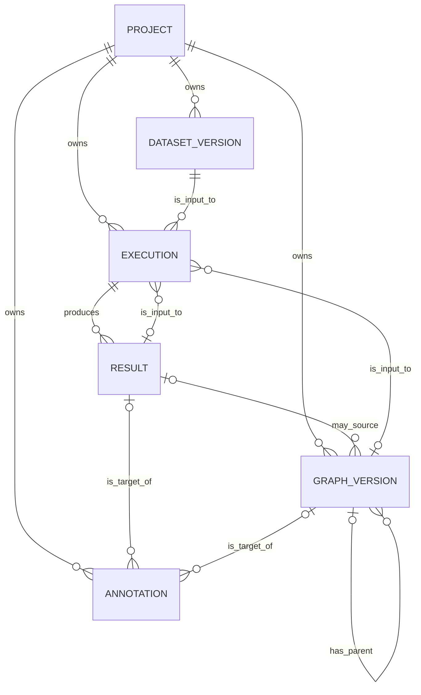

# 設計書改定 — ENH-E1

- 対象:
  - `../10_Revised_requirements_definition_documents/21_論理データ設計.md`
  - `../10_Revised_requirements_definition_documents/22_プロダクト基本設計.md`
  - `../10_Revised_requirements_definition_documents/23_API・インターフェース設計.md`
  - `../10_Revised_requirements_definition_documents/30_詳細設計.md`
- 改定識別子: `ENH-E1`
- 改定状態: 承認済み

> **本書は承認済み要件定義書から導出される。**
>
> **実装都合から本書または要件定義書を逆方向に変更してはならない。**

## 1. プロダクト基本設計改定

### 1.1. アーキテクチャ原則

#### 1.1.1. 主要Entity

以下の7 Entityを維持する。

```text
Project
Dataset Version
Execution
Result
Artifact
Graph Version
Annotation
```

#### 1.1.2. Execution中心モデル

```text
1 Method
+ 1 Parameter Set
+ 1 Immutable Snapshot
= 1 Execution
```

複数MethodまたはParameter Setは`batch_key`で束ねる。

#### 1.1.3. 科学ライフサイクル

```text
Graph Version
→ Identification Execution
  ├─ Identification Result
  └─ Data Eligibility Result
→ Estimation Execution
  ├─ Treatment Effect Result
  └─ Diagnostics Result
→ Refutation Execution
→ Sensitivity Execution
→ Annotation
```

#### 1.1.4. Product層とScientific Coreの分離

Product層は以下を管理する。

- Entity
- Execution受付
- Project境界
- Snapshot
- State
- Lineage
- Persistence
- API
- UI

Scientific Coreは以下を管理する。

- Graph Validation
- Identification
- Data Eligibility Calculation
- Estimation
- Diagnostics
- Refutation
- Sensitivity
- Scientific Warning

Product層はDoWhy、causal-learn等の外部Library型を参照しない。

### 1.2. コンポーネント責務

| コンポーネント | 追加責務 |
|---|---|
| Web App | Causal Question入力、Identification表示、Data Eligibility、Refutation、Sensitivity表示 |
| Web API | Operation別Validation、上流Result Validation、Graph Origin、科学Result照会 |
| Worker | 5 OperationのDispatch、複数Result保存、Result Chain解決 |
| Scientific Core | Identification、Eligibility、Refutation、Sensitivity |
| Metadata DB | `input_result_id`、Graph Origin、Result Type拡張 |
| Artifact Store | Identification、Diagnostics、Refutation、Sensitivity Report |
| CLI | Identify、Refute、Sensitivityのローカル実行 |

### 1.3. Workspace改定

#### 1.3.1. Project／Data Workspace

既存機能を維持する。

#### 1.3.2. Discovery Workspace

以下を追加表示する。

- Graph Origin
- Source Backend
- Constraints Applied
- Parent Graph Version
- Unresolved Orientation
- Latent Confounding Warning
- Bootstrap Agreement
- Algorithm Agreement

#### 1.3.3. Inference Workspace

以下の4区画とする。

```text
1. Causal Question / Design
2. Identification / Data Eligibility
3. Estimation / Diagnostics
4. Refutation / Sensitivity
```

操作順を以下とする。

```text
Question / Design入力
→ Identification実行
→ Result確認
→ Estimator選択
→ Estimation実行
→ Diagnostics確認
→ Refutation / Sensitivity実行
```

`NOT_IDENTIFIED`の場合、Estimator実行操作を無効化する。

Data Eligibilityが`WARN`の場合、Override Reasonを必須入力とする。

#### 1.3.4. Results／Lineage Workspace

以下を追加表示する。

- Identification Result
- Data Eligibility Result
- Diagnostics Result
- Refutation Result
- Sensitivity Result
- Graph Origin
- Upstream Result
- Override Reason
- Analysis Mode

### 1.4. Worker基本設計

```text
QUEUED
→ Execution取得
→ Dataset解決
→ Graph解決
→ Upstream Result解決
→ Snapshot Hash検証
→ Operation別Input構築
→ Scientific Core実行
→ Result群構築
→ Artifact保存
→ Result・Artifact・Execution StatusをTransaction確定
→ SUCCEEDED
```

科学的負結果を返しても、Result保存に成功した場合はExecutionを`SUCCEEDED`とする。

### 1.5. Operation別責務

| Operation | 必須入力 | 主要出力 |
|---|---|---|
| DISCOVERY | Dataset、Discovery Spec | Discovery Graph Result |
| IDENTIFICATION | Dataset、Graph、Causal Question／Design | Identification Result、Data Eligibility Result |
| ESTIMATION | Dataset、Graph、Identification Result、Estimation Spec | Treatment Effect Result、Diagnostics Result |
| REFUTATION | Treatment Effect Result、Refutation Spec | Refutation Result |
| SENSITIVITY | Treatment Effect Result、Sensitivity Spec | Sensitivity Result |

## 2. 論理データ設計改定

### 2.1. Entity関係



### 2.2. Execution属性

| 属性 | 型 | NULL | 説明 |
|---|---|---:|---|
| `input_result_id` | UUID FK Result | 可 | 上流の科学Result |
| `snapshot_schema_version` | VARCHAR(100) | 不可 | Snapshot Schema識別子 |

`operation`を以下へ拡張する。

```text
DISCOVERY
IDENTIFICATION
ESTIMATION
REFUTATION
SENSITIVITY
```

### 2.3. Operation別参照制約

| Operation | Dataset | Graph | Input Result |
|---|---:|---:|---:|
| DISCOVERY | 必須 | 禁止 | 禁止 |
| IDENTIFICATION | 必須 | 必須 | 禁止 |
| ESTIMATION | 必須 | 必須 | Identification Result必須 |
| REFUTATION | 必須 | 元Executionと同一を原則とする | Treatment Effect Result必須 |
| SENSITIVITY | 必須 | 元Executionと同一を原則とする | Treatment Effect Result必須 |

### 2.4. Execution Snapshot Version 2

```json
{
  "schema_version": "causal-analysis-spec/2",
  "analysis_mode": "EXPLORATORY",
  "research_context": {
    "problem_statement": null,
    "research_question": "Does coupon delivery increase sales?",
    "significance": null,
    "hypothesis": null
  },
  "causal_question": {
    "population": "eligible customers",
    "treatment": "coupon",
    "comparator": "no coupon",
    "outcome": "sales",
    "analysis_unit": "customer",
    "treatment_time": "campaign start",
    "outcome_window": "30 days",
    "estimand": "ATE",
    "decision_use": "campaign planning"
  },
  "causal_design": {
    "assignment_assumption": "conditional exchangeability",
    "time_zero": "campaign start",
    "eligibility_criteria": [],
    "adjustment_set": [],
    "assumptions": []
  },
  "operation_spec": {},
  "validation_override": null
}
```

`validation_override`は以下を保持する。

```json
{
  "reason": "Scientific justification for continuing despite warnings",
  "actor": "user@example",
  "warning_codes": [
    "LIMITED_OVERLAP"
  ]
}
```

### 2.5. Result Type

```text
DISCOVERY_GRAPH_RESULT
IDENTIFICATION_RESULT
DATA_ELIGIBILITY_RESULT
TREATMENT_EFFECT_RESULT
DIAGNOSTICS_RESULT
REFUTATION_RESULT
SENSITIVITY_RESULT
```

### 2.6. Result TypeとScientific Status

| Result Type | 許可するScientific Status |
|---|---|
| DISCOVERY_GRAPH_RESULT | `GENERATED`, `GENERATED_WITH_WARNINGS`, `UNRELIABLE` |
| IDENTIFICATION_RESULT | `IDENTIFIED`, `NOT_IDENTIFIED`, `PARTIALLY_IDENTIFIED`, `REQUIRES_REVIEW` |
| DATA_ELIGIBILITY_RESULT | `PASS`, `WARN`, `FAIL` |
| TREATMENT_EFFECT_RESULT | `ESTIMATED`, `INSUFFICIENT_OVERLAP`, `INSUFFICIENT_SAMPLE`, `ESTIMATION_UNRELIABLE`, `REQUIRES_REVIEW` |
| DIAGNOSTICS_RESULT | `PASS`, `WARN`, `FAIL` |
| REFUTATION_RESULT | `NO_FAILURE_DETECTED`, `FAILURE_DETECTED`, `INCONCLUSIVE` |
| SENSITIVITY_RESULT | `ROBUST`, `FRAGILE`, `INCONCLUSIVE` |

### 2.7. Graph Version属性

| 属性 | 型 | NULL | 説明 |
|---|---|---:|---|
| `source_result_id` | UUID FK Result | 可 | Discovery由来の場合のSource Result |
| `graph_origin` | VARCHAR(40) | 不可 | Graph作成起源 |
| `provenance_json` | JSON | 不可 | Backend、Constraint、Transform、Warning等 |

`graph_origin`は以下とする。

```text
DISCOVERED
CONSTRAINT_ADJUSTED
USER_DEFINED
IMPORTED
USER_EDITED
```

### 2.8. Graph Origin制約

- `DISCOVERED`: `source_result_id`必須
- `CONSTRAINT_ADJUSTED`: `source_result_id`または`parent_graph_version_id`必須
- `USER_DEFINED`: `source_result_id`禁止
- `IMPORTED`: `source_result_id`禁止
- `USER_EDITED`: `parent_graph_version_id`必須

### 2.9. Graph Provenance例

```json
{
  "backend": "causal-learn",
  "backend_version": "x.y.z",
  "algorithm": "PC",
  "constraints_applied": true,
  "constraint_mode": "POST_HOC",
  "source_graph_hash": "sha256:...",
  "warnings": [],
  "bootstrap": null
}
```

`constraint_mode`が`POST_HOC`であるGraphを、制約付き探索Algorithmの直接出力として表示してはならない。

### 2.10. Artifact Type

```text
SCIENTIFIC_RESULT_JSON
SCIENTIFIC_REPORT
```

Artifact Metadataは以下を保存する。

- Schema Version
- Backend
- Backend Version
- Execution ID
- Result ID
- Checksum
- Content Role

### 2.11. Lineage View

```text
Result
→ Generating Execution
→ Input Result
→ Input ResultのExecution
→ Dataset Version
→ Graph Version
→ Graph Source Result
→ Artifact
→ Annotation
```

参照Cycleを禁止する。

### 2.12. 不変条件

- Execution SnapshotをSubmit後に更新しない
- `input_result_id`をSubmit後に変更しない
- Resultを上書きしない
- FIXED Graph Versionを上書きしない
- Graph編集は新Versionとする
- OperationとUpstream Result Typeが不整合なExecutionを作成しない
- Project境界を越える参照を禁止する

## 3. API・インターフェース設計改定

### 3.1. Endpoint方針

Identification等を独立Resource Endpointとして追加しない。

既存Execution Commandを拡張する。

```text
POST /api/v1/projects/{project_id}/execution-batches
```

追加候補:

```text
GET /api/v1/scientific-capabilities
```

### 3.2. Execution Batch Request

```json
{
  "operation": "IDENTIFICATION",
  "dataset_version_id": "uuid",
  "input_graph_version_id": "uuid",
  "input_result_id": null,
  "objective": "Identify the ATE of coupon delivery on sales",
  "rationale": "Campaign planning",
  "analysis_spec": {
    "schema_version": "causal-analysis-spec/2"
  },
  "variants": [
    {
      "algorithm_or_estimator": "GRAPHICAL_BACKDOOR",
      "parameters": {},
      "random_seed": 42
    }
  ],
  "code_version": "git-sha",
  "runtime_versions": {}
}
```

### 3.3. Identification Analysis Spec

```json
{
  "schema_version": "causal-analysis-spec/2",
  "analysis_mode": "EXPLORATORY",
  "research_context": {},
  "causal_question": {},
  "causal_design": {
    "identification_strategy": "BACKDOOR",
    "adjustment_set": [
      "x1",
      "x2"
    ],
    "assumptions": []
  },
  "operation_spec": {
    "allow_partial_identification": false
  }
}
```

### 3.4. Estimation Analysis Spec

```json
{
  "schema_version": "causal-analysis-spec/2",
  "analysis_mode": "EXPLORATORY",
  "research_context": {},
  "causal_question": {},
  "causal_design": {},
  "operation_spec": {
    "estimator": "AIPW",
    "inference_options": {
      "confidence_level": 0.95
    }
  }
}
```

### 3.5. Refutation Analysis Spec

```json
{
  "schema_version": "causal-analysis-spec/2",
  "analysis_mode": "EXPLORATORY",
  "operation_spec": {
    "method": "PLACEBO_TREATMENT",
    "repetitions": 100
  }
}
```

### 3.6. Sensitivity Analysis Spec

```json
{
  "schema_version": "causal-analysis-spec/2",
  "analysis_mode": "EXPLORATORY",
  "operation_spec": {
    "dimension": "PROPENSITY_CLIPPING",
    "values": [
      0.01,
      0.025,
      0.05
    ]
  }
}
```

### 3.7. Graph Version Request

```json
{
  "source_result_id": null,
  "parent_graph_version_id": null,
  "graph_origin": "USER_DEFINED",
  "name": "Domain graph v1",
  "graph": {},
  "provenance": {
    "source_note": "Defined from domain knowledge"
  },
  "edit_rationale": null,
  "fix_immediately": false
}
```

### 3.8. Result Response

```json
{
  "result_id": "uuid",
  "execution_id": "uuid",
  "result_type": "IDENTIFICATION_RESULT",
  "scientific_status": "IDENTIFIED",
  "summary": {},
  "payload": {},
  "diagnostics": {},
  "warnings": [],
  "artifact_ids": []
}
```

一覧取得では`payload`を省略できる。

### 3.9. Scientific Core Port

```python
class ScientificCorePort(Protocol):
    def run_discovery(...) -> list["ScientificResultDescriptor"]:
        ...

    def run_identification(...) -> list["ScientificResultDescriptor"]:
        ...

    def run_estimation(...) -> list["ScientificResultDescriptor"]:
        ...

    def run_refutation(...) -> list["ScientificResultDescriptor"]:
        ...

    def run_sensitivity(...) -> list["ScientificResultDescriptor"]:
        ...
```

```python
@dataclass(frozen=True)
class ScientificResultDescriptor:
    result_type: ResultType
    scientific_status: ScientificStatus
    summary: dict[str, Any]
    payload: dict[str, Any]
    diagnostics: dict[str, Any]
    warnings: list[dict[str, Any]]
    artifacts: list[ArtifactDescriptor]
```

### 3.10. Error Code

```text
UPSTREAM_RESULT_REQUIRED
UPSTREAM_RESULT_INCOMPATIBLE
IDENTIFICATION_NOT_ACCEPTABLE
DATA_ELIGIBILITY_FAILED
OVERRIDE_REASON_REQUIRED
UNSUPPORTED_IDENTIFICATION_STRATEGY
UNSUPPORTED_REFUTATION_METHOD
UNSUPPORTED_SENSITIVITY_METHOD
SNAPSHOT_SCHEMA_UNSUPPORTED
GRAPH_ORIGIN_INVALID
```

科学的負結果をHTTP Errorにしてはならない。

入力契約、Project境界、Operation不整合は`422`または`409`とする。

### 3.11. CLI

```text
ariadne-identify --config <path>
ariadne-refute --config <path>
ariadne-sensitivity --config <path>
```

CLIはWeb Execution IDを生成しない。

Manifestへ以下を追加する。

- Snapshot Schema Version
- Analysis Mode
- Causal Question Hash
- Graph Origin
- Upstream Result Reference
- Identification Status
- Eligibility Status
- Backend Version

## 4. 詳細設計改定

### 4.1. Domain変更対象

```text
src/ariadne/product/domain/enums.py
src/ariadne/product/domain/execution.py
src/ariadne/product/domain/result.py
src/ariadne/product/domain/graph_version.py
src/ariadne/product/domain/graph_semantics.py
```

### 4.2. Execution変更

```python
input_result_id: str | None
snapshot_schema_version: str
```

Operation別の入力契約を検証する。

```python
def validate_input_contract(self) -> None:
    ...
```

### 4.3. Result変更

Result生成時に、Result TypeとScientific Statusの組合せを検証する。

### 4.4. Graph Version変更

Graph Originと参照条件を生成時に検証する。

### 4.5. Snapshot Canonicalization

1. 未知FieldをRejectする
2. Schema Versionを検証する
3. Key順を固定する
4. UUID、日時、Enumを文字列表現へ正規化する
5. Floatの非有限値をRejectする
6. Operationに無関係なFieldをRejectする
7. Canonical JSONを生成する
8. SHA-256 Hashを生成する
9. Submit後の変更を禁止する

### 4.6. Application Service変更対象

```text
src/ariadne/product/application/execution_service.py
src/ariadne/product/application/graph_version_service.py
src/ariadne/product/application/comparison_query_service.py
src/ariadne/product/application/lineage_query_service.py
```

追加候補:

```text
src/ariadne/product/application/scientific_validation_service.py
```

責務:

- Operation別入力検証
- Upstream Result検証
- Project境界検証
- Identification Status Gate
- Eligibility Status Gate
- Override検証
- Snapshot生成
- Result Type比較

### 4.7. Scientific Core変更対象

```text
src/ariadne/product/ports/scientific_core.py
src/ariadne/scientific/core_adapter.py
src/ariadne/scientific/identification/
src/ariadne/scientific/refutation/
src/ariadne/scientific/sensitivity/
src/ariadne/scientific/validation/
```

### 4.8. Identification E1

必須Strategy:

```text
RANDOMIZED
BACKDOOR
```

最低限、以下を検証する。

- Graph Type
- Treatment Nodeの存在
- Outcome Nodeの存在
- TreatmentとOutcomeが異なる
- Adjustment Setの列が存在する
- Adjustment SetにTreatmentを含まない
- Adjustment SetにOutcomeを含まない
- Treatment Descendantを含まない
- 既知Colliderを含まない
- Back-door PathをBlockする

CPDAG／PAG等で一意に判断できない場合、`REQUIRES_REVIEW`を返す。

暗黙にDAGへ変換してはならない。

### 4.9. Data Eligibility E1

- Data Type
- Missingness
- Duplicate Analysis Unit
- Sample Size
- Treatment Prevalence
- Adjustment Column Availability
- Preliminary Overlap
- Extreme Propensity Risk

### 4.10. Refutation E1

必須Method:

- Placebo Treatment
- Data Subset

### 4.11. Sensitivity E1

必須Method:

- Adjustment Set Variation
- Propensity Clipping Threshold Variation

### 4.12. Worker変更

変更対象:

```text
src/ariadne/interfaces/worker/execution_processor.py
```

Operationを明示的にDispatchする。

```python
match execution.operation:
    case ExecutionOperation.DISCOVERY:
        ...
    case ExecutionOperation.IDENTIFICATION:
        ...
    case ExecutionOperation.ESTIMATION:
        ...
    case ExecutionOperation.REFUTATION:
        ...
    case ExecutionOperation.SENSITIVITY:
        ...
    case _:
        raise UnsupportedExecutionOperationError(execution.operation)
```

Scientific Coreの出力を1件以上の`ScientificResultDescriptor`へ正規化する。

Result群とArtifact群を同一Transactionで確定する。

### 4.13. Persistence変更対象

```text
src/ariadne/product/persistence/orm_models.py
src/ariadne/product/persistence/repositories.py
product_migrations/versions/
```

Migration対象:

- `input_result_id`
- `snapshot_schema_version`
- Operation Check Constraint
- Result Type Check Constraint
- Scientific Status Check Constraint
- Graph `source_result_id`のNullable化
- `graph_origin`
- `provenance_json`
- Artifact Type拡張

旧Product DBデータの保持は要件としない。

空DBに対するAlembic Upgrade成功を必須とする。

### 4.14. Comparison設計

数値比較可能条件:

- 同一Project
- 同一Result Type
- 同一Estimand
- 同一Outcome Scale
- 同一Population定義

条件が一致しない場合、`INCOMPARABLE` Warningを返す。

### 4.15. Lineage設計

`input_result_id`を再帰的に辿る。

- 最大深度を設定する
- Visited SetでCycleを検出する
- Project境界を検証する
- Graph Source Resultを含める
- Snapshot Hashを表示する

### 4.16. Test設計

Unit Test:

- Operation／Input Contract Matrix
- Result Type／Status Matrix
- Graph Origin Constraint
- Snapshot Canonicalization
- Project境界
- Upstream Result Type
- Post-treatment Rejection
- Collider Warning／Rejection
- CPDAG／PAG Review Requirement

Component Test:

- Identification Adapter
- Data Eligibility
- Refutation Adapter
- Sensitivity Adapter
- Optional Backend Unavailable
- Backend Exception Normalization

API Test:

- Operation別Request
- Invalid Upstream Result
- Cross-project Reference
- `NOT_IDENTIFIED` Result
- Override Reason
- User-defined Graph
- Imported Graph
- Comparison Compatibility

Worker Test:

- 各Operation成功
- 科学的負結果
- 複数Result保存
- Artifact Cleanup
- Cancellation
- Retry
- Transaction Rollback

Scientific Benchmark:

1. Randomized Treatment
2. Observed Back-door Confounding
3. Missing Confounder
4. Collider Adjustment
5. Post-treatment Adjustment
6. Poor Overlap
7. Placebo Effect
8. Adjustment Set Sensitivity
9. Propensity Clipping Sensitivity
10. CPDAG／PAG Unresolved Orientation

初期Benchmark閾値:

- Deterministic Status一致率: 100%
- Known-truth ATEのStandardized Absolute Bias: 0.10以下
- 95% CI Empirical Coverage: 0.90以上0.98以下
- Fixed Poor-overlap Scenario検出率: 100%
- Fixed Post-treatment Scenario拒否率: 100%
- Fixed Non-identification Scenario検出率: 100%
