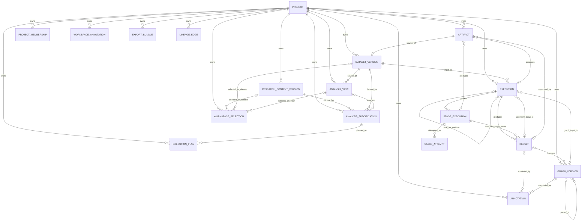

# 21 論理データ設計

- 文書状態: `APPROVED`
- 文書種別: 現行論理データモデルのeffective snapshot
- 上位文書: `10_requirements_definition.md`
- 下位文書: `22_product_basic_design.md`, `23_api_interface_design.md`, `30_detailed_design.md`
- 実装照合対象（non-normative）: `src/ariadne/product/domain/`, `src/ariadne/product/persistence/`

> 本書はAriadneの現行論理データモデルを自己完結的に定義する正本である。
> 過去Enhancementの差分資料、DB migration履歴、source codeを参照しなくても、Entity、Cardinality、状態、非Entity model、整合性制約を理解できることを要求する。
> source code / DB schemaは本書への適合確認対象であり、本書の代替ではない。

## 1. 設計方針

### 1.1 設計目的

本書は、Research Topic、Research Context、Dataset、Analysis View、三つのAnalysis Family、Workflow、Result、ArtifactおよびLineageを、実装技術から独立した論理Entity / Value / Projectionとして定義する。

論理Entity、Domain Entity、DB Table、API Resource、UI画面は一対一である必要はない。ただし、正本のidentity、version、状態、参照、cardinality、不変条件は各層で意味的に一致しなければならない。

### 1.2 基本原則

1. 主要な分析Resourceは一つのProject境界に所属する。
2. Dataset Version、FIXED済みResearch Context / Analysis View / Analysis Specification、Execution Plan、Result、Artifact等、再現性に関与するResourceは上書きしない。
3. 実行条件は参照IDだけでなくcanonical snapshot / hashを保持し、後から同一条件を検証できるようにする。
4. Analysis Family固有payloadは共通Envelopeとversioned schemaへ分離する。
5. Lineageは表示時に推測せず、Resource生成・Command受付時に明示保存する。
6. JSONへ外部library object、NaN、Infinity、非決定的表現を保存しない。
7. ResultとArtifactを分離し、科学的意味と物理生成物を混同しない。
8. Technical execution statusとscientific / analytical statusを分離する。
9. `AnalysisFamily`は既存domain discriminatorを再利用し、duplicate Family discriminatorを作らない。
10. Navigation Stageとruntime StageType / StageExecutionを別概念として扱う。
11. `NavigationStageDescriptor`、Current Family、Current Navigation Stageはpersistent Entityへ昇格させない。
12. Analysis Contextは既存Project-scoped selection/resourceの論理projectionとして扱い、専用persistent aggregateを新設しない。

### 1.3 論理モデルの構成要素

本書では、persistentなbusiness authorityを持つ`Domain Resource`と、Domain Resourceではないapplication / runtime / navigation上の論理概念を明確に区別する。

この分類は、UIやworkflow上に概念が存在することだけを理由にpersistent Entityを追加したり、navigation metadataをruntime lifecycleへ混入させたりすることを防ぐための設計境界である。

#### 1.3.1 Domain Resource

Domain Resourceは、独立したidentity、ownership、lifecycle、mutabilityまたは監査上のauthorityを持つ論理Resourceである。論理Resource、Domain Entity、DB Table、API Resource、UI画面は一対一である必要はない。

| Resource | Mutability | Primary ID | 責務 |
| --- | --- | --- | --- |
| Project | Mutable aggregate | `project_id` | Research TopicとProject境界 |
| Artifact | Immutable metadata | `artifact_id` | 物理生成物descriptor |
| DatasetVersion | Immutable | `dataset_version_id` | 入力Dataset version |
| ResearchContextVersion | DRAFT -> FIXED | `research_context_version_id` | 問題・問い・仮説・意思決定文脈 |
| AnalysisView | DRAFT -> FIXED | `analysis_view_id` | Datasetに対する分析用View |
| AnalysisSpecification | DRAFT -> FIXED | `analysis_specification_id` | Family固有分析仕様 |
| ExecutionPlan | Immutable | `execution_plan_id` | runtime Stage DAG |
| Execution | Stateful | `execution_id` | canonical execution |
| StageExecution | Stateful | `stage_execution_id` | runtime Stage実行状態 |
| StageAttempt | Append-only | `stage_attempt_id` | Stage retry / attempt履歴 |
| Result | Immutable | `result_id` | 科学的・分析的Result |
| GraphVersion | DRAFT -> FIXED | `graph_version_id` | causal graph version |
| Annotation | Mutable | `annotation_id` | Result / Graphへの注釈 |
| ProjectMembership | Mutable | `membership_id` | Project権限 |
| WorkspaceSelection | Mutable per user | `workspace_selection_id` | Analysis Context selection |
| WorkspaceAnnotation | Mutable with revision history | `annotation_id` | Project-scoped判断 / 注釈 |
| ExportBundle | Immutable | `export_id` | Result export |
| LineageEdge | Append-only | `lineage_edge_id` | semantic lineage relation |

Compatibility / transition用の`FamilyExecution / FamilyStageExecution / FamilyResult / FamilyArtifact`はhistorical read modelとして残り得るが、新規Product lifecycle writeの正本Domain Resourceではない。`IdempotencyRecord`はtechnical persistence recordでありbusiness Domain Resourceではない。

#### 1.3.2 Domain Resource外の論理概念

次の概念はAriadneの論理モデル上重要であるが、それ自体を独立persistent Domain Resourceとして扱わない。

| Concept | 種別 | 永続化 | 責務 |
| --- | --- | --- | --- |
| `AnalysisFamily` | Enum / domain discriminator | Resourceとしては不要 | Exploratory / Causal / Predictiveの分析Family識別 |
| Analysis Context | application-level logical projection | 専用aggregateを永続化しない | Current Project / Research Context / Dataset Version / Analysis Viewを一つの分析文脈として投影 |
| `StageType` | runtime value object | ExecutionPlan / StageExecutionの構成要素 | runtime Stage種別をnamespace / name / versionで識別 |
| `StageDefinition` | runtime value object | ExecutionPlan内 | runtime Stageのinput / output / parameter / resource policyを定義 |
| `StageBinding` | runtime value object | ExecutionPlan内 | runtime Stage間dependency / bindingを定義 |
| `NavigationStageDescriptor` | application metadata / immutable value | DB永続化しない | Family-local Stage ID、label、order等 |
| `FamilyNavigationDescriptor` | application metadata / immutable value | DB永続化しない | FamilyとStage catalog、default Stageの組 |
| Current Family | navigation state | DB永続化しない | 現在のanalysis Family context |
| Current Navigation Stage | navigation state | DB永続化しない | 現在のFamily-local work / view context |
| route representation | serialized navigation state | URL / browser history | Project / Family / Stageのdeep-link表現 |
| renderer binding | presentation mapping | code / config | `(family, stage)`から既存surface / use caseへのbinding |
| Operation Availability View | query / projection model | 専用Entityを原則作らない | 現在のContext / Resource状態からoperation可否を導出 |

詳細な非Entity modelは`## 4. 非Entityのデータモデル`で定義する。

#### 1.3.3 論理概念の分類原則

- 新規概念は、まず既存Domain Resourceの属性・関係・projectionとして自然に表現可能か確認する。
- 独立identity / lifecycle / mutability / audit authorityを持つ場合のみ、新規Domain Resource候補とする。
- enum / value object / descriptor / navigation state / query projectionを人工的にDomain Resourceへ昇格させない。
- runtime Entity / valueとnavigation metadataを同一型へ統合しない。
- UI上の分類・画面分割だけを理由にDB schema、persistent aggregate、cardinalityを変更しない。
- Analysis Contextは既存Project-scoped Resourceとselectionのprojectionであり、専用persistent aggregateを新設しない。
- Navigation StageはAnalysis Specificationのsemantic inputでもruntime lifecycle fieldでもないため、`AnalysisSpecification`、`ExecutionPlan`、`Execution`、`StageExecution`へnavigation fieldを追加しない。

### 1.4 型と制約の表記

- データ型は論理型を基本とし、必要に応じて現行の長さ制約を併記する。物理DB製品固有の実装差は詳細設計へ写像する。
- `PK`および`NOT NULL`欄の`1`は制約あり、空欄は制約なしを表す。
- `FK`欄には論理参照先Entityと属性を記載する。物理DBでFKを持たないpolymorphic/logical referenceは「その他制約」で明示する。
- Project配下Entity間の参照では、参照先が同一Projectに属することをDB制約またはApplication validationで保証する。
- current sourceとの照合で物理FKが未設定であっても、論理設計上reference authorityが明確な場合は論理FKとして記載し、物理実装差を注記する。

## 2. Entity関係

本章は`1.3.1 Domain Resource`として分類したpersistent Entity間のownership / reference / cardinality / deletion semanticsを定義する。`1.3.2 Domain Resource外の論理概念`の関係はpersistent ERへ混在させず、`## 4. 非Entityのデータモデル`で定義する。

### 2.1 ER図



`WorkspaceAnnotation.target_id`、`LineageEdge.source_id / target_id`、`ExportBundle.result_ids_json`はpolymorphic / collection referenceであるため、ER図では固定FK edgeとして展開しない。

### 2.2 Cardinality一覧

| 関係 | Cardinality | 説明 |
| --- | --- | --- |
| Project - Artifact | 1 : 0..N | Projectは複数Artifactを所有する |
| Project - DatasetVersion | 1 : 0..N | Projectは複数DatasetVersionを所有する |
| Project - ResearchContextVersion | 1 : 0..N | Projectは複数ResearchContextVersionを所有する |
| Project - AnalysisView | 1 : 0..N | Projectは複数AnalysisViewを所有する |
| Project - AnalysisSpecification | 1 : 0..N | Projectは複数AnalysisSpecificationを所有する |
| Project - ExecutionPlan | 1 : 0..N | Projectは複数ExecutionPlanを所有する |
| Project - Execution | 1 : 0..N | Projectは複数Executionを所有する |
| Project - GraphVersion | 1 : 0..N | Projectは複数GraphVersionを所有する |
| Project - Annotation | 1 : 0..N | Projectは複数Annotationを所有する |
| Project - ProjectMembership | 1 : 0..N | Projectは複数user roleを持つ |
| Project - WorkspaceSelection | 1 : 0..N | Projectはuserごとのselectionを持つ |
| Project - WorkspaceAnnotation | 1 : 0..N | Projectは複数WorkspaceAnnotationを持つ |
| Project - ExportBundle | 1 : 0..N | Projectは複数ExportBundleを持つ |
| Project - LineageEdge | 1 : 0..N | Projectは複数LineageEdgeを持つ |
| Artifact - DatasetVersion | 1 : 0..1 | DatasetVersionは1つのSOURCE Artifactを参照し、source Artifactは1つのDatasetVersionに対応する |
| DatasetVersion - AnalysisView | 1 : 0..N | 一つのDatasetVersionから複数AnalysisViewを作成できる |
| ResearchContextVersion - AnalysisSpecification | 1 : 0..N | Context Versionを複数Specificationが参照できる |
| DatasetVersion - AnalysisSpecification | 1 : 0..N | DatasetVersionを複数Specificationが参照できる |
| AnalysisView - AnalysisSpecification | 0..1 : 0..N | SpecificationはAnalysisViewを任意参照する |
| AnalysisSpecification - ExecutionPlan | 1 : 0..N | 同一Specificationからplanner/version違いのPlanを生成し得る |
| DatasetVersion - Execution | 1 : 0..N | DatasetVersionを複数Executionが使用できる |
| GraphVersion - Execution | 0..1 : 0..N | Operationに応じて入力Graphを使用する |
| Result - Execution | 0..1 : 0..N | Operationに応じて上流Resultを明示参照する |
| Execution - Execution | 0..1 : 0..N | rerun/revision Executionはbase Executionを任意参照する |
| Execution - StageExecution | 1 : 0..N | Executionはruntime StageExecutionを持つ |
| StageExecution - StageAttempt | 1 : 0..N | StageExecutionは複数attemptを持つ |
| Execution - Result | 1 : 0..N | Executionは複数Resultを生成できる |
| StageExecution - Result | 0..1 : 0..N | STAGE_RESULTは1つのStageExecutionへ所属する |
| Execution - Artifact | 0..1 : 0..N | EXECUTION_OUTPUT ArtifactはExecutionへ所属する |
| StageExecution - Artifact | 0..1 : 0..N | Artifactは生成Stageを任意に指示できる |
| Result - Artifact | 0..1 : 0..N | Artifactは対応Resultを任意参照できる |
| Result - GraphVersion | 0..1 : 0..N | GraphVersionはsource Resultを任意参照する |
| GraphVersion - GraphVersion | 0..1 : 0..N | 編集・派生GraphVersionは親GraphVersionを任意参照する |
| Result - Annotation | 0..1 : 0..N | AnnotationはResultを対象にできる |
| GraphVersion - Annotation | 0..1 : 0..N | AnnotationはGraphVersionを対象にできる |
| ResearchContextVersion - WorkspaceSelection | 0..1 : 0..N | user selectionがActive Research Contextを任意参照する |
| DatasetVersion - WorkspaceSelection | 0..1 : 0..N | user selectionがDatasetVersionを任意参照する |
| AnalysisView - WorkspaceSelection | 0..1 : 0..N | user selectionがAnalysisViewを任意参照する |

### 2.3 参照・削除方針

- Project、ResearchContextVersion、DatasetVersion、AnalysisView、AnalysisSpecification、ExecutionPlan、Execution、StageExecution、StageAttempt、Result、Artifact、GraphVersionおよびLineageEdgeは分析来歴・再現性の構成要素であるため、参照が存在する状態でのhard deleteを禁止する。
- Projectの利用停止は`ARCHIVED`で表現し、Project配下Resourceをcascade deleteしない。
- FK削除動作は原則`RESTRICT`とする。
- immutable / FIXED Resourceの内容変更は既存rowの更新ではなく新Version / 新Execution / 新Result等として表現する。
- Artifactの物理binary削除は、論理metadata・Lineageの保持要件とretention policyを満たし、参照がない場合にのみ許容する。Artifact metadataをLineageから先に破壊してはならない。
- `WorkspaceSelection`はmutable operational stateであり削除・再作成可能だが、選択対象Entityを削除する根拠にはならない。
- `Annotation` / `WorkspaceAnnotation`の変更履歴要件はそれぞれのmodelに従う。scientific decisionの監査性が必要な場合、過去意味を破壊するhard deleteは行わない。
- polymorphic reference（WorkspaceAnnotation / LineageEdge）はApplication validationでtarget existenceとProject境界を保証する。
- Compatibility read modelの保持・廃止はmigration policyに従うが、canonical Entityを参照している間は破壊的削除を行わない。

### 2.4 Domain Resource関係モデル

`2.1`〜`2.3`はpersistent Entity間の関係をER / cardinality / deletion policyとして厳密に定義する。本節は、それらを読者が俯瞰しやすいownership / reference modelとして再表現する。

#### 2.4.1 Ownership / lifecycleの俯瞰

```text
Project
├── Artifact
├── DatasetVersion
│   └── AnalysisView
├── ResearchContextVersion
├── AnalysisSpecification
│   └── ExecutionPlan
├── Execution
│   ├── StageExecution
│   │   └── StageAttempt
│   ├── Result
│   └── Artifact (EXECUTION_OUTPUT)
├── GraphVersion
├── Annotation
├── ProjectMembership
├── WorkspaceSelection
├── WorkspaceAnnotation
├── ExportBundle
└── LineageEdge
```

このtreeはownership / lifecycle上の主要な包含関係を示すための論理俯瞰であり、すべてのFKをtree edgeとして表現するものではない。cross-referenceは次節および`2.1 ER図`を正本とする。

#### 2.4.2 主要参照

```text
DatasetVersion.source_artifact_id -> Artifact(SOURCE)
AnalysisView -> DatasetVersion
AnalysisSpecification -> ResearchContextVersion
AnalysisSpecification -> DatasetVersion
AnalysisSpecification -> optional AnalysisView
ExecutionPlan.analysis_specification_id -> AnalysisSpecification identity
Execution -> DatasetVersion
Execution -> optional GraphVersion / upstream Result
Execution -> optional base Execution
StageExecution -> Execution
StageAttempt -> StageExecution
Result -> Execution
STAGE_RESULT -> StageExecution
Artifact(EXECUTION_OUTPUT) -> Execution; optional StageExecution / Result
GraphVersion -> optional Result / parent GraphVersion
Annotation -> exactly one of Result / GraphVersion
WorkspaceSelection -> optional ResearchContextVersion / DatasetVersion / AnalysisView
WorkspaceAnnotation -> Project-scoped target Resource
ExportBundle -> Result collection
LineageEdge -> same-Project source / target
```

#### 2.4.3 Current implementation / canonical authority boundary

- Canonical `Execution`に`execution_plan_id`を独立FK / logical attributeとして必須化しない。ExecutionPlan identityを保持するapplication pathでは`analysis_spec_json`内metadataとして扱い得るが、canonical Execution FKと同一視しない。
- `FamilyExecution / FamilyStageExecution / FamilyResult / FamilyArtifact`はhistorical / compatibility read modelであり、新規canonical lifecycle write authorityではない。
- `WorkspaceAnnotation.target_id`、`LineageEdge.source_id / target_id`、`ExportBundle.result_ids_json`はpolymorphic / collection referenceであり、固定FKだけで全関係を表現しない。Application validationでtarget existenceとProject boundaryを保証する。
- `AnalysisFamily`はDomain Resourceではないが、`AnalysisSpecification.analysis_family`、`ExecutionPlan.analysis_family`、`Execution.analysis_family`の共通discriminatorとして現れる。duplicate Family discriminatorを追加しない。
- `FamilyNavigationDescriptor -> NavigationStageDescriptor -> renderer / use-case binding`の関係はapplication metadata relationであり、persistent ER relationへ変換しない。詳細は`4.3 Navigation metadata model`を正本とする。


## 3. Entity定義

### 3.1 Project

定義: 1つの分析テーマと、そのResearch Context、Dataset、Analysis、Result、Lineageの責務境界。

| 属性 | PK | FK | データ型 | NOT NULL | その他制約 | 説明 |
| --- | --- | --- | --- | --- | --- | --- |
| `project_id` | 1 |  | UUID / VARCHAR(36) | 1 | 不変 | Project識別子 |
| `name` |  |  | VARCHAR(200) | 1 |  | 表示名 |
| `topic` |  |  | TEXT |  |  | Research Topic |
| `objective` |  |  | TEXT |  |  | 分析・意思決定目的 |
| `memo` |  |  | TEXT |  |  | 補足 |
| `status` |  |  | VARCHAR(20) | 1 | `ACTIVE` / `ARCHIVED` | Project状態 |
| `created_at` |  |  | TIMESTAMP WITH TIME ZONE | 1 |  | 作成日時 |
| `updated_at` |  |  | TIMESTAMP WITH TIME ZONE | 1 |  | 更新日時 |

設計判断・制約:
- Projectの利用停止はhard deleteではなく`ACTIVE -> ARCHIVED`で表現する。
- `ARCHIVED` Projectでは新規writeを禁止し、既存ResourceとLineageをread-onlyで保持する。
- Research Contextのversioned contentはProject本体へ埋め込まず`ResearchContextVersion`で管理する。

### 3.2 Artifact

定義: Dataset sourceまたはExecutionが生成した物理生成物について、所在、内容hash、media type、所有関係を管理するdescriptor。

| 属性 | PK | FK | データ型 | NOT NULL | その他制約 | 説明 |
| --- | --- | --- | --- | --- | --- | --- |
| `artifact_id` | 1 |  | UUID / VARCHAR(36) | 1 | 不変 | Artifact識別子 |
| `project_id` |  | `Project.project_id` | UUID / VARCHAR(36) | 1 | INDEX, `ON DELETE RESTRICT` | 所属Project |
| `execution_id` |  | `Execution.execution_id` | UUID / VARCHAR(36) |  | INDEX, `ON DELETE RESTRICT` | 生成元Execution。SOURCE ArtifactではNULL |
| `stage_execution_id` |  | `StageExecution.stage_execution_id` | UUID / VARCHAR(36) |  | INDEX, 論理参照 | 生成元StageExecution。物理FKは必須としない |
| `result_id` |  | `Result.result_id` | UUID / VARCHAR(36) |  | INDEX, `ON DELETE RESTRICT` | 対応Result |
| `artifact_scope` |  |  | VARCHAR(30) | 1 | `SOURCE` / `EXECUTION_OUTPUT` | 所有scope |
| `artifact_type` |  |  | VARCHAR(40) | 1 | 許容type allowlist | Artifact種別 |
| `object_key` |  |  | TEXT | 1 | UNIQUE | Artifact Store上の論理所在 |
| `content_hash` |  |  | VARCHAR(128) | 1 |  | 内容hash |
| `media_type` |  |  | VARCHAR(100) | 1 |  | MIME type |
| `size_bytes` |  |  | BIGINT | 1 | `>= 0` | byte数 |
| `metadata_json` |  |  | JSON | 1 | default `{}` | 補足metadata |
| `created_at` |  |  | TIMESTAMP WITH TIME ZONE | 1 |  | 作成日時 |

設計判断・制約:
- `SOURCE`では`execution_id / stage_execution_id / result_id`を持たない。
- `EXECUTION_OUTPUT`では`execution_id`を必須とする。
- APIはlocal absolute pathを正本識別子として返さない。


現行`ArtifactType`の許容値:

```text
DATASET_FILE
GRAPH_JSON
GRAPH_IMAGE
EFFECT_TABLE
DIAGNOSTICS_TABLE
MANIFEST
CONFIG_SNAPSHOT
LOG
SCIENTIFIC_RESULT_JSON
SCIENTIFIC_REPORT
CHART_SPECIFICATION
PARTITION_INDEX
FITTED_PREPROCESSOR
FITTED_MODEL
PREDICTION
PREDICTIVE_EXPLANATION
MODEL_CARD
```

Canonical Artifactに`family`、汎用`schema_version`、`storage_uri`、`deleted_at`、`deletion_reason`を追加しない。historical `FamilyArtifact`のfieldとcanonical Artifactを混同しない。

### 3.3 DatasetVersion

定義: Executionで参照する入力Datasetの不変Version。Dataset系列は`dataset_key`で表現する。

| 属性 | PK | FK | データ型 | NOT NULL | その他制約 | 説明 |
| --- | --- | --- | --- | --- | --- | --- |
| `dataset_version_id` | 1 |  | UUID / VARCHAR(36) | 1 | 不変 | Dataset Version識別子 |
| `project_id` |  | `Project.project_id` | UUID / VARCHAR(36) | 1 | INDEX, `ON DELETE RESTRICT` | 所属Project |
| `source_artifact_id` |  | `Artifact.artifact_id` | UUID / VARCHAR(36) | 1 | UNIQUE, `ON DELETE RESTRICT` | SOURCE Artifact |
| `dataset_key` |  |  | VARCHAR(100) | 1 | INDEX | Dataset系列key |
| `name` |  |  | VARCHAR(200) | 1 |  | 表示名 |
| `version_label` |  |  | VARCHAR(100) | 1 | UNIQUE(`project_id`,`dataset_key`,`version_label`) | Version表示label |
| `content_hash` |  |  | VARCHAR(128) | 1 | UNIQUE(`project_id`,`dataset_key`,`content_hash`) | Dataset内容hash |
| `schema_json` |  |  | JSON | 1 | default `{}` | column名とlogical type等 |
| `profile_summary_json` |  |  | JSON | 1 | default `{}` | profile summary |
| `row_count` |  |  | BIGINT | 1 | `>= 0` | 行数 |
| `column_count` |  |  | INTEGER | 1 | `>= 0` | 列数 |
| `source_note` |  |  | TEXT |  |  | 出所・補足 |
| `created_at` |  |  | TIMESTAMP WITH TIME ZONE | 1 |  | 登録日時 |

設計判断・制約:
- 登録後のDataset内容を上書きしない。変更は新しいDatasetVersionとする。
- `source_artifact_id`はSOURCE scopeのArtifactを参照しなければならない。

### 3.4 ResearchContextVersion

定義: 問題設定、Research Question、仮説、意思決定文脈をversioned resourceとして保持する。

| 属性 | PK | FK | データ型 | NOT NULL | その他制約 | 説明 |
| --- | --- | --- | --- | --- | --- | --- |
| `research_context_version_id` | 1 |  | UUID / VARCHAR(36) | 1 | 不変 | Research Context Version識別子 |
| `project_id` |  | `Project.project_id` | UUID / VARCHAR(36) | 1 | INDEX, `ON DELETE RESTRICT` | 所属Project |
| `context_key` |  |  | VARCHAR(100) | 1 | UNIQUE tuple構成要素 | Context系列key |
| `version_number` |  |  | INTEGER | 1 | `> 0`; UNIQUE(`project_id`,`context_key`,`version_number`) | version番号 |
| `status` |  |  | VARCHAR(20) | 1 | `DRAFT` / `FIXED` | 状態 |
| `schema_version` |  |  | VARCHAR(100) | 1 | default `research-context/1` | schema version |
| `problem_statement` |  |  | TEXT | 1 |  | 問題設定 |
| `research_questions_json` |  |  | JSON | 1 | 1件以上を要求 | Research Question |
| `significance` |  |  | TEXT |  |  | 重要性 |
| `hypotheses_json` |  |  | JSON | 1 | default `[]` | 仮説 |
| `decision_context_json` |  |  | JSON | 1 | default `{}` | 意思決定文脈 |
| `relations_json` |  |  | JSON | 1 | default `[]`; self-reference禁止 | 他ResearchContextVersionとのrelation |
| `canonical_hash` |  |  | VARCHAR(64) |  | FIXED時に生成 | canonical content hash |
| `created_by` |  |  | VARCHAR(200) | 1 |  | 作成者 |
| `created_at` |  |  | TIMESTAMP WITH TIME ZONE | 1 |  | 作成日時 |
| `fixed_at` |  |  | TIMESTAMP WITH TIME ZONE |  | FIXED時のみ | 固定日時 |

設計判断・制約:
- `FIXED`後のcontentを上書きしない。
- `relations_json`で許容するrelationは`REFINES / DERIVED_FROM / SUPERSEDES / RELATED_TO`とする。
- relation targetは同一Project内で解決する。

### 3.5 AnalysisView

定義: DatasetVersionに対するrow filter、column selection、derived column、missing-value policy等をversionedに保持する。

| 属性 | PK | FK | データ型 | NOT NULL | その他制約 | 説明 |
| --- | --- | --- | --- | --- | --- | --- |
| `analysis_view_id` | 1 |  | UUID / VARCHAR(36) | 1 | 不変 | Analysis View識別子 |
| `project_id` |  | `Project.project_id` | UUID / VARCHAR(36) | 1 | INDEX, `ON DELETE RESTRICT` | 所属Project |
| `source_dataset_version_id` |  | `DatasetVersion.dataset_version_id` | UUID / VARCHAR(36) | 1 | INDEX, `ON DELETE RESTRICT` | source Dataset Version |
| `view_key` |  |  | VARCHAR(100) | 1 | UNIQUE tuple構成要素 | View系列key |
| `version_number` |  |  | INTEGER | 1 | `> 0`; UNIQUE(`project_id`,`view_key`,`version_number`) | version番号 |
| `name` |  |  | VARCHAR(200) | 1 |  | 表示名 |
| `status` |  |  | VARCHAR(20) | 1 | `DRAFT` / `FIXED` | 状態 |
| `schema_version` |  |  | VARCHAR(100) | 1 | default `analysis-view/1` | schema version |
| `spec_json` |  |  | JSON | 1 |  | row/column/derived/filter/time/sampling specification |
| `content_hash` |  |  | VARCHAR(64) |  | FIXED時に生成 | canonical content hash |
| `manifest_json` |  |  | JSON | 1 | default `{}` | materialization/validation summary |
| `created_by` |  |  | VARCHAR(200) | 1 |  | 作成者 |
| `created_at` |  |  | TIMESTAMP WITH TIME ZONE | 1 |  | 作成日時 |
| `fixed_at` |  |  | TIMESTAMP WITH TIME ZONE |  | FIXED時のみ | 固定日時 |

設計判断・制約:
- `FIXED`後のspecを上書きしない。
- filter operator/valueはsource Dataset logical typeと互換でなければならない。
- Analysis Viewはsource Dataset Versionに対してのみ有効であり、別Dataset Versionへ暗黙再利用しない。

### 3.6 AnalysisSpecification

定義: Research Context、Dataset、任意のAnalysisViewと、Analysis Family固有の問い・方法・評価条件を結び付けるversioned specification。

| 属性 | PK | FK | データ型 | NOT NULL | その他制約 | 説明 |
| --- | --- | --- | --- | --- | --- | --- |
| `analysis_specification_id` | 1 |  | UUID / VARCHAR(36) | 1 | 不変 | Analysis Specification識別子 |
| `project_id` |  | `Project.project_id` | UUID / VARCHAR(36) | 1 | INDEX, `ON DELETE RESTRICT` | 所属Project |
| `specification_key` |  |  | VARCHAR(100) | 1 | UNIQUE tuple構成要素 | Specification系列key |
| `version_number` |  |  | INTEGER | 1 | `> 0`; UNIQUE(`project_id`,`specification_key`,`version_number`) | version番号 |
| `status` |  |  | VARCHAR(20) | 1 | `DRAFT` / `FIXED` | 状態 |
| `schema_version` |  |  | VARCHAR(100) | 1 | default `analysis-specification/1` | 共通Envelope schema |
| `analysis_family` |  |  | VARCHAR(20) | 1 | `EXPLORATORY / CAUSAL / PREDICTIVE` | Analysis Family discriminator |
| `research_context_version_id` |  | `ResearchContextVersion.research_context_version_id` | UUID / VARCHAR(36) | 1 | INDEX, `ON DELETE RESTRICT` | Research Context |
| `dataset_version_id` |  | `DatasetVersion.dataset_version_id` | UUID / VARCHAR(36) | 1 | INDEX, `ON DELETE RESTRICT` | Dataset Version |
| `analysis_view_id` |  | `AnalysisView.analysis_view_id` | UUID / VARCHAR(36) |  | INDEX, `ON DELETE RESTRICT` | 任意Analysis View |
| `analysis_mode` |  |  | VARCHAR(20) | 1 | `EXPLORATORY / CONFIRMATORY` | 分析mode |
| `family_spec_schema_version` |  |  | VARCHAR(100) | 1 |  | Family-specific schema version |
| `family_spec_json` |  |  | JSON | 1 |  | Family-specific specification |
| `revision_context_json` |  |  | JSON |  |  | revision rationale/context |
| `warnings_json` |  |  | JSON | 1 | default `[]` | scientific / reuse warning |
| `canonical_hash` |  |  | VARCHAR(64) |  | FIXED時に生成 | canonical content hash |
| `created_by` |  |  | VARCHAR(200) | 1 |  | 作成者 |
| `created_at` |  |  | TIMESTAMP WITH TIME ZONE | 1 |  | 作成日時 |
| `fixed_at` |  |  | TIMESTAMP WITH TIME ZONE |  | FIXED時のみ | 固定日時 |

設計判断・制約:
- `analysis_family`と`family_spec_schema_version / family_spec_json`のschemaは整合しなければならない。
- Research Context、Dataset Version、Analysis Viewはすべて同一Projectに属さなければならない。
- Navigation StageはAnalysisSpecificationのsemantic inputではないため属性として追加しない。

### 3.7 ExecutionPlan

定義: 固定されたAnalysisSpecificationからplannerが生成するruntime Stage DAGの不変plan。

| 属性 | PK | FK | データ型 | NOT NULL | その他制約 | 説明 |
| --- | --- | --- | --- | --- | --- | --- |
| `execution_plan_id` | 1 |  | UUID / VARCHAR(36) | 1 | 不変 | Execution Plan識別子 |
| `project_id` |  | `Project.project_id` | UUID / VARCHAR(36) | 1 | INDEX, `ON DELETE RESTRICT` | 所属Project |
| `analysis_specification_id` |  | `AnalysisSpecification.analysis_specification_id` | UUID / VARCHAR(100) | 1 | INDEX; logical FK | 入力Specification。物理FK有無に依存しない論理参照 |
| `analysis_family` |  |  | VARCHAR(20) | 1 | `EXPLORATORY / CAUSAL / PREDICTIVE` | Family |
| `plan_schema_version` |  |  | VARCHAR(100) | 1 |  | Plan schema version |
| `planner_id` |  |  | VARCHAR(100) | 1 |  | Planner識別子 |
| `planner_version` |  |  | VARCHAR(40) | 1 |  | Planner version |
| `stages_json` |  |  | JSON | 1 |  | StageDefinition一覧 |
| `dependencies_json` |  |  | JSON | 1 |  | Stage dependency/binding DAG |
| `plan_hash` |  |  | VARCHAR(64) | 1 | UNIQUE | canonical Plan hash |
| `created_at` |  |  | TIMESTAMP WITH TIME ZONE | 1 |  | 生成日時 |

設計判断・制約:
- ExecutionPlanは生成後に上書きしない。
- `analysis_family`は入力AnalysisSpecificationのFamilyと一致しなければならない。
- Navigation Stage / browser routeをExecutionPlanへ保存しない。

### 3.8 Execution

定義: 一つのAnalysis Operationを、固定されたinputとsnapshotで実行するcanonical execution。

| 属性 | PK | FK | データ型 | NOT NULL | その他制約 | 説明 |
| --- | --- | --- | --- | --- | --- | --- |
| `execution_id` | 1 |  | UUID / VARCHAR(36) | 1 | 不変 | Execution識別子 |
| `project_id` |  | `Project.project_id` | UUID / VARCHAR(36) | 1 | INDEX, `ON DELETE RESTRICT` | 所属Project |
| `analysis_family` |  |  | VARCHAR(20) | 1 | `CAUSAL / EXPLORATORY / PREDICTIVE` | Analysis Family |
| `dataset_version_id` |  | `DatasetVersion.dataset_version_id` | UUID / VARCHAR(36) | 1 | INDEX, `ON DELETE RESTRICT` | 入力Dataset Version |
| `input_graph_version_id` |  | `GraphVersion.graph_version_id` | UUID / VARCHAR(36) |  | INDEX, `ON DELETE RESTRICT` | 入力Graph Version |
| `input_result_id` |  | `Result.result_id` | UUID / VARCHAR(36) |  | INDEX, `ON DELETE RESTRICT` | 上流Result |
| `batch_key` |  |  | UUID / VARCHAR(36) | 1 | INDEX | batch / comparison単位 |
| `operation` |  |  | VARCHAR(20) | 1 | `DISCOVERY / IDENTIFICATION / ESTIMATION / REFUTATION / SENSITIVITY` | Operation |
| `objective_snapshot` |  |  | TEXT |  |  | 受付時objective snapshot |
| `rationale_snapshot` |  |  | TEXT |  |  | 受付時rationale snapshot |
| `analysis_spec_json` |  |  | JSON | 1 | canonical execution snapshot | 実行用Analysis Specification snapshot |
| `algorithm_or_estimator` |  |  | VARCHAR(100) | 1 |  | algorithm / estimator |
| `parameter_json` |  |  | JSON | 1 | default `{}` | parameter snapshot |
| `random_seed` |  |  | BIGINT |  |  | random seed |
| `code_version` |  |  | VARCHAR(200) | 1 |  | code version |
| `runtime_version_json` |  |  | JSON | 1 | default `{}` | runtime/library versions |
| `snapshot_hash` |  |  | VARCHAR(128) | 1 |  | canonical snapshot hash |
| `snapshot_schema_version` |  |  | VARCHAR(100) | 1 |  | snapshot schema version |
| `status` |  |  | VARCHAR(20) | 1 | `QUEUED / RUNNING / SUCCEEDED / FAILED / CANCELLED` | technical status |
| `retry_count` |  |  | INTEGER | 1 | default `0`, `>= 0` | retry回数 |
| `last_error_summary` |  |  | TEXT |  |  | 最終technical error |
| `requested_by` |  |  | VARCHAR(200) | 1 |  | 要求者 |
| `requested_at` |  |  | TIMESTAMP WITH TIME ZONE | 1 |  | 受付日時 |
| `started_at` |  |  | TIMESTAMP WITH TIME ZONE |  |  | 開始日時 |
| `finished_at` |  |  | TIMESTAMP WITH TIME ZONE |  |  | 終了日時 |
| `base_execution_id` |  | `Execution.execution_id` | UUID / VARCHAR(36) |  | INDEX, self reference | rerun/revision元Execution |
| `revision_kind` |  |  | VARCHAR(20) |  | NULL / `RERUN / REVISED` | revision種別 |
| `change_reason` |  |  | TEXT |  |  | 変更理由 |
| `lease_owner` |  |  | VARCHAR(200) |  | INDEX | worker lease owner |
| `lease_expires_at` |  |  | TIMESTAMP WITH TIME ZONE |  | INDEX | worker lease期限 |

設計判断・制約:
- Submit後のinput Dataset/Graph/Result、analysis snapshot、method、parameterを上書きしない。
- Operation別input制約は`6.4`で定義する。
- `base_execution_id`を使うrevisionも新しいExecution identityを持つ。
- worker token等の内部実装属性は論理Domain属性に含めない。


`runtime_version_json`は最低限、実際の実行環境を再構築するための次のmetadataを保持する。

```text
ariadne_code_version
python_version
platform_system
platform_release
machine
libraries
```

`libraries`には実際にregistered/used runner dependencyとして使用したscientific library versionを保存する。version取得だけを目的にfuture optional dependencyをimportしない。

Canonical `Execution`には`execution_plan_id`を独立属性として必須化しない。ExecutionPlan identityを保持するapplication pathでは`analysis_spec_json`内metadataとして扱い得るが、canonical Execution FKと同一視しない。

### 3.9 StageExecution

定義: ExecutionPlanで定義されたruntime Stageのcanonical実行状態。

| 属性 | PK | FK | データ型 | NOT NULL | その他制約 | 説明 |
| --- | --- | --- | --- | --- | --- | --- |
| `stage_execution_id` | 1 |  | UUID / VARCHAR(36) | 1 | 不変 | StageExecution識別子 |
| `execution_id` |  | `Execution.execution_id` | UUID / VARCHAR(36) | 1 | INDEX, `ON DELETE RESTRICT` | 親Execution |
| `stage_key` |  |  | VARCHAR(100) | 1 | UNIQUE(`execution_id`,`stage_key`) | Execution内Stage key |
| `stage_type_json` |  |  | JSON | 1 |  | runtime StageType |
| `ordinal` |  |  | INTEGER | 1 | `>= 0` | 表示/plan順序 |
| `dependencies_json` |  |  | JSON | 1 | default `[]` | 依存Stage key |
| `status` |  |  | VARCHAR(40) | 1 | StageExecution状態allowlist | technical stage status |
| `input_binding_json` |  |  | JSON | 1 | default `{}` | resolved input binding |
| `output_binding_json` |  |  | JSON | 1 | default `{}` | produced output binding |
| `last_error_json` |  |  | JSON |  |  | 最終error detail |
| `started_at` |  |  | TIMESTAMP WITH TIME ZONE |  |  | 開始日時 |
| `finished_at` |  |  | TIMESTAMP WITH TIME ZONE |  |  | 終了日時 |
| `created_at` |  |  | TIMESTAMP WITH TIME ZONE | 1 |  | 生成日時 |

設計判断・制約:
- `stage_execution_id`と`execution_id`のidentity pairは一意である。
- Navigation Stageとは別概念であり、Family-local UI Stage IDをruntime lifecycleへ流用しない。

### 3.10 StageAttempt

定義: StageExecutionに対するappend-only retry/attempt history。

| 属性 | PK | FK | データ型 | NOT NULL | その他制約 | 説明 |
| --- | --- | --- | --- | --- | --- | --- |
| `stage_attempt_id` | 1 |  | UUID / VARCHAR(36) | 1 | 不変 | StageAttempt識別子 |
| `stage_execution_id` |  | `StageExecution.stage_execution_id` | UUID / VARCHAR(36) | 1 | INDEX, `ON DELETE RESTRICT` | 対象StageExecution |
| `attempt_number` |  |  | INTEGER | 1 | `> 0`; UNIQUE(`stage_execution_id`,`attempt_number`) | attempt連番 |
| `worker_id` |  |  | VARCHAR(200) | 1 |  | worker識別子 |
| `started_at` |  |  | TIMESTAMP WITH TIME ZONE | 1 |  | 開始日時 |
| `finished_at` |  |  | TIMESTAMP WITH TIME ZONE |  |  | 終了日時 |
| `error_json` |  |  | JSON |  |  | 失敗detail |
| `effective_random_seed` |  |  | INTEGER |  |  | 実際に使用したseed |

設計判断・制約:
- StageAttemptはappend-onlyとし、過去attemptを上書きしない。

### 3.11 Result

定義: ExecutionまたはStageExecutionから生成され、分析判断・比較・Lineageの正本となる論理的科学結果。

| 属性 | PK | FK | データ型 | NOT NULL | その他制約 | 説明 |
| --- | --- | --- | --- | --- | --- | --- |
| `result_id` | 1 |  | UUID / VARCHAR(36) | 1 | 不変 | Result識別子 |
| `execution_id` |  | `Execution.execution_id` | UUID / VARCHAR(36) | 1 | INDEX, `ON DELETE RESTRICT` | 生成元Execution |
| `result_level` |  |  | VARCHAR(30) | 1 | `EXECUTION_RESULT / STAGE_RESULT` | ownership level |
| `stage_execution_id` |  | `StageExecution.stage_execution_id` | UUID / VARCHAR(36) |  | INDEX, 論理参照 | STAGE_RESULTの生成Stage。物理FKは必須としない |
| `result_type` |  |  | VARCHAR(40) | 1 | Result Type allowlist | Result種別 |
| `scientific_status` |  |  | VARCHAR(40) | 1 | Result Type別status matrix | 科学的評価状態 |
| `summary_json` |  |  | JSON | 1 | default `{}` | 比較表示用summary |
| `payload_json` |  |  | JSON | 1 | default `{}` | 構造化Result本体 |
| `diagnostics_json` |  |  | JSON | 1 | default `{}` | 診断情報 |
| `warning_json` |  |  | JSON | 1 | default `[]` | warning一覧 |
| `created_at` |  |  | TIMESTAMP WITH TIME ZONE | 1 |  | 生成日時 |

設計判断・制約:
- `EXECUTION_RESULT`では`stage_execution_id = NULL`、`STAGE_RESULT`では`stage_execution_id != NULL`とする。
- technical Execution statusとscientific Result statusを分離する。
- `result_type`と`scientific_status`の許容組合せは`6.6`で定義する。


Family別Result Type:

| Family | Result Type |
| --- | --- |
| EXPLORATORY | `DATA_PROFILE_RESULT`, `DISTRIBUTION_RESULT`, `ASSOCIATION_RESULT`, `GROUP_SUMMARY_RESULT`, `CHART_RESULT` |
| CAUSAL | `DISCOVERY_GRAPH_RESULT`, `IDENTIFICATION_RESULT`, `DATA_ELIGIBILITY_RESULT`, `TREATMENT_EFFECT_RESULT`, `DIAGNOSTICS_RESULT`, `REFUTATION_RESULT`, `SENSITIVITY_RESULT` |
| PREDICTIVE | `SPLIT_RESULT`, `TRAINING_RESULT`, `EVALUATION_RESULT`, `ERROR_ANALYSIS_RESULT`, `PREDICTIVE_EXPLANATION_RESULT`, `MODEL_CARD_RESULT` |

Result semantic levelはExecution-levelまたはStage-levelであり、別のResult architectureではない。physical storage locator / object key / URIはResult identityではない。

### 3.12 GraphVersion

定義: Causal Graphの構造、origin、provenanceをversionedに保持する。

| 属性 | PK | FK | データ型 | NOT NULL | その他制約 | 説明 |
| --- | --- | --- | --- | --- | --- | --- |
| `graph_version_id` | 1 |  | UUID / VARCHAR(36) | 1 | 不変 | GraphVersion識別子 |
| `project_id` |  | `Project.project_id` | UUID / VARCHAR(36) | 1 | INDEX, `ON DELETE RESTRICT` | 所属Project |
| `source_result_id` |  | `Result.result_id` | UUID / VARCHAR(36) |  | INDEX, `ON DELETE RESTRICT` | 発見等のsource Result |
| `parent_graph_version_id` |  | `GraphVersion.graph_version_id` | UUID / VARCHAR(36) |  | INDEX, `ON DELETE RESTRICT` | 編集/派生元GraphVersion |
| `designated_outcome_node` |  |  | VARCHAR(200) |  | INDEX | designated outcome |
| `name` |  |  | VARCHAR(200) | 1 |  | 表示名 |
| `graph_type` |  |  | VARCHAR(40) | 1 | `DAG / CPDAG / PAG` | Graph type |
| `graph_origin` |  |  | VARCHAR(40) | 1 | `DISCOVERED / CONSTRAINT_ADJUSTED / USER_DEFINED / IMPORTED / USER_EDITED` | 由来 |
| `provenance_json` |  |  | JSON | 1 | default `{}` | provenance metadata |
| `graph_json` |  |  | JSON | 1 | canonical graph structure | node/edge本体 |
| `content_hash` |  |  | VARCHAR(128) | 1 |  | 内容hash |
| `edit_rationale` |  |  | TEXT |  |  | 編集理由 |
| `status` |  |  | VARCHAR(20) | 1 | `DRAFT / FIXED` | 状態 |
| `created_by` |  |  | VARCHAR(200) | 1 |  | 作成者 |
| `created_at` |  |  | TIMESTAMP WITH TIME ZONE | 1 |  | 作成日時 |

設計判断・制約:
- `FIXED` GraphVersionを上書きしない。
- `graph_origin`と`source_result_id / parent_graph_version_id`の組合せを制約する。
- 親GraphVersion参照によりGraphVersion lineageを明示する。

### 3.13 Annotation

定義: ResultまたはGraphVersionに対するstatement、rationale、assumption、limitationを保持する。

| 属性 | PK | FK | データ型 | NOT NULL | その他制約 | 説明 |
| --- | --- | --- | --- | --- | --- | --- |
| `annotation_id` | 1 |  | UUID / VARCHAR(36) | 1 | 不変 | Annotation識別子 |
| `project_id` |  | `Project.project_id` | UUID / VARCHAR(36) | 1 | INDEX, `ON DELETE RESTRICT` | 所属Project |
| `target_result_id` |  | `Result.result_id` | UUID / VARCHAR(36) |  | INDEX, `ON DELETE RESTRICT` | 対象Result |
| `target_graph_version_id` |  | `GraphVersion.graph_version_id` | UUID / VARCHAR(36) |  | INDEX, `ON DELETE RESTRICT` | 対象GraphVersion |
| `statement` |  |  | TEXT | 1 |  | statement |
| `rationale` |  |  | TEXT |  |  | rationale |
| `assumptions_json` |  |  | JSON | 1 | default `[]` | assumptions |
| `limitations_json` |  |  | JSON | 1 | default `[]` | limitations |
| `created_by` |  |  | VARCHAR(200) | 1 |  | 作成者 |
| `created_at` |  |  | TIMESTAMP WITH TIME ZONE | 1 |  | 作成日時 |
| `updated_at` |  |  | TIMESTAMP WITH TIME ZONE | 1 |  | 更新日時 |

設計判断・制約:
- `target_result_id`と`target_graph_version_id`は排他的XORとし、必ずどちらか一方だけを指定する。
- targetは同一Projectに属さなければならない。

### 3.14 ProjectMembership

定義: Projectに対するuser roleを保持する。

| 属性 | PK | FK | データ型 | NOT NULL | その他制約 | 説明 |
| --- | --- | --- | --- | --- | --- | --- |
| `membership_id` | 1 |  | UUID / VARCHAR(36) | 1 | 不変 | Membership識別子 |
| `project_id` |  | `Project.project_id` | UUID / VARCHAR(36) | 1 | INDEX, `ON DELETE RESTRICT` | 所属Project |
| `user_id` |  |  | VARCHAR(200) | 1 | UNIQUE(`project_id`,`user_id`) | user識別子 |
| `role` |  |  | VARCHAR(20) | 1 | `OWNER / EDITOR / VIEWER` | Project role |
| `created_at` |  |  | TIMESTAMP WITH TIME ZONE | 1 |  | 作成日時 |
### 3.15 WorkspaceSelection

定義: userごとのProject-scopedなResearch Context / Dataset Version / Analysis View selection stateを保持する。

| 属性 | PK | FK | データ型 | NOT NULL | その他制約 | 説明 |
| --- | --- | --- | --- | --- | --- | --- |
| `workspace_selection_id` | 1 |  | UUID / VARCHAR(36) | 1 | 不変 | WorkspaceSelection識別子 |
| `project_id` |  | `Project.project_id` | UUID / VARCHAR(36) | 1 | INDEX, `ON DELETE RESTRICT` | 所属Project |
| `user_id` |  |  | VARCHAR(200) | 1 | UNIQUE(`project_id`,`user_id`) | user識別子 |
| `research_context_version_id` |  | `ResearchContextVersion.research_context_version_id` | UUID / VARCHAR(36) |  | `ON DELETE RESTRICT` | Active Research Context selection |
| `dataset_version_id` |  | `DatasetVersion.dataset_version_id` | UUID / VARCHAR(36) |  | `ON DELETE RESTRICT` | Dataset Version selection |
| `analysis_view_id` |  | `AnalysisView.analysis_view_id` | UUID / VARCHAR(36) |  | `ON DELETE RESTRICT` | Analysis View selection |
| `unsaved_draft` |  |  | BOOLEAN | 1 | default `false` | 未保存draft存在flag |
| `updated_at` |  |  | TIMESTAMP WITH TIME ZONE | 1 |  | 最終更新日時 |

設計判断・制約:
- selection targetはすべて`project_id`と同一Projectに属さなければならない。
- Analysis Viewはselected Dataset Versionと互換でなければならない。
- Dataset Version切替時にAnalysis Viewが非互換ならAnalysis View selectionを解除する。

### 3.16 WorkspaceAnnotation

定義: Project-scoped resourceに対する選択・判断・next actionを含むannotation。

| 属性 | PK | FK | データ型 | NOT NULL | その他制約 | 説明 |
| --- | --- | --- | --- | --- | --- | --- |
| `annotation_id` | 1 |  | UUID / VARCHAR(36) | 1 | 不変 | WorkspaceAnnotation識別子 |
| `project_id` |  | `Project.project_id` | UUID / VARCHAR(36) | 1 | INDEX, `ON DELETE RESTRICT` | 所属Project |
| `target_type` |  |  | VARCHAR(100) | 1 | target type allowlist | 対象Resource type |
| `target_id` |  |  | VARCHAR(100) | 1 | INDEX, polymorphic logical reference | 対象Resource ID |
| `statement` |  |  | TEXT | 1 |  | statement |
| `rationale` |  |  | TEXT |  |  | rationale |
| `assumptions_json` |  |  | JSON | 1 | default `[]` | assumptions |
| `limitations_json` |  |  | JSON | 1 | default `[]` | limitations |
| `decision` |  |  | VARCHAR(20) |  | NULL / `SELECTED / REJECTED / DEFERRED` | 判断 |
| `next_actions_json` |  |  | JSON | 1 | default `[]` | next action |
| `revision_history_json` |  |  | JSON | 1 | default `[]` | revision history |
| `created_by` |  |  | VARCHAR(200) | 1 |  | 作成者 |
| `created_at` |  |  | TIMESTAMP WITH TIME ZONE | 1 |  | 作成日時 |
| `updated_at` |  |  | TIMESTAMP WITH TIME ZONE | 1 |  | 更新日時 |

設計判断・制約:
- `target_type`は`Project / ResearchContextVersion / AnalysisView / AnalysisSpecification / Execution / Result / GraphVersion`に限定する。
- `target_id`はpolymorphic logical referenceであり、target_typeと組にして解決する。

### 3.17 ExportBundle

定義: 複数Resultを再配布・共有可能なmanifest/binaryとして固定したexport。

| 属性 | PK | FK | データ型 | NOT NULL | その他制約 | 説明 |
| --- | --- | --- | --- | --- | --- | --- |
| `export_id` | 1 |  | UUID / VARCHAR(36) | 1 | 不変 | Export識別子 |
| `project_id` |  | `Project.project_id` | UUID / VARCHAR(36) | 1 | INDEX, `ON DELETE RESTRICT` | 所属Project |
| `schema_version` |  |  | VARCHAR(100) | 1 | default `ariadne-export-manifest/1` | manifest schema |
| `result_ids_json` |  |  | JSON | 1 | 同一Project Resultのみ | export対象Result ID一覧 |
| `object_key` |  |  | TEXT | 1 | UNIQUE | export object所在 |
| `content_hash` |  |  | VARCHAR(64) | 1 |  | 内容hash |
| `media_type` |  |  | VARCHAR(100) | 1 |  | MIME type |
| `size_bytes` |  |  | BIGINT | 1 | `>= 0` | byte数 |
| `manifest_summary_json` |  |  | JSON | 1 |  | manifest summary |
| `created_by` |  |  | VARCHAR(200) | 1 |  | 作成者 |
| `created_at` |  |  | TIMESTAMP WITH TIME ZONE | 1 |  | 作成日時 |

設計判断・制約:
- ExportBundleは生成後に上書きしない。
- `result_ids_json`の各Resultは同一Projectに属さなければならない。

### 3.18 LineageEdge

定義: Resource間のsemantic relationを明示的・append-onlyに保持するcanonical lineage edge。

| 属性 | PK | FK | データ型 | NOT NULL | その他制約 | 説明 |
| --- | --- | --- | --- | --- | --- | --- |
| `lineage_edge_id` | 1 |  | UUID / VARCHAR(36) | 1 | 不変 | LineageEdge識別子 |
| `project_id` |  | `Project.project_id` | UUID / VARCHAR(36) | 1 | INDEX, `ON DELETE RESTRICT` | 所属Project |
| `source_type` |  |  | VARCHAR(100) | 1 | polymorphic source type | source Resource type |
| `source_id` |  |  | VARCHAR(100) | 1 | polymorphic logical reference | source Resource ID |
| `relation_type` |  |  | VARCHAR(100) | 1 | relation allowlist / authority | semantic relation |
| `target_type` |  |  | VARCHAR(100) | 1 | polymorphic target type | target Resource type |
| `target_id` |  |  | VARCHAR(100) | 1 | polymorphic logical reference | target Resource ID |
| `evidence_json` |  |  | JSON | 1 | default `{}` | relation evidence |
| `created_by` |  |  | VARCHAR(200) | 1 |  | 作成者 |
| `created_at` |  |  | TIMESTAMP WITH TIME ZONE | 1 |  | 作成日時 |

設計判断・制約:
- (`source_type`,`source_id`,`relation_type`,`target_type`,`target_id`)を一意とする。
- source/targetは同一Project境界内で解決する。
- LineageEdgeをUI表示時の推測で生成せず、Command受付・Result/Resource生成時に明示保存する。


## 4. 非Entityのデータモデル

本章は独立identity/lifecycleを持たないvalue object、projection、query model、navigation metadata、embedded schemaを定義する。これらをUI上に存在するという理由だけでpersistent Entityへ昇格させない。

### 4.1 AnalysisFamily

`AnalysisFamily`はEntityではなくdomain discriminatorであり、許容値は次の3つとする。

- `EXPLORATORY`
- `CAUSAL`
- `PREDICTIVE`

この値は`AnalysisSpecification.analysis_family`、`ExecutionPlan.analysis_family`、`Execution.analysis_family`で共通利用する。同義のduplicate enum/fieldを増設しない。

### 4.2 Analysis Context

Analysis Contextは新しいpersistent aggregateではなく、current routeとProject-scoped selection/resourceの論理projectionである。

```text
Analysis Context
├─ Current Project
│  └─ canonical Analysis route.project_id
├─ Active Research Context
│  └─ WorkspaceSelection.research_context_version_id
├─ Dataset Version
│  └─ WorkspaceSelection.dataset_version_id
└─ Analysis View
   └─ WorkspaceSelection.analysis_view_id
```

| Element | Authority | Persistence |
| --- | --- | --- |
| Current Project | canonical Analysis route `project_id` | 専用field/resourceを追加しない |
| Active Research Context | `ResearchContextVersion` + `WorkspaceSelection` | existing lifecycleを利用 |
| Dataset Version | `DatasetVersion` + `WorkspaceSelection` | existing lifecycleを利用 |
| Analysis View | `AnalysisView` + `WorkspaceSelection` | existing lifecycleを利用 |
| Current Family / Navigation Stage | browser URL / navigation state | DB永続化しない |

Selection rule:

1. Research Context / Dataset Version / Analysis ViewはCurrent Projectと整合する。
2. Analysis Viewはselected Dataset Versionと互換である。
3. Dataset Version変更時、Analysis Viewが互換でなければAnalysis View selectionを解除する。
4. 有効selectionを復元できない場合、架空default resourceを作らずunselectedとする。
5. Context不足だけを理由にFamily / Navigation Stage routeを書き換えない。

### 4.3 Navigation metadata model

Navigation StageはAnalysis Specificationやruntime Stageとは異なるapplication metadataである。

```text
AnalysisFamily
   │
   ▼
FamilyNavigationDescriptor
   │
   └─ NavigationStageDescriptor*
            │
            └─ renderer / use-case binding
```

主要value:

| Value | 内容 |
| --- | --- |
| `FamilyNavigationDescriptor` | Family、default Stage、Stage catalog |
| `NavigationStageDescriptor` | Stage ID、label、order、表示metadata |
| Current Family | browser navigation state |
| Current Navigation Stage | Family-local browser navigation state |
| route representation | `/projects/{project_id}/analysis/{family_slug}/{stage_slug}` |
| renderer binding | `(family, stage)`から既存surface/use caseへのbinding |

Navigation metadataを`AnalysisSpecification`、`ExecutionPlan`、`Execution`、`StageExecution`へ保存しない。

### 4.4 Runtime Stage value model

ExecutionPlan内のruntime Stageは次のvalue objectで表現する。

```json
{
  "stage_key": "train",
  "stage_type": {
    "namespace": "predictive",
    "name": "train",
    "version": "1"
  },
  "input_contract": {},
  "output_contract": {},
  "parameters": {},
  "resource_policy": {},
  "enabled": true
}
```

- `StageType`: namespace / name / versionでruntime Stage種別を識別
- `StageDefinition`: input/output/parameter/resource policy
- `StageBinding`: Stage間dependency / input-output binding

これらはNavigation Stageと同一型にしない。

### 4.5 AnalysisView specification

`AnalysisView.spec_json`のcanonical envelopeは次の概念を保持する。

```json
{
  "schema_version": "analysis-view/1",
  "source_dataset_version_id": "uuid",
  "row_filter": [],
  "selected_columns": [],
  "derived_columns": [],
  "missing_value_policy": {},
  "time_cutoff": null,
  "sampling": null
}
```

Typed filter compatibility:

| Logical Type | Allowed operators | Value contract |
| --- | --- | --- |
| BOOLEAN | `EQ, NE, IN, NOT_IN, IS_NULL, NOT_NULL` | boolean。`IN/NOT_IN`はboolean list |
| INTEGER | `EQ, NE, LT, LTE, GT, GTE, IN, NOT_IN, IS_NULL, NOT_NULL` | integer。booleanをintegerとして扱わない |
| REAL | `EQ, NE, LT, LTE, GT, GTE, IN, NOT_IN, IS_NULL, NOT_NULL` | finite int/float。booleanは禁止 |
| DATETIME | `EQ, NE, LT, LTE, GT, GTE, IN, NOT_IN, IS_NULL, NOT_NULL` | ISO-8601 string |
| TEXT | `EQ, NE, IN, NOT_IN, IS_NULL, NOT_NULL` | string |
| OTHER | `IS_NULL, NOT_NULL` | valueなし |

追加rule:

- `IS_NULL / NOT_NULL`はvalueを持たない。
- `IN / NOT_IN`はnon-empty listを要求する。
- `time_cutoff`はDATETIME columnと`LT / LTE` semanticsで扱う。
- type不整合をvalidation successとして扱わず、stable code `FILTER_TYPE_MISMATCH`で表現する。
- create / update / validate / fixで同一のcompatibility validatorを利用する。
- new expression language、derived expressionのfull static typing、Family-specific typingをこの契約から暗黙に追加しない。

### 4.6 AnalysisSpecification family payload

共通Envelope:

```json
{
  "schema_version": "analysis-specification/1",
  "analysis_family": "EXPLORATORY | CAUSAL | PREDICTIVE",
  "research_context_version_id": "uuid",
  "dataset_version_id": "uuid",
  "analysis_view_id": "uuid-or-null",
  "analysis_mode": "EXPLORATORY | CONFIRMATORY",
  "family_spec_schema_version": "...",
  "family_spec": {},
  "revision_context": null,
  "warnings": []
}
```

Family-specific schemaの主要scope:

- Exploratory: profile / distribution / association / group summary / time trend / chart等の分析仕様
- Causal: causal question / design / identification / estimation / refutation / sensitivity等
- Predictive: task / target / feature / split / preprocessing / model / tuning / evaluation / explanation等

Family-specific payloadを共通Entityへ無制限にflat展開しない。


#### 4.6.1 Exploratory handoff DRAFT contract

Exploratory ResultからCausal/Predictiveへhandoffする場合、canonical `AnalysisSpecification`をDRAFTとしてpersistする。

- target `analysis_family`: `CAUSAL`または`PREDICTIVE`
- `analysis_mode`: requestで`EXPLORATORY / CONFIRMATORY`を明示
- `dataset_version_id / analysis_view_id`: source Result lineageからderiveし、arbitrary overrideしない
- `research_context_version_id`: source lineageから一意にderiveできる場合は継承し、曖昧ならrequestで要求
- DRAFTではfamily_specの未完成を許容する
- source Resultからtarget AnalysisSpecificationへsemantic `MOTIVATED` relationを保存する
- auto FIX / auto Executionは行わない
- same immutable `dataset_version_id`をconfirmatory analysisへ再利用する場合はscientific warningを保持する

Explore stateからAnalysisView DRAFTへ持ち込むのは`row_filter / selected_columns / derived_columns / missing_value_policy / time_cutoff / sampling`であり、chart mark/encoding/panel layout等のpresentation-only stateをAnalysisViewへ混入させない。

#### 4.6.2 Exploratory schema

`exploratory-analysis-spec/1`の主要構造:

- operation: `PROFILE / DISTRIBUTION / ASSOCIATION / GROUP_SUMMARY / TIME_TREND / CHART`
- columns
- grouping
- aggregation
- chart encoding
- filter / sampling reference
- expected output type

#### 4.6.3 Causal schema

`causal-analysis-spec/2`の主要構造:

- analysis_mode
- research_context
- causal_question
- causal_design
- operation_spec
- validation_override
- optional revision_context
- optional scientific_warnings

Causal Operationは`DISCOVERY / IDENTIFICATION / ESTIMATION / REFUTATION / SENSITIVITY`である。未知fieldをsilent acceptanceしない。

#### 4.6.4 Predictive schema

`predictive-analysis-spec/1`の主要構造:

- task_type: `BINARY_CLASSIFICATION / REGRESSION`
- prediction_question
  - prediction_unit
  - target
  - prediction_time
  - horizon
  - intended_use
  - deployment_population
- feature_spec
  - feature_columns
  - availability_cutoff
  - excluded_columns
- split_spec
  - strategy
  - train / validation / test ratioまたはcutoff
  - group_column
  - stratify
  - seed
- preprocessing_spec
- model_spec
- tuning_spec
- evaluation_spec
- explanation_spec

### 4.7 Execution Snapshot

Execution Snapshotは独立Entityではなく、`Execution`へ固定保存する再現性payloadである。

```json
{
  "snapshot_schema_version": "...",
  "analysis_family": "...",
  "dataset_version_id": "...",
  "input_graph_version_id": null,
  "input_result_id": null,
  "analysis_spec": {},
  "algorithm_or_estimator": "...",
  "parameters": {},
  "random_seed": null,
  "code_version": "...",
  "runtime_versions": {}
}
```

canonical JSONを用いて`snapshot_hash`を計算する。Execution作成後にsnapshotを上書きしない。

### 4.8 Batch View

Batchは独立Entityではない。`Execution.batch_key`が同じExecution集合をquery projectionとして表示する。

```text
Batch View
├─ batch_key
├─ executions[]
├─ operation
├─ parameter differences
├─ scientific result summary
└─ technical status summary
```

`batch_key`はExecution identityでもLineage edgeでもない。

### 4.9 Comparison Projection

Comparisonは複数Result / Executionから導出するread modelであり、比較そのものを正本Entityとして保存することを必須としない。

```text
Comparison Projection
├─ compared execution/result IDs
├─ method / parameter / dataset / graph differences
├─ comparable metrics
├─ warnings
└─ provenance links
```

比較対象の原データはExecution / Result / Artifact / LineageEdgeを正本とする。

### 4.10 Lineage View

Lineage Viewは`LineageEdge`およびEntityのdirect referenceから構成するquery modelである。

```text
Lineage View
Project
  ├─ ResearchContextVersion
  ├─ DatasetVersion
  ├─ AnalysisView
  ├─ AnalysisSpecification
  ├─ ExecutionPlan
  ├─ Execution
  │   ├─ StageExecution
  │   ├─ Result
  │   └─ Artifact
  └─ GraphVersion
```

UI表示時に新しいLineage relationを推測・persistしてはならない。

### 4.11 Graph Candidate View

Graph Candidate ViewはGraphVersionを候補一覧として比較するprojectionである。

主要表示値:

- GraphVersion identity / name / graph_type / origin
- source Result / parent GraphVersion
- designated outcome
- status
- content hash
- selected diagnostics / annotation summary

独立Candidate Entityは作らない。

### 4.12 Graph Comparison View

複数GraphVersionの構造差分を表示するprojection。

```text
Graph Comparison
├─ base graph
├─ compared graph
├─ added / removed nodes
├─ added / removed / reoriented edges
├─ origin / rationale
└─ provenance
```

比較結果を正本Graphとして保存する場合は新しいGraphVersionを明示作成する。

### 4.13 Operation Availability View

現在のAnalysis ContextとResource状態から、Operation実行可否を導出するread model。

```json
{
  "operation": "ESTIMATION",
  "available": false,
  "reasons": [
    {"code": "INPUT_RESULT_REQUIRED"}
  ]
}
```

availabilityはExecution stateそのものではない。context不足時に架空Resourceを生成して`available=true`にしない。

### 4.14 Compatibility / transition read models

`FamilyExecution / FamilyStageExecution / FamilyResult / FamilyArtifact`はhistorical/compatibility read modelである。

- legacy/historical rowを読み出すために保持し得る。
- canonical Product lifecycleの新規write authorityにはしない。
- canonical `Execution / StageExecution / Result / Artifact`との意味を混在させない。

### 4.15 Technical persistence model

`IdempotencyRecord`はbusiness Entityではなくtechnical persistence recordである。

```text
IdempotencyRecord
├─ project_id
├─ scope
├─ idempotency_key
├─ request_hash
├─ response_json
└─ created_at
```

(`project_id`, `scope`, `idempotency_key`)を一意とし、同一commandの重複適用を防止する。business lineageやscientific resultの正本として扱わない。

### 4.16 Canonicalization model

canonical hash対象JSONは次のruleで正規化する。

1. object keyを安定順序でserializeする。
2. datetimeはtimezone-aware ISO-8601へ正規化する。
3. Enumはstable string valueへ変換する。
4. set等の順序非保証collectionは意味的に順序が不要な場合のみcanonical sortする。
5. NaN / Infinityを禁止する。
6. numpy/pandas/sklearn等のlibrary objectを直接JSONへ保存しない。
7. schema versionをsnapshotとともに保持する。


### 4.17 Lineage authority model

Domain上のpolymorphic referenceは次のvalue modelとして解釈する。

```text
ResourceRef
├─ resource_type
├─ resource_id
├─ project_id
├─ schema_version: optional
└─ content_hash: optional
```

Canonical read modelは最低限次のstructural chainを再構成できなければならない。

```text
ResearchContextVersion
  ↓
AnalysisSpecification
  ↓
ExecutionPlan
  ↓
Execution
  ↓
StageExecution
  ↓
Result
  ↓
Artifact
```

さらに`DatasetVersion / AnalysisView / GraphVersion / input Result / base Execution`を接続する。

Lineage authorityはclosed-by-defaultとする。FK、snapshot identity、Execution/Stage/Result/Artifact ownershipからdeterministically導出できるstructural relationをgeneric `LineageEdge`へ二重persistしない。

Structural authorityの代表tuple:

```text
Execution --GENERATED--> Result
Result --GENERATED--> Artifact
DatasetVersion --USED_INPUT--> Execution
AnalysisView --USED_INPUT--> Execution
Result --USED_INPUT--> Execution
Result --DERIVED_FROM--> GraphVersion
Artifact --DERIVED_FROM--> DatasetVersion
Execution --DERIVED_FROM--> Execution
Execution --REVISED_FROM--> Execution
```

Generic `LineageEdge`がauthorityとなる代表tuple:

```text
Artifact --DERIVED_FROM--> Artifact
Result --SUMMARIZES--> Result
Result --SUMMARIZES--> Artifact
Result --MOTIVATED--> Execution
Result --MOTIVATED--> AnalysisSpecification
```

`Result`または`Artifact`をsourceとする`DOCUMENTS / SUPPORTED_BY / EVIDENCE_FOR`、ならびにdecision semanticsである`SELECTED / REJECTED`等は、許可されたsource/target typeの組合せに限ってgeneric persistenceする。

Domain relation typeとして扱う語彙:

```text
USED_INPUT
GENERATED
DERIVED_FROM
REVISED_FROM
SUPPORTED_BY
EVIDENCE_FOR
DOCUMENTS
SUMMARIZES
MOTIVATED
SELECTED
REJECTED
```

API入力として許可するrelation type subsetとdomain authority allowlistは同一contractとは限らない。presentation用の`CONTEXT_FOR / SOURCE_OF / INPUT_TO / HAS_ARTIFACT / HAS_ANNOTATION / RELATED_TO`等の表示relation名をcanonical generic LineageEdge typeへ無条件に保存しない。

## 5. 状態モデル

### 5.1 Project Status

```text
ACTIVE
  │
  └── archive()
        ▼
    ARCHIVED
```

- 初期状態は`ACTIVE`。
- `ARCHIVED -> ACTIVE`をcurrent必須遷移としない。
- ARCHIVED後も過去Resource / Result / Lineageをread-onlyで保持する。

### 5.2 Versioned Resource Status

`ResearchContextVersion`、`AnalysisView`、`AnalysisSpecification`の基本状態:

```text
DRAFT
  │
  └── fix()
        ▼
      FIXED
```

- DRAFTではvalidation可能な範囲で編集できる。
- FIXED後に意味内容を変更する場合は新Versionを作成する。
- FIXED時にcanonical hash / fixed_atを確定する。

`GraphVersion`も`DRAFT -> FIXED`を基本とするが、Graph origin/reference制約を追加で満たす。

### 5.3 Execution Status

```text
QUEUED
  ├── start() ───────────────► RUNNING
  ├── cancel() ──────────────► CANCELLED
  │
RUNNING
  ├── succeed() ─────────────► SUCCEEDED
  ├── fail() ────────────────► FAILED
  └── cancel() ──────────────► CANCELLED
```

- technical Execution statusとResultのscientific statusは独立である。
- `SUCCEEDED`は科学的仮説の成功を意味しない。
- rerun/revisionは既存Executionのstatus巻き戻しではなく新Executionとして表現する。

### 5.4 StageExecution Status

```text
PENDING
   │ prerequisite resolved
   ▼
READY
   │ start
   ▼
RUNNING
 ├──────────────► SUCCEEDED
 ├──────────────► FAILED
 ├──────────────► CANCELLED
 └ prerequisite failure
                 ▼
       SKIPPED_DUE_TO_PREREQUISITE
```

実際の許容状態は次の7つ。

- `PENDING`
- `READY`
- `RUNNING`
- `SUCCEEDED`
- `FAILED`
- `SKIPPED_DUE_TO_PREREQUISITE`
- `CANCELLED`

StageAttemptはこの状態遷移の試行履歴であり、StageExecutionそのものとは分離する。

### 5.5 GraphVersion Status

```text
DRAFT
  │
  └── fix()
        ▼
      FIXED
```

- DRAFTのみ編集可能。
- FIXEDは不変。
- 編集・修正したGraphを保存する場合、parent GraphVersionを参照する新GraphVersionを作成する。

### 5.6 Result Scientific Status

Resultのscientific statusは`result_type`に応じて解釈する。代表的なstatus group:

| Result category | 許容status |
| --- | --- |
| Exploratory generic | `GENERATED`, `GENERATED_WITH_WARNINGS` |
| Discovery Graph | `GENERATED`, `GENERATED_WITH_WARNINGS`, `UNRELIABLE` |
| Identification | `IDENTIFIED`, `NOT_IDENTIFIED`, `PARTIALLY_IDENTIFIED`, `REQUIRES_REVIEW` |
| Eligibility / Diagnostics | `PASS`, `WARN`, `FAIL` |
| Treatment Effect | `ESTIMATED`, `INSUFFICIENT_OVERLAP`, `INSUFFICIENT_SAMPLE`, `ESTIMATION_UNRELIABLE`, `REQUIRES_REVIEW` |
| Refutation | `NO_FAILURE_DETECTED`, `FAILURE_DETECTED`, `INCONCLUSIVE` |
| Sensitivity | `ROBUST`, `FRAGILE`, `INCONCLUSIVE` |
| Split | `PASS` |
| Training | `TRAINED`, `TRAINED_WITH_WARNINGS` |
| Evaluation | `EVALUATED`, `INSUFFICIENT_TEST_SAMPLE` |
| Predictive Explanation | `GENERATED`, `GENERATED_WITH_WARNINGS`, `NOT_APPLICABLE` |

technical `FAILED`をscientific `FAIL`と混同しない。

### 5.7 Workspace Selection State

WorkspaceSelectionはlifecycle Entityではなくmutable selection stateだが、Analysis Contextの整合性に関わるため状態規則を定義する。

```text
Current Project = route project_id
      │
      ├─ Active Research Context  optional
      ├─ Dataset Version          optional
      └─ Analysis View            optional
             │
             └─ Dataset-compatible only
```

Dataset Version変更時:

```text
new Dataset Version selected
        │
        ▼
current Analysis View compatible?
      ├─ yes -> keep
      └─ no  -> clear Analysis View selection
```

有効値がない場合はunselectedを許容し、dummy/default Resourceを作らない。

## 6. 整合性制約

### 6.1 Project境界

- Project-scoped Entityの参照先は原則同一Projectに属する。
- `AnalysisSpecification`のResearchContextVersion / DatasetVersion / AnalysisViewは同一Project。
- `Execution`のDatasetVersion / input GraphVersion / input Result / base Executionは同一Project。
- `Annotation` target、WorkspaceSelection target、WorkspaceAnnotation target、ExportBundle Result、LineageEdge source/targetも同一Project。
- Project境界を越える比較が必要な場合はread-only projectionとして明示し、canonical Entity間FKを暗黙に跨がせない。

### 6.2 Version / 不変性

- DatasetVersionは登録後不変。
- ResearchContextVersion / AnalysisView / AnalysisSpecification / GraphVersionはFIXED後不変。
- ExecutionPlanは生成後不変。
- Executionのinput/snapshot/method/parameterはSubmit後不変。
- Result / Artifact / ExportBundleは生成後不変。
- 変更は新Version / 新Execution / 新Result等として明示する。

### 6.3 Referential / Cardinality制約

- DatasetVersionは1つのSOURCE Artifactを必須参照する。
- AnalysisViewは1つのsource DatasetVersionを必須参照する。
- AnalysisSpecificationはResearchContextVersionとDatasetVersionを必須参照し、AnalysisViewは任意。
- StageExecutionは1つのExecutionに所属する。
- StageAttemptは1つのStageExecutionに所属し、attempt numberはStageExecution内で一意。
- Resultは1つのExecutionに所属する。STAGE_RESULTのみStageExecutionを必須参照する。
- AnnotationはResultまたはGraphVersionのどちらか一方だけを対象とする。
- WorkspaceSelectionはProject/userにつき最大1件。
- ProjectMembershipはProject/userにつき最大1件。
- LineageEdgeのsemantic tupleは重複登録しない。

### 6.4 Operation別入力制約

Canonical Causal Operationの最低参照制約:

| Operation | Dataset | Graph | Input Result |
| --- | --- | --- | --- |
| DISCOVERY | 必須 | 禁止 | 禁止 |
| IDENTIFICATION | 必須 | 必須 | 禁止 |
| ESTIMATION | 必須 | 必須 | Identification Resultを要求。ただし明示されたlegacy snapshot互換を除く |
| REFUTATION | 必須 | 必須 | Treatment Effect等のupstream Resultを必須 |
| SENSITIVITY | 必須 | 必須 | Treatment Effect等のupstream Resultを必須 |

Family固有runtime planでOperation taxonomyが異なる場合も、input ownershipとsnapshotの不変性を維持する。

### 6.5 AnalysisView整合性

- selected / derived columnがsource Dataset schemaに対して解決可能である。
- derived column名を重複させない。
- filter operator/value typeがlogical typeに適合する。
- 非決定的関数、任意code execution、外部I/OをAnalysisView expressionとして許可しない。
- AnalysisViewのDataset compatibilityをWorkspaceSelection変更時にも再検証する。

### 6.6 Result type / scientific status matrix

`Result.result_type`と`scientific_status`は任意組合せではない。少なくとも次を満たす。

| Result Type | Allowed Scientific Status |
| --- | --- |
| `DATA_PROFILE_RESULT`, `DISTRIBUTION_RESULT`, `ASSOCIATION_RESULT`, `GROUP_SUMMARY_RESULT`, `CHART_RESULT`, `ERROR_ANALYSIS_RESULT`, `MODEL_CARD_RESULT` | `GENERATED`, `GENERATED_WITH_WARNINGS` |
| `SPLIT_RESULT` | `PASS` |
| `TRAINING_RESULT` | `TRAINED`, `TRAINED_WITH_WARNINGS` |
| `EVALUATION_RESULT` | `EVALUATED`, `INSUFFICIENT_TEST_SAMPLE` |
| `PREDICTIVE_EXPLANATION_RESULT` | `GENERATED`, `GENERATED_WITH_WARNINGS`, `NOT_APPLICABLE` |
| `DISCOVERY_GRAPH_RESULT` | `GENERATED`, `GENERATED_WITH_WARNINGS`, `UNRELIABLE` |
| `IDENTIFICATION_RESULT` | `IDENTIFIED`, `NOT_IDENTIFIED`, `PARTIALLY_IDENTIFIED`, `REQUIRES_REVIEW` |
| `DATA_ELIGIBILITY_RESULT`, `DIAGNOSTICS_RESULT` | `PASS`, `WARN`, `FAIL` |
| `TREATMENT_EFFECT_RESULT` | `ESTIMATED`, `INSUFFICIENT_OVERLAP`, `INSUFFICIENT_SAMPLE`, `ESTIMATION_UNRELIABLE`, `REQUIRES_REVIEW` |
| `REFUTATION_RESULT` | `NO_FAILURE_DETECTED`, `FAILURE_DETECTED`, `INCONCLUSIVE` |
| `SENSITIVITY_RESULT` | `ROBUST`, `FRAGILE`, `INCONCLUSIVE` |

### 6.7 Artifact ownership

- `artifact_scope = SOURCE`の場合、execution / stage execution / result ownershipを持たない。
- `artifact_scope = EXECUTION_OUTPUT`の場合、Executionを必須参照する。
- stage/result referenceを持つArtifactは、そのExecution/Project ownershipと整合する。
- `object_key`は一意であり、同一physical objectを別のcanonical Artifact identityとして二重管理しない。

### 6.8 GraphVersion整合性

`graph_origin`とsource/parent referenceの整合を保証する。

- `DISCOVERED`: `source_result_id`必須。
- `CONSTRAINT_ADJUSTED`: source Resultまたはparent GraphVersionの少なくとも一方を要求。
- `USER_DEFINED / IMPORTED`: source Resultとparent GraphVersionを持たない。
- `USER_EDITED`: parent GraphVersion必須、source Resultは持たない。
- 自己parentを禁止する。
- Graph lineageでcycleを許容する設計にしてはならない。cycle検出の実装方式は詳細設計で定める。

### 6.9 ResearchContext relation整合性

- relation targetは同一ProjectのResearchContextVersion。
- self referenceを禁止する。
- relation typeは`REFINES / DERIVED_FROM / SUPERSEDES / RELATED_TO`。
- 特定relationのDAG性を要求する場合は、一般cycle検出を実装するまで「保証済み」と扱わない。

### 6.10 Lineage整合性

- LineageEdgeはsource/target存在確認後に保存する。
- source/targetは同一Project。
- semantic tupleを一意とする。
- direct FK/referenceとLineageEdgeが同じrelationを表す場合、両者の意味が矛盾してはならない。
- lineage queryはcanonical Entity / LineageEdgeをauthorityとし、presentation stateから推測しない。

### 6.11 Navigation / runtime境界

- Navigation Stageを`AnalysisSpecification / ExecutionPlan / Execution / StageExecution`へ追加しない。
- Current Family / Navigation Stageはbrowser route/navigation stateをauthorityとする。
- Navigation catalogはapplication metadataでありscientific schema registryへ登録しない。
- context selection不足をruntime Stage failureとして記録しない。Operation availabilityとして事前に表現する。

### 6.12 Unique / index論理制約

主要unique constraint:

| Entity | Unique key |
| --- | --- |
| DatasetVersion | (`project_id`,`dataset_key`,`version_label`) |
| DatasetVersion | (`project_id`,`dataset_key`,`content_hash`) |
| DatasetVersion | `source_artifact_id` |
| ResearchContextVersion | (`project_id`,`context_key`,`version_number`) |
| AnalysisView | (`project_id`,`view_key`,`version_number`) |
| AnalysisSpecification | (`project_id`,`specification_key`,`version_number`) |
| ExecutionPlan | `plan_hash` |
| StageExecution | (`execution_id`,`stage_key`) |
| StageAttempt | (`stage_execution_id`,`attempt_number`) |
| ProjectMembership | (`project_id`,`user_id`) |
| WorkspaceSelection | (`project_id`,`user_id`) |
| Artifact | `object_key` |
| ExportBundle | `object_key` |
| LineageEdge | (`source_type`,`source_id`,`relation_type`,`target_type`,`target_id`) |

Indexは検索・ownership validation・Lineage traversalに必要なFK/referenceを中心に設計し、logical uniquenessとphysical performance indexを混同しない。

### 6.13 Schema reader contract

Dataset schemaを参照するvalidator / application serviceは、`DatasetVersion.schema_json`からlogical typeを一貫して解決しなければならない。

最低要件:

- column名からlogical typeを取得できる。
- unknown/missing columnをsilent successにしない。
- logical type aliasの正規化規則を一箇所へ集約する。
- filter/type validationとUI schema表示で異なる型解釈を持たない。

## 7. CHANGELOG

本章のみEnhancement履歴を扱う。`§1〜§6`は現在有効な論理データ設計であり、過去Enhancementの理解を前提としない。

### 7.1 ENH-E2 Golden Path Logical Model / Migration

ENH-E2ではGolden Path成立に必要な初期正本Entity、ER、Cardinality、state、integrity constraintsを定義した。当時のmigration事項はcurrent normative設計ではなく履歴として本節へ保持する。

- Project statusは既存`ACTIVE / ARCHIVED` modelを利用し、status追加migrationを必要としなかった。
- GraphVersionへ`designated_outcome_node`をnullable fieldとして追加した。
- Batch / Comparison / Lineage View / Graph Candidate / Graph Comparison / Operation Availability等はquery/projection modelとし、それだけを理由に新tableを作成しなかった。
- Dataset、Execution、Result、GraphVersion等のhard-delete抑制とLineage preservationを基本方針とした。

### 7.2 ENH-E3 Versioned Workspace Resource Expansion

Research Context、Analysis View、Analysis Specification、Execution Plan、StageExecution等のversioned/canonical resourceを追加し、Project内の分析Contextとworkflowを明示化した。

この拡張後も、E2で確立した「ER / Cardinality / Entity属性 / 非Entity / 状態 / 整合性制約」という論理設計観点は有効であり、本書では現行Entityへ拡張して復元している。

### 7.3 ENH-E4 Canonical Execution Architecture

- canonical `Execution / StageExecution / StageAttempt / Result / Artifact`をProduct lifecycle authorityとして整理した。
- historical `FamilyExecution / FamilyStageExecution / FamilyResult / FamilyArtifact`をcompatibility read modelへ降格した。
- runtime StageとResult ownershipを明示した。

### 7.4 ENH-E5 Family × Navigation Stage Application Architecture

- `AnalysisFamily`は既存domain discriminatorを再利用した。
- Navigation Stage / descriptor / current navigation stateはpersistent Entityへ追加しなかった。
- Navigation Stageとruntime `StageType / StageExecution`を分離した。

### 7.5 ENH-E5 Phase I Canonical Convergence

- Result / Artifact / Lineageのcanonical authorityを整理した。
- AnalysisView typed filter compatibility、family-specific result/status contract、canonicalization等をcurrent modelへ統合した。

### 7.6 ENH-E7 Analysis Context Logical Projection

Project Management / Analysis Workspace分離に伴い、Analysis Contextを次の4要素からなるapplication-level logical projectionとして明示した。

- Current Project
- Active Research Context
- Dataset Version
- Analysis View

Analysis Context専用persistent aggregateは追加せず、`WorkspaceSelection`と既存Project-scoped Resourceを利用する。Dataset Version変更時に非互換Analysis View selectionを解除し、selection不足時に架空default resourceを生成しない。
