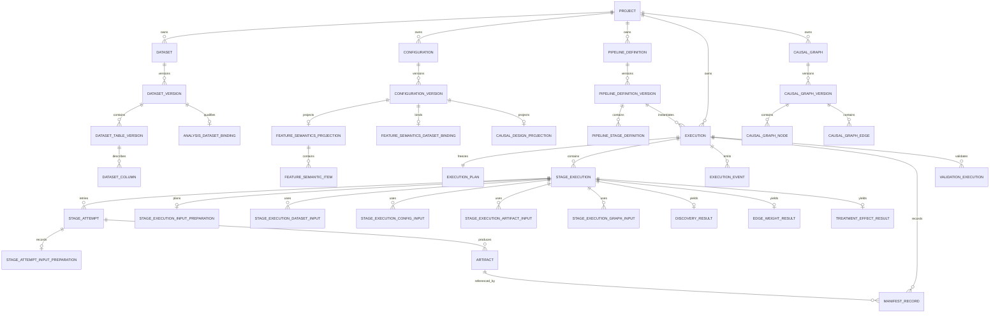

# ariadne Webサービス データモデル定義書

## 0. 文書情報

- 文書名: ariadne Webサービス データモデル定義書
- 文書版: 1.4
- 改訂日: 2026-08-04
- 対象DBMS: PostgreSQL
- 実装基準: `src/ariadne/domain/metadata.py`
- 改訂目的: 実行管理ドメインの用語および物理名称を、`Run` 系から `Execution` 系へ全面的に統一する

### 0.1 文書の目的

本書は、ariadne Webサービスが使用するMetadata DBの論理データモデルおよび物理データモデルを定義する。

Metadata DBは、因果探索・因果推論を管理、再現、監査するためのメタデータを保存する。分析対象となる表データ本体および大きな結果ファイルはArtifact Storeまたは外部データ基盤に配置し、Metadata DBには識別子、schema/content hash、所在、来歴、状態、検索・権限制御用projectionを保存する。

本版では、ariadne内部のWeb実行管理概念を **Execution** と呼ぶ。`Run` はMLflow等の外部実験追跡システムが採番・管理する実行を指す場合に限って使用し、Ariadneの実行管理エンティティ、API、物理テーブル、外部キー、イベント、監査、Outbox payloadには使用しない。

### 0.2 適用範囲

| 項目 | 内容 |
|---|---|
| Metadata DB | PostgreSQL |
| Artifact Store | local filesystem、S3、Azure Blob Storage |
| 主要Domain | Identity、Project、Data Catalog、Configuration、Pipeline、Execution、Artifact、Discovery、Saved Causal Graph、Inference、Audit |
| 実行管理の正本 | Ariadne Execution |
| 科学実験追跡 | Ariadne Executionとは別責務。外部追跡IDを保持する場合は名前空間を明示する |

### 0.3 改訂履歴

| 版 | 日付 | 変更内容 |
|---|---|---|
| 1.0 | 2026-07-18 | Webサービス化に必要な初期データモデルを定義 |
| 1.1 | 2026-07-20 | Analysis-ready実行、Feature Semantics、Saved Causal Graph等を追加 |
| 1.2 | 2026-07-20 | エンティティの責務・CRUD・関係を明文化 |
| 1.3 | 2026-07-20 | Metadata DBと分析対象データの境界、および実装対応列定義を追加 |
| 1.4 | 2026-08-04 | `Run`、`Stage Run`、`Run Event`および関連物理名称を`Execution`、`Stage Execution`、`Execution Event`へ全面改称 |

### 0.4 規範用語

| 表現 | 意味 |
|---|---|
| 必須、すること | 実装および検証が必要 |
| nullable / optional | Resourceまたは実行modeにより値を省略可能 |
| 不変 | 確定後はUPDATEせず、変更時は新しいVersion、Execution、AttemptまたはFactをINSERTする |
| append-only | UPDATEおよびDELETEを許可しない |
| 論理削除 | 物理DELETEせず、`deleted_at`または状態により通常検索から除外する |

### 0.5 用語・物理名称の統一規則

| 旧名称 | 新名称 | 適用範囲 |
|---|---|---|
| Run | Execution | Ariadneの実行要求・オーケストレーション |
| run | execution | 物理テーブル、変数、JSON key |
| run_id | execution_id | PK参照、FK、API parameter、event payload |
| Stage Run | Stage Execution | Pipeline内のstage単位実行 |
| stage_run | stage_execution | 物理テーブル、関連テーブルprefix |
| stage_run_id | stage_execution_id | FK、API、projection |
| Run Event | Execution Event | 状態・進捗event |
| run_event | execution_event | 物理テーブル |
| retry_of_run_id | retry_of_execution_id | 再実行関係 |
| Run Result Summary | Execution Result Summary | 実行から結果を検索するprojection |
| run_result_summary | execution_result_summary | 物理テーブル |
| Validation Run | Validation Execution | Ariadne内の検証履歴 |
| validation_run | validation_execution | 物理テーブル |

次は改称対象外とする。

- MLflow Run
- `mlflow_run_id`
- `MlflowClient`
- MLflow SDKの`start_run`、`create_run`
- 外部システムが正式名称として公開するRun ID

## 1. モデルの共通規則

### 1.1 Resource、Version、Execution、Fact、Projection

| 種別 | 主な対象 | 更新規則 |
|---|---|---|
| Resource | Dataset、Configuration、Pipeline Definition、Causal Graph | 名称・説明等の可変metadataのみ更新可。削除は論理削除 |
| Version | Dataset Version、Configuration Version、Pipeline Definition Version、Causal Graph Version | 内容snapshot。確定後は不変 |
| Execution | Execution、Stage Execution、Stage Attempt、Validation Execution | 実行中は状態更新可。retryでは新しいExecutionまたはAttemptを作成 |
| Fact / Artifact | Manifest、Execution Event、Audit Event、Artifact content、Input Preparation | append-only |
| Projection | Result、Profile、Graph Node/Edge、Execution Result Summary | 正本から再生成可能。正本との矛盾時は無効化または再生成 |

### 1.2 識別子、時刻、hash

- 主キーはUUID文字列とし、application側で生成する。高頻度append-only eventはbigintを使用してよい。
- 外部公開IDにDB連番を使用しない。
- 時刻はUTCの`timestamptz`として保存する。
- Execution受付時には、入力Resource IDだけでなく、参照したVersion ID、content hash、schema hashをExecution Planまたは入力Factへsnapshotとして保存する。
- 名前空間不明の`run_id`をAriadne共通モデルへ追加してはならない。
- Ariadne実行管理IDは`execution_id`、MLflow IDは`mlflow_run_id`と明示する。

### 1.3 Input Mode

| code | 利用場面 | 必須入力 |
|---|---|---|
| `CONFIGURED_FEATURE_BUILD` | 既存CLI、ETL、Feature Build経路 | 対応するFeature Configuration Version |
| `ANALYSIS_READY` | Analysis-ready Datasetを直接使う経路 | READY Analysis Dataset Binding、Feature Semantics Version |

Input modeはExecution Plan作成前に明示的に解決し、`stage_execution.input_mode`、Execution Plan、Manifestへ保存する。Dataset kind、table数、filenameから暗黙に推測してはならない。

## 2. エンティティ一覧

### 2.1 Domain別一覧

| Domain | エンティティ | 役割 |
|---|---|---|
| Identity | `app_user`、`role`、`project_member` | 利用者、権限、Project所属 |
| Project | `project` | ResourceおよびExecutionの所有境界 |
| Data Catalog | `dataset`、`dataset_version`、`dataset_table_version`、`dataset_column` | Datasetと不変snapshot |
| Analysis Readiness | `analysis_dataset_binding`、`data_profile`、`column_profile`、`dataset_column_policy` | 分析可能性、品質、列制御 |
| Configuration | `configuration`、`configuration_version`、`feature_semantics_projection`、`feature_semantics_dataset_binding`、`feature_semantic_item`、`causal_design_projection`、`causal_assumption` | 分析設定と意味論 |
| Pipeline | `pipeline_definition`、`pipeline_definition_version`、`pipeline_stage_definition`、関連依存・binding | 実行テンプレート |
| Execution | `execution`、`execution_plan`、`stage_execution`、`stage_attempt` | 実行要求、計画、stage、試行 |
| Execution Input | `stage_execution_dataset_input`、`stage_execution_config_input`、`stage_execution_artifact_input`、`stage_execution_graph_input`、`stage_execution_parameter` | Execution受付時の入力固定 |
| Input Preparation | `stage_execution_input_preparation`、`stage_attempt_input_preparation` | 計画時および実処理時のconditioning記録 |
| Artifact / Audit | `stored_object`、`artifact`、`manifest_record`、`artifact_lineage`、`execution_event`、`outbox_event`、`audit_event` | 成果物、来歴、非同期処理、監査 |
| Discovery / Graph | `discovery_result`、`discovery_algorithm_result`、`discovery_edge`、`causal_graph`、`causal_graph_version`、`causal_graph_node`、`causal_graph_edge` | 探索結果と採用グラフ |
| Inference | `edge_weight_result`、`treatment_effect_result`、`execution_result_summary` | 推論結果とExecutionからの検索導線 |
| Supporting | `experiment`、`validation_execution`、`validation_issue`、`visualization_specification`、`visualization_query` | 整理、検証、可視化 |

### 2.2 Execution関連エンティティの責務

#### `execution`

Web/API経由の実行要求およびオーケストレーションの集約root。Project、利用者、pipeline version、実行mode、状態、冪等性、再実行関係、再現性情報を保持する。

#### `execution_plan`

Execution受付時に確定したstage構成、入力Version、hash、input modeおよびparameterの不変canonical documentを保持する。`execution_id`を主キー兼外部キーとする。

#### `stage_execution`

Execution Plan内のstage単位の実行管理を表す。Execution内で`stage_key`および`ordinal`を一意とする。

#### `stage_attempt`

Stage Executionの試行履歴を表す。Worker、lease、heartbeat、workspace、終了code、error、resource usageを保持する。再試行時は既存Attemptを上書きせず、新しい`attempt_number`を作成する。

#### `execution_event`

Executionの状態・進捗eventを順序付きで記録するappend-only Fact。`execution_id`と`sequence_number`の組を一意とする。

#### `validation_execution`

ExecutionまたはStage Executionに対するvalidation実施履歴を保持する。旧`validation_run`という物理名称は使用しない。

## 3. 概念ER



## 4. Execution関連の物理モデル

### 4.1 `execution`

実装class: `Execution`

| 列名 | 型 | NULL | Key / Index | 役割 |
|---|---|---:|---|---|
| `id` | `varchar(36)` | No | PK | Ariadne execution ID |
| `project_id` | `varchar(36)` | No | FK `project.id`、index | 所有Project |
| `experiment_id` | `varchar(36)` | Yes | FK `experiment.id` | 任意の整理用Experiment |
| `pipeline_definition_version_id` | `varchar(36)` | Yes | FK | 固定したPipeline Version |
| `execution_kind` | `varchar(32)` | No |  | `PIPELINE`、`ETL`、`DISCOVERY`、`INFERENCE` |
| `execution_mode` | `varchar(32)` | No |  | `DRY_RUN`、`VALIDATE_ONLY`、`RUN` |
| `status` | `varchar(32)` | No | composite index | Execution状態 |
| `submitted_by` | `varchar(36)` | No | FK `app_user.id` | 受付利用者 |
| `submitted_at` | `timestamptz` | No |  | 受付時刻 |
| `queued_at` | `timestamptz` | Yes |  | Queue投入時刻 |
| `started_at` | `timestamptz` | Yes |  | 実処理開始時刻 |
| `finished_at` | `timestamptz` | Yes |  | terminal時刻 |
| `cancel_requested_at` | `timestamptz` | Yes |  | cancel要求時刻 |
| `idempotency_key` | `varchar(255)` | Yes | partial unique with `project_id` | 冪等性key |
| `request_hash` | `varchar(255)` | No |  | 受付requestのcanonical hash |
| `random_seed` | `bigint` | Yes |  | 実行seed |
| `code_commit` | `varchar(128)` | Yes |  | source commit |
| `package_version` | `varchar(64)` | Yes |  | package version |
| `dependency_lock_hash` | `varchar(255)` | Yes |  | lock file hash |
| `container_image_digest` | `varchar(255)` | Yes |  | container image digest |
| `priority` | `integer` | No |  | Queue priority |
| `retry_of_execution_id` | `varchar(36)` | Yes | FK `execution.id` | 元Execution |
| `error_code` | `varchar(128)` | Yes |  | 機械判定用error code |
| `error_summary` | `text` | Yes |  | 秘密情報を含まないerror概要 |
| `metadata_json` | `jsonb` | No |  | 拡張metadata |

制約:

- `(project_id, idempotency_key)`は`idempotency_key IS NOT NULL`の場合に一意とする。
- `retry_of_execution_id`は自身を参照してはならない。
- terminal状態のExecutionは、実行入力・計画・再現性snapshotを変更してはならない。
- Ariadne IDを表す列名またはAPI propertyに`run_id`を使用してはならない。

### 4.2 `execution_plan`

実装class: `ExecutionPlanRecord`

| 列名 | 型 | NULL | Key | 役割 |
|---|---|---:|---|---|
| `execution_id` | `varchar(36)` | No | PK、FK `execution.id` | 対象Execution |
| `schema_version` | `varchar(64)` | No |  | plan schema version |
| `canonical_json` | `jsonb` | No |  | 不変のExecution Plan |
| `plan_hash` | `varchar(255)` | No |  | canonical document hash |
| `created_at` | `timestamptz` | No |  | 作成時刻 |

制約:

- INSERT後はappend-only相当とし、UPDATEおよびDELETEを禁止する。
- `canonical_json`内のAriadne実行IDのproperty名は`execution_id`とする。
- 外部追跡IDを格納する場合は`mlflow_run_id`等、名前空間を明示する。

### 4.3 `stage_execution`

実装class: `StageExecution`

| 列名 | 型 | NULL | Key / Constraint | 役割 |
|---|---|---:|---|---|
| `id` | `varchar(36)` | No | PK | Stage Execution ID |
| `execution_id` | `varchar(36)` | No | FK `execution.id`、index | 親Execution |
| `stage_key` | `varchar(255)` | No | unique per Execution | stage識別子 |
| `stage_type` | `varchar(32)` | No |  | `ETL`、`DISCOVERY`、`INFERENCE` |
| `analysis_mode` | `varchar(32)` | Yes |  | `EDGE_WEIGHT`または`TREATMENT_EFFECT`等 |
| `input_mode` | `varchar(32)` | No |  | 解決済みInput Mode |
| `ordinal` | `integer` | No | unique per Execution | plan内順序 |
| `runner_name` | `varchar(128)` | No |  | Stage Runner名 |
| `status` | `varchar(32)` | No |  | Stage状態 |
| `current_attempt_number` | `integer` | No |  | 最新Attempt番号 |
| `selected_attempt_id` | `varchar(36)` | Yes | logical reference | 採用Attempt |
| `cache_hit` | `boolean` | No |  | cache利用有無 |
| `reused_from_stage_execution_id` | `varchar(36)` | Yes | FK `stage_execution.id` | 再利用元 |
| `started_at` | `timestamptz` | Yes |  | 開始時刻 |
| `finished_at` | `timestamptz` | Yes |  | 終了時刻 |
| `error_code` | `varchar(128)` | Yes |  | error code |
| `error_summary` | `text` | Yes |  | error概要 |

一意制約:

- `UNIQUE(execution_id, stage_key)`
- `UNIQUE(execution_id, ordinal)`

### 4.4 `stage_execution_dependency`

実装class: `StageExecutionDependency`

| 列名 | 型 | NULL | Key |
|---|---|---:|---|
| `stage_execution_id` | `varchar(36)` | No | PK、FK `stage_execution.id` |
| `depends_on_stage_execution_id` | `varchar(36)` | No | PK、FK `stage_execution.id` |

同一Execution内のStage Execution間だけを関連付ける。自己依存および循環依存はApplication Serviceで拒否する。

### 4.5 `stage_attempt`

実装class: `StageAttempt`

| 列名 | 型 | NULL | Key / Constraint | 役割 |
|---|---|---:|---|---|
| `id` | `varchar(36)` | No | PK | Attempt ID |
| `stage_execution_id` | `varchar(36)` | No | FK、index | 親Stage Execution |
| `attempt_number` | `integer` | No | unique per Stage Execution | 1始まりの試行番号 |
| `status` | `varchar(32)` | No |  | Attempt状態 |
| `queue_message_id` | `varchar(255)` | Yes |  | Queue message識別子 |
| `worker_id` | `varchar(255)` | Yes |  | Worker識別子 |
| `workspace_ref` | `text` | Yes |  | workspace参照 |
| `queued_at` | `timestamptz` | No |  | Queue投入時刻 |
| `leased_at` | `timestamptz` | Yes |  | lease取得時刻 |
| `lease_expires_at` | `timestamptz` | Yes |  | lease期限 |
| `heartbeat_at` | `timestamptz` | Yes |  | 最終heartbeat |
| `started_at` | `timestamptz` | Yes |  | 開始時刻 |
| `finished_at` | `timestamptz` | Yes |  | 終了時刻 |
| `exit_code` | `integer` | Yes |  | process exit code |
| `error_class` | `varchar(255)` | Yes |  | error class |
| `error_code` | `varchar(128)` | Yes |  | error code |
| `error_message` | `text` | Yes |  | 秘密情報を除いたmessage |
| `error_detail_json` | `jsonb` | No |  | 構造化error |
| `runtime_metadata_json` | `jsonb` | No |  | runtime情報 |
| `resource_usage_json` | `jsonb` | No |  | resource usage |

一意制約: `UNIQUE(stage_execution_id, attempt_number)`

terminal Attemptの入力、結果、終了情報は不変とする。

### 4.6 Execution入力テーブル

#### `stage_execution_dataset_input`

| 列名 | 型 | Key |
|---|---|---|
| `stage_execution_id` | `varchar(36)` | PK、FK `stage_execution.id` |
| `input_name` | `varchar(255)` | PK |
| `dataset_version_id` | `varchar(36)` | FK `dataset_version.id` |

#### `stage_execution_config_input`

| 列名 | 型 | Key |
|---|---|---|
| `stage_execution_id` | `varchar(36)` | PK、FK `stage_execution.id` |
| `input_name` | `varchar(255)` | PK |
| `configuration_version_id` | `varchar(36)` | FK `configuration_version.id` |
| `content_hash_snapshot` | `varchar(255)` |  |

#### `stage_execution_artifact_input`

| 列名 | 型 | Key |
|---|---|---|
| `stage_execution_id` | `varchar(36)` | PK、FK `stage_execution.id` |
| `input_name` | `varchar(255)` | PK |
| `artifact_id` | `varchar(36)` | FK `artifact.id` |

#### `stage_execution_graph_input`

| 列名 | 型 | Key |
|---|---|---|
| `stage_execution_id` | `varchar(36)` | PK、FK `stage_execution.id` |
| `input_name` | `varchar(255)` | PK |
| `causal_graph_version_id` | `varchar(36)` | FK `causal_graph_version.id` |
| `content_hash_snapshot` | `varchar(255)` |  |
| `source` | `varchar(32)` |  |

#### `stage_execution_parameter`

| 列名 | 型 | Key |
|---|---|---|
| `stage_execution_id` | `varchar(36)` | PK、FK `stage_execution.id` |
| `parameter_name` | `varchar(255)` | PK |
| `value_json` | `jsonb` |  |
| `source` | `varchar(32)` |  |

これらはExecution Planから作成され、Execution受付後は変更しない。

### 4.7 Input Preparation

#### `stage_execution_input_preparation`

計画時に解決したInput Mode、Dataset、Table、schema hash、Feature Semantics、要求列、conditioning specを保持する。

主キーは`stage_execution_id`、FKは`stage_execution.id`とする。

#### `stage_attempt_input_preparation`

Attemptで実際に使用した列、除外列、解決済みconditioning、生成Artifact、状態、errorを保持する。

- `stage_attempt_id`を主キーとする。
- `stage_execution_id`をFKとして保持する。
- terminal化後は不変とする。

### 4.8 `execution_event`

実装class: `ExecutionEvent`

| 列名 | 型 | NULL | Key / Constraint | 役割 |
|---|---|---:|---|---|
| `id` | `bigint` | No | PK、autoincrement | event行ID |
| `execution_id` | `varchar(36)` | No | FK、index | 対象Execution |
| `stage_execution_id` | `varchar(36)` | Yes | FK | 対象Stage Execution |
| `stage_attempt_id` | `varchar(36)` | Yes | FK | 対象Attempt |
| `sequence_number` | `bigint` | No | unique per Execution | 順序番号 |
| `event_type` | `varchar(128)` | No |  | event種別 |
| `payload_json` | `jsonb` | No |  | event payload |
| `occurred_at` | `timestamptz` | No |  | 発生時刻 |

制約:

- `UNIQUE(execution_id, sequence_number)`
- UPDATEおよびDELETEを禁止する。
- payload内でAriadne IDを示す場合は`execution_id`、`stage_execution_id`、`stage_attempt_id`を使用する。
- event typeは`EXECUTION_CREATED`、`EXECUTION_RETRY_QUEUED`等、Execution語彙を使用する。

### 4.9 `outbox_event`

| 列名 | 型 | 役割 |
|---|---|---|
| `aggregate_type` | `varchar(64)` | Execution eventでは`EXECUTION` |
| `aggregate_id` | `varchar(36)` | `execution.id` |
| `event_type` | `varchar(128)` | 例: `EXECUTE_EXECUTION`、`CANCEL_EXECUTION` |
| `payload_json` | `jsonb` | `execution_id`を含む |

`aggregate_type='RUN'`、`EXECUTE_RUN`、payloadの`run_id`を新規に使用してはならない。

### 4.10 `manifest_record`

| 列名 | 型 | NULL | Key |
|---|---|---:|---|
| `id` | `varchar(36)` | No | PK |
| `execution_id` | `varchar(36)` | No | FK `execution.id`、index |
| `stage_execution_id` | `varchar(36)` | Yes | FK `stage_execution.id` |
| `scope` | `varchar(16)` | No |  |
| `artifact_id` | `varchar(36)` | No | FK `artifact.id` |
| `schema_version` | `varchar(64)` | No |  |
| `content_hash` | `varchar(255)` | No |  |
| `projection_json` | `jsonb` | No |  |
| `created_at` | `timestamptz` | No |  |

Manifestはappend-onlyとし、Ariadne IDにはExecution語彙を使用する。

### 4.11 `validation_execution`および`validation_issue`

#### `validation_execution`

| 列名 | 型 | Key |
|---|---|---|
| `id` | `varchar(36)` | PK |
| `execution_id` | `varchar(36)` | FK `execution.id`、index |
| `stage_execution_id` | `varchar(36)` | nullable FK |
| `validator_name` | `varchar(128)` |  |
| `validator_version` | `varchar(64)` | nullable |
| `status` | `varchar(16)` |  |
| `started_at` | `timestamptz` |  |
| `finished_at` | `timestamptz` |  |

#### `validation_issue`

`validation_execution_id`により`validation_execution.id`を参照する。旧`validation_run_id`は使用しない。

### 4.12 Execution結果projection

Executionから結果を検索するprojectionの正式名称は`execution_result_summary`とする。

最低限、次の参照を保持する。

- `execution_id`
- `stage_execution_id`
- `result_type`
- `result_id`
- `status`
- `created_at`

実装が専用tableを持たず各Result tableから動的に構成する場合でも、API propertyおよび設計上の名称はExecution語彙を使用する。

## 5. 状態モデル

### 5.1 Execution状態

Executionは少なくとも次の状態を扱う。

- `SUBMITTED`
- `VALIDATING`
- `QUEUED`
- `RUNNING`
- `CANCEL_REQUESTED`
- `SUCCEEDED`
- `FAILED`
- `CANCELED`

許可される状態遷移はApplication Serviceで強制し、terminal状態から非terminal状態へ戻してはならない。retryは元Executionの状態を戻さず、新しいExecutionを作成して`retry_of_execution_id`で関連付ける。

### 5.2 Stage Execution状態

Stage Executionは少なくとも次の状態を扱う。

- `SUBMITTED`
- `QUEUED`
- `RUNNING`
- `SUCCEEDED`
- `FAILED`
- `CANCELED`
- `SKIPPED`

### 5.3 Stage Attempt状態

Stage Attemptは少なくとも次の状態を扱う。

- `CREATED`
- `QUEUED`
- `LEASED`
- `RUNNING`
- `SUCCEEDED`
- `FAILED`
- `CANCELED`
- `LOST`

## 6. 不変性および監査

### 6.1 不変対象

次を不変またはappend-onlyとする。

- `execution_plan`
- Execution受付時の入力snapshot table
- terminalとなった`stage_attempt`
- `stage_attempt_input_preparation`
- `manifest_record`
- `execution_event`
- `audit_event`
- AVAILABLEとなったArtifact content
- PUBLISHEDされたConfiguration Version、Pipeline Definition Version、Causal Graph Version
- READYとなったDataset Versionの内容

### 6.2 Audit Event

Execution操作の`resource_type`は`EXECUTION`を使用する。

例:

- `EXECUTION_CREATE`
- `EXECUTION_CANCEL_REQUEST`
- `EXECUTION_RETRY`
- `STAGE_EXECUTION_START`
- `STAGE_EXECUTION_FINISH`

旧`resource_type='RUN'`を新規記録してはならない。

## 7. APIおよびserializationとの対応

正式なAPI resourceは次とする。

```text
POST /executions
GET  /executions
GET  /executions/{execution_id}
POST /executions/{execution_id}/cancel
POST /executions/{execution_id}/retry
GET  /executions/{execution_id}/events
GET  /executions/{execution_id}/artifacts
GET  /executions/{execution_id}/results
```

正式なJSON propertyは次とする。

```json
{
  "execution_id": "...",
  "stage_execution_id": "...",
  "retry_of_execution_id": "..."
}
```

後方互換aliasを提供する場合、`/runs`および`run_id`はdeprecatedとして明示し、新規書込み、内部model、DB物理名称には使用しない。

## 8. Migration要件

既存DBに旧名称が存在する場合、データを保持するrename migrationを使用する。

### 8.1 Table rename

```text
run                                -> execution
stage_run                          -> stage_execution
run_event                          -> execution_event
validation_run                     -> validation_execution
run_result_summary                 -> execution_result_summary
stage_run_dependency               -> stage_execution_dependency
stage_run_dataset_input            -> stage_execution_dataset_input
stage_run_config_input             -> stage_execution_config_input
stage_run_artifact_input           -> stage_execution_artifact_input
stage_run_graph_input              -> stage_execution_graph_input
stage_run_parameter                -> stage_execution_parameter
stage_run_input_preparation        -> stage_execution_input_preparation
```

### 8.2 Column rename

```text
run_id                             -> execution_id
stage_run_id                       -> stage_execution_id
retry_of_run_id                    -> retry_of_execution_id
reused_from_stage_run_id           -> reused_from_stage_execution_id
origin_stage_run_id                -> origin_stage_execution_id
validation_run_id                  -> validation_execution_id
```

### 8.3 ConstraintおよびIndex rename

FK、UNIQUE、CHECK、Index名に旧`run`または`stage_run`語彙が含まれる場合は、対応するExecution語彙へ変更する。

### 8.4 Payload migration

次を更新する。

- Outbox payload
- Execution Event payload
- Audit `resource_type`
- Manifest projection
- seed data
- fixture
- sample data
- cached JSON

既存payloadを読み取る必要がある場合は旧keyを読み込みaliasとして受理してよいが、新規書込みは新keyだけを使用する。

### 8.5 Migration実装原則

- 初期revisionを実行時の最新ORM `Base.metadata.create_all()`へ依存させない。
- 各revisionは作成時点のDDL操作を固定する。
- 新規DBへ全revisionを順番に適用したschemaと、既存DBをupgradeしたschemaが一致することを検証する。
- renameはdrop-and-createより優先する。

## 9. 検証要件

### 9.1 Static検査

次の旧語彙が、許可された互換コードまたは外部正式用語以外に残っていないことを検査する。

```text
class Run
__tablename__ = "run"
run_id
stage_run
stage_run_id
run_event
validation_run
retry_of_run_id
aggregate_type="RUN"
resource_type="RUN"
EXECUTE_RUN
```

### 9.2 DB検査

- `execution`、`stage_execution`、`execution_event`、`validation_execution`が存在する。
- 旧物理tableが存在しない。ただし明示的な互換viewは除く。
- すべてのFKが新物理名称を参照する。
- `execution_event`がappend-onlyである。
- `execution_plan`が不変である。
- `(project_id, idempotency_key)`のpartial unique制約が有効である。
- `UNIQUE(execution_id, stage_key)`および`UNIQUE(execution_id, ordinal)`が有効である。
- `UNIQUE(stage_execution_id, attempt_number)`が有効である。

### 9.3 API検査

- `/executions`を正式APIとして公開する。
- request、response、OpenAPI schemaが`execution_id`を使用する。
- cancel、retry、events、artifacts、resultsが`execution_id`で解決される。
- deprecated互換経路がある場合、新規内部処理へ旧語彙を伝播させない。

### 9.4 Worker検査

- Outboxの`aggregate_type`は`EXECUTION`。
- 実行eventは`EXECUTE_EXECUTION`。
- payloadは`execution_id`を使用する。
- Stage処理は`stage_execution_id`および`stage_attempt_id`を使用する。
- lease、heartbeat、retryがExecution語彙のDB schemaで動作する。

## 10. 完了条件

次をすべて満たした場合、本改訂を完了とする。

- 論理名称がExecution、Stage Execution、Execution Eventへ統一されている。
- 物理テーブルが`execution`、`stage_execution`、`execution_event`へ統一されている。
- FKおよびJSON propertyが`execution_id`、`stage_execution_id`へ統一されている。
- validation履歴が`validation_execution`へ統一されている。
- Result検索projectionがExecution語彙を使用する。
- ER図、エンティティ一覧、列定義、状態遷移、監査、Outbox、API、migration、test記述に旧Ariadne Run語彙が残っていない。
- `Run`という語が残る場合、それがMLflow等の外部正式用語またはdeprecated互換aliasであることが明示されている。
- rename migrationで既存データ、FK、index、unique constraint、event、audit、outboxの意味が保持される。
